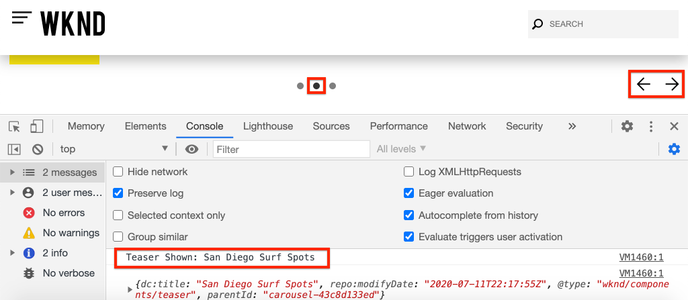

# 將Adobe使用者端資料層與AEM核心元件搭配使用 {#overview}

Adobe Client Data Layer匯入了標準方法，用以收集和儲存訪客的網頁體驗相關資料，並且讓這項資料易於存取。 Adobe Client Data Layer不受平台限制，但已完全整合至核心元件，以與AEM搭配使用。

>[!VIDEO](https://video.tv.adobe.com/v/41195?quality=12&learn=on)

>[!NOTE]
>
> 想要在AEM網站上啟用Adobe使用者端資料層嗎？ [請在這裡檢視指示](https://experienceleague.adobe.com/docs/experience-manager-core-components/using/developing/data-layer/overview.html?lang=zh-Hant#installation-activation)。

## 探索資料層

只要使用瀏覽器的開發人員工具和即時[WKND參考網站](https://wknd.site/us/en.html)，您就可以瞭解Adobe使用者端資料層的內建功能。

>[!NOTE]
>
> 以下是從Chrome瀏覽器擷取的熒幕擷取畫面。

1. 導覽至[https://wknd.site/us/en.html](https://wknd.site/us/en.html)
1. 開啟您的開發人員工具，並在&#x200B;**主控台**&#x200B;中輸入下列命令：

   ```js
   window.adobeDataLayer.getState();
   ```

   若要檢視AEM網站上資料層的目前狀態，請檢查回應。 您應該會看到頁面和個別元件的相關資訊。

   

1. 在主控台中輸入下列內容，將資料物件推送至資料層：

   ```js
   window.adobeDataLayer.push({
       "component": {
           "training-data": {
               "title": "Learn More",
               "link": "learn-more.html"
           }
       }
   });
   ```

1. 再次執行命令`adobeDataLayer.getState()`並找到`training-data`的專案。
1. 接著，新增path引數以僅傳回元件的特定狀態：

   ```js
   window.adobeDataLayer.getState('component.training-data');
   ```

   

## 使用事件

最佳實務是根據資料層的事件觸發任何自訂程式碼。 接下來，探索註冊及接聽不同事件。

1. 在主控台中輸入下列Helper方法：

   ```js
   function getDataObjectHelper(event, filter) {
       if (event.hasOwnProperty("eventInfo") && event.eventInfo.hasOwnProperty("path")) {
           var dataObject = window.adobeDataLayer.getState(event.eventInfo.path);
           if (dataObject != null) {
               for (var property in filter) {
                   if (!dataObject.hasOwnProperty(property) || (filter[property] !== null && filter[property] !== dataObject[property])) {
                       return;
                   }
                   return dataObject;
               }
           }
       }
       return;
   }
   ```

   上述程式碼會檢查`event`物件，並使用`adobeDataLayer.getState`方法取得觸發事件的物件目前狀態。 然後helper方法會檢查`filter`，而且只有在目前的`dataObject`符合篩選條件時才傳回它。

   >[!CAUTION]
   >
   > 在本練習中，很重要的一點是&#x200B;**不**&#x200B;要重新整理瀏覽器，否則主控台JavaScript會遺失。

1. 接下來，輸入當&#x200B;**Teaser**&#x200B;元件顯示在&#x200B;**轉盤**&#x200B;中時所呼叫的事件處理常式。

   ```js
   function teaserShownHandler(event) {
       var dataObject = getDataObjectHelper(event, {"@type": "wknd/components/carousel/item"});
       if(dataObject != null) {
           console.log("Teaser Shown: " + dataObject['dc:title']);
           console.log(dataObject);
       }
   }
   ```

   `teaserShownHandler`函式呼叫`getDataObjectHelper`函式並傳遞`wknd/components/carousel/item`的篩選器做為`@type`，以篩選掉由其他元件觸發的事件。

1. 接著，將事件接聽程式推播至資料層以接聽`cmp:show`事件。

   ```js
   window.adobeDataLayer.push(function (dl) {
        dl.addEventListener("cmp:show", teaserShownHandler);
   });
   ```

   `cmp:show`事件是由許多不同的元件所觸發，例如在&#x200B;**輪播**&#x200B;中顯示新投影片，或在&#x200B;**標籤**&#x200B;元件中選取新標籤時。

1. 在頁面上，切換轉盤幻燈片並觀察主控台陳述式：

   

1. 若要停止監聽`cmp:show`事件，請從資料層移除事件監聽器

   ```js
   window.adobeDataLayer = window.adobeDataLayer || [];
   window.adobeDataLayer.push(function(dl) {
       dl.removeEventListener("cmp:show", teaserShownHandler);
   });
   ```

1. 返回頁面並切換輪播幻燈片。 請注意，不會再記錄任何陳述式，且不會聆聽事件。

1. 接著，建立觸發頁面顯示事件時所呼叫的事件處理常式：

   ```js
   function pageShownHandler(event) {
       var dataObject = getDataObjectHelper(event, {"@type": "wknd/components/page"});
       if(dataObject != null) {
           console.log("Page Shown: " + dataObject['dc:title']);
           console.log(dataObject);
       }
   }
   ```

   請注意，資源型別`wknd/components/page`是用來篩選事件。

1. 接著，將事件接聽程式推播至資料層，以接聽`cmp:show`事件，並呼叫`pageShownHandler`。

   ```js
   window.adobeDataLayer = window.adobeDataLayer || [];
   window.adobeDataLayer.push(function (dl) {
        dl.addEventListener("cmp:show", pageShownHandler);
   });
   ```

1. 您應該會立即看到隨頁面資料引發的主控台陳述式：

   

   頁面的`cmp:show`事件會在頁面頂端的每個頁面載入時觸發。 您可能會問，當頁面明確已載入時，為何觸發事件處理常式？

   Adobe使用者端資料層的獨特功能之一，是您可以在&#x200B;**之前**&#x200B;或&#x200B;**之後**&#x200B;註冊事件接聽程式，資料層已初始化，這有助於避免競爭情形。

   Data Layer會維護已依序發生之所有事件的佇列陣列。 資料層預設會針對發生在&#x200B;**過去**&#x200B;中的事件以及發生在&#x200B;**未來**&#x200B;中的事件觸發事件回呼。 您可從過去或未來篩選事件。 [在檔案中可以找到更多資訊](https://github.com/adobe/adobe-client-data-layer/wiki#addeventlistener)。


## 後續步驟

有兩個選項可供您持續學習，第一個是檢視[收集頁面資料，並將其傳送至Adobe Analytics](../analytics/collect-data-analytics.md)教學課程，示範如何使用Adobe使用者端資料層。 第二個選項是學習如何[使用AEM元件自訂Adobe使用者端資料層](./data-layer-customize.md)


## 其他資源 {#additional-resources}

* [Adobe使用者端資料層檔案](https://github.com/adobe/adobe-client-data-layer/wiki)
* [使用Adobe使用者端資料層和核心元件檔案](https://experienceleague.adobe.com/docs/experience-manager-core-components/using/developing/data-layer/overview.html?lang=zh-Hant)
