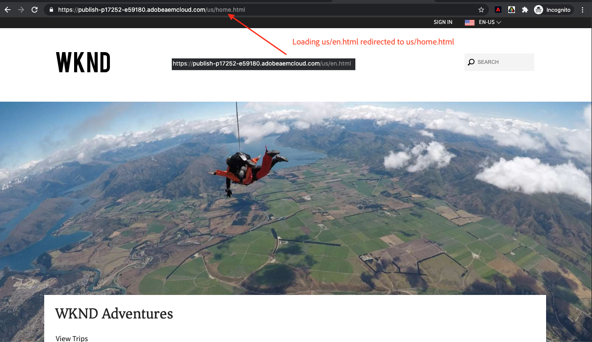

# 個人化完整網頁體驗 {#personalization-fpe}

瞭解如何建立活動，以使用Adobe Target將AEM上託管的網站頁面重新導向至新頁面。

## 必備條件

為了個人化AEM網站的完整頁面，必須完成下列設定：

1. [將Adobe Target新增至您的AEM網站](./add-target-launch-extension.md)
1. [從Launch觸發Adobe Target呼叫](./load-and-fire-target.md)

## 案例概述

WKND網站重新設計了首頁，並且想要將其目前首頁訪客重新導向至新的首頁。 同時，也瞭解重新設計的首頁如何協助改善使用者參與度和收入。 行銷人員已指派您建立活動，以將訪客重新導向至新首頁。 讓我們探索WKND網站首頁，瞭解如何使用Adobe Target建立活動。

## 使用視覺化體驗撰寫器(VEC)建立A/B測試的步驟

1. 登入Adobe Target並導覽至「活動」標籤
1. 按一下 **建立活動** 按鈕，然後選擇 **A/B測試** 活動

   

1. 選取 **視覺化體驗撰寫器** 選項，提供活動URL，然後按一下 **下一個**

   

1. 建立新活動後，視覺化體驗撰寫器會在左側顯示兩個標籤： *體驗A* 和 *體驗B*. 從清單中選取體驗。 您可以使用將新體驗新增至清單 **新增體驗** 按鈕。

   

1. 檢視體驗A可用的選項，然後選取 **重新導向至URL** 選項並提供新WKND網站首頁的URL。

   

1. 重新命名 *體驗A* 至 *新增WKND首頁* 和 *體驗B* 至 *wknd首頁*

   

1. 按一下 **下一個** 移至目標定位，並保持兩個體驗之間的手動流量分配50-50。

   

1. 對於目標和設定，選擇報表來源作為Adobe Target，然後選取目標量度作為轉換和頁面檢視動作。

   

1. 提供活動的名稱並儲存。
1. 啟用已儲存的活動以即時推送您的變更。

   

1. 在新標籤中開啟您的網站頁面（步驟3中的活動URL），您應該能夠從A/B測試活動檢視任一體驗（WKND首頁或新WKND首頁）。 `us/en.html` 重新導向至 `us/home.html`.

   

## 摘要

身為行銷人員，您可以建立活動，使用Adobe Target將AEM上託管的網頁重新導向至新頁面。

## 支援連結

* [Adobe Experience Cloud Debugger - Chrome](https://chrome.google.com/webstore/detail/adobe-experience-cloud-de/ocdmogmohccmeicdhlhhgepeaijenapj)
* [Adobe Experience Cloud Debugger - Firefox](https://addons.mozilla.org/en-US/firefox/addon/adobe-experience-platform-dbg/)
