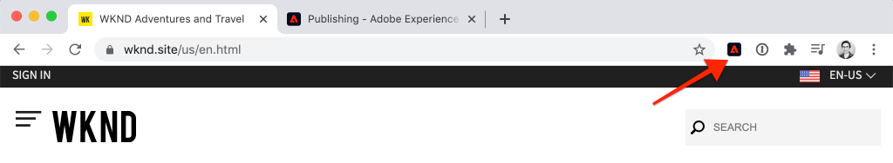

# 使用Adobe Analytics收集頁面資料

瞭解如何搭配使用 [Adobe Client Data Layer的內建功能與AEM Core Components](https://docs.adobe.com/content/help/zh-Hant/experience-manager-core-components/using/developing/data-layer/overview.html) ，以收集Adobe Experience Manager Sites中某頁面的相關資料。 [Experience Platform Launch](https://www.adobe.com/experience-platform/launch.html) 和 [](https://docs.adobe.com/content/help/en/launch/using/extensions-ref/adobe-extension/analytics-extension/overview.html) Adobe Analytics擴充功能將用來建立規則，以傳送頁面資料至Adobe Analytics。

## 您將建立的


在本教學課程中，您將根據來自Adobe用戶端資料層的事件觸發啟動規則、新增規則應觸發的條件，以及將AEM頁面的「頁面名稱 **」和「頁面範本****** 」傳送至Adobe Analytics。

### 目標 {#objective}

1. 根據資料層的變更，在啟動中建立事件導向規則
1. 在Launch中將頁面資料層屬性對應至資料元素
1. 收集頁面資料，並使用頁面檢視信標傳送至Adobe Analytics

## 必備條件

以下為必要項目：

* **Experience Platform Launch** Property
* **Adobe Analytics** test/dev報表套裝ID和追蹤伺服器。 請參閱下列檔案以 [建立新報表套裝](https://docs.adobe.com/content/help/en/analytics/admin/manage-report-suites/new-report-suite/new-report-suite.html)。
* [Experience Platform Debugger](https://docs.adobe.com/content/help/en/platform-learn/tutorials/data-ingestion/web-sdk/introduction-to-the-experience-platform-debugger.html) browser extension. 本教學課程中的螢幕擷取自Chrome瀏覽器。
* （選用）啟用 [Adobe Client資料層的AEM網站](https://docs.adobe.com/content/help/en/experience-manager-core-components/using/developing/data-layer/overview.html#installation-activation)。 本教學課程將使用公開對 [應網站](https://wknd.site/us/en.html) https://wknd.site/us/en.html，但歡迎您使用您自己的網站。

>[!NOTE]
>
> 需要整合Launch和AEM網站的協助嗎？ [請參閱此影片系列](../experience-platform-launch/overview.md)。

## WKND站點的交換機啟動環境

[https://wknd.site](https://wknd.site) 是以開放原始碼專案為基 [礎的公開對開網站](https://github.com/adobe/aem-guides-wknd) ，專為AEM實作 [參考和教學課程](https://docs.adobe.com/content/help/en/experience-manager-learn/getting-started-wknd-tutorial-develop/overview.html) 。

您不必設定AEM環境並安裝WKND程式碼基底，而是可以使用Experience Platform除錯程式 **將即時**[https://wknd.site/](https://wknd.site/) 切換 *至您的* Launch屬性。 當然，如果您自己的AEM網站已啟用 [Adobe用戶端資料層，您就可以使用](https://docs.adobe.com/content/help/en/experience-manager-core-components/using/developing/data-layer/overview.html#installation-activation)

1. 登入Experience Platform Launch並 [建立Launch屬性](https://docs.adobe.com/content/help/en/core-services-learn/implementing-in-websites-with-launch/configure-launch/launch.html) （如果您尚未）。
1. 請確定已建立初始 [的啟動程式庫](https://docs.adobe.com/content/help/en/launch/using/reference/publish/libraries.html#create-a-library) ，並提升至啟動 [環境](https://docs.adobe.com/content/help/en/launch/using/reference/publish/environments.html)。
1. 從您的資料庫已發佈至的環境中複製啟動內嵌代碼。

   

1. 在您的瀏覽器中開啟新標籤，並導覽至 [https://wknd.site/](https://wknd.site/)
1. 開啟Experience Platform Debugger瀏覽器擴充功能

   

1. 導覽至「 **Launch** > **Configuration** 」，並在「Injected Embed Codes」（插入的內嵌代碼）下方，以您從步驟3複製 ****** 的內嵌代碼取代現有的Launch內嵌代碼。

   

1. 在「 **WKND** 」標籤上啟 **用「控制台記錄」** ，並鎖定除錯程式。

   

## 驗證WKND網站上的Adobe用戶端資料層

「 [WKND參考」專案是使用AEM Core Components建立](https://github.com/adobe/aem-guides-wknd) ，並依預設啟用 [Adobe Client資料層](https://docs.adobe.com/content/help/en/experience-manager-core-components/using/developing/data-layer/overview.html#installation-activation) 。 接著，確認Adobe用戶端資料層已啟用。

1. 導覽至 [https://wknd.site](https://wknd.site)。
1. 開啟瀏覽器的開發人員工具並導覽至 **Console**。 運行以下命令：

   ```js
   adobeDataLayer.getState();
   ```

   這會傳回Adobe用戶端資料層的目前狀態。

   

1. 展開響應並檢查 `page` 條目。 您應看到如下的資料結構：

   ```json
   page-2eee4f8914:
       @type: "wknd/components/page"
       dc:description: "WKND is a collective of outdoors, music, crafts, adventure sports, and travel enthusiasts that want to share our experiences, connections, and expertise with the world."
       dc:title: "WKND Adventures and Travel"
       repo:modifyDate: "2020-08-31T21:02:21Z"
       repo:path: "/content/wknd/us/en.html"
       xdm:language: "en-US"
       xdm:tags: ["Attract"]
       xdm:template: "/conf/wknd/settings/wcm/templates/landing-page-template"
   ```

   我們將使用從資料層的 [頁面架構](https://docs.adobe.com/content/help/en/experience-manager-core-components/using/developing/data-layer/overview.html#page)、和 `dc:title`Page架構衍生的標準屬性，將頁面 `xdm:language``xdm:template` 資料傳送至Adobe Analytics。

   >[!NOTE]
   >
   > 沒看見Javascript物 `adobeDataLayer` 件嗎？ 確保您的 [網站上已啟用Adobe用戶端資料層](https://docs.adobe.com/content/help/en/experience-manager-core-components/using/developing/data-layer/overview.html#installation-activation) 。

## 建立載入頁面的規則

Adobe用戶端資料層是事件 **導向** 的資料層。 載入AEM **Page資料層** 時，會觸發事件 `cmp:show`。 建立將根據事件觸發的規 `cmp:show` 則。

1. 導覽至Experience Platform Launch，並進入與AEM網站整合的Web屬性。
1. 導覽至「啟 **動** 」UI中的「規則」區段，然後按一下「 **建立新規則」**。

   

1. 將規則命名為「已 **載入頁面」**。
1. 按一 **下「事件****新增** 」以開啟「事 **件設定」精靈** 。
1. 在「事 **件類型** 」下 **選擇「自訂代碼」**。

   

1. 按一 **下主面板中的** 「開啟編輯器」，然後輸入下列程式碼片段：

   ```js
   var pageShownEventHandler = function(evt) {
      // defensive coding to avoid a null pointer exception
      if(evt.hasOwnProperty("eventInfo") && evt.eventInfo.hasOwnProperty("path")) {
         //trigger Launch Rule and pass event
         console.debug("cmp:show event: " + evt.eventInfo.path);
         var event = {
            //include the path of the component that triggered the event
            path: evt.eventInfo.path,
            //get the state of the component that triggered the event
            component: window.adobeDataLayer.getState(evt.eventInfo.path)
         };
   
         //Trigger the Launch Rule, passing in the new `event` object
         // the `event` obj can now be referenced by the reserved name `event` by other Launch data elements
         // i.e `event.component['someKey']`
         trigger(event);
      }
   }
   
   //set the namespace to avoid a potential race condition
   window.adobeDataLayer = window.adobeDataLayer || [];
   //push the event listener for cmp:show into the data layer
   window.adobeDataLayer.push(function (dl) {
      //add event listener for `cmp:show` and callback to the `pageShownEventHandler` function
      dl.addEventListener("cmp:show", pageShownEventHandler);
   });
   ```

   上述程式碼片段會將函式推送至資 [料層，以新增事件](https://github.com/adobe/adobe-client-data-layer/wiki#pushing-a-function) 偵聽器。 觸發事 `cmp:show` 件時，會呼 `pageShownEventHandler` 叫函式。 在此函式中，會新增一些例行性檢查，並 `event` 會針對觸發事件的 [](https://github.com/adobe/adobe-client-data-layer/wiki#getstate) 元件，以資料層的最新狀態建構新的例行性檢查。

   之後就 `trigger(event)` 叫了。 `trigger()` 是Launch中的保留名稱，將「觸發」啟動規則。 我們將物 `event` 件傳遞為參數，而此參數會以Launch中另一個名稱的保留名稱公開 `event`。 Launch中的資料元素現在可以參照各種屬性，例如： `event.component['someKey']`.

1. 儲存變更。
1. 下一步，在「 **動作** 」(Actions **)下，按一** 下「新增」(Add **)以開啟「動** 作設定」精靈。
1. 在「操 **作類型** 」下 **選擇「自定義代碼」**。

   

1. 按一 **下主面板中的** 「開啟編輯器」，然後輸入下列程式碼片段：

   ```js
   console.debug("Page Loaded ");
   console.debug("Page name: " + event.component['dc:title']);
   console.debug("Page type: " + event.component['@type']);
   console.debug("Page template: " + event.component['xdm:template']);
   ```

   物件 `event` 會從自訂事件中 `trigger()` 呼叫的方法傳遞。 `component` 是自訂事件中資料層衍生 `getState` 的目前頁面。 從先前的資料 [層公開的](https://docs.adobe.com/content/help/en/experience-manager-core-components/using/developing/data-layer/overview.html#page) 「頁面」架構中，以便看到各種索引鍵在包裝盒外公開。

1. 儲存變更並在Launch中執 [行建置](https://docs.adobe.com/content/help/en/launch/using/reference/publish/builds.html) ，將程式碼提升至 [AEM網站上使用的環](https://docs.adobe.com/content/help/en/launch/using/reference/publish/environments.html) 境。

   >[!NOTE]
   >
   > 使用 [Adobe Experience Platform Debugger](https://docs.adobe.com/content/help/en/platform-learn/tutorials/data-ingestion/web-sdk/introduction-to-the-experience-platform-debugger.html) ，將內嵌程式碼切換至開發環 **境非常有用** 。

1. 導覽至您的AEM網站並開啟開發人員工具以檢視主控台。 重新整理頁面，您應該會看到主控台訊息已記錄：

   

## 建立資料元素

接著，建立數個資料元素，從Adobe用戶端資料層擷取不同的值。 如前一練習中所述，我們可以直接透過自訂程式碼存取資料層的屬性。 使用資料元素的好處是，可跨啟動規則重複使用這些元素。

從資料層公開 [的頁面架構](https://docs.adobe.com/content/help/en/experience-manager-core-components/using/developing/data-layer/overview.html#page) (Page schema)之前叫出：

資料元素將會對應至 `@type`、 `dc:title`和屬 `xdm:template` 性。

### 元件資源類型

1. 導覽至Experience Platform Launch，並進入與AEM網站整合的Web屬性。
1. 導覽至「資 **料元素」區** ，然後按一 **下「建立新資料元素」**。
1. 在名稱 **中** ，輸入 **元件資源類型**。
1. 對於「 **資料元素類型** 」，請 **選取「自訂代碼」**。

   

1. 按一 **下「開啟編輯器** 」，然後在自訂代碼編輯器中輸入下列項目：

   ```js
   if(event && event.component && event.component.hasOwnProperty('@type')) {
       return event.component['@type'];
   }
   ```

   儲存變更。

   >[!NOTE]
   >
   > 請記得， `event` 物件已設為可用且根據觸發Launch規則的事件 **進行** 「範圍」。 在規則內參考資料元素之前，資料元素的 *值* 才設定。 因此，在規則內使用此資料元素是安全的，就像在上一步驟中建立的「頁面載入 **」規則一樣**** ，但在其他上下文中使用則不安全。

### 頁面名稱

1. 按一 **下新增資料元素**。
1. 在名 **稱中** ，輸 **入頁面名稱**。
1. 對於「 **資料元素類型** 」，請 **選取「自訂代碼」**。
1. 按一 **下「開啟編輯器** 」，然後在自訂代碼編輯器中輸入下列項目：

   ```js
   if(event && event.component && event.component.hasOwnProperty('dc:title')) {
       return event.component['dc:title'];
   }
   ```

   儲存變更。

### 頁面範本

1. 按一 **下新增資料元素**。
1. 在名 **稱中** ，輸 **入頁面名稱**。
1. 對於「 **資料元素類型** 」，請 **選取「自訂代碼」**。
1. 按一 **下「開啟編輯器** 」，然後在自訂代碼編輯器中輸入下列項目：

   ```js
   if(event && event.component && event.component.hasOwnProperty('xdm:template')) {
       return event.component['xdm:template'];
   }
   ```

   儲存變更。

1. 您現在應該有三個資料元素作為規則的一部分：

   

## 新增Analytics擴充功能

接著，將Analytics擴充功能新增至您的Launch屬性。 我們得把這些資料傳送到某處！

1. 導覽至Experience Platform Launch，並進入與AEM網站整合的Web屬性。
1. 前往「擴 **充功能** >目錄 **」**
1. 找到 **Adobe Analytics擴充功能** ，然後按一下「安 **裝」**

   

1. 在「 **資料庫管理** >報 **表套裝**」下方，輸入您要用於每個啟動環境的報表套裝ID。

   

   >[!NOTE]
   >
   > 在本教學課程中，您可以針對所有環境使用一個報表套裝，但在實際生活中，您會想要使用個別的報表套裝，如下圖所示

   >[!TIP]
   >
   >我們建議使用「 *Manage the library for me* 」（為我管理資料庫）選項作為「Library Management」（資料庫管理）設定，因為這可讓資料庫 `AppMeasurement.js` 保持最新狀態更輕鬆。

1. 在「 **一般** >追 **蹤伺服器**」下，輸入您的追蹤伺服器，例如 `tmd.sc.omtrdc.net`. 如果您的網站支援 `https://`

   

1. Click **Save** to save the changes.

## 新增條件至「載入頁面」規則

接著，更新「載 **入頁面** 」規則，以使用「元件資源類型 **」資料元素，確保只有當事件是用於頁面時，才** 會觸發規 `cmp:show` 則 ****。 其他元件可觸發事 `cmp:show` 件，例如當投影片變更時，轉盤元件會觸發事件。 因此，為此規則新增條件很重要。

1. 在啟動UI中，導覽至先前建 **立的頁面** 載入規則。
1. 在「條 **件** 」(Conditions **)下，單** 擊「添加」(Add **)以開啟「條** 件配置」(Condition Configuration)嚮導。
1. 對於條 **件類型** ，選擇 **值比較**。
1. 將表單欄位中的第一個值設為 `%Component Resource Type%`。 您可以使用「資料元素」圖  ，選擇「 **** 元件資源類型」資料元素。 將比較器保持為 `Equals`。
1. 將第二個值設為 `wknd/components/page`。

   

   >[!NOTE]
   >
   > 您可在自訂程式碼函式中新增此條件，以監聽在教學課程 `cmp:show` 中先前建立的事件。 不過，在UI中新增它可讓需要變更規則的其他使用者看到更多內容。 此外，我們還使用資料元素！

1. 儲存變更。

## 設定Analytics變數並觸發頁面檢視信標

目前，「 **頁面載入** 」規則只會輸出主控台陳述式。 接著，使用資料元素和Analytics擴充功能，將Analytics變數設為「載入頁 **面** 」規 **則中的動作** 。 我們也會設定其他動作來觸發「頁 **面檢視信標** 」，並將收集的資料傳送至Adobe Analytics。

1. 在「載入 **頁面** 」規 **則中，移** 除「核心——自訂程式碼 **** 」動作（控制台陳述式）:

   

1. 在「動作」(Actions)下， **按一下** 「新增」(Add)以新增動作。
1. 將「延伸 **模組** 」類型設為 **Adobe Analytics** ，並將「動作類型」 **設定為「設****定變數」**

   

1. 在主面板中選取可用 **eVar** ，並設為「資料元素頁面範本」 **的值**。 使用「資料元素」圖示  ，選取「 **頁面範本」元素** 。

   

1. 向下捲動，在「 **Additional Settings****（其他設定）」下方** ，將「Page Name **（頁面名稱）」設為「**&#x200B;資料元素頁面名稱：

   

   儲存變更。

1. 接著，點選加號圖示，在 **Adobe Analytics —— 設定變數右側新增其** 他動作 **** :

   

1. 將「延 **伸功能** 」類型設 **定為Adobe Analytics** ，並將「 **動作類型** 」設定為「傳送 ****&#x200B;信標」。 由於此視為頁面檢視，請將預設追蹤設定保留為 **`s.t()`**。

   

1. 儲存變更。「載 **入頁面** 」規則現在應具備下列設定：

   

   * **1.** 聽聽活 `cmp:show` 動。
   * **2.** 檢查事件是否由頁面觸發。
   * **3.** 為頁面名稱和頁面范 **本設定** Analytics **變數**
   * **4.** 傳送分析頁面檢視信標
1. 儲存所有變更並建立您的啟動程式庫，並升級至適當的環境。

## 驗證頁面檢視信標和分析呼叫

現在，「頁 **面載入」規則傳送Analytics信標** ，您應該可以使用「體驗平台除錯程式」來查看Analytics追蹤變數。

1. 在您的 [瀏覽器中開啟](https://wknd.site/us/en.html) WKND網站。
1. 按一下「除錯程式」圖  ，以開啟「Experience Platform Debugger」。
1. 請確定除錯程式正將Launch屬性對應至您的 *Development* environment，如先前所述，且已勾 **選「Console記錄** 」。
1. 開啟「Analytics」功能表，並確認報表套裝已設 *定至* 報表套裝。 頁面名稱也應填入：

   

1. 向下捲動並展開「 **Network Requests（網路請求）**」。 您應該可以找到頁 **面範本****的evar集**:

   

1. 返回瀏覽器並開啟開發人員主控台。 按一下頁 **面頂端** 的轉盤。

   

1. 在瀏覽器控制台中觀察控制台語句：

   

   這是因為轉盤會觸發事 `cmp:show` 件 *，但由於我們檢查* 元件資源類型 ****，所以不會引發任何事件。

   >[!NOTE]
   >
   > 如果您未看到任何主控台記錄檔，請確 **定已勾選「Experience Platform Debugger」中的「** Launch **** 」（啟動）下的「Console Logging」（控制台記錄）。

1. 導覽至「西澳洲」之類的 [文章頁面](https://wknd.site/us/en/magazine/western-australia.html)。 觀察頁面名稱和範本類型的變更。

## 恭喜！

您剛才使用事件導向的Adobe Client Data Layer和Experience Platform Launch從AEM網站收集資料頁面資料，並將它傳送至Adobe Analytics。

### 後續步驟

請參閱下列教學課程，瞭解如何使用事件導向的Adobe Client資料層來 [追蹤Adobe Experience Manager網站上特定元件的點按次數](track-clicked-component.md)。
