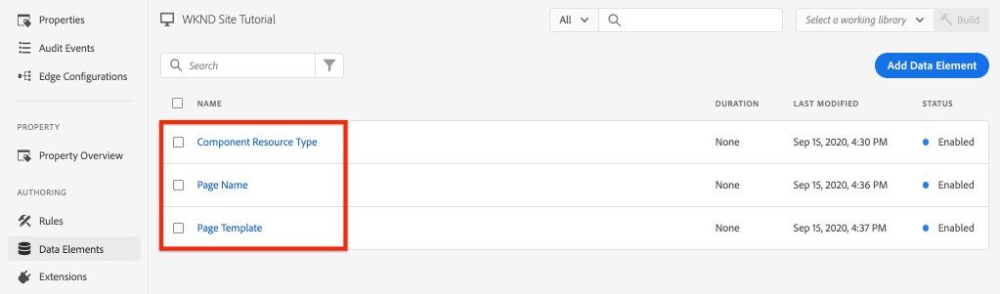

# 收集頁面資料與Adobe Analytics

>[!NOTE]
>
>Adobe Experience Platform Launch已被改名為Adobe Experience Platform的一套資料收集技術。 因此，在產品文檔中已進行了一些術語更改。 請參閱以下內容 [文檔](https://experienceleague.adobe.com/docs/experience-platform/tags/term-updates.html) 的下一頁。


瞭解如何使用 [Adobe客戶端資料層(AEM帶核心元件)](https://experienceleague.adobe.com/docs/experience-manager-core-components/using/developing/data-layer/overview.html) 收集Adobe Experience Manager Sites某頁的資料。 [Experience Platform中的標籤](https://experienceleague.adobe.com/docs/experience-platform/tags/home.html) 和 [Adobe Analytics擴展](https://experienceleague.adobe.com/docs/experience-platform/tags/extensions/client/analytics/overview.html) 用於建立規則以將頁資料發送到Adobe Analytics。

## 您要構建的 {#what-build}


在本教程中，您將根據來自Adobe客戶端資料層的事件觸發標籤規則。 另外，添加何時應觸發規則的條件，然後發送 **頁名** 和 **頁面模板** 頁AEM到Adobe Analytics

### 目標 {#objective}

1. 在標籤屬性中建立事件驅動規則，以捕獲資料層中的更改
1. 將頁資料層屬性映射到標籤屬性中的資料元素
1. 使用頁面視圖信標收集頁面資料並將其發送到Adobe Analytics

## 必備條件

以下是必需的：

* **標籤屬性** Experience Platform
* **Adobe Analytics** test/開發報告套件ID和跟蹤伺服器。 請參閱以下文檔 [建立報表套件](https://experienceleague.adobe.com/docs/analytics/admin/admin-tools/manage-report-suites/c-new-report-suite/new-report-suite.html)。
* [Experience Platform調試器](https://experienceleague.adobe.com/docs/platform-learn/data-collection/debugger/overview.html) 瀏覽器擴展。 本教程中的螢幕截圖從Chrome瀏覽器捕獲。
* （可選）AEM站點 [Adobe客戶端資料層已啟用](https://experienceleague.adobe.com/docs/experience-manager-core-components/using/developing/data-layer/overview.html#installation-activation)。 本教程使用面向公共的 [WKND](https://wknd.site/us/en.html) 站點，但歡迎您使用自己的站點。

>[!NOTE]
>
> 是否需要整合標籤屬性和站AEM點的幫助？ [查看此視頻系列](../experience-platform/data-collection/tags/overview.md)。

## WKND站點的交換機標籤環境

的 [WKND](http://wknd.site/us/en.html) 是一個以 [開源項目](https://github.com/adobe/aem-guides-wknd) 設計為參考 [教程](https://experienceleague.adobe.com/docs/experience-manager-learn/getting-started-wknd-tutorial-develop/overview.html?lang=zh-Hant) 執行AEM。

您不必設定環AEM境並安裝WKND代碼庫，而是可以使用Experience Platform調試器 **開關** 活 [WKND站點](http://wknd.site/us/en.html) 至 *你* 標籤屬性。 但是，如果您自己的站AEM點已經擁有 [Adobe客戶端資料層已啟用](https://experienceleague.adobe.com/docs/experience-manager-core-components/using/developing/data-layer/overview.html#installation-activation)。

1. 登錄到Experience Platform和 [建立標籤屬性](https://experienceleague.adobe.com/docs/platform-learn/implement-in-websites/configure-tags/create-a-property.html) （如果尚未）。
1. 確保初始標籤JavaScript [庫已建立](https://experienceleague.adobe.com/docs/experience-platform/tags/publish/libraries.html#create-a-library) 並升級為標籤 [環境](https://experienceleague.adobe.com/docs/experience-platform/tags/publish/environments/environments.html)。
1. 將JavaScript嵌入代碼從庫已發佈到的標籤環境中複製。

   

1. 在瀏覽器中，開啟一個新頁籤並導航到 [WKND站點](http://wknd.site/us/en.html)
1. 開啟Experience Platform調試器瀏覽器擴展

   

1. 導航到 **Experience Platform標籤** > **配置** 在 **注入的嵌入代碼** 將現有嵌入代碼替換為 *你* 從步驟3複製的嵌入代碼。

   

1. 啟用 **控制台日誌記錄** 和 **鎖** WKND頁籤上的調試器。

   

## 驗證WKND站點上的Adobe客戶端資料層

的 [WKND參考項目](https://github.com/adobe/aem-guides-wknd) 使用核心AEM元件構建，並 [Adobe客戶端資料層已啟用](https://experienceleague.adobe.com/docs/experience-manager-core-components/using/developing/data-layer/overview.html#installation-activation) 預設值。 接下來，驗證Adobe客戶端資料層是否已啟用。

1. 導航到 [WKND站點](http://wknd.site/us/en.html)。
1. 開啟瀏覽器的開發人員工具並導航到 **控制台**。 運行以下命令：

   ```js
   adobeDataLayer.getState();
   ```

   上述代碼返回Adobe客戶端資料層的當前狀態。

   

1. 展開響應並檢查 `page` 的子菜單。 您應看到如下資料架構：

   ```json
   page-2eee4f8914:
       @type: "wknd/components/page"
       dc:description: WKND is a collective of outdoors, music, crafts, adventure sports, and travel enthusiasts that want to share our experiences, connections, and expertise with the world.
       dc:title: "WKND Adventures and Travel"
       repo:modifyDate: "2020-08-31T21:02:21Z"
       repo:path: "/content/wknd/us/en.html"
       xdm:language: "en-US"
       xdm:tags: ["Attract"]
       xdm:template: "/conf/wknd/settings/wcm/templates/landing-page-template"
   ```

   要將頁面資料發送到Adobe Analytics，請使用標準屬性，如 `dc:title`。 `xdm:language`, `xdm:template` 的上界。

   有關詳細資訊，請查看 [頁架構](https://experienceleague.adobe.com/docs/experience-manager-core-components/using/developing/data-layer/overview.html#page) 從核心元件資料架構中。

   >[!NOTE]
   >
   > 如果你看不到 `adobeDataLayer` JavaScript對象？ 確保 [Adobe客戶端資料層已啟用](https://experienceleague.adobe.com/docs/experience-manager-core-components/using/developing/data-layer/overview.html#installation-activation) 在你的網站上。

## 建立頁面載入規則

Adobe客戶端資料層是 **事件** 驅動資料層。 載入頁AEM資料層時，它將觸發 `cmp:show` 的子菜單。 建立在 `cmp:show` 從頁面資料層觸發事件。

1. 導航到Experience Platform並進入與站點整合的標AEM記屬性。
1. 導航到 **規則** 的子菜單，然後按一下 **建立新規則**。

   

1. 命名規則 **已載入頁**。
1. 在 **事件** 子節，按一下 **添加** 開啟 **事件配置** 的子菜單。
1. 對於 **事件類型** 欄位，選擇 **自定義代碼**。

   

1. 按一下 **開啟編輯器** 在主面板中，並輸入以下代碼段：

   ```js
   var pageShownEventHandler = function(evt) {
      // defensive coding to avoid a null pointer exception
      if(evt.hasOwnProperty("eventInfo") && evt.eventInfo.hasOwnProperty("path")) {
         //trigger the Tag Rule and pass event
         console.debug("cmp:show event: " + evt.eventInfo.path);
         var event = {
            //include the path of the component that triggered the event
            path: evt.eventInfo.path,
            //get the state of the component that triggered the event
            component: window.adobeDataLayer.getState(evt.eventInfo.path)
         };
   
         //Trigger the Tag Rule, passing in the new `event` object
         // the `event` obj can now be referenced by the reserved name `event` by other Tag data elements
         // i.e `event.component['someKey']`
         trigger(event);
      }
   }
   
   //set the namespace to avoid a potential race condition
   window.adobeDataLayer = window.adobeDataLayer || [];
   //push the event listener for cmp:show into the data layer
   window.adobeDataLayer.push(function (dl) {
      //add event listener for `cmp:show` and callback to the `pageShownEventHandler` function
      dl.addEventListener("cmp:show", pageShownEventHandler);
   });
   ```

   上述代碼段通過 [推動函式](https://github.com/adobe/adobe-client-data-layer/wiki#pushing-a-function) 到資料層。 當 `cmp:show` 觸發事件 `pageShownEventHandler` 函式。 在此函式中，添加了一些健全性檢查，並添加了 `event` 是用最新 [資料層的狀態](https://github.com/adobe/adobe-client-data-layer/wiki#getstate) 觸發事件的元件。

   最後 `trigger(event)` 函式。 的 `trigger()` 函式是標籤屬性中的保留名稱，它 **觸發器** 規則。 的 `event` 對象作為參數傳遞，而參數又由tag屬性中的另一個保留名稱公開。 標籤屬性中的資料元素現在可以使用代碼段引用各種屬性，如 `event.component['someKey']`。

1. 儲存變更。
1. 下一個 **操作** 按一下 **添加** 開啟 **操作配置** 的子菜單。
1. 對於 **操作類型** ，選擇 **自定義代碼**。

   

1. 按一下 **開啟編輯器** 在主面板中，並輸入以下代碼段：

   ```js
   console.debug("Page Loaded ");
   console.debug("Page name: " + event.component['dc:title']);
   console.debug("Page type: " + event.component['@type']);
   console.debug("Page template: " + event.component['xdm:template']);
   ```

   的 `event` 對象從 `trigger()` 在自定義事件中調用的方法。 這裡 `component` 是從資料層派生的當前頁 `getState` 的子菜單。

1. 保存更改並運行 [構建](https://experienceleague.adobe.com/docs/experience-platform/tags/publish/builds.html) 將代碼升級到 [環境](https://experienceleague.adobe.com/docs/experience-platform/tags/publish/environments/environments.html) 在您的站AEM點上。

   >[!NOTE]
   >
   > 使用 [Adobe Experience Platform調試器](https://experienceleague.adobe.com/docs/platform-learn/data-collection/debugger/overview.html) 將嵌入代碼切換到 **開發** 環境。

1. 導航到您AEM的站點，然後開啟開發人員工具以查看控制台。 刷新頁面，您應看到控制台消息已記錄：


## 建立資料元素

然後建立多個資料元素以從Adobe客戶端資料層捕獲不同的值。 如上一練習所示，可以直接通過自定義代碼訪問資料層的屬性。 使用「資料元素」的優點是可以跨標籤規則重新使用它們。

資料元素映射到 `@type`。 `dc:title`, `xdm:template` 屬性。

### 元件資源類型

1. 導航到Experience Platform並進入與站點整合的標AEM記屬性。
1. 導航到 **資料元素** 的 **建立新資料元素**。
1. 對於 **名稱** ，輸入 **元件資源類型**。
1. 對於 **資料元素類型** 欄位，選擇 **自定義代碼**。

   

1. 按一下 **開啟編輯器** 按鈕，在自定義代碼編輯器中輸入以下內容：

   ```js
   if(event && event.component && event.component.hasOwnProperty('@type')) {
       return event.component['@type'];
   }
   ```

1. 儲存變更。

   >[!NOTE]
   >
   > 記住 `event` 對象根據觸發該對象的事件可用並確定範圍 **規則** 在標籤屬性中。 在資料元素為 *引用* 在規則中。 因此，在規則內使用此資料元素是安全的， **已載入頁** 在上一步中建立的規則 *但* 在其他情況下使用是不安全的。

### 頁面名稱

1. 按一下 **添加資料元素** 按鈕
1. 對於 **名稱** 欄位，輸入 **頁名**。
1. 對於 **資料元素類型** 欄位，選擇 **自定義代碼**。
1. 按一下 **開啟編輯器** ，然後在自定義代碼編輯器中輸入以下內容：

   ```js
   if(event && event.component && event.component.hasOwnProperty('dc:title')) {
       return event.component['dc:title'];
   }
   ```

1. 儲存變更。

### 頁面範本

1. 按一下 **添加資料元素** 按鈕
1. 對於 **名稱** 欄位，輸入 **頁面模板**。
1. 對於 **資料元素類型** 欄位，選擇 **自定義代碼**。
1. 按一下 **開啟編輯器** ，然後在自定義代碼編輯器中輸入以下內容：

   ```js
   if(event && event.component && event.component.hasOwnProperty('xdm:template')) {
       return event.component['xdm:template'];
   }
   ```

1. 儲存變更。

1. 現在，您應將三個資料元素作為規則的一部分：

   

## 添加分析擴展

接下來，將分析擴展添加到您的標籤屬性中，將資料發送到報表套件。

1. 導航到Experience Platform並進入與站點整合的標AEM記屬性。
1. 轉到 **擴展** > **目錄**
1. 查找 **Adobe Analytics** 按一下 **安裝**

   

1. 下 **庫管理** > **報表套件**，輸入要用於每個標籤環境的報告套件ID。

   

   >[!NOTE]
   >
   > 在本教程中為所有環境都使用一個報告套件是可以的，但在現實生活中，您希望使用單獨的報告套件，如下圖所示

   >[!TIP]
   >
   >建議使用 *「為我管理庫」選項* 「庫管理」設定，因為它使 `AppMeasurement.js` 庫最新。

1. 選中複選框以啟用 **使用Activity Map**。

   

1. 下 **常規** > **跟蹤伺服器**，例如，輸入跟蹤伺服器， `tmd.sc.omtrdc.net`。 如果您的站點支援SSL跟蹤伺服器 `https://`

   

1. 按一下 **保存** 的子菜單。

## 將條件添加到「頁載入」規則

接下來，更新 **已載入頁** 規則 **元件資源類型** 資料元素，以確保僅在 `cmp:show` 事件是 **頁面**。 其它元件可以 `cmp:show` 事件，例如，當幻燈片更改時，Carousel元件將觸發它。 因此，為此規則添加條件非常重要。

1. 在標籤屬性UI中，導航到 **已載入頁** 規則早先建立。
1. 下 **條件** 按一下 **添加** 開啟 **條件配置** 的子菜單。
1. 對於 **條件類型** 欄位，選擇 **值比較** 的雙曲餘切值。
1. 將表單域中的第一個值設定為 `%Component Resource Type%`。 可以使用「資料元素」表徵圖  的 **元件資源類型** 資料元素。 將比較器設定為 `Equals`。
1. 將第二個值設定為 `wknd/components/page`。

   

   >[!NOTE]
   >
   > 可以在偵聽的自定義代碼函式中添加此條件 `cmp:show` 在教程的前面建立的事件。 但是，在UI中添加它可讓可能需要更改規則的其他用戶看到更多內容。 另外，我們還可以利用資料元素！

1. 儲存變更。

## 設定分析變數並觸發頁視圖信標

當前 **已載入頁** 規則只輸出控制台語句。 接下來，使用資料元素和分析擴展將分析變數設定為 **動作** 的 **已載入頁** 規則。 我們還設定了額外的操作來觸發 **頁面視圖信標** 把收集到的資料發給Adobe Analytics。

1. 在「載入頁面」規則中， **刪除** 這樣 **核心 — 自定義代碼** 操作（控制台語句）:

   

1. 在「操作」子節下，按一下 **添加** 的子菜單。

1. 設定 **擴展** 類型 **Adobe Analytics** 並設定 **操作類型** 至  **設定變數**

   

1. 在主面板中，選擇可用 **eVar** 並設定為資料元素的值 **頁面模板**。 使用「資料元素」表徵圖  的 **頁面模板** 的子菜單。

   

1. 向下滾動，在下 **其他設定** 集 **頁名** 到資料元素 **頁名**:

   

1. 儲存變更。

1. 接下來，在右側添加一個附加操作 **Adobe Analytics — 設定變數** 點擊 **加** 表徵圖：

   

1. 設定 **擴展** 類型 **Adobe Analytics** 並設定 **操作類型** 至  **發送信標**。 由於此操作被視為頁面視圖，因此將預設跟蹤設定為 **`s.t()`**。

   

1. 儲存變更。的 **已載入頁** 規則現在應具有以下配置：

   

   * **1.** 聽著 `cmp:show` 的子菜單。
   * **2.** 檢查事件是否由頁面觸發。
   * **3.** 設定分析變數 **頁名** 和 **頁面模板**
   * **4.** 發送分析頁視圖信標

1. 保存所有更改並構建標籤庫，升級到相應的環境。

## 驗證「頁面視圖信標」和「分析」調用

現在 **已載入頁** 規則發送分析信標，您應該能夠使用Experience Platform調試器查看分析跟蹤變數。

1. 開啟 [WKND站點](https://wknd.site/us/en.html) 的子菜單。
1. 按一下調試器表徵圖  開啟Experience Platform調試器。
1. 確保調試器正在將標籤屬性映射到 *你* 開發環境，如前面和 **控制台日誌記錄** 的子菜單。
1. 開啟「分析」菜單並驗證報表套件是否設定為 *你* 報表套件。 還應填充頁名：

   

1. 向下滾動並展開 **網路請求**。 你應該能找到 **埃瓦** 設定 **頁面模板**:

   

1. 返回到瀏覽器並開啟開發人員控制台。 按一下 **旋轉木馬** 頁面頂部。

   

1. 在瀏覽器控制台中觀察控制台語句：

   

   這是因為旋轉木馬確實 `cmp:show` 事件 *但* 因為我們的支票 **元件資源類型**，未觸發任何事件。

   >[!NOTE]
   >
   > 如果未看到任何控制台日誌，請確保 **控制台日誌記錄** 選中 **Experience Platform標籤** Experience Platform調試器。

1. 導航到文章頁面，如 [西澳大利亞](https://wknd.site/us/en/magazine/western-australia.html)。 觀察頁面名稱和模板類型的更改。

## 恭喜！

您剛才使用事件驅動的Adobe客戶端資料層和Experience Platform中的標籤從站點收集資料頁AEM資料並將其發送到Adobe Analytics。

### 後續步驟

請參閱以下教程，瞭解如何使用事件驅動的Adobe客戶端資料層 [跟蹤Adobe Experience Manager站點上特定元件的點擊量](track-clicked-component.md)。
