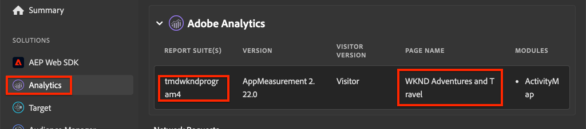

# 整合AEM Sites和Adobe Analytics

>[!NOTE]
>
>Adobe Experience Platform Launch已經過品牌重塑，現在是Adobe Experience Platform中的一套資料收集技術。 因此，所有產品檔案中出現了幾項術語變更。 請參閱以下內容 [檔案](https://experienceleague.adobe.com/docs/experience-platform/tags/term-updates.html) 以取得術語變更的彙整參考資料。


瞭解如何使用AEM Sites的內建功能，將Adobe Analytics和Adobe Analytics標籤擴充功能整合 [使用AEM核心元件Adobe使用者端資料層](https://experienceleague.adobe.com/docs/experience-manager-core-components/using/developing/data-layer/overview.html) 以收集Adobe Experience Manager Sites中某個頁面的相關資料。 [Experience Platform中的標籤](https://experienceleague.adobe.com/docs/experience-platform/tags/home.html) 和 [Adobe Analytics擴充功能](https://experienceleague.adobe.com/docs/experience-platform/tags/extensions/client/analytics/overview.html) 用於建立規則，以將頁面資料傳送至Adobe Analytics。

## 您即將建置的內容 {#what-build}


在本教學課程中，您將根據Adobe使用者端資料層中的事件觸發標籤規則。 此外，為應該引發規則的時機新增條件，然後傳送 **頁面名稱** 和 **頁面範本** 從AEM頁面傳至Adobe Analytics的值。

### 目標 {#objective}

1. 在標籤屬性中建立事件導向規則，以擷取資料層的變更
1. 將頁面資料層屬性對應至標籤屬性中的資料元素
1. 使用頁面檢視信標收集頁面資料並傳送至Adobe Analytics

## 先決條件

需要下列專案：

* **標籤屬性** 在Experience Platform中
* **Adobe Analytics** 測試/開發報表套裝ID和追蹤伺服器。 請參閱以下檔案以瞭解 [建立報表套裝](https://experienceleague.adobe.com/docs/analytics/admin/admin-tools/manage-report-suites/c-new-report-suite/new-report-suite.html).
* [Experience Platform偵錯工具](https://experienceleague.adobe.com/docs/platform-learn/data-collection/debugger/overview.html) 瀏覽器延伸模組。 本教學課程中的熒幕擷取畫面是從Chrome瀏覽器擷取。
* （選用）具有的AEM網站 [Adobe使用者端資料層已啟用](https://experienceleague.adobe.com/docs/experience-manager-core-components/using/developing/data-layer/overview.html#installation-activation). 本教學課程使用公開顯示 [WKND](https://wknd.site/us/en.html) 網站，但歡迎您使用自己的網站。

>[!NOTE]
>
> 需要整合標籤屬性和AEM網站的協助嗎？ [觀看此影片系列](../experience-platform/data-collection/tags/overview.md).

## 切換WKND網站的標籤環境

此 [WKND](https://wknd.site/us/en.html) 是面向公眾的網站，建立在 [開放原始碼專案](https://github.com/adobe/aem-guides-wknd) 設計作為參考和 [教學課程](https://experienceleague.adobe.com/docs/experience-manager-learn/getting-started-wknd-tutorial-develop/overview.html) 適用於AEM實作。

除了設定AEM環境及安裝WKND程式碼基底之外，您還可以使用Experience Platform偵錯工具來 **切換** 即時 [WKND網站](https://wknd.site/us/en.html) 至 *您的* 標籤屬性。 不過，如果您的AEM網站已有 [Adobe使用者端資料層已啟用](https://experienceleague.adobe.com/docs/experience-manager-core-components/using/developing/data-layer/overview.html#installation-activation).

1. 登入Experience Platform並 [建立Tag屬性](https://experienceleague.adobe.com/docs/platform-learn/implement-in-websites/configure-tags/create-a-property.html) （如果沒有）。
1. 確認初始標籤JavaScript [資料庫已建立](https://experienceleague.adobe.com/docs/experience-platform/tags/publish/libraries.html#create-a-library) 並提升至標籤 [環境](https://experienceleague.adobe.com/docs/experience-platform/tags/publish/environments/environments.html?lang=zh-Hant).
1. 從程式庫已發佈到的標籤環境中複製JavaScript內嵌程式碼。

   

1. 在您的瀏覽器中，開啟新標籤並導覽至 [WKND網站](https://wknd.site/us/en.html)
1. 開啟Experience Platform Debugger瀏覽器擴充功能

   

1. 瀏覽至 **Experience Platform標籤** > **設定** 和下 **插入的內嵌程式碼** 將現有的內嵌程式碼取代為 *您的* 內嵌程式碼是從步驟3複製。

   

1. 啟用 **主控台記錄** 和 **鎖定** WKND標籤上的除錯工具。

   

## 驗證WKND網站上的Adobe使用者端資料層

此 [WKND參考專案](https://github.com/adobe/aem-guides-wknd) 是以AEM核心元件建立而成，具備 [Adobe使用者端資料層已啟用](https://experienceleague.adobe.com/docs/experience-manager-core-components/using/developing/data-layer/overview.html#installation-activation) 依預設。 接下來，確認Adobe使用者端資料層已啟用。

1. 瀏覽至 [WKND網站](https://wknd.site/us/en.html).
1. 開啟瀏覽器的開發人員工具，並導覽至 **主控台**. 執行以下命令：

   ```js
   adobeDataLayer.getState();
   ```

   上述程式碼會傳回Adobe使用者端資料層的目前狀態。

   

1. 展開回應並檢查 `page` 登入點。 您應該會看到類似以下的資料結構：

   ```json
   page-2eee4f8914:
       @type: "wknd/components/page"
       dc:description: WKND is a collective of outdoors, music, crafts, adventure sports, and travel enthusiasts that want to share our experiences, connections, and expertise with the world.
       dc:title: "WKND Adventures and Travel"
       repo:modifyDate: "2020-08-31T21:02:21Z"
       repo:path: "/content/wknd/us/en.html"
       xdm:language: "en-US"
       xdm:tags: ["Attract"]
       xdm:template: "/conf/wknd/settings/wcm/templates/landing-page-template"
   ```

   若要將頁面資料傳送至Adobe Analytics，請使用以下標準屬性 `dc:title`， `xdm:language`、和 `xdm:template` 資料層的URL。

   如需詳細資訊，請檢閱 [頁面結構描述](https://experienceleague.adobe.com/docs/experience-manager-core-components/using/developing/data-layer/overview.html#page) 核心元件資料結構描述中的。

   >[!NOTE]
   >
   > 如果您沒有看到 `adobeDataLayer` JavaScript物件？ 確保 [已啟用Adobe使用者端資料層](https://experienceleague.adobe.com/docs/experience-manager-core-components/using/developing/data-layer/overview.html#installation-activation) 在您的網站上。

## 建立頁面載入規則

Adobe使用者端資料層是 **事件導向** 資料層。 載入AEM Page資料層時，會觸發 `cmp:show` 事件。 建立規則，此規則會在 `cmp:show` 事件是從頁面資料層觸發。

1. 導覽至Experience Platform並進入與AEM網站整合的標籤屬性。
1. 導覽至 **規則** 區段，然後按一下 **建立新規則**.

   

1. 為規則命名 **頁面已載入**.
1. 在 **活動** 子區段，按一下 **新增** 以開啟 **事件設定** 精靈。
1. 的 **事件型別** 欄位，選取 **自訂程式碼**.

   

1. 按一下 **開啟編輯器** 在主面板中，輸入下列程式碼片段：

   ```js
   var pageShownEventHandler = function(evt) {
      // defensive coding to avoid a null pointer exception
      if(evt.hasOwnProperty("eventInfo") && evt.eventInfo.hasOwnProperty("path")) {
         //trigger the Tag Rule and pass event
         console.log("cmp:show event: " + evt.eventInfo.path);
         var event = {
            //include the path of the component that triggered the event
            path: evt.eventInfo.path,
            //get the state of the component that triggered the event
            component: window.adobeDataLayer.getState(evt.eventInfo.path)
         };
   
         //Trigger the Tag Rule, passing in the new `event` object
         // the `event` obj can now be referenced by the reserved name `event` by other Tag data elements
         // i.e `event.component['someKey']`
         trigger(event);
      }
   }
   
   //set the namespace to avoid a potential race condition
   window.adobeDataLayer = window.adobeDataLayer || [];
   //push the event listener for cmp:show into the data layer
   window.adobeDataLayer.push(function (dl) {
      //add event listener for `cmp:show` and callback to the `pageShownEventHandler` function
      dl.addEventListener("cmp:show", pageShownEventHandler);
   });
   ```

   上述程式碼片段會依照以下方式新增事件接聽程式 [推送函式](https://github.com/adobe/adobe-client-data-layer/wiki#pushing-a-function) 並放入資料層。 時間 `cmp:show` 事件是以下動作觸發： `pageShownEventHandler` 呼叫函式。 在此函式中，新增了一些健全性檢查和一個新的 `event` 建構使用最新的 [資料層的狀態](https://github.com/adobe/adobe-client-data-layer/wiki#getstate) 用於觸發事件的元件。

   最後 `trigger(event)` 呼叫函式。 此 `trigger()` 函式是標籤屬性中的保留名稱，它 **觸發器** 規則。 此 `event` 物件會作為引數傳遞，而引數會由tag屬性中的另一個保留名稱公開。 標籤屬性中的資料元素現在可以使用程式碼片段（例如），參照各種屬性 `event.component['someKey']`.

1. 儲存變更。
1. 下一個在 **動作** 按一下 **新增** 以開啟 **動作設定** 精靈。
1. 的 **動作型別** 欄位，選擇 **自訂程式碼**.

   

1. 按一下 **開啟編輯器** 在主面板中，輸入下列程式碼片段：

   ```js
   console.log("Page Loaded ");
   console.log("Page name: " + event.component['dc:title']);
   console.log("Page type: " + event.component['@type']);
   console.log("Page template: " + event.component['xdm:template']);
   ```

   此 `event` 物件傳遞自 `trigger()` 在自訂事件中呼叫的方法。 在此， `component` 是從資料層衍生的目前頁面 `getState` 在自訂事件中。

1. 儲存變更並執行 [版本編號](https://experienceleague.adobe.com/docs/experience-platform/tags/publish/builds.html) 將程式碼提升至 [環境](https://experienceleague.adobe.com/docs/experience-platform/tags/publish/environments/environments.html?lang=zh-Hant) 用於您的AEM網站。

   >[!NOTE]
   >
   > 使用 [Adobe Experience Platform Debugger](https://experienceleague.adobe.com/docs/platform-learn/data-collection/debugger/overview.html) 將內嵌程式碼切換為 **開發** 環境。

1. 導覽至您的AEM網站，然後開啟開發人員工具以檢視主控台。 重新整理頁面，您應該會看到主控台訊息已記錄：


## 建立資料元素

接著，建立數個資料元素，從Adobe使用者端資料層擷取不同的值。 如同上一個練習所示，您可以直接透過自訂程式碼存取資料層的屬性。 使用資料元素的優點在於它們可以在標籤規則中重複使用。

資料元素會對應至 `@type`， `dc:title`、和 `xdm:template` 屬性。

### 元件資源型別

1. 導覽至Experience Platform並進入與AEM網站整合的標籤屬性。
1. 導覽至 **資料元素** 區段並按一下 **建立新資料元素**.
1. 對於 **名稱** 欄位，輸入 **元件資源型別**.
1. 對於 **資料元素型別** 欄位，選取 **自訂程式碼**.

   

1. 按一下 **開啟編輯器** 按鈕，並在自訂程式碼編輯器中輸入下列內容：

   ```js
   if(event && event.component && event.component.hasOwnProperty('@type')) {
       return event.component['@type'];
   }
   ```

1. 儲存變更。

   >[!NOTE]
   >
   > 記住 `event` 物件可供使用，並根據觸發 **規則** 標籤屬性中的。 在資料元素完成以下步驟前，不會設定資料元素的值 *已引用* 在規則內。 因此，在規則內使用此資料元素是安全的，例如 **頁面已載入** 在上一步建立的規則 *但是* 在其他情境中使用此專案會很不安全。

### 頁面名稱

1. 按一下 **新增資料元素** 按鈕
1. 對於 **名稱** 欄位，輸入 **頁面名稱**.
1. 對於 **資料元素型別** 欄位，選取 **自訂程式碼**.
1. 按一下 **開啟編輯器** 按鈕，然後在自訂程式碼編輯器中輸入下列內容：

   ```js
   if(event && event.component && event.component.hasOwnProperty('dc:title')) {
       return event.component['dc:title'];
   }
   ```

1. 儲存變更。

### 頁面範本

1. 按一下 **新增資料元素** 按鈕
1. 對於 **名稱** 欄位，輸入 **頁面範本**.
1. 對於 **資料元素型別** 欄位，選取 **自訂程式碼**.
1. 按一下 **開啟編輯器** 按鈕，然後在自訂程式碼編輯器中輸入下列內容：

   ```js
   if(event && event.component && event.component.hasOwnProperty('xdm:template')) {
       return event.component['xdm:template'];
   }
   ```

1. 儲存變更。

1. 規則中現在應該包含三個資料元素：

   

## 新增Analytics擴充功能

接下來，將Analytics擴充功能新增至您的標籤屬性，以將資料傳送至報表套裝。

1. 導覽至Experience Platform並進入與AEM網站整合的標籤屬性。
1. 前往 **擴充功能** > **目錄**
1. 找到 **Adobe Analytics** 擴充功能並按一下 **安裝**

   

1. 在 **程式庫管理** > **報表套裝**，輸入您要用於每個標籤環境的報表套裝id。

   

   >[!NOTE]
   >
   > 在本教學課程中，您可針對所有環境使用同一個報表套裝，但在現實情況中，您需使用個別的報表套裝（如下圖所示）

   >[!TIP]
   >
   >我們建議使用 *為我管理程式庫選項* 作為程式庫管理設定，因為可讓您更輕鬆地 `AppMeasurement.js` 程式庫為最新狀態。

1. 核取方塊以啟用 **使用Activity Map**.

   

1. 在 **一般** > **追蹤伺服器**，輸入您的追蹤伺服器，例如 `tmd.sc.omtrdc.net`. 如果您的網站支援，請輸入SSL追蹤伺服器 `https://`

   

1. 按一下 **儲存** 以儲存變更。

## 將條件新增至頁面載入規則

接下來，更新 **頁面已載入** 規則來使用 **元件資源型別** 資料元素以確保規則只在 `cmp:show` 事件用於 **頁面**. 其他元件可觸發 `cmp:show` 事件，例如，輪播元件會在幻燈片變更時觸發此事件。 因此，請務必為此規則新增條件。

1. 在標籤屬性UI中，導覽至 **頁面已載入** 規則先前已建立。
1. 在 **條件** 按一下 **新增** 以開啟 **條件設定** 精靈。
1. 的 **條件型別** 欄位，選取 **值比較** 選項。
1. 將表單欄位中的第一個值設為 `%Component Resource Type%`. 您可以使用資料元素圖示  以選取 **元件資源型別** 資料元素。 將比較器保留設為 `Equals`.
1. 將第二個值設為 `wknd/components/page`.

   

   >[!NOTE]
   >
   > 您可在接聽的自訂程式碼函式中新增此條件 `cmp:show` 在教學課程中先前建立的事件。 不過，將其新增至UI可讓可能需要變更規則的其他使用者更清楚瞭解。 此外，我們還能使用資料元素！

1. 儲存變更。

## 設定Analytics變數並觸發頁面檢視信標

目前 **頁面已載入** 規則只會輸出主控台陳述式。 接下來，使用資料元素和Analytics擴充功能，將Analytics變數設為 **動作** 在 **頁面已載入** 規則。 我們也會設定額外的動作以觸發 **頁面檢視信標** 並將收集的資料傳送至Adobe Analytics。

1. 在「頁面已載入」規則中， **移除** 此 **核心 — 自訂程式碼** 動作（主控台陳述式）：

   

1. 在動作子區段下，按一下 **新增** 以新增動作。

1. 設定 **副檔名** 輸入至 **Adobe Analytics** 並設定 **動作型別** 至  **設定變數**

   

1. 在主面板中，選取可用的 **eVar** 並設為資料元素的值 **頁面範本**. 使用資料元素圖示  以選取 **頁面範本** 元素。

   

1. 向下捲動，在下 **其他設定** 設定 **頁面名稱** 至資料元素 **頁面名稱**：

   

1. 儲存變更。

1. 接下來，在「 」的右側新增一個額外動作 **Adobe Analytics — 設定變數** 點選 **加** 圖示：

   

1. 設定 **副檔名** 輸入至 **Adobe Analytics** 並設定 **動作型別** 至  **傳送信標**. 由於此動作會視為頁面檢視，請將預設追蹤設為 **`s.t()`**.

   

1. 儲存變更。 此 **頁面已載入** 規則現在應具有下列設定：

   

   * **1.** 聆聽 `cmp:show` 事件。
   * **2.** 檢查事件是否由頁面觸發。
   * **3.** 設定Analytics變數 **頁面名稱** 和 **頁面範本**
   * **4.** 傳送Analytics頁面檢視信標

1. 儲存所有變更並建置您的標籤程式庫，升級至適當的環境。

## 驗證頁面檢視信標和Analytics呼叫

現在 **頁面已載入** 規則會傳送Analytics信標，您應該能夠使用Analytics Debugger檢視Experience Platform追蹤變數。

1. 開啟 [WKND網站](https://wknd.site/us/en.html) 在您的瀏覽器中。
1. 按一下Debugger圖示  以開啟Experience PlatformDebugger。
1. 確認Debugger將標籤屬性對應至 *您的* 開發環境，如先前和所述 **主控台記錄** 已勾選。
1. 開啟Analytics功能表，並確認報表套裝已設為 *您的* 報告套裝。 頁面名稱也應填入：

   

1. 向下捲動並展開 **網路要求**. 您應該能夠找到 **evar** 為 **頁面範本**：

   

1. 返回瀏覽器並開啟開發人員主控台。 按一下 **輪播** ，位於頁面頂端。

   

1. 在瀏覽器主控台中觀察主控台陳述式：

   

   這是因為轉盤確實會觸發 `cmp:show` 事件 *但是* 因為我們檢查了 **元件資源型別**，不會引發任何事件。

   >[!NOTE]
   >
   > 如果您沒有看到任何主控台記錄檔，請確定 **主控台記錄** 已勾選在 **Experience Platform標籤** 在Experience Platform Debugger中。

1. 導覽至文章頁面，例如 [西澳洲](https://wknd.site/us/en/magazine/western-australia.html). 觀察該頁面名稱和範本型別的變更。

## 恭喜！

您剛才在Experience Platform中使用事件導向的Adobe使用者端資料層和標籤，從AEM Site收集資料頁面資料並將其傳送到Adobe Analytics。

### 後續步驟

請參閱下列教學課程，瞭解如何使用事件導向的Adobe使用者端資料層 [追蹤Adobe Experience Manager網站上特定元件的點按次數](track-clicked-component.md).
