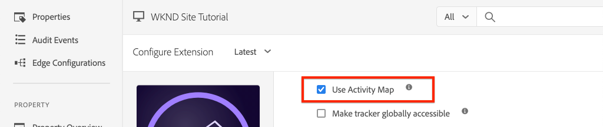

# 整合AEM Sites和Adobe Analytics

瞭解如何使用[AEM Sites使用者端資料層與Adobe Analytics核心元件](https://experienceleague.adobe.com/docs/experience-manager-core-components/using/developing/data-layer/overview.html)的內建功能，將AEM和Adobe與Adobe Analytics標籤擴充功能整合，以收集Adobe Experience Manager Sites中某個頁面的相關資料。 Experience Platform[&#128279;](https://experienceleague.adobe.com/docs/experience-platform/tags/home.html)中的標籤和[Adobe Analytics擴充功能](https://experienceleague.adobe.com/docs/experience-platform/tags/extensions/client/analytics/overview.html)是用來建立規則，以將頁面資料傳送至Adobe Analytics。

## 您即將建置的內容 {#what-build}


在本教學課程中，您將根據Adobe使用者端資料層中的事件觸發標籤規則。 此外，請為應該引發規則的時間新增條件，然後將AEM頁面的&#x200B;**頁面名稱**&#x200B;和&#x200B;**頁面範本**&#x200B;值傳送至Adobe Analytics。

### 目標 {#objective}

1. 在標籤屬性中建立事件導向規則，以擷取資料層的變更
1. 將頁面資料層屬性對應至標籤屬性中的資料元素
1. 使用頁面檢視信標收集頁面資料並傳送至Adobe Analytics

## 先決條件

需要下列專案：

* Experience Platform中的&#x200B;**標籤屬性**
* **Adobe Analytics**&#x200B;測試/開發報表套裝ID與追蹤伺服器。 請參閱下列有關[建立報表套裝](https://experienceleague.adobe.com/docs/analytics/admin/admin-tools/manage-report-suites/c-new-report-suite/new-report-suite.html)的檔案。
* [Experience Platform Debugger](https://experienceleague.adobe.com/docs/platform-learn/data-collection/debugger/overview.html)瀏覽器延伸模組。 本教學課程中的熒幕擷取畫面是從Chrome瀏覽器擷取。
* （選用）已啟用[Adobe使用者端資料層的AEM網站](https://experienceleague.adobe.com/docs/experience-manager-core-components/using/developing/data-layer/overview.html#installation-activation)。 此教學課程使用公開的[WKND](https://wknd.site/us/en.html)網站，但歡迎您使用自己的網站。

>[!NOTE]
>
> 需要整合標籤屬性和AEM網站的協助嗎？ [觀看此影片系列](../experience-platform/data-collection/tags/overview.md)。

## 切換WKND網站的標籤環境

[WKND](https://wknd.site/us/en.html)是面向公眾的網站，建置基礎為[開放原始碼專案](https://github.com/adobe/aem-guides-wknd)，設計作為參考和[AEM實作的教學課程](https://experienceleague.adobe.com/docs/experience-manager-learn/getting-started-wknd-tutorial-develop/overview.html)。

您不必設定AEM環境及安裝WKND程式碼基底，而是可以使用Experience Platform Debugger將已上線的[WKND網站](https://wknd.site/us/en.html)切換&#x200B;**至&#x200B;*您的*標籤屬性。**&#x200B;不過，如果您的AEM網站已啟用[Adobe使用者端資料層](https://experienceleague.adobe.com/docs/experience-manager-core-components/using/developing/data-layer/overview.html#installation-activation)，您就可以使用該網站。

1. 登入Experience Platform並[建立Tag屬性](https://experienceleague.adobe.com/docs/platform-learn/implement-in-websites/configure-tags/create-a-property.html) （如果尚未建立）。
1. 確定已建立初始標籤JavaScript [資料庫](https://experienceleague.adobe.com/docs/experience-platform/tags/publish/libraries.html#create-a-library)並提升至標籤[環境](https://experienceleague.adobe.com/docs/experience-platform/tags/publish/environments/environments.html)。
1. 從已發佈程式庫的目的地標籤環境中複製JavaScript內嵌程式碼。

   

1. 在您的瀏覽器中，開啟新索引標籤並導覽至[WKND網站](https://wknd.site/us/en.html)
1. 開啟Experience Platform Debugger瀏覽器擴充功能

   

1. 導覽至&#x200B;**Experience Platform Tags** > **設定**，並在&#x200B;**插入的內嵌程式碼**&#x200B;下以從步驟3複製的&#x200B;*您的*&#x200B;內嵌程式碼取代現有的內嵌程式碼。

   

1. 在WKND索引標籤上啟用&#x200B;**主控台記錄**&#x200B;和&#x200B;**鎖定**&#x200B;偵錯工具。

   

## 驗證WKND網站上的Adobe使用者端資料層

[WKND參考專案](https://github.com/adobe/aem-guides-wknd)是以AEM核心元件建置，並且預設已啟用[Adobe使用者端資料層](https://experienceleague.adobe.com/docs/experience-manager-core-components/using/developing/data-layer/overview.html#installation-activation)。 接下來，確認Adobe使用者端資料層已啟用。

1. 導覽至[WKND網站](https://wknd.site/us/en.html)。
1. 開啟瀏覽器的開發人員工具，並導覽至&#x200B;**主控台**。 執行以下命令：

   ```js
   adobeDataLayer.getState();
   ```

   上述程式碼會傳回Adobe使用者端資料層的目前狀態。

   

1. 展開回應並檢查`page`專案。 您應該會看到類似以下的資料結構：

   ```json
   page-2eee4f8914:
       @type: "wknd/components/page"
       dc:description: WKND is a collective of outdoors, music, crafts, adventure sports, and travel enthusiasts that want to share our experiences, connections, and expertise with the world.
       dc:title: "WKND Adventures and Travel"
       repo:modifyDate: "2020-08-31T21:02:21Z"
       repo:path: "/content/wknd/us/en.html"
       xdm:language: "en-US"
       xdm:tags: ["Attract"]
       xdm:template: "/conf/wknd/settings/wcm/templates/landing-page-template"
   ```

   若要將頁面資料傳送至Adobe Analytics，請使用資料層的`dc:title`、`xdm:language`和`xdm:template`等標準屬性。

   如需詳細資訊，請參閱核心元件資料結構描述中的[頁面結構描述](https://experienceleague.adobe.com/docs/experience-manager-core-components/using/developing/data-layer/overview.html#page)。

   >[!NOTE]
   >
   > 如果您沒有看到`adobeDataLayer` JavaScript物件？ 確定您的網站上已啟用[Adobe使用者端資料層](https://experienceleague.adobe.com/docs/experience-manager-core-components/using/developing/data-layer/overview.html#installation-activation)。

## 建立頁面載入規則

Adobe使用者端資料層是&#x200B;**事件導向**&#x200B;資料層。 載入AEM頁面資料層時，會觸發`cmp:show`事件。 建立從頁面資料層觸發`cmp:show`事件時觸發的規則。

1. 導覽至Experience Platform並進入與AEM網站整合的標籤屬性。
1. 導覽至標籤屬性UI中的&#x200B;**規則**&#x200B;區段，然後按一下&#x200B;**建立新規則**。

   

1. 將規則&#x200B;**頁面載入名稱**。
1. 在&#x200B;**事件**&#x200B;子區段中，按一下&#x200B;**新增**&#x200B;以開啟&#x200B;**事件設定**&#x200B;精靈。
1. 針對&#x200B;**事件型別**&#x200B;欄位，選取&#x200B;**自訂程式碼**。

   

1. 按一下主面板中的&#x200B;**開啟編輯器**，然後輸入下列程式碼片段：

   ```js
   var pageShownEventHandler = function(evt) {
      // defensive coding to avoid a null pointer exception
      if(evt.hasOwnProperty("eventInfo") && evt.eventInfo.hasOwnProperty("path")) {
         //trigger the Tag Rule and pass event
         console.log("cmp:show event: " + evt.eventInfo.path);
         var event = {
            //include the path of the component that triggered the event
            path: evt.eventInfo.path,
            //get the state of the component that triggered the event
            component: window.adobeDataLayer.getState(evt.eventInfo.path)
         };
   
         //Trigger the Tag Rule, passing in the new `event` object
         // the `event` obj can now be referenced by the reserved name `event` by other Tag data elements
         // i.e `event.component['someKey']`
         trigger(event);
      }
   }
   
   //set the namespace to avoid a potential race condition
   window.adobeDataLayer = window.adobeDataLayer || [];
   //push the event listener for cmp:show into the data layer
   window.adobeDataLayer.push(function (dl) {
      //add event listener for `cmp:show` and callback to the `pageShownEventHandler` function
      dl.addEventListener("cmp:show", pageShownEventHandler);
   });
   ```

   上述程式碼片段透過[將函式](https://github.com/adobe/adobe-client-data-layer/wiki#pushing-a-function)推入資料層，以新增事件接聽程式。 觸發`cmp:show`事件時，會呼叫`pageShownEventHandler`函式。 在此函式中，已新增一些健全性檢查，而且已使用觸發事件的元件之資料層[&#128279;](https://github.com/adobe/adobe-client-data-layer/wiki#getstate)的最新狀態建構新的`event`。

   最後呼叫`trigger(event)`函式。 `trigger()`函式是標籤屬性中的保留名稱，它會&#x200B;**觸發規則**。 `event`物件傳遞為引數，而該引數又由標籤屬性中的另一個保留名稱公開。 標籤屬性中的資料元素現在可以使用程式碼片段（例如`event.component['someKey']`）來參考各種屬性。

1. 儲存變更。
1. 接下來，在&#x200B;**動作**&#x200B;底下，按一下&#x200B;**新增**&#x200B;以開啟&#x200B;**動作組態**&#x200B;精靈。
1. 對於&#x200B;**動作型別**&#x200B;欄位，請選擇&#x200B;**自訂程式碼**。

   

1. 按一下主面板中的&#x200B;**開啟編輯器**，然後輸入下列程式碼片段：

   ```js
   console.log("Page Loaded ");
   console.log("Page name: " + event.component['dc:title']);
   console.log("Page type: " + event.component['@type']);
   console.log("Page template: " + event.component['xdm:template']);
   ```

   `event`物件是從自訂事件中呼叫的`trigger()`方法傳遞。 在此，`component`是從自訂事件中的資料層`getState`衍生的目前頁面。

1. 儲存變更並在標籤屬性中執行[組建](https://experienceleague.adobe.com/docs/experience-platform/tags/publish/builds.html)，以將程式碼提升至您AEM網站上使用的[環境](https://experienceleague.adobe.com/docs/experience-platform/tags/publish/environments/environments.html)。

   >[!NOTE]
   >
   > 使用[Adobe Experience Platform Debugger](https://experienceleague.adobe.com/docs/platform-learn/data-collection/debugger/overview.html)將內嵌程式碼切換至&#x200B;**開發**&#x200B;環境可能很有用。

1. 導覽至您的AEM網站，然後開啟開發人員工具以檢視主控台。 重新整理頁面，您應該會看到主控台訊息已記錄：


## 建立資料元素

接著，建立數個資料元素，從Adobe Client Data Layer擷取不同值。 如同上一個練習所示，您可以直接透過自訂程式碼存取資料層的屬性。 使用資料元素的優點在於它們可以在標籤規則中重複使用。

資料元素對應至`@type`、`dc:title`和`xdm:template`屬性。

### 元件資源型別

1. 導覽至Experience Platform並進入與AEM網站整合的標籤屬性。
1. 導覽至&#x200B;**資料元素**&#x200B;區段，然後按一下&#x200B;**建立新資料元素**。
1. 在&#x200B;**Name**&#x200B;欄位中，輸入&#x200B;**元件資源型別**。
1. 對於&#x200B;**資料元素型別**&#x200B;欄位，請選取&#x200B;**自訂程式碼**。

   

1. 按一下&#x200B;**開啟編輯器**&#x200B;按鈕，然後在自訂程式碼編輯器中輸入下列內容：

   ```js
   if(event && event.component && event.component.hasOwnProperty('@type')) {
       return event.component['@type'];
   }
   ```

1. 儲存變更。

   >[!NOTE]
   >
   > 回想一下，已根據在標籤屬性中觸發&#x200B;**規則**&#x200B;的事件，提供`event`物件並設定範圍。 在規則中的資料元素為&#x200B;*referenced*&#x200B;之前，不會設定資料元素的值。 因此，在上一個步驟&#x200B;*中建立的&#x200B;**Page Loaded**&#x200B;規則之類的規則內使用此資料元素是安全的，但*&#x200B;在其他內容中使用此資料元素是不安全的。

### 頁面名稱

1. 按一下&#x200B;**新增資料元素**&#x200B;按鈕
1. 在&#x200B;**名稱**&#x200B;欄位中，輸入&#x200B;**頁面名稱**。
1. 對於&#x200B;**資料元素型別**&#x200B;欄位，請選取&#x200B;**自訂程式碼**。
1. 按一下&#x200B;**開啟編輯器**&#x200B;按鈕，然後在自訂程式碼編輯器中輸入下列內容：

   ```js
   if(event && event.component && event.component.hasOwnProperty('dc:title')) {
       return event.component['dc:title'];
   }
   ```

1. 儲存變更。

### 頁面範本

1. 按一下&#x200B;**新增資料元素**&#x200B;按鈕
1. 在&#x200B;**Name**&#x200B;欄位中，輸入&#x200B;**頁面範本**。
1. 對於&#x200B;**資料元素型別**&#x200B;欄位，請選取&#x200B;**自訂程式碼**。
1. 按一下&#x200B;**開啟編輯器**&#x200B;按鈕，然後在自訂程式碼編輯器中輸入下列內容：

   ```js
   if(event && event.component && event.component.hasOwnProperty('xdm:template')) {
       return event.component['xdm:template'];
   }
   ```

1. 儲存變更。

1. 規則中現在應該包含三個資料元素：

   規則中的資料元素

## 新增Analytics擴充功能

接下來，將Analytics擴充功能新增至您的標籤屬性，以將資料傳送至報表套裝。

1. 導覽至Experience Platform並進入與AEM網站整合的標籤屬性。
1. 移至&#x200B;**擴充功能** > **目錄**
1. 找到&#x200B;**Adobe Analytics**&#x200B;擴充功能並按一下&#x200B;**安裝**

   

1. 在&#x200B;**資料庫管理** > **報表套裝**&#x200B;底下，輸入您要用於每個標籤環境的報表套裝ID。

   

   >[!NOTE]
   >
   > 在本教學課程中，您可針對所有環境使用同一個報表套裝，但在現實情況中，您需使用個別的報表套裝（如下圖所示）

   >[!TIP]
   >
   >我們建議使用&#x200B;*「為我管理資料庫」選項*&#x200B;作為「資料庫管理」設定，因為這樣可更輕鬆地使`AppMeasurement.js`資料庫保持最新狀態。

1. 核取方塊以啟用&#x200B;**使用Activity Map**。

   

1. 在&#x200B;**一般** > **追蹤伺服器**&#x200B;底下，輸入您的追蹤伺服器，例如`tmd.sc.omtrdc.net`。 如果您的網站支援`https://`，請輸入SSL追蹤伺服器

   

1. 按一下「**儲存**」以儲存變更。

## 將條件新增至頁面載入規則

接下來，更新&#x200B;**Page Loaded**&#x200B;規則以使用&#x200B;**元件資源型別**&#x200B;資料元素，以確保該規則僅在`cmp:show`事件是&#x200B;**Page**&#x200B;時引發。 其他元件可以引發`cmp:show`事件，例如，輪播元件會在幻燈片變更時引發。 因此，請務必為此規則新增條件。

1. 在標籤屬性UI中，導覽至先前建立的&#x200B;**頁面已載入**&#x200B;規則。
1. 在&#x200B;**條件**&#x200B;下，按一下&#x200B;**新增**&#x200B;以開啟&#x200B;**條件組態**&#x200B;精靈。
1. 對於&#x200B;**條件型別**&#x200B;欄位，請選取&#x200B;**值比較**&#x200B;選項。
1. 將表單欄位中的第一個值設為`%Component Resource Type%`。 您可以使用資料元素圖示來選取&#x200B;**元件資源型別**&#x200B;資料元素。 將比較器保留設定為`Equals`。
1. 將第二個值設為`wknd/components/page`。

   頁面載入規則的

   >[!NOTE]
   >
   > 您可以在自訂程式碼函式中新增此條件，該函式會監聽教學課程中先前建立的`cmp:show`事件。 不過，將其新增至UI可讓可能需要變更規則的其他使用者更清楚瞭解。 此外，我們還能使用資料元素！

1. 儲存變更。

## 設定Analytics變數並觸發頁面檢視信標

目前&#x200B;**頁面已載入**&#x200B;規則只會輸出主控台陳述式。 接下來，使用這些資料元素和Analytics擴充功能，將Analytics變數設定為&#x200B;**頁面已載入**&#x200B;規則中的&#x200B;**動作**。 我們也設定了額外的動作以觸發&#x200B;**頁面檢視信標**，並將收集的資料傳送至Adobe Analytics。

1. 在頁面載入規則中，**移除** **核心 — 自訂程式碼**&#x200B;動作（主控台陳述式）：

   

1. 在[動作]子區段下，按一下[新增] **&#x200B;**&#x200B;以新增動作。

1. 將&#x200B;**擴充功能**&#x200B;型別設定為&#x200B;**Adobe Analytics**，並將&#x200B;**動作型別**&#x200B;設定為&#x200B;**設定變數**

   

1. 在主面板中，選取可用的&#x200B;**eVar**&#x200B;並設定為資料元素&#x200B;**頁面範本**&#x200B;的值。 使用資料元素圖示來選取&#x200B;**頁面範本**&#x200B;元素。

   

1. 向下捲動，在&#x200B;**其他設定**&#x200B;下，將&#x200B;**頁面名稱**&#x200B;設定為資料元素&#x200B;**頁面名稱**：

   

1. 儲存變更。

1. 接下來，點選&#x200B;**加上**&#x200B;圖示，在&#x200B;**Adobe Analytics — 設定變數**&#x200B;的右側新增一個額外動作：

   

1. 將&#x200B;**擴充功能**&#x200B;型別設定為&#x200B;**Adobe Analytics**，並將&#x200B;**動作型別**&#x200B;設定為&#x200B;**傳送信標**。 由於此動作被視為頁面檢視，請將預設追蹤設定為&#x200B;**`s.t()`**。

   

1. 儲存變更。 **頁面已載入**&#x200B;規則現在應具有下列設定：

   

   * **1。**&#x200B;接聽`cmp:show`事件。
   * **2。**&#x200B;檢查事件是否由頁面觸發。
   * **3。**&#x200B;設定&#x200B;**頁面名稱**&#x200B;和&#x200B;**頁面範本**&#x200B;的Analytics變數
   * **4。**&#x200B;傳送Analytics頁面檢視點標

1. 儲存所有變更並建置您的標籤程式庫，升級至適當的環境。

## 驗證頁面檢視信標和Analytics呼叫

現在&#x200B;**頁面已載入**&#x200B;規則已傳送Analytics信標，您應該能夠使用Experience Platform Debugger檢視Analytics追蹤變數。

1. 在瀏覽器中開啟[WKND網站](https://wknd.site/us/en.html)。
1. 按一下Debugger圖示以開啟Experience Platform Debugger。
1. 如先前所述，確定Debugger將標籤屬性對應到&#x200B;*您的*&#x200B;開發環境，並檢查&#x200B;**主控台記錄**。
1. 開啟Analytics功能表，並確認報表套裝已設為&#x200B;*您的*&#x200B;報表套裝。 頁面名稱也應填入：

   

1. 向下捲動並展開&#x200B;**網路要求**。 您應該能夠找到&#x200B;**頁面範本**&#x200B;設定的&#x200B;**evar**：

   

1. 返回瀏覽器並開啟開發人員主控台。 按一下頁面頂端的&#x200B;**輪播**。

   

1. 在瀏覽器主控台中觀察主控台陳述式：

   

   這是因為轉盤確實觸發`cmp:show`事件&#x200B;*，但由於我們檢查&#x200B;**元件資源型別**，因此未引發任何事件*。

   >[!NOTE]
   >
   > 如果您沒有看到任何主控台記錄，請確定已在Experience Platform Debugger的&#x200B;**Experience Platform標籤**&#x200B;下檢查&#x200B;**主控台記錄**。

1. 導覽至文章頁面，例如[西澳洲](https://wknd.site/us/en/magazine/western-australia.html)。 觀察該頁面名稱和範本型別的變更。

## 恭喜！

您剛才使用Experience Platform中的事件導向Adobe Client Data Layer和Tags從AEM網站收集資料頁面資料，並將其傳送至Adobe Analytics。

### 後續步驟

請參閱下列教學課程，瞭解如何使用事件導向的Adobe Client Data Layer來[追蹤Adobe Experience Manager網站](track-clicked-component.md)上特定元件的點按次數。
