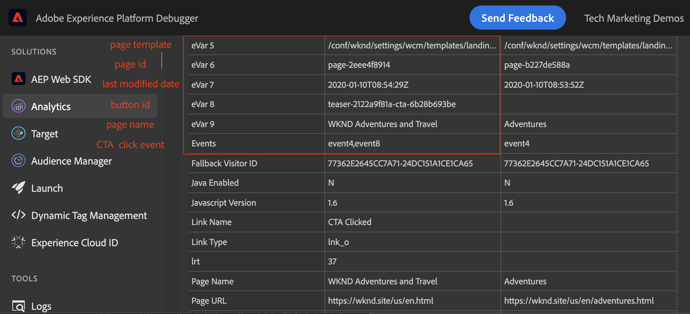
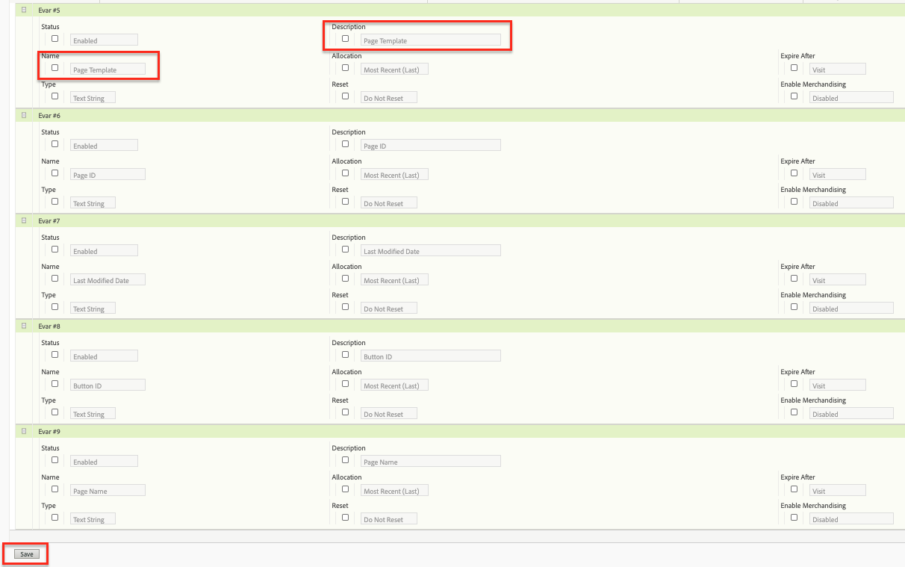
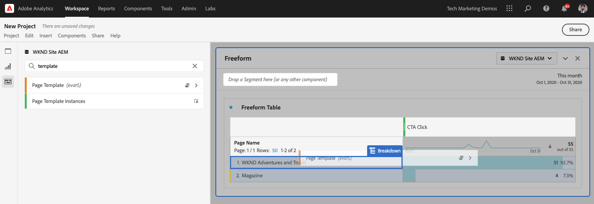

# 使用Analysis Workspace分析資料

瞭解如何將從Adobe Experience Manager網站擷取的資料對應至Adobe Analytics報表套裝中的量度和維度。 瞭解如何使用Adobe Analytics的Analysis Workspace功能建立詳細的報告資料板。

## 您將建立的

WKND行銷團隊想瞭解哪個「行動呼籲(CTA)」按鈕在首頁上表現最佳。 在本教學課程中，我們將在Analysis Workspace建立新專案，以視覺化方式呈現不同CTA按鈕的效能，並瞭解使用者在網站上的行為。 當使用者按一下WKND首頁上的「動作呼叫(CTA)」按鈕時，會使用Adobe Analytics擷取下列資訊。

**Analytics變數**

以下是目前追蹤的Analytics變數：

* `eVar5` -  `Page template`
* `eVar6` - `Page Id`
* `eVar7` -  `Page last modified date`
* `eVar8` -  `CTA Button Id`
* `eVar9` -  `Page Name`
* `event8` -  `CTA Button Click event`
* `prop8` -  `CTA Button Id`

### 目標{#objective}

1. 建立新的報表套裝或使用現有的報表套裝。
1. 在報表套裝中設定[轉換變數(eVar)](https://docs.adobe.com/content/help/en/analytics/admin/admin-tools/conversion-variables/conversion-var-admin.html)和[成功事件（事件）](https://docs.adobe.com/help/en/analytics/admin/admin-tools/success-events/success-event.html)。
1. 建立[Analysis Workspace專案](https://docs.adobe.com/content/help/en/analytics/analyze/analysis-workspace/home.html)，借助可讓您快速建立、分析和分享見解的工具來分析資料。
1. 與其他團隊成員分享Analysis Workspace專案。

## 必備條件

本教學課程是[追蹤已點按的元件與Adobe Analytics](./track-clicked-component.md)的延續，並假設您已：

* 啟用[Adobe Analytics擴展](https://docs.adobe.com/content/help/en/launch/using/extensions-ref/adobe-extension/analytics-extension/overview.html)的&#x200B;**啟動屬性**
* **Adobe** Analyticst/dev報表套裝ID和追蹤伺服器。請參閱以下檔案，瞭解如何建立新的報表套裝](https://docs.adobe.com/content/help/en/analytics/admin/manage-report-suites/new-report-suite/new-report-suite.html)。[
* [Experience Platform](https://docs.adobe.com/content/help/en/platform-learn/tutorials/data-ingestion/web-sdk/introduction-to-the-experience-platform-debugger.html) 除錯瀏覽器擴充功能已設定，您的Launch屬性已載入 [https://wknd.site/us/en.](https://wknd.site/us/en.html) html或啟AEM用Adobe資料層的網站。

## 轉換變數(eVar)和成功事件（事件）

「Custom Insight轉換變數」(或eVar)會置於您網站所選網頁的Adobe程式碼中。 其主要用途是在自訂行銷報告中劃分轉換成功度量。 eVar可以是瀏覽型的，其功能與Cookie類似。 傳遞至eVar變數的值會跟隨使用者一段預定期間。

當eVar設為訪客的值時，Adobe會自動記住該值，直到其過期。 訪客在作用中時遇到的任何成功事件都會計入為eVar值。

eVar最適合用來測量因果，例如：

* 哪些內部促銷活動影響收入
* 哪些橫幅廣告最終導致註冊
* 下訂單前使用內部搜尋的次數

成功事件是可追蹤的動作。 您決定什麼是成功事件。 例如，如果訪客點按CTA按鈕，點按事件可視為成功事件。

### 設定eVar

1. 從Adobe Experience Cloud首頁，選擇您的組織，然後啟動Adobe Analytics。

   

1. 在Analytics工具列中，按一下「**管理** > **報表套裝**」並尋找您的報表套裝。

   

1. 選擇報表套裝> **編輯設定** > **轉換** > **轉換變數**

   

1. 使用&#x200B;**新增**&#x200B;選項，讓我們建立轉換變數，將架構對應如下：

   * `eVar5` -   `Page Template`
   * `eVar6` -  `Page ID`
   * `eVar7` -  `Last Modified Date`
   * `eVar8` -  `Button Id`
   * `eVar9` -  `Page Name`

   

1. 請為每個eVar和&#x200B;**Save**&#x200B;儲存變更提供適當的名稱和說明。 我們將使用這些eVar，在下一節中建立Analysis Workspace專案。 因此，使用者易記的名稱可讓變數更容易被發現。

   

### 設定成功事件

接下來，我們建立追蹤「CTA按鈕」點按的「偶數」。

1. 在&#x200B;**報表套裝管理員**&#x200B;視窗中，選取&#x200B;**報表套裝Id**，然後按一下&#x200B;**編輯設定**。
1. 按一下「**轉換** > **成功事件**」
1. 使用&#x200B;**新增**&#x200B;選項，建立新的自訂成功事件以追蹤CTA按鈕，然後按一下，然後&#x200B;**儲存**&#x200B;您的變更。
   * `Event` : `event8`
   * `Name`:`CTA Click`
   * `Type`:`Counter`

   

## 在Analysis Workspace建立新專案{#workspace-project}

Analysis Workspace是彈性的瀏覽器工具，可讓您快速建立分析並分享見解。 使用拖放介面，您可以建立分析、新增視覺化，讓資料更生動、組織資料集、與組織中的任何人共用及排程專案。

接著，建立新的[project](https://docs.adobe.com/content/help/en/analytics/analyze/analysis-workspace/build-workspace-project/t-freeform-project.html)以建立控制面板，分析整個網站的CTA按鈕效能。

1. 從Analytics工具列中，選擇&#x200B;**Workspace**，然後按一下「建立新專案」**。**

   

1. 選擇從&#x200B;**空白專案**&#x200B;開始，或選擇預先建立的範本之一，由Adobe提供或由您的組織建立的自訂範本。 有數個範本可用，視您所考慮的分析或使用案例而定。 [進一](https://docs.adobe.com/content/help/en/analytics/analyze/analysis-workspace/build-workspace-project/starter-projects.html) 步瞭解可用的不同範本選項。

   在您的工作區專案中，面板、表格、視覺化和元件可從左側導軌存取。 這些是您的專案構建區塊。

   * **[元件](https://docs.adobe.com/content/help/en/analytics/analyze/analysis-workspace/components/analysis-workspace-components.html)** -元件是維度、量度、區段或日期範圍，所有這些都可結合在自由表格中，以開始回答您的業務問題。請務必先熟悉每種元件類型，然後再深入分析。 掌握元件術語後，您就可以開始拖放，在自由表格中建立分析。
   * **[視覺化](https://docs.adobe.com/content/help/en/analytics/analyze/analysis-workspace/visualizations/freeform-analysis-visualizations.html)** -視覺化（例如長條圖或折線圖）會加入資料上方，以視覺化方式呈現。在最左側的邊欄上，選取中間的「視覺化」圖示，以檢視可用視覺化的完整清單。
   * **[面板](https://docs.adobe.com/content/help/en/analytics/analyze/analysis-workspace/panels/panels.html)** -面板是表格和視覺化的集合。您可以從工作區的左上角圖示存取面板。 當您想要根據時段、報表套裝或分析使用案例來組織專案時，面板會很有幫助。 Analysis Workspace提供下列面板類型：

   

### 使用Analysis Workspace新增資料視覺化

接著，建立表格，以建立使用者如何與WKND網站首頁上的「動作呼叫」(CTA)按鈕互動的視覺表示。 要建立這樣的表示法，我們使用在[追蹤已點按的元件中收集的資料與Adobe Analytics](./track-clicked-component.md)。 以下是使用者與WKND網站的「動作呼叫」按鈕互動所追蹤的資料快速摘要。

* `eVar5` -   `Page template`
* `eVar6` -  `Page Id`
* `eVar7` -  `Page last modified date`
* `eVar8` -  `CTA Button Id`
* `eVar9` -  `Page Name`
* `event8` -  `CTA Button Click event`
* `prop8` -  `CTA Button Id`

1. 將&#x200B;**Page**&#x200B;維元件拖放到自由表格上。 您現在應該可以檢視顯示表格中顯示「頁面名稱」(eVar9)和對應的「頁面檢視」（發生次數）的視覺化。

   

1. 將&#x200B;**CTA Click**(event8)量度拖放至發生次數量度並加以取代。 您現在可以檢視視覺化，顯示頁面名稱(eVar9)和頁面上的CTA點按事件對應計數。

   

1. 讓我們依其範本類型來劃分依頁面。 從元件中選取頁面範本量度，並將「頁面範本」量度拖放至「頁面名稱」維度。 您現在可以檢視依範本類型劃分的頁面名稱。

   * **變更前**

      

   * **變更後**

      

1. 若要瞭解使用者在WKND網站頁面上與CTA按鈕互動的方式，我們必須新增按鈕ID(eVar8)量度，進一步劃分頁面範本量度。

   

1. 在下方，您可看到WKND網站的視覺呈現方式，依其頁面範本細分，並進一步依使用者與WKND網站點按動作(CTA)按鈕的互動來細分。

   

1. 您可以使用「Adobe Analytics分類」，將「按鈕ID」值取代為更易用的名稱。 您可以閱讀更多有關如何為特定量度[建立分類的資訊，請參閱此處](https://docs.adobe.com/content/help/en/analytics/components/classifications/c-classifications.html)。 在此例中，我們為`eVar8`設定了分類量度`Button Section (Button ID)`，將按鈕ID對應至使用者友好名稱。

   

## 新增分類至分析變數

### 轉換分類

Analytics分類是將Analytics變數資料分類，然後在您產生報表時以不同方式顯示資料的方式。 為改善按鈕ID在「Analytics工作區」報表中的顯示方式，讓我們為按鈕ID建立分類變數(eVar8)。 分類時，您會在變數和與該變數相關的中繼資料之間建立關係。

接下來，我們建立Analytics變數的分類。

1. 從&#x200B;**Admin**&#x200B;工具列選單中，選擇&#x200B;**報表套裝**
1. 從&#x200B;**報表套裝管理員**&#x200B;視窗中選取&#x200B;**報表套裝ID**，然後按一下「編輯設定&#x200B;**>**&#x200B;轉換&#x200B;**>轉換分類**」****

   

1. 從&#x200B;**選擇分類類型**&#x200B;下拉式清單中，選取變數(eVar8-按鈕ID)以新增分類。
1. 按一下「分類」區段下方所列「分類」變數旁的箭頭，以新增「分類」。

   

1. 在&#x200B;**編輯分類**&#x200B;對話方塊中，為文字分類提供適當的名稱。 建立具有「文本分類」名稱的維元件。

   

1. **保** 存更改。

### 分類匯入工具

使用匯入工具將分類上傳至Adobe Analytics。 您也可以匯出資料，以便在匯入前進行更新。 您使用匯入工具匯入的資料必須是特定格式。 Adobe可讓您選擇下載資料範本，並在Tab分隔的資料檔案中包含所有正確的標題詳細資訊。 您可以將新資料新增至此範本，然後使用FTP在瀏覽器中匯入資料檔案。

#### 分類範本

在將分類匯入行銷報告之前，您可以下載範本，幫助您建立分類資料檔案。 資料檔案會將您想要的分類用作欄標題，然後將報告資料集組織在適當的分類標題下。

接下來，讓我們下載按鈕ID(eVar8)變數的分類範本

1. 導覽至&#x200B;**Admin** > **分類匯入工具**
1. 讓我們從&#x200B;**下載範本**標籤下載轉換變數的分類範本。
   

1. 在「下載範本」標籤上，指定資料範本設定。
   * **選擇報表套裝** :選取要在範本中使用的報表套裝。報表套裝和資料集必須相符。
   * **要分類的資料集** :選擇資料檔案的資料類型。功能表包含您報表套裝中所有已設定分類的報表。
   * **編碼** :選擇資料檔案的字元編碼。預設編碼格式為UTF-8。

1. 按一下&#x200B;**下載**&#x200B;並將模板檔案保存到本地系統。 範本檔案是以Tab分隔的資料檔案（.tab副檔名），大部分的試算表應用程式都支援。
1. 使用您選擇的編輯器開啟以Tab分隔的資料檔案。
1. 將按鈕ID(eVar9)和對應的按鈕名稱新增至區段中步驟9中每個eVar9值的Tab分隔檔案。

   

1. **儲** 存以Tab分隔的檔案。
1. 導覽至&#x200B;**匯入檔案**&#x200B;標籤。
1. 設定檔案匯入的目標。
   * **選擇報表套裝** :WKND網站AEM（報表套裝）
   * **要分類的資料集** :按鈕Id(轉換變數eVar8)
1. 按一下&#x200B;**選擇檔案**&#x200B;選項從系統上傳以Tab分隔的檔案，然後按一下&#x200B;**導入檔案**

   

   >[!NOTE]
   >
   > 成功的匯入會立即顯示匯出中的適當變更。 不過，使用瀏覽器匯入時，報表中的資料變更需要4小時，使用FTP匯入時則需要24小時。

#### 以分類變數取代轉換變數

1. 從Analytics工具列中，選擇&#x200B;**Workspace**，並開啟我們在本教學課程的[Create a new project inAnalysis Workspace](#workspace-project)區段中建立的工作區。

   

1. 接著，將工作區中顯示「動作呼叫(CTA)」按鈕ID的&#x200B;**按鈕Id**&#x200B;量度取代為上一步驟中建立的分類名稱。

1. 從元件搜尋器中，搜尋&#x200B;**WKND CTA按鈕**，並將&#x200B;**WKND CTA按鈕（按鈕Id）**&#x200B;維度拖放至「按鈕Id」量度上並加以取代。

   * **變更前**

      
   * **變更後**

      

1. 您可以注意到「按鈕ID」量度包含「動作呼叫(CTA)」按鈕的按鈕ID，現在會以「分類範本」中提供的對應名稱取代。
1. 讓我們比較Analytics工作區表格與WKND首頁，並瞭解CTA按鈕點按計數及其分析。 根據工作區自由表格資料，顯然使用者已22次點按&#x200B;**SKI NOW**&#x200B;按鈕，並且4次點按西澳洲WKND首頁露營按鈕&#x200B;**閱讀更多**&#x200B;按鈕。

   

1. 請務必儲存您的Adobe Analytics工作區專案，並提供正確的名稱和說明。 （可選）您可以將標籤添加到工作區項目。

   

1. 在成功儲存專案後，您可以使用「共用」選項與其他同事或隊友共用您的工作區專案。

   

## 恭喜！

您剛學會如何將從Adobe Experience Manager網站擷取的資料對應至Adobe Analytics報表套裝中的量度和維度、對量度執行分類，並使用Adobe Analytics的Analysis Workspace功能建立詳細的報表控制面板。

