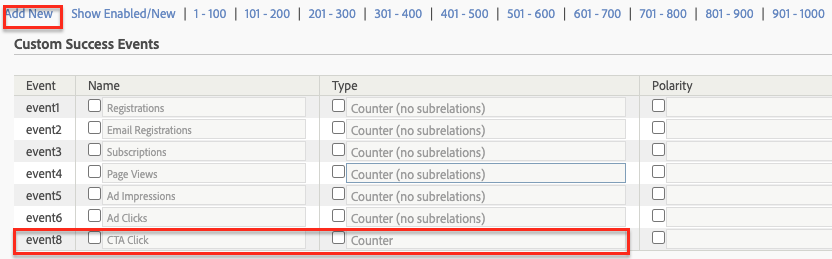

# 使用Analysis Workspace分析資料

瞭解如何將從Adobe Experience Manager網站擷取的資料對應至Adobe Analytics報表套裝中的量度和維度。 瞭解如何使用Adobe Analytics的Analysis Workspace功能建立詳細的報告儀表板。

## 您即將建置的內容 {#what-build}

WKND行銷團隊很想知道哪些 `Call to Action (CTA)` 按鈕在首頁上表現最佳。 在本教學課程中，請在以下位置建立專案： **Analysis Workspace** 以視覺化不同CTA按鈕的效能，並瞭解使用者在網站上的行為。 當使用者按一下WKND首頁上的行動號召(CTA)按鈕時，會使用Adobe Analytics擷取以下資訊。

**Analytics變數**

目前追蹤的Analytics變數如下：

* `eVar5` -  `Page template`
* `eVar6` - `Page Id`
* `eVar7` - `Page last modified date`
* `eVar8` - `CTA Button Id`
* `eVar9` - `Page Name`
* `event8` - `CTA Button Click event`
* `prop8` - `CTA Button Id`

### 目標 {#objective}

1. 建立報表套裝或使用現有報表套裝。
1. 設定 [轉換變數(eVar)](https://experienceleague.adobe.com/docs/analytics/admin/admin-tools/manage-report-suites/edit-report-suite/conversion-variables/conversion-var-admin.html) 和 [成功事件（事件）](https://experienceleague.adobe.com/docs/analytics/admin/admin-tools/manage-report-suites/edit-report-suite/conversion-variables/success-events/success-event.html) 報表套裝中的。
1. 建立 [Analysis Workspace專案](https://experienceleague.adobe.com/docs/analytics/analyze/analysis-workspace/home.html) 藉助可讓您快速建立、分析和分享見解的工具來分析資料。
1. 與其他團隊成員共用Analysis Workspace專案。

## 必備條件

本教學課程是 [使用Adobe Analytics追蹤已點按的元件](./track-clicked-component.md) 並假設您擁有：

* A **標籤屬性** 使用 [Adobe Analytics擴充功能](https://experienceleague.adobe.com/docs/experience-platform/tags/extensions/client/analytics/overview.html) 已啟用
* **Adobe Analytics** 測試/開發報表套裝ID和追蹤伺服器。 請參閱下列檔案以瞭解 [建立報表套裝](https://experienceleague.adobe.com/docs/analytics/admin/admin-tools/manage-report-suites/c-new-report-suite/new-report-suite.html).
* [Experience Platform偵錯工具](https://experienceleague.adobe.com/docs/platform-learn/data-collection/debugger/overview.html) 瀏覽器擴充功能已設定標籤屬性，並載入 [WKND網站](https://wknd.site/us/en.html) 或啟用Adobe資料層的AEM網站。

## 轉換變數(eVar)和成功事件（事件）

Custom Insight轉換變數(或eVar)會放置在網站所選網頁的Adobe程式碼中。 其主要用途是在自訂行銷報告中區隔轉換成功量度。 eVar可以是以造訪為基礎，其功能與Cookie類似。 傳遞至eVar變數的值會跟隨使用者一段預定的時間。

當eVar設為訪客的值時，Adobe會自動記住該值，直到它過期為止。 訪客在eVar值作用中時遇到的任何成功事件都會計入該eVar值。

eVar最適合用來測量原因和結果，例如：

* 哪些內部行銷活動影響了收入
* 最終導致註冊的橫幅廣告
* 下訂單前使用內部搜尋的次數

成功事件是可追蹤的動作。 成功事件的條件由您決定。 例如，如果訪客點選CTA按鈕，該點選事件可被視為成功事件。

### 設定eVar

1. 從Adobe Experience Cloud首頁，選取您的組織，然後啟動Adobe Analytics。

   

1. 在Analytics工具列中，按一下 **管理員** > **報表套裝** 並尋找您的報表套裝。

   

1. 選取報表套裝> **編輯設定** > **轉換** > **轉換變數**

   

1. 使用 **新增** 選項，接著建立「轉換變數」來對應架構，如下所示：

   * `eVar5` -  `Page Template`
   * `eVar6` - `Page ID`
   * `eVar7` - `Last Modified Date`
   * `eVar8` - `Button Id`
   * `eVar9` - `Page Name`

   

1. 為每個eVar和提供適當的名稱和說明 **儲存** 您的變更。 在Analysis Workspace專案中，會使用具有適當名稱的eVar，因此使用者易記的名稱可讓您輕鬆找到變數。

   

### 設定成功事件

接下來，讓我們建立事件以追蹤CTA按鈕點選。

1. 從 **報表套裝管理員** 視窗，選取 **報表套裝Id** 並按一下 **編輯設定**.
1. 按一下 **轉換** > **成功事件**
1. 使用 **新增** 選項，建立自訂成功事件以追蹤CTA按鈕點選，然後 **儲存** 您的變更。
   * `Event` : `event8`
   * `Name`:`CTA Click`
   * `Type`:`Counter`

   

## 在Analysis Workspace中建立專案 {#workspace-project}

Analysis Workspace是彈性的瀏覽器工具，可讓您快速建立分析和分享見解。 使用拖放介面，您可以製作分析、新增視覺效果以生動呈現資料、組織資料集、與組織中的任何人共用及排程專案。

接下來，建立 [專案](https://experienceleague.adobe.com/docs/analytics/analyze/analysis-workspace/build-workspace-project/freeform-overview.html#analysis-workspace) 建立控制面板，分析整個網站的CTA按鈕效能。

1. 從Analytics工具列中，選取 **Workspace** 並按一下 **建立新專案**.

   

1. 選擇以從 **空白專案** 或是選取其中一個預先建立的範本，該範本是由Adobe提供，或是由您的組織建立的自訂範本。 根據您所考慮的分析或使用案例，有數個範本可供使用。 [瞭解更多](https://experienceleague.adobe.com/docs/analytics/analyze/analysis-workspace/build-workspace-project/starter-projects.html) 關於可用的不同範本選項。

   在您的Workspace專案中，可從左側欄存取面板、表格、視覺效果和元件。 它們構成了專案的建置組塊。

   * **[元件](https://experienceleague.adobe.com/docs/analytics/analyze/analysis-workspace/components/analysis-workspace-components.html)**  — 元件包含維度、量度、區段或日期範圍，您可以在自由表格中結合這些元件，開始回應您的業務問題。 請務必熟悉每個元件型別，再開始投入分析。 熟悉元件術語後，即可開始拖放至自由表格中建立分析。
   * **[視覺效果](https://experienceleague.adobe.com/docs/analytics/analyze/analysis-workspace/visualizations/freeform-analysis-visualizations.html)**  — 接著在資料上新增視覺效果（例如長條圖或折線圖），以視覺化方式生動呈現資料。 在最左側的邊欄中，選取中間的「視覺效果」圖示，即可檢視完整的可用視覺效果清單。
   * **[面板](https://experienceleague.adobe.com/docs/analytics/analyze/analysis-workspace/panels/panels.html)**  — 面板是表格和視覺效果的集合。 您可以從Workspace左上角的圖示存取面板。 當您想要根據時段、報表套裝或分析使用案例來組織專案時，面板會很有幫助。 Analysis Workspace中有以下面板型別：

   

### 使用Analysis Workspace新增資料視覺效果

接下來，建立表格以建立使用者如何與互動的視覺化表示法 `Call to Action (CTA)` 按鈕。 若要建置這類表示法，讓我們使用在 [使用Adobe Analytics追蹤已點按的元件](./track-clicked-component.md). 以下是使用WKND網站的「行動號召」按鈕針對使用者互動所追蹤的資料快速摘要。

* `eVar5` -  `Page template`
* `eVar6` - `Page Id`
* `eVar7` - `Page last modified date`
* `eVar8` - `CTA Button Id`
* `eVar9` - `Page Name`
* `event8` - `CTA Button Click event`
* `prop8` - `CTA Button Id`

1. 拖放 **頁面** 維度元件貼到自由格式表格上。 您現在應該能夠檢視視覺效果，以顯示表格內顯示的「頁面名稱」(eVar9)和對應的「頁面檢視」（發生次數）。

   

1. 拖放 **CTA點按** (event8)量度上移至「發生次數」量度並將其取代。 您現在可以檢視在頁面上顯示「頁面名稱」(eVar9)和相應CTA點選事件計數的視覺效果。

   

1. 讓我們依照其範本型別來劃分頁面。 從元件選取頁面範本量度，並將「頁面範本」量度拖放至「頁面名稱」維度。 您現在可以檢視依範本型別劃分的頁面名稱。

   * **變更前**
     

   * **變更後**
     

1. 若要瞭解使用者在WKND網站頁面上與CTA按鈕互動的方式，需要進一步劃分，方法是新增按鈕ID (eVar8)量度。

   

1. 您可以在下方看到WKND網站的視覺化呈現，依其頁面範本劃分，並進一步依使用者與WKND網站點按動作(CTA)按鈕的互動劃分。

   

1. 您可以使用Adobe Analytics分類，以更好記的名稱取代「按鈕ID」值。 您可以深入閱讀如何建立特定量度的分類 [此處](https://experienceleague.adobe.com/docs/analytics/components/classifications/c-classifications.html). 在此案例中，我們有一個分類量度 `Button Section (Button ID)` 設定 `eVar8` 將按鈕id對應至好記的名稱。

   

## 新增分類至分析變數

### 轉換分類

Analytics分類是在產生報表時，將Analytics變數資料分類，然後以不同方式顯示資料的一種方式。 若要改善按鈕ID在Analytics Workspace報表中的顯示方式，讓我們為按鈕ID (eVar8)建立分類變數。 分類時，您會在變數與該變數相關的中繼資料之間建立關係。

接下來，建立Analytics變數的分類。

1. 從 **管理員** 工具列功能表，選取 **報表套裝**
1. 選取 **報表套裝Id** 從 **報表套裝管理員** 視窗並按一下 **編輯設定** > **轉換** > **轉換分類**

   

1. 從 **選取分類型別** 從下拉式清單中，選取變數(eVar8按鈕ID)以新增分類。
1. 按一下「分類」區段底下所列之「分類」變數旁的箭頭，以新增分類。

   

1. 在 **編輯分類** 對話方塊中，為文字分類提供合適的名稱。 會建立具有文字分類名稱的維度元件。

   

1. **儲存** 您的變更。

### 分類匯入工具

使用匯入工具將分類上傳至Adobe Analytics。 您也可以在匯入之前匯出資料以進行更新。 您使用匯入工具匯入的資料必須是特定格式。 Adobe可讓您選擇下載資料範本，並將所有適當的標頭詳細資料放在以Tab分隔的資料檔案中。 您可以將新資料新增至此範本，然後使用FTP在瀏覽器中匯入資料檔案。

#### 分類範本

將分類匯入行銷報表之前，您可以下載範本來協助您建立分類資料檔案。 資料檔案會使用您所需的分類當做欄標題，然後將報告資料集組織在適當的分類標題下。

接下來，讓我們下載Button Id (eVar8)變數的分類範本

1. 導覽至 **管理員** > **分類匯入工具**
1. 讓我們從以下網站下載轉換變數的分類範本： **下載範本** 標籤。
   

1. 在「下載範本」標籤中指定資料範本設定。
   * **選取報表套裝** ：選取要在範本中使用的報表套裝。 報表套裝和資料集必須相符。
   * **要分類的資料集** ：選取資料檔案的資料型別。 功能表包含報表套裝中所有已針對分類設定的報告。
   * **編碼** ：選取資料檔案的字元編碼。 預設編碼格式為UTF-8。

1. 按一下 **下載** 並將範本檔案儲存至本機系統。 範本檔案是以定位點分隔的資料檔案（副檔名為.tab），大多數的試算表應用程式都支援這個檔案。
1. 使用您選擇的編輯器開啟以Tab分隔的資料檔案。
1. 針對區段中步驟9的每個eVar9值，將按鈕ID (eVar9)和對應的按鈕名稱新增至以Tab分隔的檔案。

   

1. **儲存** 以Tab分隔的檔案。
1. 導覽至 **匯入檔案** 標籤。
1. 設定檔案匯入的目的地。
   * **選取報表套裝** ： WKND Site AEM （報表套裝）
   * **要分類的資料集** ：按鈕Id (轉換變數eVar8)
1. 按一下 **選擇檔案** 選項，用於從您的系統上傳Tab字元分隔的檔案，然後按一下 **匯入檔案**

   

   >[!NOTE]
   >
   > 成功匯入後，匯出內容會立即顯示適當的變更。 不過，使用瀏覽器匯入時，報表中的資料變更最多需要4小時，使用FTP匯入時，最多需要24小時。

#### 以分類變數取代轉換變數

1. 從Analytics工具列中，選取 **Workspace** 並開啟在中建立的工作區 [在Analysis Workspace中建立專案](#create-a-project-in-analysis-workspace) 一節。

   

1. 接下來，取代 **按鈕ID** 工作區中的量度，顯示具有先前步驟中建立之分類名稱的行動號召(CTA)按鈕的ID。

1. 在元件尋找器中，搜尋 **WKND CTA按鈕** 並拖放 **WKND CTA按鈕（按鈕Id）** 維度至按鈕ID量度並加以取代。

   * **變更前**
     
   * **變更後**
     

1. 您會注意到，包含行動號召(CTA)按鈕的按鈕ID量度，現在已取代為「分類範本」中提供的對應名稱。
1. 讓我們比較Analytics Workspace表格與WKND首頁，瞭解CTA按鈕點選計數及其分析。 根據工作區自由表格資料，使用者按下 **立即滑雪** WKND首頁於西澳洲露營的按鈕及四次 **瞭解詳情** 按鈕。

   

1. 請務必儲存Adobe Analytics Workspace專案，並提供適當的名稱和說明。 或者，您也可以將標籤新增至Workspace專案。

   

1. 成功儲存專案後，您可以使用「共用」選項與其他同事或隊友共用您的工作區專案。

   

## 恭喜！

您剛剛瞭解如何將從Adobe Experience Manager網站擷取的資料對應至Adobe Analytics報表套裝中的量度和維度。 此外，已執行量度的分類，並使用Adobe Analytics的Analysis Workspace功能建置詳細的報表控制面板。
