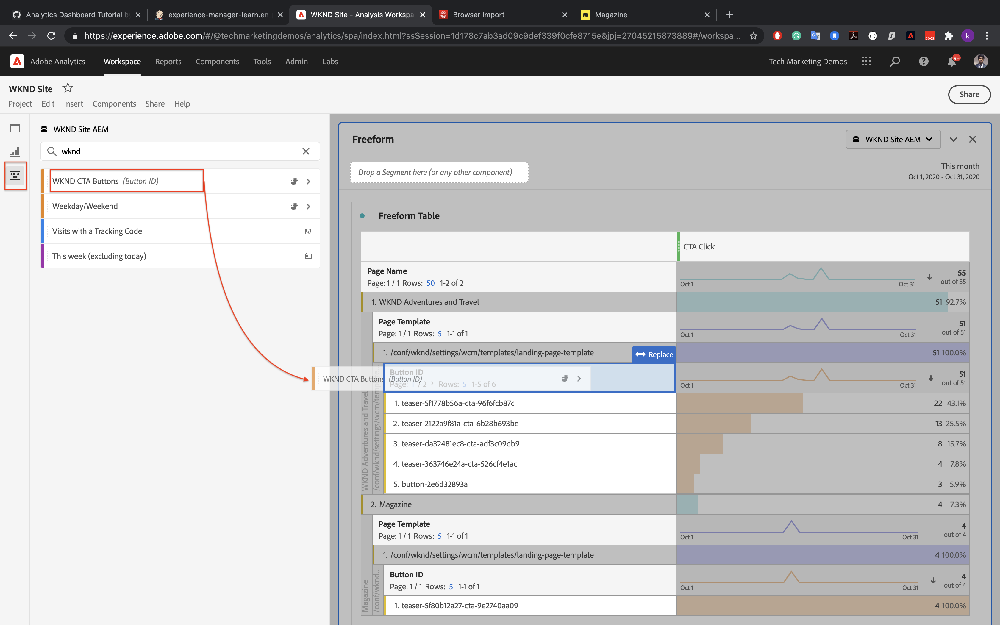

# 利用Analysis Workspace分析資料

瞭解如何將從Adobe Experience Manager站點捕獲的資料映射到Adobe Analytics報告套件中的度量和維度。 瞭解如何使用Adobe Analytics的Analysis Workspace功能構建詳細的報告儀表板。

## 您要構建的 {#what-build}

WKND營銷團隊想知道 `Call to Action (CTA)` 按鈕在首頁上執行得最好。 在本教程中，在 **Analysis Workspace** 可直觀顯示不同CTA按鈕的效能，並瞭解站點上的用戶行為。 當用戶按一下WKND首頁上的「Call to Action(CTA)」按鈕時，使用Adobe Analytics捕獲以下資訊。

**分析變數**

以下是當前正在跟蹤的分析變數：

* `eVar5` -  `Page template`
* `eVar6` - `Page Id`
* `eVar7` - `Page last modified date`
* `eVar8` - `CTA Button Id`
* `eVar9` - `Page Name`
* `event8` - `CTA Button Click event`
* `prop8` - `CTA Button Id`

### 目標 {#objective}

1. 建立報表套件或使用現有報表套件。
1. 配置 [轉換變數(eVar)](https://experienceleague.adobe.com/docs/analytics/admin/admin-tools/manage-report-suites/edit-report-suite/conversion-variables/conversion-var-admin.html) 和 [成功事件（事件）](https://experienceleague.adobe.com/docs/analytics/admin/admin-tools/manage-report-suites/edit-report-suite/conversion-variables/success-events/success-event.html) 的子菜單。
1. 建立 [Analysis Workspace項目](https://experienceleague.adobe.com/docs/analytics/analyze/analysis-workspace/home.html) 借助工具來分析資料，使您能夠快速構建、分析和共用見解。
1. 與其他團隊成員共用Analysis Workspace項目。

## 必備條件

本教程是 [跟蹤已按一下的元件與Adobe Analytics](./track-clicked-component.md) 並假設您有：

* A **標籤屬性** 和 [Adobe Analytics擴展](https://experienceleague.adobe.com/docs/experience-platform/tags/extensions/client/analytics/overview.html) 啟用
* **Adobe Analytics** test/開發報告套件ID和跟蹤伺服器。 請參閱以下文檔 [建立報表套件](https://experienceleague.adobe.com/docs/analytics/admin/admin-tools/manage-report-suites/c-new-report-suite/new-report-suite.html)。
* [Experience Platform調試器](https://experienceleague.adobe.com/docs/platform-learn/data-collection/debugger/overview.html) 瀏覽器擴展，配置有載入在 [WKND站點](https://wknd.site/us/en.html) 或啟AEM用Adobe資料層的站點。

## 轉換變數(eVars)和成功事件（事件）

Custom Insight轉換變數(或eVar)將放在您站點的所選網頁上的Adobe代碼中。 其主要目的是在定制市場營銷報告中細分轉換成功度量。 eVar可以是基於訪問的，其功能與cookie類似。 傳遞給eVar變數的值跟隨用戶一預定時間段。

當eVar設定為訪問者的值時，Adobe會自動記住該值，直到該值過期。 訪問者在eVar值處於活動狀態時遇到的任何成功事件都計入eVar值。

Vars最適合用於衡量因果，例如：

* 哪些內部市場活動影響了收入
* 哪些橫幅廣告最終導致註冊
* 訂單前使用內部搜索的次數

成功事件是可跟蹤的操作。 確定成功事件。 例如，如果訪問者按一下CTA按鈕，則按一下事件可被視為成功事件。

### 配置eVar

1. 從Adobe Experience Cloud首頁中，選擇您的組織，然後啟動Adobe Analytics。

   

1. 在分析工具欄中，按一下 **管理** > **報表套件** 並找到報告套件。

   

1. 選擇報告套件> **編輯設定** > **轉換** > **轉換變數**

   

1. 使用 **添加新** 選項，讓我們建立轉換變數以映射架構，如下所示：

   * `eVar5` -  `Page Template`
   * `eVar6` - `Page ID`
   * `eVar7` - `Last Modified Date`
   * `eVar8` - `Button Id`
   * `eVar9` - `Page Name`

   

1. 為每個變數提供適當的名稱和說明， **保存** 您的更改。 在Analysis Workspace項目中，使用了具有適當名稱的eVars，因此，用戶友好的名稱使變數很容易被發現。

   

### 配置成功事件

接下來，讓我們建立一個事件來跟蹤CTA按鈕按一下。

1. 從 **報表套件管理器** ，選擇 **報表套件ID** 按一下 **編輯設定**。
1. 按一下 **轉換** > **成功事件**
1. 使用 **添加新** 選項，建立自定義成功事件以跟蹤CTA按鈕，然後按一下 **保存** 您的更改。
   * `Event` : `event8`
   * `Name`:`CTA Click`
   * `Type`:`Counter`

   

## 在Analysis Workspace建立項目 {#workspace-project}

Analysis Workspace是一個靈活的瀏覽器工具，使您能夠快速構建分析並共用見解。 使用拖放介面，您可以建立分析、添加可視化效果以使資料生動起來、建立資料集、與組織中的任何人共用和安排項目。

接下來，建立 [項目](https://experienceleague.adobe.com/docs/analytics/analyze/analysis-workspace/build-workspace-project/freeform-overview.html#analysis-workspace) 構建儀表板以分析整個站點的CTA按鈕的效能。

1. 從分析工具欄中，選擇 **工作區** 按一下 **建立新項目**。

   

1. 選擇從 **空白項目** 或選擇預構建的模板之一，該模板由Adobe提供，或者由您的組織建立的自定義模板提供。 有幾個模板可用，具體取決於您所考慮的分析或使用案例。 [瞭解更多資訊](https://experienceleague.adobe.com/docs/analytics/analyze/analysis-workspace/build-workspace-project/starter-projects.html) 關於可用的不同模板選項。

   在Workspace項目中，從左滑軌訪問面板、表、可視化和元件。 它們為你的項目構成了構件。

   * **[元件](https://experienceleague.adobe.com/docs/analytics/analyze/analysis-workspace/components/analysis-workspace-components.html)**  — 元件是維、度量、段或日期範圍，所有這些都可以合併到自由形式表中，以開始回答您的業務問題。 在深入分析之前，請務必熟悉每種元件類型。 掌握了元件術語後，可開始拖放以在「自由形式」表中生成分析。
   * **[可視化](https://experienceleague.adobe.com/docs/analytics/analyze/analysis-workspace/visualizations/freeform-analysis-visualizations.html)**  — 然後在資料的頂部添加可視化效果，如條形圖或折線圖，以使其可視化。 在最左側的滑軌上，選擇中間的「可視化」表徵圖以查看可用可視化的完整清單。
   * **[面板](https://experienceleague.adobe.com/docs/analytics/analyze/analysis-workspace/panels/panels.html)**  — 面板是表和可視化的集合。 可以從工作區中的左上表徵圖訪問面板。 當您要根據時段、報告套件或分析使用案例來組織項目時，面板會很有幫助。 以下面板類型在Analysis Workspace提供：

   

### 使用Analysis Workspace添加資料可視化

接下來，構建一個表以建立用戶交互方式的可視化表示 `Call to Action (CTA)` 按鈕。 要構建此表示法，讓我們使用中收集的資料 [跟蹤已按一下的元件與Adobe Analytics](./track-clicked-component.md)。 下面是用戶與WKND站點的「操作呼叫」按鈕交互時跟蹤的資料的快速摘要。

* `eVar5` -  `Page template`
* `eVar6` - `Page Id`
* `eVar7` - `Page last modified date`
* `eVar8` - `CTA Button Id`
* `eVar9` - `Page Name`
* `event8` - `CTA Button Click event`
* `prop8` - `CTA Button Id`

1. 拖放 **頁面** 維元件到自由形式表。 現在，您應該能夠查看顯示表格中顯示的「頁面名稱」(eVar9)和相應的「頁面視圖」（具體值）的可視化。

   

1. 拖放 **CTA按一下** (event8)度量到具體值度量並替換它。 現在，您可以查看顯示頁面名稱(eVar9)和頁面上CTA按一下事件的相應計數的可視化。

   

1. 讓我們按頁面的模板類型進行細分。 從元件中選擇頁模板度量，然後將頁模板度量拖放到頁名維上。 您現在可以查看按其模板類型細分的頁面名稱。

   * **變更前**

      

   * **變更後**

      

1. 要瞭解用戶在WKND網站頁面上時如何與CTA按鈕交互，需要添加按鈕ID(eVar8)度量來進一步細分。

   

1. 在下面，您可以看到WKND站點的可視表示，它按其頁面模板進行細分，並進一步按用戶與WKND站點的交互進行細分。按一下到操作(CTA)按鈕。

   

1. 可以使用「Adobe Analytics分類」將「按鈕ID」值替換為更易用的名稱。 您可以閱讀有關如何為特定度量建立分類的詳細資訊 [這裡](https://experienceleague.adobe.com/docs/analytics/components/classifications/c-classifications.html)。 在這個例子中，我們有一個分類度量 `Button Section (Button ID)` 設定 `eVar8` 將按鈕id映射到用戶友好名稱。

   

## 將分類添加到分析變數

### 轉換分類

分析分類是一種將分析變數資料分類，然後在生成報告時以不同方式顯示資料的方法。 要改進按鈕ID在「分析工作區」報告中的顯示方式，讓我們為按鈕ID(eVar8)建立分類變數。 分類時，您將在變數和與該變數相關的元資料之間建立關係。

接下來，我們建立Classification for Analytics變數。

1. 從 **管理** 工具欄菜單，選擇 **報表套件**
1. 選擇 **報表套件ID** 從 **報表套件管理器** 的 **編輯設定** > **轉換** > **轉換分類**

   

1. 從 **選擇分類類型** 下拉清單中，選擇要添加分類的變數(eVar8按鈕ID)。
1. 按一下「分類」部分下列出的「分類」變數旁邊的箭頭以添加新的「分類」。

   

1. 在 **編輯分類** 對話框，為文本分類提供合適的名稱。 將建立具有文本分類名稱的維元件。

   

1. **保存** 您的更改。

### 分類導入程式

使用導入程式將分類上載到Adobe Analytics。 也可以導出資料以在導入之前進行更新。 使用導入工具導入的資料必須採用特定格式。 Adobe提供了以下選項：下載資料模板，其中包含制表符分隔資料檔案中所有正確的標題詳細資訊。 您可以將新資料添加到此模板，然後使用FTP在瀏覽器中導入資料檔案。

#### 分類模板

在將分類導入市場營銷報表之前，您可以下載一個模板來幫助您建立分類資料檔案。 資料檔案將您所需的分類用作列標題，然後在相應的分類標題下組織報告資料集。

接下來，我們下載按鈕ID(eVar8)變數的分類模板

1. 導航到 **管理** > **分類導入程式**
1. 讓我們從 **下載模板** 頁籤。
   

1. 在「下載模板」頁籤上，指定資料模板配置。
   * **選擇報告套件** :選擇要在模板中使用的報表套件。 報表套件和資料集必須匹配。
   * **要分類的資料集** :選擇資料檔案的資料類型。 該菜單包括為分類配置的報告套件中的所有報告。
   * **編碼** :選擇資料檔案的字元編碼。 預設編碼格式為UTF-8。

1. 按一下 **下載** 並將模板檔案保存到本地系統。 模板檔案是制表符分隔的資料檔案（.tab檔案名副檔名），大多數電子錶格應用程式都支援該檔案。
1. 使用所選編輯器開啟制表符分隔的資料檔案。
1. 將「按鈕ID(eVar9)」和相應的按鈕名稱添加到節中步驟9中每個eVar9值的制表符分隔檔案中。

   

1. **保存** 以制表符分隔的檔案。
1. 導航到 **導入檔案** 頁籤。
1. 配置檔案導入的目標。
   * **選擇報告套件** :WKND站AEM點（報表套件）
   * **要分類的資料集** :按鈕ID(轉換變數eVar8)
1. 按一下 **選擇檔案** 選項，從系統中上載制表符分隔的檔案，然後按一下 **導入檔案**

   

   >[!NOTE]
   >
   > 成功導入會立即顯示導出中的相應更改。 但是，使用瀏覽器導入時，報告中的資料更改最多需要4小時，使用FTP導入時，更改最多需要24小時。

#### 用分類變數替換轉換變數

1. 從分析工具欄中，選擇 **工作區** 開啟在 [在Analysis Workspace建立項目](#create-a-project-in-analysis-workspace) 本教程中的「」部分。

   

1. 接下來，替換 **按鈕ID** 在工作區中顯示「Call to Action(CTA)」按鈕的ID，該按鈕具有在上一步中建立的分類名稱。

1. 在元件查找器中，搜索 **WKND CTA按鈕** 拖放 **WKND CTA按鈕（按鈕ID）** 維到按鈕ID度量並替換它。

   * **變更前**

      
   * **變更後**

      

1. 您可以注意到「按鈕ID」度量，該度量包含「行動要求」(CTA)按鈕的按鈕ID現在替換為分類模板中提供的相應名稱。
1. 讓我們將「分析工作區」(Analytics Workspace)表與WKND首頁進行比較，並瞭解CTA按鈕按一下計數及其分析。 根據工作區自由格式表資料，顯然用戶已按一下 **立即滑雪** WKND首頁在西澳大利亞宿營 **更多內容** 按鈕

   

1. 確保保存您的Adobe Analytics工作區項目並提供正確的名稱和說明。 （可選）可以向工作區項目添加標籤。

   

1. 成功保存項目後，您可以使用「共用」選項與其他同事或隊友共用您的工作區項目。

   

## 恭喜！

您剛剛學會了如何將從Adobe Experience Manager網站捕獲的資料映射到Adobe Analytics報告套件中的度量和維度。 此外，還對度量執行了分類，並使用Adobe Analytics的Analysis Workspace功能構建詳細的報告控制板。
