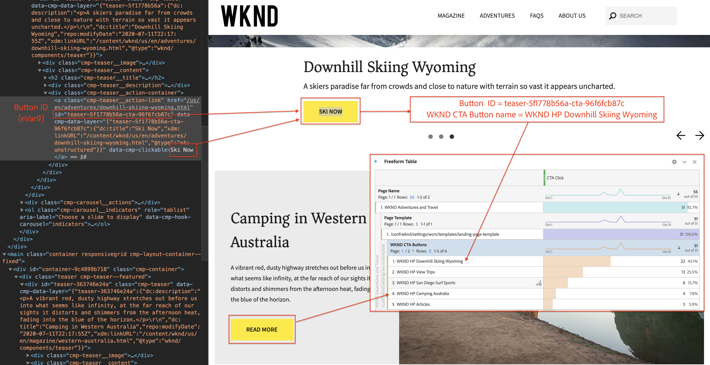

# 使用Analysis Workspace分析資料

了解如何將從Adobe Experience Manager網站擷取的資料對應至Adobe Analytics報表套裝中的量度和維度。 了解如何使用Adobe Analytics的Analysis Workspace功能，建立詳細的報表控制面板。

## 您將建置的

WKND行銷團隊想要了解哪個動作呼叫(CTA)按鈕在首頁上的效能最佳。 在本教學課程中，我們將在Analysis Workspace中建立新專案，以視覺化方式呈現不同CTA按鈕的效能，並了解網站上的使用者行為。 使用者按一下WKND首頁的「動作呼叫」(CTA)按鈕時，會使用Adobe Analytics擷取下列資訊。

**Analytics變數**

目前追蹤的Analytics變數如下：

* `eVar5` -  `Page template`
* `eVar6` - `Page Id`
* `eVar7` - `Page last modified date`
* `eVar8` - `CTA Button Id`
* `eVar9` - `Page Name`
* `event8` - `CTA Button Click event`
* `prop8` - `CTA Button Id`

### 目標 {#objective}

1. 建立新的報表套裝或使用現有的報表套裝。
1. 設定 [轉換變數(eVar)](https://experienceleague.adobe.com/docs/analytics/admin/admin-tools/conversion-variables/conversion-var-admin.html) 和 [成功事件（事件）](https://experienceleague.adobe.com/docs/analytics/admin/admin-tools/success-events/success-event.html) 填入。
1. 建立 [Analysis Workspace專案](https://experienceleague.adobe.com/docs/analytics/analyze/analysis-workspace/home.html) 借助工具來分析資料，以便您快速建立、分析和共用見解。
1. 與其他團隊成員共用Analysis Workspace專案。

## 必備條件

本教學課程是 [使用Adobe Analytics追蹤已點按的元件](./track-clicked-component.md) 並假設您擁有：

* A **Launch屬性** 和 [Adobe Analytics擴充功能](https://experienceleague.adobe.com/docs/experience-platform/tags/extensions/adobe/analytics/overview.html) 已啟用
* **Adobe Analytics** 測試/開發報表套裝ID和追蹤伺服器。 請參閱下列檔案，以了解 [建立新報表套裝](https://experienceleague.adobe.com/docs/analytics/admin/manage-report-suites/new-report-suite/new-report-suite.html).
* [Experience Platform偵錯器](https://experienceleague.adobe.com/docs/debugger-learn/tutorials/experience-platform-debugger/introduction-to-the-experience-platform-debugger.html) 瀏覽器擴充功能已在上載入您的Launch屬性 [https://wknd.site/us/en.html](https://wknd.site/us/en.html) 或啟用「Adobe資料層」的AEM網站。

## 轉換變數(eVar)和成功事件（事件）

Custom Insight轉換變數(或eVar)會放置在您網站所選網頁的Adobe代碼中。 其主要用途是將自訂行銷報表中的轉換成功量度分段。 eVar可以是以造訪為基礎，且運作方式與Cookie類似。 傳遞至eVar變數的值會跟隨使用者一段預定的期間。

當eVar設為訪客的值時，Adobe會自動記住該值，直到它過期為止。 訪客在eVar值作用中時遇到的任何成功事件都會計入eVar值。

eVar最適合用來測量原因和結果，例如：

* 哪些內部促銷活動影響收入
* 哪些橫幅廣告最終導致註冊
* 下訂單前使用內部搜尋的次數

成功事件是可追蹤的動作。 您可以決定成功事件。 例如，如果訪客點按CTA按鈕，則點按事件可視為成功事件。

### 設定eVar

1. 從Adobe Experience Cloud首頁，選取您的組織並啟動Adobe Analytics。

   

1. 在Analytics工具列中，按一下 **管理** > **報表套裝** 找到您的報表套裝。

   

1. 選取報表套裝> **編輯設定** > **轉換** > **轉換變數**

   

1. 使用 **新增** 選項，建立轉換變數來對應結構，如下所示：

   * `eVar5` -  `Page Template`
   * `eVar6` - `Page ID`
   * `eVar7` - `Last Modified Date`
   * `eVar8` - `Button Id`
   * `eVar9` - `Page Name`

   

1. 為每個eVar提供適當的名稱和說明，並 **儲存** 您的變更。 我們會使用這些eVar，在下一節中建立Analysis Workspace專案。 因此，好記的名稱使變數易於發現。

   

### 設定成功事件

接下來，我們建立追蹤CTA按鈕點擊的Even。

1. 從 **報表套裝管理器** ，選擇 **報表套裝Id** 按一下 **編輯設定**.
1. 按一下 **轉換** > **成功事件**
1. 使用 **新增** 選項，建立新的自訂成功事件以追蹤CTA按鈕點擊，然後 **儲存** 您的變更。
   * `Event` : `event8`
   * `Name`:`CTA Click`
   * `Type`:`Counter`

   

## 在Analysis Workspace中建立新專案 {#workspace-project}

Analysis Workspace是彈性的瀏覽器工具，可讓您快速建立分析並分享見解。 您可以使用拖放介面建立分析、新增視覺效果以生動呈現資料、組織資料集、與組織中的任何人共用及排程專案。

接下來，建立新 [專案](https://experienceleague.adobe.com/docs/analytics/analyze/analysis-workspace/build-workspace-project/freeform-overview.html#analysis-workspace) 建立控制面板，以分析整個網站的CTA按鈕效能。

1. 在Analytics工具列中，選取 **工作區** 並按一下 **建立新專案**.

   

1. 選擇從 **空白專案** 或選取其中一個預先建立的範本，由Adobe提供或由貴組織建立的自訂範本。 根據您想要的分析或使用案例，提供數個範本。 [深入了解](https://experienceleague.adobe.com/docs/analytics/analyze/analysis-workspace/build-workspace-project/starter-projects.html) 關於不同的可用範本選項。

   在工作區專案中，您可以從左側邊欄存取面板、表格、視覺效果和元件。 這些是您的專案基礎。

   * **[元件](https://experienceleague.adobe.com/docs/analytics/analyze/analysis-workspace/components/analysis-workspace-components.html)**  — 元件包括維度、量度、區段或日期範圍，您可以在自由表格中結合這些元件，開始回答您的業務問題。 請務必熟悉各種元件類型，再開始建立分析。 熟悉元件術語後，即可開始在自由表格中拖放以建立分析。
   * **[視覺效果](https://experienceleague.adobe.com/docs/analytics/analyze/analysis-workspace/visualizations/freeform-analysis-visualizations.html)**  — 接著在資料上新增視覺效果（例如長條圖或折線圖），以透過視覺化呈現資料。 在左側邊欄中，選取中間的「視覺效果」圖示，即可檢視完整的可用視覺效果清單。
   * **[面板](https://experienceleague.adobe.com/docs/analytics/analyze/analysis-workspace/panels/panels.html)**  — 面板是表格和視覺效果的集合。 您可以從工作區的左上角圖示存取面板。 如果您想要根據時段、報表套裝或分析使用案例來組織專案，面板就很實用。 下列面板類型適用於Analysis Workspace:

   

### 使用Analysis Workspace新增資料視覺效果

接下來，建立表格，以建立使用者如何與WKND網站首頁上的動作呼叫(CTA)按鈕互動的視覺表示法。 若要建立此表示法，我們將使用 [使用Adobe Analytics追蹤已點按的元件](./track-clicked-component.md). 以下是針對使用者與WKND網站的「動作呼叫」按鈕互動而追蹤的資料快速摘要。

* `eVar5` -  `Page template`
* `eVar6` - `Page Id`
* `eVar7` - `Page last modified date`
* `eVar8` - `CTA Button Id`
* `eVar9` - `Page Name`
* `event8` - `CTA Button Click event`
* `prop8` - `CTA Button Id`

1. 拖放 **頁面** 維度元件上的「自由表格」中。 您現在應該可以檢視視覺效果，其中顯示表格內顯示的頁面名稱(eVar9)和對應的頁面檢視（發生次數）。

   

1. 拖放 **CTA點按** (event8)量度上的發生次數量度並加以取代。 您現在可以檢視視覺效果，其中顯示頁面名稱(eVar9)以及頁面上CTA點按事件的對應計數。

   

1. 讓我們依其範本類型來劃分。 從元件中選取頁面範本量度，然後將「頁面範本」量度拖放至「頁面名稱」維度。 您現在可以檢視依其範本類型劃分的頁面名稱。

   * **變更前**

      

   * **變更後**

      

1. 若要了解使用者在WKND網站頁面上與CTA按鈕互動的方式，我們必須新增按鈕ID(eVar8)量度，以進一步劃分「頁面範本」量度。

   

1. 下方您會看到依頁面範本劃分的WKND網站的視覺呈現，以及透過使用者與WKND網站的點按動作(CTA)按鈕互動而進一步劃分。

   

1. 您可以使用Adobe Analytics分類，以更好記的名稱取代按鈕ID值。 您可以深入了解如何為特定量度建立分類 [此處](https://experienceleague.adobe.com/docs/analytics/components/classifications/c-classifications.html). 在此案例中，我們有分類量度 `Button Section (Button ID)` 設定 `eVar8` 將按鈕id對應至好記的名稱。

   

## 新增分類至分析變數

### 轉換分類

Analytics分類是將Analytics變數資料分類，然後在您產生報表時以不同方式顯示資料的方法。 為改善「按鈕ID」在Analytics Workspace報表中的顯示方式，我們將為「按鈕ID」(eVar8)建立分類變數。 分類時，您會在變數和與該變數相關的中繼資料之間建立關係。

接下來，我們為Analytics變數建立分類。

1. 從 **管理** 工具欄菜單，選擇 **報表套裝**
1. 選取 **報表套裝Id** 從 **報表套裝管理器** 按一下 **編輯設定** > **轉換** > **轉換分類**

   

1. 從 **選取分類類型** 下拉式清單中，選取變數(eVar8 — 按鈕ID)以新增分類。
1. 按一下「分類」區段下方所列之「分類」變數旁的箭頭，以新增「分類」。

   

1. 在 **編輯分類** ，請為「文本分類」提供合適的名稱。 系統會建立具有文字分類名稱的維度元件。

   

1. **儲存** 您的變更。

### 分類匯入工具

使用匯入工具將分類上傳至Adobe Analytics。 您也可以在匯入前匯出要更新的資料。 您使用匯入工具匯入的資料必須是特定格式。 Adobe可讓您以定位點分隔的資料檔案，下載包含所有適當標題詳細資料的資料範本。 您可以將新資料新增至此範本，然後使用FTP在瀏覽器中匯入資料檔案。

#### 分類範本

在將分類匯入行銷報表之前，您可以下載範本，協助您建立分類資料檔案。 資料檔案會將您需要的分類用作欄標題，然後在適當的分類標題下組織報表資料集。

接下來，我們下載按鈕Id(8)變數的分類範本

1. 導覽至 **管理** > **分類匯入工具**
1. 現在來自 **下載範本** 標籤。
   

1. 在「下載範本」標籤上，指定資料範本設定。
   * **選取報表套裝** :選取要在範本中使用的報表套裝。 報表套裝和資料集必須相符。
   * **要分類的資料集** :選取資料檔案的資料類型。 功能表包含您為分類設定的報表套裝中的所有報表。
   * **編碼** :選取資料檔案的字元編碼。 預設編碼格式為UTF-8。

1. 按一下 **下載** 並將範本檔案儲存至本機系統。 範本檔案是以定位點分隔的資料檔案（副檔名為.tab），大多數的試算表應用程式均能支援。
1. 使用您所選的編輯器，開啟以定位點分隔的資料檔案。
1. 針對步驟9中的每個eVar9值，將按鈕ID(eVar9)和對應的按鈕名稱新增至以Tab分隔的檔案中。

   

1. **儲存** 以定位點分隔的檔案。
1. 導覽至 **匯入檔案** 標籤。
1. 設定檔案匯入的目標。
   * **選取報表套裝** :WKND Site AEM（報表套裝）
   * **要分類的資料集** :按鈕Id(轉換變數eVar8)
1. 按一下 **選擇檔案** 選項，從系統上傳以定位點分隔的檔案，然後按一下 **匯入檔案**

   

   >[!NOTE]
   >
   > 成功的匯入會立即在匯出中顯示適當的變更。 不過，使用瀏覽器匯入時，報表中的資料變更需花費最多4小時，使用FTP匯入則需花費最多24小時。

#### 以分類變數取代轉換變數

1. 在Analytics工具列中，選取 **工作區** 並開啟我們在 [在Analysis Workspace中建立新專案](#workspace-project) 一節。

   

1. 接下來，取代 **按鈕Id** 量度，此量度會顯示動作呼叫(CTA)按鈕的ID，以及上一步中建立的分類名稱。

1. 從元件尋找器，搜尋 **WKND CTA按鈕** 並拖放 **WKND CTA按鈕（按鈕Id）** 維度加到「按鈕Id」量度上並加以取代。

   * **變更前**

      
   * **變更後**

      

1. 您可以注意到，包含動作呼叫(CTA)按鈕按鈕ID的按鈕ID量度，現在已更換為分類範本中提供的對應名稱。
1. 讓我們比較Analytics Workspace表格和WKND首頁，並了解CTA按鈕點擊計數及其分析。 根據工作區自由表格資料，使用者顯然有22次點按 **立即滑雪** 西澳大利亞WKND首頁露營的按鈕和四次 **了解詳情** 按鈕。

   

1. 請務必儲存您的Adobe Analytics Workspace專案，並提供正確的名稱和說明。 您可以選擇將標籤新增至工作區專案。

   

1. 成功儲存專案後，您可以使用「共用」選項，將工作區專案與其他同事或隊友共用。

   

## 恭喜！

您剛學習如何將從Adobe Experience Manager網站擷取的資料對應至Adobe Analytics報表套裝中的量度和維度、對量度執行分類，以及使用Adobe Analytics的Analysis Workspace功能建立詳細的報表控制面板。
