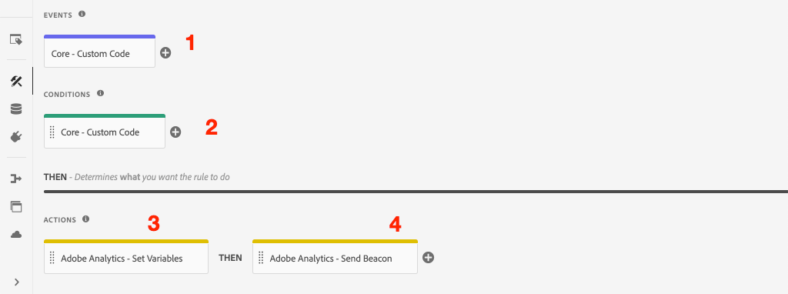

# 使用Adobe Analytics追蹤已點按的元件

使用事件導向的[Adobe使用者端資料層搭配AEM核心元件](https://experienceleague.adobe.com/docs/experience-manager-core-components/using/developing/data-layer/overview.html)，追蹤Adobe Experience Manager網站上特定元件的點按次數。 瞭解如何使用Tag屬性中的規則來監聽點選事件、依元件篩選資料，以及透過追蹤連結信標將資料傳送至Adobe Analytics。

## 您即將建置的內容 {#what-build}

WKND行銷團隊想要瞭解哪些`Call to Action (CTA)`按鈕在首頁上表現最佳。 在本教學課程中，我們將規則新增至標籤屬性，該屬性會聆聽&#x200B;**Teaser**&#x200B;和&#x200B;**Button**&#x200B;元件中的`cmp:click`事件。 然後連同追蹤連結信標將元件ID和新的事件傳送至Adobe Analytics。


### 目標 {#objective}

1. 在擷取`cmp:click`事件的標籤屬性中建立事件導向規則。
1. 依元件資源型別篩選不同事件。
1. 設定元件ID，並使用追蹤連結信標將事件傳送至Adobe Analytics。

## 先決條件

本教學課程是[使用Adobe Analytics](./collect-data-analytics.md)收集頁面資料的延續，並假設您擁有：

* 已啟用[Adobe Analytics擴充功能](https://experienceleague.adobe.com/docs/experience-platform/tags/extensions/client/analytics/overview.html)的&#x200B;**標籤屬性**
* **Adobe Analytics**&#x200B;測試/開發報表套裝ID與追蹤伺服器。 請參閱下列有關[建立報表套裝](https://experienceleague.adobe.com/docs/analytics/admin/admin-tools/manage-report-suites/c-new-report-suite/new-report-suite.html)的檔案。
* [Experience Platform偵錯工具](https://experienceleague.adobe.com/docs/platform-learn/data-collection/debugger/overview.html)瀏覽器延伸模組已設定您在[WKND網站](https://wknd.site/us/en.html)或啟用Adobe資料層的AEM網站上載入的標籤屬性。

## Inspect按鈕和Teaser結構

在標籤屬性中建立規則之前，請檢閱Button和Teaser](https://experienceleague.adobe.com/docs/experience-manager-core-components/using/developing/data-layer/overview.html#item)的[結構描述，並在資料層實作中檢查它們，這樣會很有用。

1. 導覽至[WKND首頁](https://wknd.site/us/en.html)
1. 開啟瀏覽器的開發人員工具，並導覽至&#x200B;**主控台**。 執行以下命令：

   ```js
   adobeDataLayer.getState();
   ```

   上述程式碼會傳回Adobe使用者端資料層的目前狀態。

   透過瀏覽器主控台

1. 展開回應並尋找以`button-`和`teaser-xyz-cta`專案為前置詞的專案。 您應該會看到類似以下的資料結構：

   按鈕結構：

   ```json
   button-2e6d32893a:
       @type: "wknd/components/button"
       dc:title: "View All"
       parentId: "page-2eee4f8914"
       repo:modifyDate: "2020-07-11T22:17:55Z"
       xdm:linkURL: "/content/wknd/us/en/magazine.html"
   ```

   Teaser結構：

   ```json
   teaser-da32481ec8-cta-adf3c09db9:
       @type: "wknd/components/teaser/cta"
       dc:title: "Surf's Up"
       parentId: "teaser-da32481ec8"
       xdm:linkURL: "/content/wknd/us/en/magazine/san-diego-surf.html"
   ```

   以上資料詳細資料是根據[元件/容器專案結構描述](https://experienceleague.adobe.com/docs/experience-manager-core-components/using/developing/data-layer/overview.html#item)。 新標籤規則會使用此結構描述。

## 建立CTA點選規則

Adobe使用者端資料層是&#x200B;**事件**&#x200B;驅動的資料層。 每當按一下任何核心元件時，都會透過資料層傳送`cmp:click`事件。 若要接聽`cmp:click`事件，請建立規則。

1. 導覽至Experience Platform並進入與AEM網站整合的標籤屬性。
1. 導覽至標籤屬性UI中的&#x200B;**規則**&#x200B;區段，然後按一下&#x200B;**新增規則**。
1. 將規則&#x200B;**CTA點按**&#x200B;命名。
1. 按一下&#x200B;**事件** > **新增**&#x200B;以開啟&#x200B;**事件設定**&#x200B;精靈。
1. 針對&#x200B;**事件型別**&#x200B;欄位，選取&#x200B;**自訂程式碼**。

   

1. 按一下主面板中的&#x200B;**開啟編輯器**，然後輸入下列程式碼片段：

   ```js
   var componentClickedHandler = function(evt) {
      // defensive coding to avoid a null pointer exception
      if(evt.hasOwnProperty("eventInfo") && evt.eventInfo.hasOwnProperty("path")) {
         //trigger Tag Rule and pass event
         console.debug("cmp:click event: " + evt.eventInfo.path);
         var event = {
            //include the path of the component that triggered the event
            path: evt.eventInfo.path,
            //get the state of the component that triggered the event
            component: window.adobeDataLayer.getState(evt.eventInfo.path)
         };
   
         //Trigger the Tag Rule, passing in the new `event` object
         // the `event` obj can now be referenced by the reserved name `event` by other Tag Property data elements
         // i.e `event.component['someKey']`
         trigger(event);
      }
   }
   
   //set the namespace to avoid a potential race condition
   window.adobeDataLayer = window.adobeDataLayer || [];
   //push the event listener for cmp:click into the data layer
   window.adobeDataLayer.push(function (dl) {
      //add event listener for `cmp:click` and callback to the `componentClickedHandler` function
      dl.addEventListener("cmp:click", componentClickedHandler);
   });
   ```

   上述程式碼片段透過[將函式](https://github.com/adobe/adobe-client-data-layer/wiki#pushing-a-function)推入資料層，以新增事件接聽程式。 每當觸發`cmp:click`事件時，就會呼叫`componentClickedHandler`函式。 在此函式中，已新增一些健全性檢查，並為觸發事件的元件，以資料層](https://github.com/adobe/adobe-client-data-layer/wiki#getstate)的最新[狀態建構新的`event`物件。

   最後呼叫`trigger(event)`函式。 `trigger()`函式是標籤屬性中的保留名稱，它會&#x200B;**觸發規則**。 `event`物件傳遞為引數，而該引數又由標籤屬性中的另一個保留名稱公開。 標籤屬性中的資料元素現在可以使用程式碼片段（例如`event.component['someKey']`）來參考各種屬性。

1. 儲存變更。
1. 接下來，在&#x200B;**動作**&#x200B;底下，按一下&#x200B;**新增**&#x200B;以開啟&#x200B;**動作組態**&#x200B;精靈。
1. 對於&#x200B;**動作型別**&#x200B;欄位，請選擇&#x200B;**自訂程式碼**。

   

1. 按一下主面板中的&#x200B;**開啟編輯器**，然後輸入下列程式碼片段：

   ```js
   console.debug("Component Clicked");
   console.debug("Component Path: " + event.path);
   console.debug("Component type: " + event.component['@type']);
   console.debug("Component text: " + event.component['dc:title']);
   ```

   `event`物件是從自訂事件中呼叫的`trigger()`方法傳遞。 `component`物件是從資料層`getState()`方法衍生的元件的目前狀態，而且是觸發點選的元素。

1. 儲存變更並在標籤屬性中執行[組建](https://experienceleague.adobe.com/docs/experience-platform/tags/publish/builds.html)，以將程式碼提升至您AEM網站上使用的[環境](https://experienceleague.adobe.com/docs/experience-platform/tags/publish/environments/environments.html?lang=zh-Hant)。

   >[!NOTE]
   >
   > 使用[Adobe Experience Platform Debugger](https://experienceleague.adobe.com/docs/platform-learn/data-collection/debugger/overview.html)將內嵌程式碼切換至&#x200B;**開發**&#x200B;環境可能很有用。

1. 導覽至[WKND網站](https://wknd.site/us/en.html)，並開啟開發人員工具以檢視主控台。 此外，請選取&#x200B;**保留記錄檔**&#x200B;核取方塊。

1. 按一下&#x200B;**Teaser**&#x200B;或&#x200B;**按鈕** CTA按鈕之一，以導覽至其他頁面。

   要按一下

1. 在開發人員主控台中觀察是否已引發&#x200B;**CTA Clicked**&#x200B;規則：

   已按下

## 建立資料元素

接著，建立資料元素以擷取已點按的元件ID和標題。 回想一下在上一個練習中，`event.path`的輸出類似於`component.button-b6562c963d`，而`event.component['dc:title']`的值類似於「檢視行程」。

### 元件ID

1. 導覽至Experience Platform並進入與AEM網站整合的標籤屬性。
1. 瀏覽至&#x200B;**資料元素**&#x200B;區段，然後按一下&#x200B;**新增資料元素**。
1. 在&#x200B;**名稱**&#x200B;欄位中，輸入&#x200B;**元件識別碼**。
1. 針對&#x200B;**資料元素型別**&#x200B;欄位，選取&#x200B;**自訂程式碼**。

   

1. 按一下&#x200B;**開啟編輯器**&#x200B;按鈕，然後在自訂程式碼編輯器中輸入下列內容：

   ```js
   if(event && event.path && event.path.includes('.')) {
       // split on the `.` to return just the component ID
       return event.path.split('.')[1];
   }
   ```

1. 儲存變更。

   >[!NOTE]
   >
   > 回想一下，已根據在標籤屬性中觸發&#x200B;**規則**&#x200B;的事件，提供`event`物件並設定範圍。 在規則中的資料元素為&#x200B;*referenced*&#x200B;之前，不會設定資料元素的值。 因此，在上一個步驟&#x200B;*中建立的&#x200B;**Page Loaded**規則之類的規則內使用此資料元素是安全的，但*&#x200B;在其他內容中使用此資料元素是不安全的。


### 元件標題

1. 瀏覽至&#x200B;**資料元素**&#x200B;區段，然後按一下&#x200B;**新增資料元素**。
1. 在&#x200B;**Name**&#x200B;欄位中，輸入&#x200B;**元件標題**。
1. 針對&#x200B;**資料元素型別**&#x200B;欄位，選取&#x200B;**自訂程式碼**。
1. 按一下&#x200B;**開啟編輯器**&#x200B;按鈕，然後在自訂程式碼編輯器中輸入下列內容：

   ```js
   if(event && event.component && event.component.hasOwnProperty('dc:title')) {
       return event.component['dc:title'];
   }
   ```

1. 儲存變更。

## 將條件新增至CTA點按規則

接下來，更新&#x200B;**CTA Clicked**&#x200B;規則，以確保該規則只在&#x200B;**Teaser**&#x200B;或&#x200B;**Button**&#x200B;觸發`cmp:click`事件時引發。 由於Teaser的CTA在資料層中被視為個別物件，因此請務必檢查父系，以確認其來自Teaser。

1. 在標籤屬性UI中，導覽至先前建立的&#x200B;**已點按CTA**&#x200B;規則。
1. 在&#x200B;**條件**&#x200B;下，按一下&#x200B;**新增**&#x200B;以開啟&#x200B;**條件組態**&#x200B;精靈。
1. 針對&#x200B;**條件型別**&#x200B;欄位，選取&#x200B;**自訂程式碼**。

   

1. 按一下&#x200B;**開啟編輯器**，然後在自訂程式碼編輯器中輸入下列內容：

   ```js
   if(event && event.component && event.component.hasOwnProperty('@type')) {
       // console.log("Event Type: " + event.component['@type']);
       //Check for Button Type OR Teaser CTA type
       if(event.component['@type'] === 'wknd/components/button' ||
          event.component['@type'] === 'wknd/components/teaser/cta') {
           return true;
       }
   }
   
   // none of the conditions are met, return false
   return false;
   ```

   上述程式碼會先檢查資源型別是否來自&#x200B;**Button**，或資源型別是否來自&#x200B;**Teaser**&#x200B;內的CTA。

1. 儲存變更。

## 設定Analytics變數並觸發追蹤連結信標

目前&#x200B;**CTA Clicked**&#x200B;規則只會輸出主控台陳述式。 接下來，使用資料元素和Analytics擴充功能，將Analytics變數設為&#x200B;**動作**。 讓我們設定額外的動作，以觸發&#x200B;**追蹤連結**，並將收集的資料傳送至Adobe Analytics。

1. 在&#x200B;**CTA Clicked**&#x200B;規則中，**移除** **核心 — 自訂程式碼**&#x200B;動作（主控台陳述式）：

   

1. 在[動作]底下，按一下[新增] ****&#x200B;以建立動作。
1. 將&#x200B;**擴充功能**&#x200B;型別設定為&#x200B;**Adobe Analytics**，並將&#x200B;**動作型別**&#x200B;設定為&#x200B;**設定變數**。

1. 設定&#x200B;**eVars**、**Props**&#x200B;和&#x200B;**Events**&#x200B;的下列值：

   * `evar8` - `%Component ID%`
   * `prop8` - `%Component ID%`
   * `event8`

   

   >[!NOTE]
   >
   > 使用這裡`%Component ID%`，因為它保證所點按的CTA有唯一識別碼。 使用`%Component ID%`的潛在缺點是Analytics報表包含`button-2e6d32893a`之類的值。 使用`%Component Title%`會提供更人性化的名稱，但值可能不是唯一的。

1. 接下來，點選&#x200B;**加上**&#x200B;圖示，在&#x200B;**Adobe Analytics — 設定變數**&#x200B;的右側新增一個額外動作：

   

1. 將&#x200B;**擴充功能**&#x200B;型別設定為&#x200B;**Adobe Analytics**，並將&#x200B;**動作型別**&#x200B;設定為&#x200B;**傳送信標**。
1. 在&#x200B;**追蹤**&#x200B;底下，將選項按鈕設定為&#x200B;**`s.tl()`**。
1. 對於&#x200B;**連結型別**&#x200B;欄位，請選擇&#x200B;**自訂連結**，對於&#x200B;**連結名稱**，將值設定為： **`%Component Title%: CTA Clicked`**：

   傳送連結信標的

   上述設定結合資料元素&#x200B;**元件標題**&#x200B;的動態變數與靜態字串&#x200B;**已點按**。

1. 儲存變更。 **CTA已點按**&#x200B;規則現在應具有下列設定：

   

   * **1。**&#x200B;接聽`cmp:click`事件。
   * **2。**&#x200B;檢查事件是否由&#x200B;**按鈕**&#x200B;或&#x200B;**Teaser**&#x200B;觸發。
   * **3。**&#x200B;設定Analytics變數以追蹤&#x200B;**元件識別碼**，作為&#x200B;**eVar**、**prop**&#x200B;和&#x200B;**事件**。
   * **4。**&#x200B;傳送Analytics追蹤連結信標（並&#x200B;**不會**&#x200B;將其視為頁面檢視）。

1. 儲存所有變更並建置您的標籤程式庫，升級至適當的環境。

## 驗證追蹤連結信標和Analytics呼叫

現在&#x200B;**CTA Clicked**&#x200B;規則會傳送Analytics信標，您應該能夠使用Analytics Debugger檢視Experience Platform追蹤變數。

1. 在瀏覽器中開啟[WKND網站](https://wknd.site/us/en.html)。
1. 按一下Debugger圖示以開啟Experience PlatformDebugger。
1. 如先前所述，確認Debugger將標籤屬性對應至&#x200B;*您的*&#x200B;開發環境，並檢查&#x200B;**主控台記錄**。
1. 開啟Analytics功能表，並確認報表套裝已設為&#x200B;*您的*&#x200B;報表套裝。

   

1. 在瀏覽器中，按一下&#x200B;**Teaser**&#x200B;或&#x200B;**按鈕** CTA按鈕之一以瀏覽至其他頁面。

   要按一下

1. 返回Experience Platform偵錯工具，向下捲動並展開&#x200B;**網路要求** > *您的報表套裝*。 您應該可以找到&#x200B;**eVar**、**prop**&#x200B;和&#x200B;**事件**&#x200B;集。

   

1. 返回瀏覽器並開啟開發人員主控台。 導覽至網站頁尾，然後按一下其中一個導覽連結：

   

1. 在瀏覽器主控台中觀察未符合規則「CTA已點按」的訊息&#x200B;*「自訂程式碼」*。

   上述訊息是因為Navigation元件確實觸發`cmp:click`事件&#x200B;*但*，因為規則](#add-a-condition-to-the-cta-clicked-rule)的[條件會檢查資源型別，而不會採取任何動作。

   >[!NOTE]
   >
   > 如果您沒有看到任何主控台記錄，請確定已在Experience Platform偵錯工具的&#x200B;**Experience Platform標籤**&#x200B;下檢查&#x200B;**主控台記錄**。

## 恭喜！

您剛才在Experience Platform中使用事件導向的Adobe使用者端資料層和標籤來追蹤AEM網站上特定元件的點按次數。
