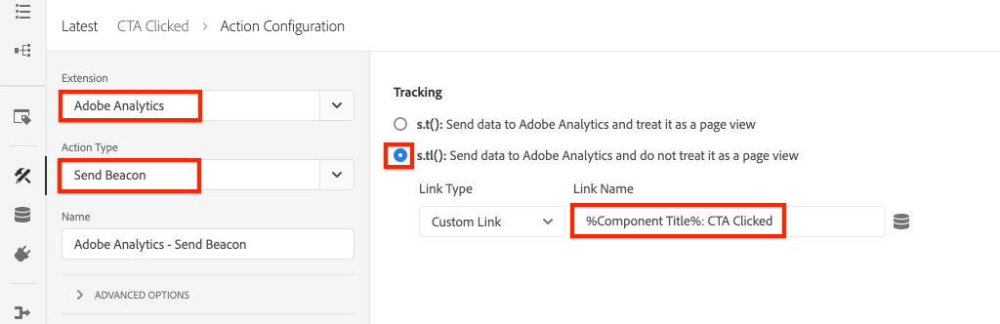

# 跟蹤已按一下的元件與Adobe Analytics

>[!NOTE]
>
>Adobe Experience Platform Launch已被改名為Adobe Experience Platform的一套資料收集技術。 因此，在產品文檔中已進行了一些術語更改。 請參閱以下內容 [文檔](https://experienceleague.adobe.com/docs/experience-platform/tags/term-updates.html) 的下一頁。

使用事件驅動 [Adobe客戶端資料層(AEM帶核心元件)](https://experienceleague.adobe.com/docs/experience-manager-core-components/using/developing/data-layer/overview.html) 跟蹤Adobe Experience Manager站點上特定元件的點擊。 瞭解如何使用標籤屬性中的規則來偵聽按一下事件、按元件篩選資料並使用跟蹤連結信標將資料發送到Adobe Analytics。

## 您要構建的 {#what-build}

WKND營銷團隊想知道 `Call to Action (CTA)` 按鈕在首頁上執行得最好。 在本教程中，讓我們將規則添加到偵聽 `cmp:click` 事件 **預告** 和 **按鈕** 元件。 然後，將元件ID和新事件與軌道連結信標一起發送到Adobe Analytics。


### 目標 {#objective}

1. 在捕獲事件的標籤屬性中建立事件驅動規則 `cmp:click` 的子菜單。
1. 按元件資源類型篩選不同事件。
1. 設定元件ID並使用跟蹤連結信標向Adobe Analytics發送事件。

## 必備條件

本教程是 [收集頁面資料與Adobe Analytics](./collect-data-analytics.md) 並假設您有：

* A **標籤屬性** 和 [Adobe Analytics擴展](https://experienceleague.adobe.com/docs/experience-platform/tags/extensions/client/analytics/overview.html) 啟用
* **Adobe Analytics** test/開發報告套件ID和跟蹤伺服器。 請參閱以下文檔 [建立報表套件](https://experienceleague.adobe.com/docs/analytics/admin/admin-tools/manage-report-suites/c-new-report-suite/new-report-suite.html)。
* [Experience Platform調試器](https://experienceleague.adobe.com/docs/platform-learn/data-collection/debugger/overview.html) 瀏覽器擴展，配置了在上載入的tag屬性 [WKND站點](https://wknd.site/us/en.html) 或啟AEM用Adobe資料層的站點。

## Inspect按鈕和預告模式

在標籤屬性中建立規則之前，請查看 [按鈕和預告的架構](https://experienceleague.adobe.com/docs/experience-manager-core-components/using/developing/data-layer/overview.html#item) 並在資料層實現中進行檢查。

1. 導航到 [WKND首頁](https://wknd.site/us/en.html)
1. 開啟瀏覽器的開發人員工具並導航到 **控制台**。 運行以下命令：

   ```js
   adobeDataLayer.getState();
   ```

   上述代碼返回Adobe客戶端資料層的當前狀態。

   

1. 展開響應並查找以前置詞為前置詞的條目 `button-` 和  `teaser-xyz-cta` 的子菜單。 您應看到如下資料架構：

   按鈕架構：

   ```json
   button-2e6d32893a:
       @type: "wknd/components/button"
       dc:title: "View All"
       parentId: "page-2eee4f8914"
       repo:modifyDate: "2020-07-11T22:17:55Z"
       xdm:linkURL: "/content/wknd/us/en/magazine.html"
   ```

   預告架構：

   ```json
   teaser-da32481ec8-cta-adf3c09db9:
       @type: "wknd/components/teaser/cta"
       dc:title: "Surf's Up"
       parentId: "teaser-da32481ec8"
       xdm:linkURL: "/content/wknd/us/en/magazine/san-diego-surf.html"
   ```

   以上資料詳細資訊基於 [元件/容器項架構](https://experienceleague.adobe.com/docs/experience-manager-core-components/using/developing/data-layer/overview.html#item)。 新標籤規則使用此架構。

## 建立CTA按一下的規則

Adobe客戶端資料層是 **事件** 驅動資料層。 只要按一下任何核心元件， `cmp:click` 事件通過資料層進行調度。 聆聽 `cmp:click` 事件，我們建立規則。

1. 導航到Experience Platform並進入與站點整合的標AEM記屬性。
1. 導航到 **規則** 在「標籤屬性UI」中按一下 **添加規則**。
1. 命名規則 **已按一下CTA**。
1. 按一下 **事件** > **添加** 開啟 **事件配置** 的子菜單。
1. 對於 **事件類型** 欄位，選擇 **自定義代碼**。

   

1. 按一下 **開啟編輯器** 在主面板中，並輸入以下代碼段：

   ```js
   var componentClickedHandler = function(evt) {
      // defensive coding to avoid a null pointer exception
      if(evt.hasOwnProperty("eventInfo") && evt.eventInfo.hasOwnProperty("path")) {
         //trigger Tag Rule and pass event
         console.debug("cmp:click event: " + evt.eventInfo.path);
         var event = {
            //include the path of the component that triggered the event
            path: evt.eventInfo.path,
            //get the state of the component that triggered the event
            component: window.adobeDataLayer.getState(evt.eventInfo.path)
         };
   
         //Trigger the Tag Rule, passing in the new `event` object
         // the `event` obj can now be referenced by the reserved name `event` by other Tag Property data elements
         // i.e `event.component['someKey']`
         trigger(event);
      }
   }
   
   //set the namespace to avoid a potential race condition
   window.adobeDataLayer = window.adobeDataLayer || [];
   //push the event listener for cmp:click into the data layer
   window.adobeDataLayer.push(function (dl) {
      //add event listener for `cmp:click` and callback to the `componentClickedHandler` function
      dl.addEventListener("cmp:click", componentClickedHandler);
   });
   ```

   上述代碼段通過 [推動函式](https://github.com/adobe/adobe-client-data-layer/wiki#pushing-a-function) 到資料層。 只要 `cmp:click` 觸發事件 `componentClickedHandler` 函式。 在此函式中，添加了一些健全性檢查，並添加了 `event` 對象是使用最新的 [資料層的狀態](https://github.com/adobe/adobe-client-data-layer/wiki#getstate) 觸發事件的元件。

   最後 `trigger(event)` 函式。 的 `trigger()` 函式是標籤屬性中的保留名稱，它 **觸發器** 規則。 的 `event` 對象作為參數傳遞，而參數又由tag屬性中的另一個保留名稱公開。 標籤屬性中的資料元素現在可以使用代碼段引用各種屬性，如 `event.component['someKey']`。

1. 儲存變更。
1. 下一個 **操作** 按一下 **添加** 開啟 **操作配置** 的子菜單。
1. 對於 **操作類型** ，選擇 **自定義代碼**。

   

1. 按一下 **開啟編輯器** 在主面板中，並輸入以下代碼段：

   ```js
   console.debug("Component Clicked");
   console.debug("Component Path: " + event.path);
   console.debug("Component type: " + event.component['@type']);
   console.debug("Component text: " + event.component['dc:title']);
   ```

   的 `event` 對象從 `trigger()` 在自定義事件中調用的方法。 的 `component` object是從資料層派生的元件的當前狀態 `getState()` 方法，是觸發按一下的元素。

1. 保存更改並運行 [構建](https://experienceleague.adobe.com/docs/experience-platform/tags/publish/builds.html) 將代碼升級到 [環境](https://experienceleague.adobe.com/docs/experience-platform/tags/publish/environments/environments.html) 在您的站AEM點上。

   >[!NOTE]
   >
   > 使用 [Adobe Experience Platform調試器](https://experienceleague.adobe.com/docs/platform-learn/data-collection/debugger/overview.html) 將嵌入代碼切換到 **開發** 環境。

1. 導航到 [WKND站點](https://wknd.site/us/en.html) 並開啟開發人員工具查看控制台。 另外，選擇 **保留日誌** 複選框。

1. 按一下 **預告** 或 **按鈕** CTA按鈕，導航到另一頁。

   

1. 在開發人員控制台中觀察 **已按一下CTA** 規則已觸發：

   

## 建立資料元素

然後建立資料元素以捕獲已按一下的元件ID和標題。 在上次練習中， `event.path` 是類似於 `component.button-b6562c963d` 和 `event.component['dc:title']` 就像《觀景之旅》

### 元件ID

1. 導航到Experience Platform並進入與站點整合的標AEM記屬性。
1. 導航到 **資料元素** 的 **添加新資料元素**。
1. 對於 **名稱** 欄位，輸入 **元件ID**。
1. 對於 **資料元素類型** 欄位，選擇 **自定義代碼**。

   

1. 按一下 **開啟編輯器** 按鈕，在自定義代碼編輯器中輸入以下內容：

   ```js
   if(event && event.path && event.path.includes('.')) {
       // split on the `.` to return just the component ID
       return event.path.split('.')[1];
   }
   ```

1. 儲存變更。

   >[!NOTE]
   >
   > 記住 `event` 對象根據觸發該對象的事件可用並確定範圍 **規則** 在標籤屬性中。 在資料元素為 *引用* 在規則中。 因此，在規則內使用此資料元素是安全的， **已載入頁** 在上一步中建立的規則 *但* 在其他情況下使用是不安全的。


### 元件標題

1. 導航到 **資料元素** 的 **添加新資料元素**。
1. 對於 **名稱** 欄位，輸入 **元件標題**。
1. 對於 **資料元素類型** 欄位，選擇 **自定義代碼**。
1. 按一下 **開啟編輯器** 按鈕，在自定義代碼編輯器中輸入以下內容：

   ```js
   if(event && event.component && event.component.hasOwnProperty('dc:title')) {
       return event.component['dc:title'];
   }
   ```

1. 儲存變更。

## 向CTA已按一下規則添加條件

接下來，更新 **已按一下CTA** 規則，以確保規則僅在 `cmp:click` 為 **預告** 或 **按鈕**。 由於預告的CTA被視為資料層中的一個單獨對象，因此必須檢查父級以驗證它是否來自預告。

1. 在標籤屬性UI中，導航到 **已按一下CTA** 規則早先建立。
1. 下 **條件** 按一下 **添加** 開啟 **條件配置** 的子菜單。
1. 對於 **條件類型** 欄位，選擇 **自定義代碼**。

   

1. 按一下 **開啟編輯器** 並在自定義代碼編輯器中輸入以下內容：

   ```js
   if(event && event.component && event.component.hasOwnProperty('@type')) {
       // console.log("Event Type: " + event.component['@type']);
       //Check for Button Type OR Teaser CTA type
       if(event.component['@type'] === 'wknd/components/button' ||
          event.component['@type'] === 'wknd/components/teaser/cta') {
           return true;
       }
   }
   
   // none of the conditions are met, return false
   return false;
   ```

   上述代碼首先檢查資源類型是否來自 **按鈕** 或資源類型是來自 **預告**。

1. 儲存變更。

## 設定分析變數並觸發跟蹤連結信標

當前 **已按一下CTA** 規則只輸出控制台語句。 接下來，使用資料元素和分析擴展將分析變數設定為 **動作**。 我們還要設定一個額外的操作來觸發 **跟蹤連結** 把收集到的資料發給Adobe Analytics。

1. 在 **已按一下CTA** 規則， **刪除** 這樣 **核心 — 自定義代碼** 操作（控制台語句）:

   

1. 在「操作」(Actions)下，按一下 **添加** 的子菜單。
1. 設定 **擴展** 類型 **Adobe Analytics** 並設定 **操作類型** 至  **設定變數**。

1. 為 **埃瓦爾**。 **道具**, **事件**:

   * `evar8` - `%Component ID%`
   * `prop8` - `%Component ID%`
   * `event8`

   

   >[!NOTE]
   >
   > 這裡 `%Component ID%` 由於它保證所按一下的CTA的唯一標識符，因此使用。 使用的潛在缺點 `%Component ID%` 分析報告包含的值 `button-2e6d32893a`。 使用 `%Component Title%` 會給出一個更人性化的名字，但價值可能並不唯一。

1. 接下來，在右側添加一個附加操作 **Adobe Analytics — 設定變數** 點擊 **加** 表徵圖：

   

1. 設定 **擴展** 類型 **Adobe Analytics** 並設定 **操作類型** 至  **發送信標**。
1. 下 **跟蹤** 將單選按鈕設定為 **`s.tl()`**。
1. 對於 **連結類型** ，選擇 **自定義連結** 和 **連結名稱** 將值設定為： **`%Component Title%: CTA Clicked`**:

   

   上述配置將資料元素中的動態變數組合在一起 **元件標題** 和靜態字串 **已按一下CTA**。

1. 儲存變更。的 **已按一下CTA** 規則現在應具有以下配置：

   

   * **1.** 聽著 `cmp:click` 的子菜單。
   * **2.** 檢查事件是否由 **按鈕** 或 **預告**。
   * **3.** 設定分析變數以跟蹤 **元件ID** 作為 **eVar**。 **托**&#x200B;的 **事件**。
   * **4.** 發送分析跟蹤連結信標(並執行 **不** 視為頁面視圖)。

1. 保存所有更改並構建標籤庫，升級到相應的環境。

## 驗證跟蹤連結信標和分析呼叫

現在 **已按一下CTA** 規則發送分析信標，您應該能夠使用Experience Platform調試器查看分析跟蹤變數。

1. 開啟 [WKND站點](https://wknd.site/us/en.html) 的子菜單。
1. 按一下調試器表徵圖  開啟Experience Platform調試器。
1. 確保調試器正在將標籤屬性映射到 *你* 開發環境，如前所述及 **控制台日誌記錄** 的子菜單。
1. 開啟「分析」菜單並驗證報表套件是否設定為 *你* 報表套件。

   

1. 在瀏覽器中，按一下 **預告** 或 **按鈕** CTA按鈕，導航到另一頁。

   

1. 返回Experience Platform調試器，向下滾動並展開 **網路請求** > *您的報告套件*。 你應該能找到 **eVar**。 **托**, **事件** 的下界。

   

1. 返回到瀏覽器並開啟開發人員控制台。 導航到站點的頁腳，然後按一下以下導航連結之一：

   

1. 在瀏覽器控制台中觀察消息 *未滿足規則「CTA已按一下」的「自定義代碼」*。

   以上消息是因為導航元件確實 `cmp:click` 事件 *但* 因為 [規則的條件](#add-a-condition-to-the-cta-clicked-rule) 檢查資源類型，不執行任何操作。

   >[!NOTE]
   >
   > 如果未看到任何控制台日誌，請確保 **控制台日誌記錄** 選中 **Experience Platform標籤** Experience Platform調試器。

## 恭喜！

您剛剛使用了Experience Platform中的事件驅動Adobe客戶端資料層和標籤來跟蹤站點上特定元件的AEM按一下。
