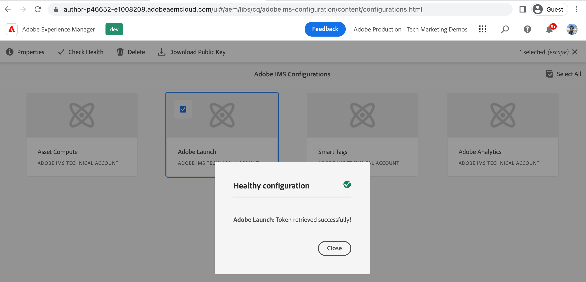

# 使用AEMIMS與標籤屬性連接{#connect-aem-and-tag-property-using-ims}

>[!NOTE]
>
>產品UI、內容和文檔中正在實施將Adobe Experience Platform Launch更名為一組資料收集技術的AEM過程，因此此處仍在使用「啟動」一詞。

瞭解如何使AEM用中的IMS(Identity Management系統)配置與標籤屬性連AEM接。 此安裝程AEM序使用啟動API驗證，並AEM允許通過啟動API通信以訪問標籤屬性。

## 建立或重用IMS配置

使用Adobe Developer控制台項目的IMS配置需要與新創AEM建的標籤屬性整合。 此配置允AEM許使用Launch API與Tags應用程式通信，IMS處理此整合的安全方面。

每當配置AEMasCloud Service環境時，都會自動建立一些IMS配置，如Asset compute、Adobe Analytics和Adobe啟動。 自動建立 **Adobe啟動** 如果您使用6.X環境，則可以使用IMS配置或建立AEM新的IMS配置。

已自動建立審閱 **Adobe啟動** IMS配置使用以下步驟。

1. 開啟AEM **工具** 菜單

1. 在「安全性」部分，選擇「Adobe IMS配置」。

1. 選擇 **Adobe啟動** 卡，按一下 **屬性**，查看詳細資訊 **證書** 和 **帳戶** 頁籤。 然後按一下 **取消** 返回而不修改任何自動建立的詳細資訊。

1. 選擇 **Adobe啟動** 卡，這次點擊 **檢查運行狀況**，您應該看到 **成功** 下面的消息。

   

## 後續步驟

[在中建立啟動Cloud Service配AEM置](create-aem-launch-cloud-service.md)
