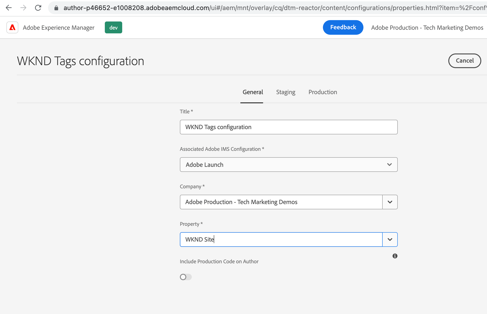

# 在中建立啟動Cloud Service配AEM置 {#create-launch-cloud-service}

>[!NOTE]
>
>產品UI、內容和文檔中正在實施將Adobe Experience Platform Launch更名為一組資料收集技術的AEM過程，因此此處仍在使用「啟動」一詞。

瞭解如何在Adobe Experience Manager建立啟動Cloud Service配置。 然AEM後，啟動Cloud Service配置可應用於現有站點，並且可以觀察到在作者和發佈環境中載入的標籤庫。

## 建立啟動雲服務

使用以下步驟建立啟動雲服務配置。

1. 從 **工具** 菜單，選擇 **Cloud Services** 的 **Adobe啟動配置**

1. 選擇站點的配置資料夾或選擇 **WKND站點** （如果使用WKND指南項目），然後按一下 **建立**

1. 從 _常規_ 頁籤，使用 **標題** ，然後選擇 **Adobe啟動** 從 _關聯的Adobe IMS配置_ 下拉清單。 然後，從 _公司_ 下拉清單，然後從 _屬性_ 下拉清單。

1. 從 _暫存_ 和 _生產_ 頁籤。 但建議查看和更改實際生產設定的配置，特別是 _非同步載入庫_ 根據您的效能和優化要求進行切換。 另請注意 _庫URI_ 對於「分段」和「生產」，值不同。

1. 最後，按一下 **建立** 完成啟動雲服務。

   

## 將啟動雲服務應用到站點

要將Tag屬性及其庫載入到站AEM點上，將將啟動雲服務配置應用到站點。 在上一步中，在站點名稱資料夾（WKND站點）下建立雲服務配置，因此應自動應用該配置，讓我們驗證一下。

1. 從 **導航** 菜單，選擇 **站點** 表徵圖

1. 選擇網站的根頁AEM，然後按一下 **屬性**。 然後，導航到 **高級** 頁籤 **配置** 部分，驗證雲配置值是否指向您的站點特定 `conf` 的子菜單。

   

## 驗證在「作者」和「發佈」頁上載入Tag屬性

現在是驗證Tag屬性及其庫是否已載入到站點頁AEM面的時候。

1. 在 **查看為已發佈** 模式，在瀏覽器控制台中，您應看到日誌消息。 該消息來自Tag屬性規則的JavaScript代碼段，在 _已載入庫（頁面頂部）_ 觸發事件。

1. 要在發佈時驗證，請先發佈 **啟動雲服務** 配置並開啟發佈實例上的網站頁。

   

恭喜！您已完成AEM並完成資料收集標籤整合，該整合將JavaScript代碼注入您的AEM站點，而不更新AEMProject代碼。

## 質詢 — 在「標籤」屬性中更新和發佈規則

使用從前一個 [建立標籤屬性](./create-tag-property.md) 要完成簡單的質詢，請更新現有規則以添加其他控制台語句，並使用 _發佈流_ 將其部署到AEM站點。

## 後續步驟

[調試標籤實現](debug-tags-implementation.md)
