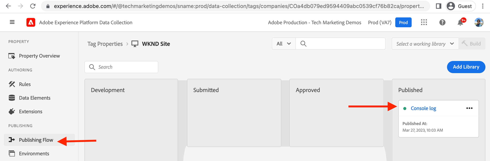

# 建立標籤屬性 {#create-tag-property}

了解如何以最低配置建立Tag屬性，以與Adobe Experience Manager整合。 使用者可前往標籤UI，並了解擴充功能、規則和發佈工作流程。

>[!VIDEO](https://video.tv.adobe.com/v/38553?quality=12&learn=on)

## 標籤屬性建立

若要建立Tag屬性，請完成下列步驟。

1. 在瀏覽器中，導覽至 [Adobe Experience Cloud首頁](https://experience.adobe.com/) 頁面並使用您登入Adobe ID。

1. 按一下 **資料收集** 應用程式 _快速存取_ 區段。

1. 按一下 **標籤** 功能表項目，然後按一下 **新屬性** 從右上角。

1. 使用為您的Tag屬性命名 **名稱** 必填欄位。 對於「網域」欄位，請輸入您的網域名稱，或使用AEMas a Cloud Service環境時，請輸入 `adobeaemcloud.com` 按一下 **儲存**.

   

## 建立新規則

按一下 **標籤屬性** 檢視。 也在 _我的最近活動_ 標題中，您應該會看到核心擴充功能已新增至此。 核心標籤擴充功能是預設擴充功能，提供頁面載入、瀏覽器、表單等基本事件類型，請參閱 [核心擴充功能概觀](https://experienceleague.adobe.com/docs/experience-platform/tags/extensions/client/core/overview.html) 以取得更多資訊。

規則可讓您指定訪客與您的AEM網站互動時應發生的事。 為了簡單起見，我們將兩則訊息記錄到瀏覽器主控台，以示範資料收集Tag整合如何能將JavaScript程式碼插入AEM網站，而不需更新AEM專案程式碼。

若要建立規則，請完成下列步驟。

1. 按一下 **規則** 從 _製作_ ，然後按一下 **建立新規則**

1. 使用為規則命名 **名稱** 必填欄位。

1. 按一下 **新增** 從 _事件_ 部分，然後 _事件設定_ 表單中 **事件類型** 下拉式選擇 _程式庫已載入（頁面頂端）_ 選項，然後按一下 **保留變更**.

1. 按一下 **新增** 從 _動作_ 部分，然後 _動作設定_ 表單中 **動作類型** 下拉式選擇 _自訂程式碼_ 選項，然後按一下 **開啟編輯器**.

1. 在 _編輯代碼_ 強制回應，輸入下列JavaScript程式碼片段，然後按一下 **儲存**，最後按一下 **保留變更**.

   ```javascript
   console.log('Tags Property loaded, all set for...');
   console.log('capabilities such as capturing data, conversion tracking and delivering unique and personalized experiences');
   ```

1. 按一下 **儲存** 來完成規則建立程式。

   

## 新增程式庫並發佈

Tag屬性 _規則_ 會使用程式庫來啟動，請將程式庫視為包含JavaScript程式碼的套件。 依照步驟啟動新建立的規則。

1. 按一下 **發佈流程** 從 _發佈_ ，然後按一下 **新增程式庫**

1. 使用為程式庫命名 **名稱** 欄位和選取 _開發（開發）_ 選項 **環境** 下拉式清單。

1. 要選擇自建立Tag屬性以來更改的所有資源，請按一下 **+新增所有變更的資源**. 此動作會將新建立的規則和核心擴充功能資源新增至程式庫。 最後按一下 **儲存並建置至開發**.

1. 為建立程式庫後 **開發** swim lane，使用 _橢圓_ 選取 **提交以進行核准**

1. 在 **已提交** 使用游泳道 _橢圓_ 選取 **核准以發佈**，同樣地 **建置並發佈到生產環境** 在 **已核准** 游泳道。




上述步驟會完成簡單的Tag屬性建立，此建立具有載入頁面時將訊息記錄到瀏覽器主控台的規則。 此外，規則和核心擴充功能也會透過建立程式庫來發佈。

## 後續步驟

[使用IMS連線AEM與標籤屬性](connect-aem-tag-property-using-ims.md)


## 其他資源 {#additional-resources}

* [建立標籤屬性](https://experienceleague.adobe.com/docs/platform-learn/implement-in-websites/configure-tags/create-a-property.html)
