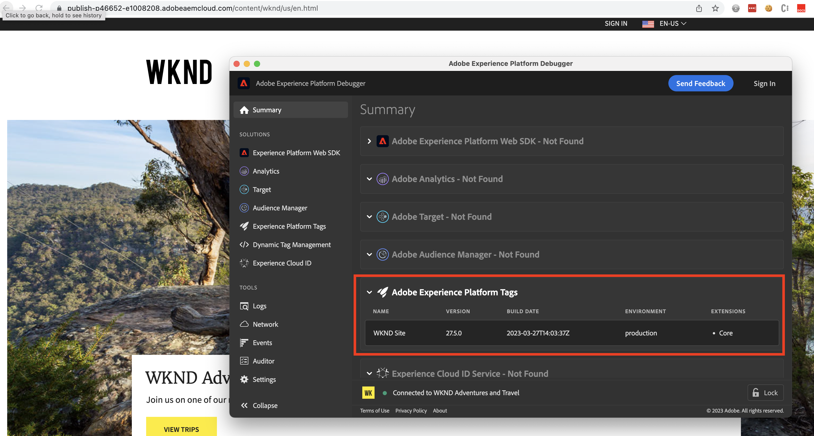

# 為標籤實作除錯 {#debug-tags-implementation}

介紹用來除錯標籤實作的常用工具和技術。 了解如何使用瀏覽器的開發人員主控台和Experience Platform偵錯工具擴充功能，識別及疑難排解標籤實作的重大問題。

>[!VIDEO](https://video.tv.adobe.com/v/38567?quality=12&learn=on)

## 透過Satellite物件進行用戶端除錯

用戶端除錯有助於驗證標籤屬性規則載入或執行順序。 每當有標籤屬性新增至網站時， `_satellite` 瀏覽器中存在JavaScript物件，以方便用戶端事件和資料追蹤。

若要啟用用戶端除錯，請呼叫 `setDebug(true)` 方法 `_satellite` 物件。

1. 開啟瀏覽器主控台，然後執行以下命令。

   ```javascript
       _satellite.setDebug(true);
   ```

1. 重新載入AEM網站頁面，並驗證主控台記錄顯示 _引發規則_ 訊息如下。

   

## 透過Adobe Experience Platform Debugger除錯

Adobe提供Adobe Experience Platform Debugger [Chrome擴充功能](https://chrome.google.com/webstore/detail/adobe-experience-platform/bfnnokhpnncpkdmbokanobigaccjkpob) 和 [Firefox附加元件](https://addons.mozilla.org/en-US/firefox/addon/adobe-experience-platform-dbg/) 除錯、了解及深入了解整合。

1. 開啟Adobe Experience Platform Debugger擴充功能，並在Publish執行個體上開啟網站頁面

1. 在 **Adobe Experience Platform Debugger >摘要> Adobe Experience Platform標籤** 區段中，確認您的「標籤」屬性詳細資訊，例如名稱、版本、建置日期、環境和擴充功能。

   

## 其他資源 {#additional-resources}

+ [Adobe Experience Platform Debugger簡介](https://experienceleague.adobe.com/docs/platform-learn/data-collection/debugger/overview.html)

+ [衛星對象參考](https://experienceleague.adobe.com/docs/experience-platform/tags/client-side/satellite-object.html)
