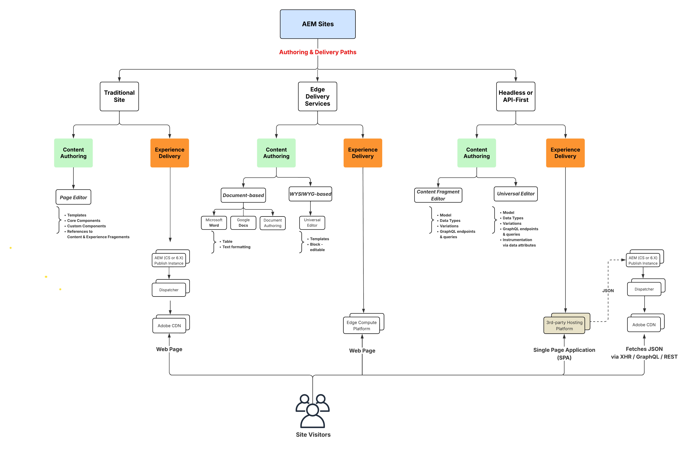

# AEM Sites 影片和教學課程 {#overview}

{{edge-delivery-services}}

Adobe Experience Manager (AEM) Sites 是業界領先的體驗管理平台。本使用手冊包含 AEM Sites 許多特性與功能的相關影片和教學課程。

## 使用 AEM Sites 進行建置的三種方式

AEM Sites 提供三種建置、製作和傳遞體驗的方式。無論您是建置完整頁面、最佳化邊緣效能，還是支援無周邊應用程式，AEM Sites 都能提供靈活的選項來滿足您的專案需求：

1. **Edge Delivery Services**&#x200B;網站利用檔案式製作或Adobe Universal Editor來製作內容，然後啟動內容，再由Edge Delivery Services以HTML網頁的形式傳送給使用者。 此選項主要適用於&#x200B;_需要高效能、擴充性和速度的「新專案及現有專案_」。
1. **Headless/API-first**&#x200B;網頁體驗使用內容片段編輯器或通用編輯器來製作內容，然後啟動該內容，並由AEM Publish以JSON格式傳送。 此選項主要適用於&#x200B;_新的和現有的專案_，這些專案需要將Headless內容傳送至行動應用程式、單頁應用程式(SPA)或其他Headless應用程式。
1. **傳統AEM**&#x200B;不是使用AEM Sites建立網頁體驗的最新方法。 傳統AEM使用AEM作者的頁面編輯器來製作內容，然後啟用內容，並透過AEM Publish as HTML網頁傳送給使用者。 建議針對&#x200B;_現有專案_&#x200B;使用傳統AEM。

這些選項旨在滿足行銷組織的多樣化需求，可以透過任何管道或裝置快速且大規模地提供引人入勝的個人化體驗。

>[!IMPORTANT]
>
> **Edge Delivery Services**&#x200B;是使用AEM Sites建置的最新方式。 其設計旨在大規模提供高效能網站，利用AdobeEdge Network的強大功能。

以下圖表呈現不同的路徑：

{width="700" zoomable="yes"}

### 比較使用 AEM Sites 進行建置的方式

以下表格針對這三條路徑進行高層級比較。其聚焦於每條路徑在內容製作和體驗傳遞方面的細微差別。

|            | Edge Delivery Services | 無周邊/API 優先 | 傳統AEM |
|---------------------|------------------------------|---------------------------------|---------------------------------------------|
| **最適合** | 具有高流量、效能及擴充能力的網站 | 行動應用程式、SPA和其他Headless應用程式 | 現有專案（非最新方法） |
| **製作工具** | 文件型製作、通用編輯器 | 內容片段、通用編輯器 | 頁面編輯器 |
| **製作內容儲存** | 文件或 AEM Author (JCR) | AEM Author (JCR) | AEM Author (JCR) |
| **傳遞** | Edge Delivery Services | AEM Publish (透過 Adobe CDN + Dispatcher) | AEM Publish (透過 Adobe CDN + Dispatcher) |
| **傳遞內容儲存** | Edge Delivery Services | AEM Publish (JCR) | AEM Publish (JCR) |
| **傳遞格式** | HTML | JSON | HTML |
| **開發技術** | JavaScript、CSS | 任何 (例如 Swift、React 等) | Java™、JavaScript、CSS |
| **實作階段** | 新專案和現有專案 | 新專案和現有專案 | 僅限現有專案 |

## 教學課程

透過以下教學課程，了解使用 AEM Sites 進行建置的三種途徑：

<!-- CARDS

* https://www.aem.live/docs/
  {title = Edge Delivery Services - Guides}
  {description = Explore Edge Delivery Services with comprehensive guides. The Build, Publish, and Launch guides cover everything you need to get started with EDS.}
  {image = ./assets/edge-delivery-services.png}
  {target = _blank}
* https://experienceleague.adobe.com/en/docs/experience-manager-learn/getting-started-with-aem-headless/overview
  {title = Headless/API-First - Tutorials}
  {description = Learn how to build headless applications powered by AEM content. Tutorials cover frameworks like iOS, Android, and React—choose what fits your stack.}
  {image = ./assets/headless.png}
  {target = _self}
* https://experienceleague.adobe.com/zh-hant/docs/experience-manager-learn/getting-started-wknd-tutorial-develop/overview
  {title = Traditional AEM - WKND Tutorial}
  {description = Learn how to build a sample AEM Sites project using the WKND tutorial. This guide walks you through project setup, Core Components, Editable Templates, client-side libraries, and component development.}
  {image = ./assets/aem-wknd-spa-editor-tutorial.png}
  {target = _self}
-->
<!-- START CARDS HTML - DO NOT MODIFY BY HAND -->

    

        

            

                <figure class="image x-is-16by9">
                    
                </figure>
            

            

                

                    

                        <a href="https://www.aem.live/docs/" target="_blank" rel="referrer" title="Edge Delivery Services - 指南">Edge Delivery Services - 指南</a>
                    

                    
透過完整指南探索 Edge Delivery Services。建置、發佈和啟動指南，涵蓋開始使用 EDS 所需的一切。

                

                <a href="https://www.aem.live/docs/" target="_blank" rel="referrer" class="spectrum-Button spectrum-Button--outline spectrum-Button--primary spectrum-Button--sizeM" style="align-self: flex-start; margin-top: 1rem;">
                    了解更多
                </a>
            

        

    

    

        

            

                <figure class="image x-is-16by9">
                    
                </figure>
            

            

                

                    

                        <a href="https://experienceleague.adobe.com/zh-hant/docs/experience-manager-learn/getting-started-with-aem-headless/overview" target="_self" rel="referrer" title="無周邊/API 優先 - 教學課程">無周邊/API 優先 - 教學課程</a>
                    

                    
了解如何建置由 AEM 內容支援的無周邊應用程式。教學課程涵蓋iOS、Android和React等架構，選擇適合您棧疊的專案。

                

                <a href="https://experienceleague.adobe.com/zh-hant/docs/experience-manager-learn/getting-started-with-aem-headless/overview" target="_self" rel="referrer" class="spectrum-Button spectrum-Button--outline spectrum-Button--primary spectrum-Button--sizeM" style="align-self: flex-start; margin-top: 1rem;">
                    了解更多
                </a>
            

        

    

    

        

            

                <figure class="image x-is-16by9">
                    
                </figure>
            

            

                

                    

                        <a href="https://experienceleague.adobe.com/zh-hant/docs/experience-manager-learn/getting-started-wknd-tutorial-develop/overview" target="_self" rel="referrer" title="傳統AEM - WKND教學課程">傳統AEM - WKND教學課程</a>
                    

                    
了解如何使用 WKND 教學課程建置 AEM Sites 專案範例。本指南會為您逐步解說專案設定、核心元件、可編輯的範本、用戶端資料庫和元件開發。

                

                <a href="https://experienceleague.adobe.com/zh-hant/docs/experience-manager-learn/getting-started-wknd-tutorial-develop/overview" target="_self" rel="referrer" class="spectrum-Button spectrum-Button--outline spectrum-Button--primary spectrum-Button--sizeM" style="align-self: flex-start; margin-top: 1rem;">
                    了解更多
                </a>
            

        

    

<!-- END CARDS HTML - DO NOT MODIFY BY HAND -->

## 其他資源

* [AEM Sites 製作文件](https://experienceleague.adobe.com/zh-hant/docs/experience-manager-65/content/sites/authoring/essentials/first-steps)
* [AEM Sites 開發文件](https://experienceleague.adobe.com/zh-hant/docs/experience-manager-65/content/implementing/developing/introduction/getting-started)
* [AEM Sites 管理文件](https://experienceleague.adobe.com/zh-hant/docs/experience-manager-65/content/sites/administering/home)
* [AEM Sites 部署文件](https://experienceleague.adobe.com/zh-hant/docs/experience-manager-65/content/implementing/deploying/introduction/platform)
* [AEM as a Cloud Service 教學課程](/help/cloud-service/overview.md)
* [AEM Assets 教學課程](/help/assets/overview.md)
* [AEM Forms 教學課程](/help/forms/overview.md)
* [AEM Foundation 教學課程](/help/foundation/overview.md)
