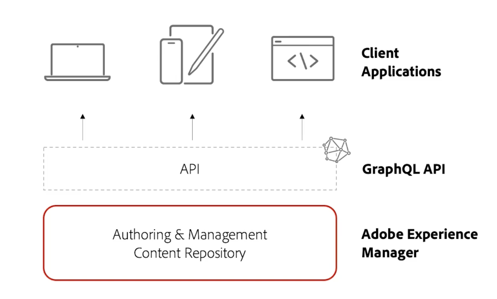

# AEM Sites 影片和教學課程 {#overview}

{{edge-delivery-services}}

Adobe Experience Manager (AEM) Sites 是 Adobe 的體驗管理平台，可讓您透過網站、行動應用程式或任何其他數位管道來製作、管理和提供數位體驗。

## AEM Sites 提供體驗的三種方式

AEM Sites 提供三種方法來建置、製作和提供體驗。無論是要建置網站、最佳化邊緣效能，還是支援無周邊應用程式，AEM Sites 都能提供靈活的選項來滿足您的專案需求：

1. **Edge Delivery Services** 體驗使用 Adobe 的 Edge Network，以高速且低延遲的方式傳遞內容。此服務會針對使用裝置、搜尋引擎和生成式 AI 代理，自動將內容最佳化。作者使用 Adobe 通用編輯器或文件型製作建立內容。
1. **無周邊/API 優先**&#x200B;體驗會使用 AEM Publish，透過適用於行動應用程式、單頁應用程式 (SPA) 或其他無周邊用戶端的 HTTP API，以 JSON 形式傳遞內容。作者使用內容片段編輯器或通用編輯器建立內容。
1. **傳統 AEM** 體驗會使用 AEM Publish，以 HTML 網頁的形式傳遞內容。作者使用 AEM Author 的頁面編輯器建立內容。此選項最適合現有專案或已經移轉的專案。

三種選項皆為極實用的方法，最佳選擇取決於您的使用案例和組織需求。每種方法都可以讓團隊在任何管道或裝置上，快速且大規模地提供個人化、引人入勝的體驗。

>[!IMPORTANT]
>
> **Edge Delivery Services** 是透過 AEM 提供網站的最新且最進階方式。它結合了 Adobe Edge Network 的速度和擴充性，且具備現代化的製作選項。雖然我們建議對新專案採用 Edge Delivery Services，但 AEM Sites 仍會持續支援無周邊和傳統方法，因此您可以選擇最符合您需求的路徑。

以下圖表呈現使用 AEM Sites 建置體驗的不同選項：

{width="700" zoomable="yes"}

### 比較使用 AEM Sites 進行建置的方式

以下表格針對這三條路徑進行高層級比較。其聚焦於每條路徑在內容製作和體驗傳遞方面的細微差別。

|            | Edge Delivery Services | 無周邊/API 優先 | 傳統 AEM |
|---------------------|------------------------------|---------------------------------|---------------------------------------------|
| **最適合** | 對流量、效能與擴充性有高度需求的網站 | 行動應用程式、SPA 和其他無周邊應用程式 | 現有專案或已移轉的專案 |
| **製作工具** | 文件型製作、通用編輯器、頁面編輯器 | 內容片段、通用編輯器 | 頁面編輯器、通用編輯器 |
| **製作內容儲存** | 文件或 AEM Author (JCR) | AEM Author (JCR) | AEM Author (JCR) |
| **傳遞** | Edge Delivery Services | AEM Publish (透過 Adobe CDN + Dispatcher) | AEM Publish (透過 Adobe CDN + Dispatcher) |
| **傳遞內容儲存** | Edge Delivery Services | AEM Publish (JCR) | AEM Publish (JCR) |
| **傳遞格式** | HTML | JSON | HTML |
| **開發技術** | JavaScript、CSS | 任何 (例如 Swift、React 等) | Java™、HTL、JavaScript、CSS |
| **搜尋機器人和生成式 AI 代理支援** | 已針對機器人、搜尋引擎和生成式 AI 代理進行最佳化 | 適用於機器人和代理，但可能需要 SSR 或其他設定 | 適合機器人，但效能可能會比 Edge Delivery Services 慢 |

## 從 AMS 或內部部署移轉

如果您要從 AMS 或內部部署 (OTP) 移轉至 AEM as a Cloud Service，Adobe 鼓勵您評估直接移至 Edge Delivery Services。此方式的工作量通常不會比移轉至 AEM as a Cloud Service Publish 更多，但能提供更快速的效能和更高的擴充性。如果您認為 Edge Delivery Services 目前並非適合您的選項，或者其他方法更符合您的需求，這些方法對您的專案而言依然是受到完整支援且有效的選項。

## 教學課程

深入探索使用 AEM Sites 進行建置的三種方法。以下教學課程會逐步引導您了解各個選項的運作方式、相關工具及使用時機。

<!-- CARDS

* https://www.aem.live/docs/
  {title = Edge Delivery Services - Guides}
  {description = Explore Edge Delivery Services with comprehensive guides. The Build, Publish, and Launch guides cover everything you need to get started with Edge Delivery Services.}
  {image = ./assets/edge-delivery-services.png}
  {target = _blank}
* https://experienceleague.adobe.com/zh-hant/docs/experience-manager-learn/getting-started-with-aem-headless/overview
  {title = Headless/API-First - Tutorials}
  {description = Learn how to build headless applications powered by AEM content. Tutorials cover frameworks like iOS, Android, and React—choose what fits your stack.}
  {image = ./assets/headless.png}
  {target = _self}
* https://experienceleague.adobe.com/zh-hant/docs/experience-manager-learn/getting-started-wknd-tutorial-develop/overview
  {title = Traditional AEM - WKND Tutorial}
  {description = Learn how to build a sample AEM Sites project using the WKND tutorial. This guide walks you through project setup, Core Components, Editable Templates, client-side libraries, and component development.}
  {image = ./assets/aem-wknd-spa-editor-tutorial.png}
  {target = _self}
-->
<!-- START CARDS HTML - DO NOT MODIFY BY HAND -->

    

        

            

                <figure class="image x-is-16by9">
                    
                </figure>
            

            

                

                    

                        <a href="https://www.aem.live/docs/" target="_blank" rel="referrer" title="Edge Delivery Services - 指南">Edge Delivery Services - 指南</a>
                    

                    
透過完整指南探索 Edge Delivery Services。建置、發佈和啟動指南，涵蓋開始使用 Edge Delivery Services 所需的一切。

                

                <a href="https://www.aem.live/docs/" target="_blank" rel="referrer" class="spectrum-Button spectrum-Button--outline spectrum-Button--primary spectrum-Button--sizeM" style="align-self: flex-start; margin-top: 1rem;">
                    了解更多
                </a>
            

        

    

    

        

            

                <figure class="image x-is-16by9">
                    
                </figure>
            

            

                

                    

                        <a href="https://experienceleague.adobe.com/zh-hant/docs/experience-manager-learn/getting-started-with-aem-headless/overview" target="_self" rel="referrer" title="無周邊/API 優先 - 教學課程">無周邊/API 優先 - 教學課程</a>
                    

                    
了解如何建置由 AEM 內容支援的無周邊應用程式。教學課程涵蓋 iOS、Android 和 React 等框架，請根據您的堆疊選擇適合的框架。

                

                <a href="https://experienceleague.adobe.com/zh-hant/docs/experience-manager-learn/getting-started-with-aem-headless/overview" target="_self" rel="referrer" class="spectrum-Button spectrum-Button--outline spectrum-Button--primary spectrum-Button--sizeM" style="align-self: flex-start; margin-top: 1rem;">
                    了解更多
                </a>
            

        

    

    

        

            

                <figure class="image x-is-16by9">
                    
                </figure>
            

            

                

                    

                        <a href="https://experienceleague.adobe.com/zh-hant/docs/experience-manager-learn/getting-started-wknd-tutorial-develop/overview" target="_self" rel="referrer" title="傳統 AEM - WKND 教學課程">傳統 AEM - WKND 教學課程</a>
                    

                    
了解如何使用 WKND 教學課程建置 AEM Sites 專案範例。本指南會為您逐步解說專案設定、核心元件、可編輯的範本、用戶端資料庫和元件開發。

                

                <a href="https://experienceleague.adobe.com/zh-hant/docs/experience-manager-learn/getting-started-wknd-tutorial-develop/overview" target="_self" rel="referrer" class="spectrum-Button spectrum-Button--outline spectrum-Button--primary spectrum-Button--sizeM" style="align-self: flex-start; margin-top: 1rem;">
                    了解更多
                </a>
            

        

    

<!-- END CARDS HTML - DO NOT MODIFY BY HAND -->

## 其他資源

* [AEM Sites 製作文件](https://experienceleague.adobe.com/zh-hant/docs/experience-manager-65/content/sites/authoring/essentials/first-steps)
* [AEM Sites 開發文件](https://experienceleague.adobe.com/zh-hant/docs/experience-manager-65/content/implementing/developing/introduction/getting-started)
* [AEM Sites 管理文件](https://experienceleague.adobe.com/zh-hant/docs/experience-manager-65/content/sites/administering/home)
* [AEM Sites 部署文件](https://experienceleague.adobe.com/zh-hant/docs/experience-manager-65/content/implementing/deploying/introduction/platform)
* [AEM as a Cloud Service 教學課程](/help/cloud-service/overview.md)
* [AEM Assets 教學課程](/help/assets/overview.md)
* [AEM Forms 教學課程](/help/forms/overview.md)
* [AEM Foundation 教學課程](/help/foundation/overview.md)
