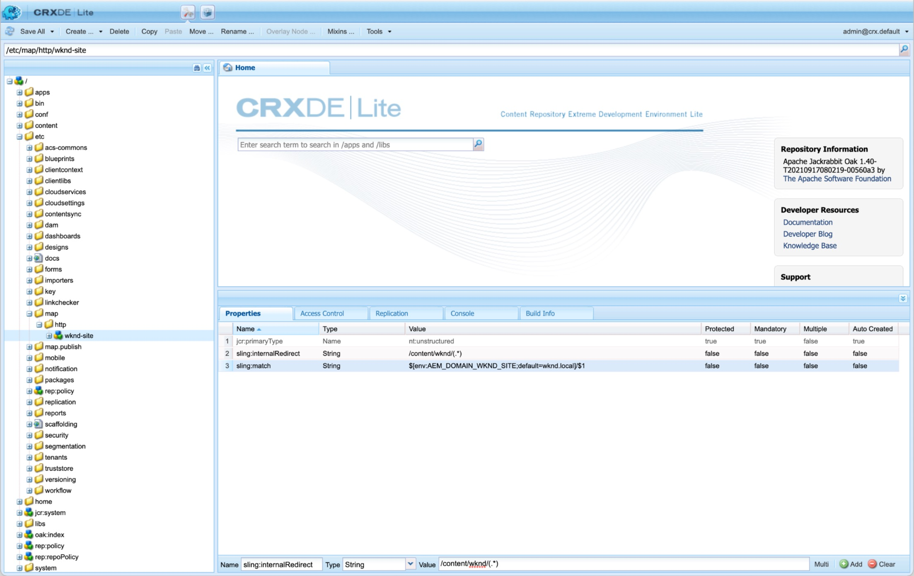

# Sitemap

瞭解如何為AEM Sites建立Sitemap，以利提升SEO。

>[!WARNING]
>
>此影片示範如何在網站地圖中使用相對URL。 Sitemap [應使用絕對URL](https://sitemaps.org/protocol.html). 另請參閱 [設定](#absolute-sitemap-urls) 瞭解如何啟用絕對URL，因為以下影片未說明此問題。

>[!VIDEO](https://video.tv.adobe.com/v/337960?quality=12&learn=on)

## 設定

### 絕對網站地圖URL{#absolute-sitemap-urls}

AEM Sitemap透過使用支援絕對URL [Sling對應](https://sling.apache.org/documentation/the-sling-engine/mappings-for-resource-resolution.html). 這是透過在產生Sitemap (通常是AEM Publish服務)的AEM服務上建立對應節點來完成的。

Sling對應節點定義的範例 `https://wknd.com` 可定義於 `/etc/map/https` 如下所示：

| 路徑 | 屬性名稱 | 屬性型別 | 屬性值 |
|------|----------|---------------|-------|
| `/etc/map/https/wknd-site` | `jcr:primaryType` | 字串 | `nt:unstructured` |
| `/etc/map/https/wknd-site` | `sling:internalRedirect` | 字串 | `/content/wknd/(.*)` |
| `/etc/map/https/wknd-site` | `sling:match` | 字串 | `wknd.com/$1` |

以下熒幕擷圖說明類似的設定，但 `http://wknd.local` (執行於的本機主機名稱對應 `http`)。




### Sitemap排程器OSGi設定

定義 [OSGi工廠設定](http://localhost:4502/system/console/configMgr/org.apache.sling.sitemap.impl.SitemapScheduler) 針對頻率(使用 [cron運算式](http://www.cronmaker.com/))在AEM中重新/產生並快取sitemap。

`ui.config/src/main/jcr_content/apps/wknd/osgiconfig/config.publish`

```json
{
  "scheduler.name": "WKND Sitemaps",
  "scheduler.expression": "0 0 2 1/1 * ? *",
  "searchPath": "/content/wknd"
}
```

### Dispatcher允許篩選規則

允許Sitemap索引和Sitemap檔案的HTTP要求。

`dispatcher/src/conf.dispatcher.d/filters/filters.any`

```
...

# Allow AEM sitemaps
/0200 { /type "allow" /path "/content/*" /selectors '(sitemap-index|sitemap)' /extension "xml" }
```

### Apache Webserver重寫規則

確定 `.xml` Sitemap HTTP請求會路由至正確的基礎AEM頁面。 如果未使用URL縮短功能，或使用Sling對應來縮短URL，則不需要進行此設定。

`dispatcher/src/conf.d/rewrites/rewrite.rules`

```
...
RewriteCond %{REQUEST_URI} (.html|.jpe?g|.png|.svg|.xml)$
RewriteRule ^/(.*)$ /content/${CONTENT_FOLDER_NAME}/$1 [PT,L]
```

## 資源

+ [AEM Sitemap檔案](https://experienceleague.adobe.com/docs/experience-manager-cloud-service/content/overview/seo-and-url-management.html?lang=en)
+ [Apache Sling Sitemap檔案](https://github.com/apache/sling-org-apache-sling-sitemap#readme)
+ [Sitemap.org Sitemap檔案](https://www.sitemaps.org/protocol.html)
+ [Sitemap.org Sitemap索引檔案檔案](https://www.sitemaps.org/protocol.html#index)
+ [Cronmaker](http://www.cronmaker.com/)