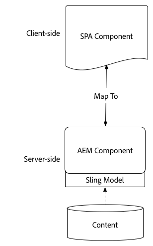
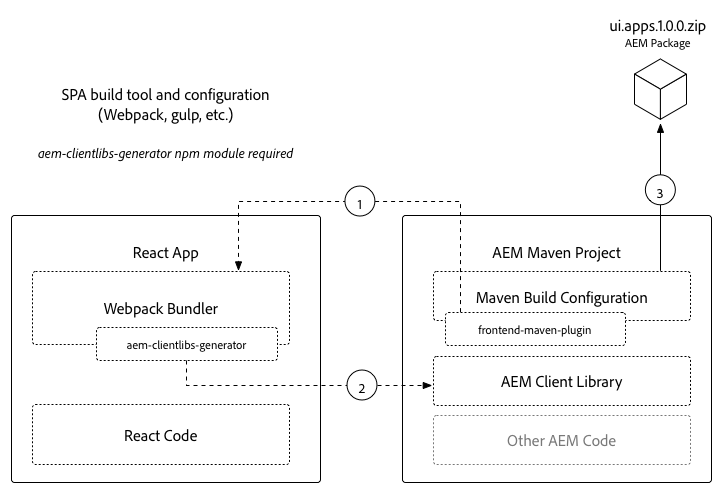
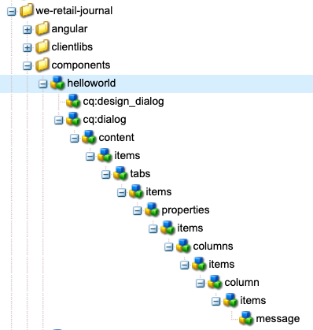
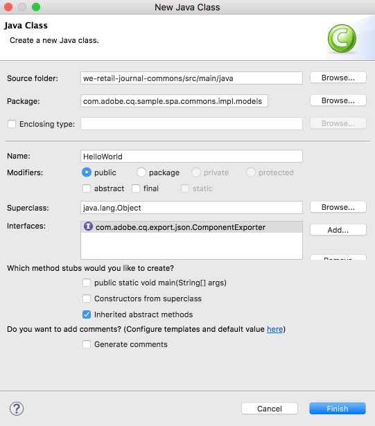
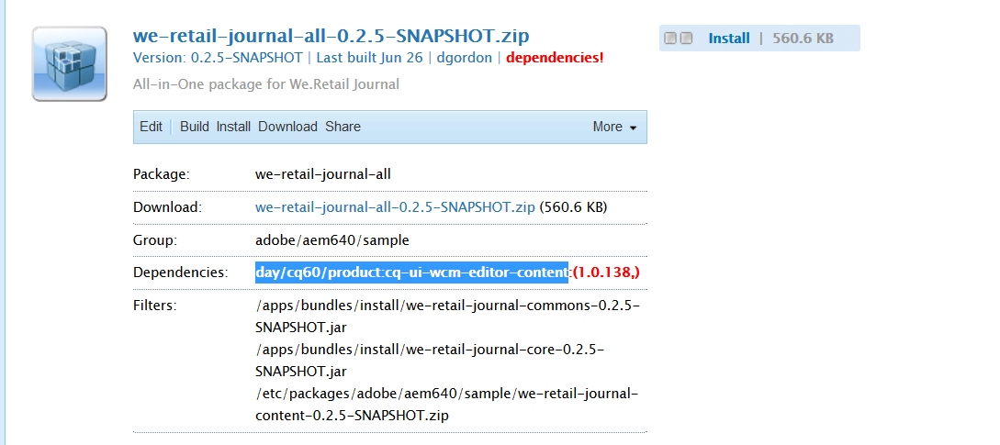

# 使用AEM SPA編輯器開發 — Hello World教學課程{#developing-with-the-aem-spa-editor-hello-world-tutorial}

>[!WARNING]
>
> 本教學課程為&#x200B;**已廢止**。 建議您遵循下列任一項：[AEM SPA Editor and ReactAngular快速入門](https://docs.adobe.com/content/help/en/experience-manager-learn/spa-angular-tutorial/overview.html)或[AEM SPA Editor and React](https://docs.adobe.com/content/help/en/experience-manager-learn/spa-react-tutorial/overview.html)快速入門

AEM SPA編輯器支援在內容內編輯單頁應用程式或SPA。 本教學課程介紹要與AEM SPA Editor JS SDK搭配使用的SPA開發。 本教學課程將新增自訂Hello World元件，以擴充We.Retail Journal應用程式。 使用者可使用React或Angular架構完成本教學課程。

>[!NOTE]
>
> 單頁應用程式(SPA)編輯器功能需要AEM 6.4 service pack 2或更新版本。
>
> 若專案需要SPA架構的用戶端轉譯(例如React或Angular),SPA Editor是建議的解決方案。

## 必備條件閱讀 {#prereq}

本教學課程旨在反白顯示將SPA元件對應至AEM元件以啟用內容內編輯所需的步驟。 開始本教學課程的使用者應熟悉Adobe Experience Manager、AEM的開發基本概念，以及透過React開發Angular架構。 本教學課程涵蓋後端和前端開發工作。

開始本教學課程之前，建議先檢閱下列資源：

* [SPA編輯器功能影片](spa-editor-framework-feature-video-use.md)  - SPA Editor和We.Retail Journal應用程式的影片概觀。
* [React.js教學課程](https://reactjs.org/tutorial/tutorial.html)  — 使用React架構開發的簡介。
* [Angular教學課程](https://angular.io/tutorial)  — 使用Angular開發的簡介

## 本機開發環境 {#local-dev}

本教學課程的設計目的：

[Adobe Experience Manager 6.5](https://helpx.adobe.com/tw/experience-manager/6-5/release-notes.html) 或 [Adobe Experience Manager 6.4](https://helpx.adobe.com/experience-manager/6-4/sites/deploying/using/technical-requirements.html) +  [Service Pack 5](https://helpx.adobe.com/tw/experience-manager/6-4/release-notes/sp-release-notes.html)

在本教學課程中，應安裝下列技術和工具：

1. [Java 11](https://downloads.experiencecloud.adobe.com/content/software-distribution/en/general.html)
2. [Apache Maven - 3.3.1+](https://maven.apache.org/)
3. [Node.js - 8.11.1+](https://nodejs.org/en/) 和npm 5.6.0+（npm隨node.js安裝）

開啟新終端並運行以下程式，仔細檢查上述工具的安裝：

```shell
$ java -version
java version "11 +"

$ mvn -version
Apache Maven 3.3.9

$ node --version
v8.11.1

$ npm --version
6.1.0
```

## 概覽 {#overview}

基本概念是將SPA元件對應至AEM元件。 AEM元件，執行伺服器端，以JSON格式匯出內容。 SPA會使用JSON內容，在瀏覽器中執行用戶端。 系統會建立SPA元件與AEM元件之間的1:1對應。



熱門架構[React JS](https://reactjs.org/)和[Angular](https://angular.io/)可立即使用。 使用者可以透過Angular或React完成本教學課程，無論其最熟悉的架構為何。

## 項目設定{#project-setup}

SPA開發只有一步之遙，另一步之遙。 目標是讓SPA開發能獨立進行，且（大多）不受AEM限制。

* SPA專案在前端開發期間可獨立於AEM專案運作。
* 前端建置工具和技術（如Webpack、NPM、[!DNL Grunt]和[!DNL Gulp]）繼續使用。
* 若要為AEM建置，系統會編譯SPA專案並自動加入AEM專案。
* 用於將SPA部署至AEM的標準AEM套件。


*SPA開發只有一步是AEM開發，另一步則是開發 — 讓SPA開發能獨立進行，且（大多）不受AEM限制。*

本教學課程的目標是使用新元件擴充We.Retail日誌應用程式。 首先，下載We.Retail Journal應用程式的原始碼，並部署至本機AEM。

1. **** 從GitHub下 [載最新的We.Retail日誌代碼](https://github.com/adobe/aem-sample-we-retail-journal)。

   或從命令列複製存放庫：

   ```shell
   $ git clone git@github.com:adobe/aem-sample-we-retail-journal.git
   ```

   >[!NOTE]
   >
   >本教學課程將針對&#x200B;**master**&#x200B;分支使用&#x200B;**1.2.1-SNAPSHOT**&#x200B;版本的專案。

1. 下列結構應可見：

   

   專案包含下列Maven模組：

   * `all`:將整個專案內嵌並安裝在單一套件中。
   * `bundles`:包含兩個OSGi套件組合：包含和其他Java程式碼 [!DNL Sling Models] 的公域和核心。
   * `ui.apps`:包含專案的/apps部分、ie JS與CSS clientlibs、元件、執行模式特定設定。
   * `ui.content`:包含結構內容和設定(`/content`、  `/conf`)
   * `react-app`:We.Retail Journal React應用程式。這既是Maven模組，也是Webpack專案。
   * `angular-app`:We.Retail JournalAngular應用程式。這既是[!DNL Maven]模組，也是Webpack專案。

1. 開啟新的終端機視窗並執行下列命令，以建立整個應用程式並部署至在[http://localhost:4502](http://localhost:4502)上執行的本機AEM執行個體。

   ```shell
   $ cd <src>/aem-sample-we-retail-journal
   $ mvn -PautoInstallSinglePackage clean install
   ```

   >[!NOTE]
   >
   > 在本專案中，要建立並封裝整個專案的Maven設定檔為`autoInstallSinglePackage`

   >[!CAUTION]
   >
   > 如果您在建置期間收到錯誤，請[確保您的Maven settings.xml檔案包含Adobe的Maven工件存放庫](https://helpx.adobe.com/experience-manager/kb/SetUpTheAdobeMavenRepository.html)。

1. 導航到:

   * [http://localhost:4502/editor.html/content/we-retail-journal/react/en/home.html](http://localhost:4502/editor.html/content/we-retail-journal/react/en/home.html)
   * [http://localhost:4502/editor.html/content/we-retail-journal/angular/en/home.html](http://localhost:4502/editor.html/content/we-retail-journal/angular/en/home.html)

   We.Retail日誌應用程式應顯示在AEM Sites編輯器中。

1. 在[!UICONTROL 編輯]模式中，選擇要編輯的元件並對內容進行更新。

   

1. 選擇[!UICONTROL 頁面屬性]圖示以開啟[!UICONTROL 頁面屬性]。 選擇[!UICONTROL 編輯模板]以開啟頁面的模板。

   

1. 在最新版SPA編輯器中，[可編輯的範本](https://helpx.adobe.com/tw/experience-manager/6-5/sites/developing/using/page-templates-editable.html)的使用方式與傳統Sites實作相同。 我們稍後將透過自訂元件重新審視此項目。

   >[!NOTE]
   >
   > 只有AEM 6.5和AEM 6.4 + **Service Pack 5**&#x200B;支援可編輯的範本。

## 開發概述{#development-overview}



SPA開發反覆項目會獨立於AEM進行。 當SPA準備好部署至AEM時，會進行下列高階步驟（如上圖所示）。

1. 系統會叫用AEM專案組建，而這會觸發SPA專案的組建。 We.Retail Journal使用&#x200B;[**frontend-maven-plugin**](https://github.com/eirslett/frontend-maven-plugin)。
1. SPA專案的&#x200B;[**aem-clientlib-generator**](https://www.npmjs.com/package/aem-clientlib-generator)將編譯的SPA內嵌為AEM專案中的AEM Client Library。
1. AEM專案會產生AEM套件，包括已編譯的SPA，以及任何其他支援AEM程式碼。

## 建立AEM元件{#aem-component}

**角色：AEM開發人員**

首先會建立AEM元件。 AEM元件負責轉譯React元件讀取的JSON屬性。 AEM元件也負責提供元件的任何可編輯屬性的對話方塊。

使用[!DNL Eclipse]或其他[!DNL IDE]，匯入We.Retail Journal Maven專案。

1. 更新reactor **pom.xml**&#x200B;以移除[!DNL Apache Rat]外掛程式。 此外掛程式會檢查每個檔案，以確保有「授權」標題。 為了我們的目的，我們不需要關注此功能。

   在&#x200B;**aem-sample-we-retail-journal/pom.xml**&#x200B;中，移除&#x200B;**apache-rate-plugin**:

   ```xml
   <!-- Remove apache-rat-plugin -->
   <plugin>
           <groupId>org.apache.rat</groupId>
           <artifactId>apache-rat-plugin</artifactId>
           <configuration>
               <excludes combine.children="append">
                   <exclude>*</exclude>
                       ...
               </excludes>
           </configuration>
           <executions>
                   <execution>
                       <phase>verify</phase>
                       <goals>
                           <goal>check</goal>
                       </goals>
               </execution>
           </executions>
       </plugin>
   ```

1. 在&#x200B;**we-retail-journal-content**(`<src>/aem-sample-we-retail-journal/ui.apps`)模組中，在&#x200B;**helloworld**&#x200B;下建立一個名為&#x200B;**cq:Component**&#x200B;的新節點。`ui.apps/jcr_root/apps/we-retail-journal/components`
1. 將下列屬性新增至&#x200B;**helloworld**&#x200B;元件，如下XML(`/helloworld/.content.xml`)所示：

   ```xml
   <?xml version="1.0" encoding="UTF-8"?>
   <jcr:root xmlns:cq="http://www.day.com/jcr/cq/1.0" xmlns:jcr="http://www.jcp.org/jcr/1.0"
       jcr:description="Hello World Component for We.Retail Journal"
       jcr:primaryType="cq:Component"
       jcr:title="Hello World"
       componentGroup="We.Retail Journal" />
   ```

   

   >[!NOTE]
   >
   > 為了說明「可編輯的範本」功能，我們故意設定`componentGroup="Custom Components"`。 在真實專案中，最好將元件群組的數量減到最少，因此較好的群組是「[!DNL We.Retail Journal]」，以符合其他內容元件。
   >
   > 只有AEM 6.5和AEM 6.4 + **Service Pack 5**&#x200B;支援可編輯的範本。

1. 接下來將建立對話框，以允許為&#x200B;**Hello World**&#x200B;元件配置自定義消息。 在`/apps/we-retail-journal/components/helloworld`下方添加&#x200B;**nt:unstructured**&#x200B;的節點名稱&#x200B;**cq:dialog**。
1. **cq:dialog**&#x200B;將顯示一個將文本保存到名為&#x200B;**[!DNL message]**&#x200B;的屬性的文本欄位。 在新建立的&#x200B;**cq:dialog**&#x200B;下方新增下列節點和屬性，如下方的XML(`helloworld/_cq_dialog/.content.xml`)所示：

   ```xml
   <?xml version="1.0" encoding="UTF-8"?>
   <jcr:root xmlns:sling="http://sling.apache.org/jcr/sling/1.0" xmlns:cq="http://www.day.com/jcr/cq/1.0" xmlns:jcr="http://www.jcp.org/jcr/1.0" xmlns:nt="http://www.jcp.org/jcr/nt/1.0"
       jcr:primaryType="nt:unstructured"
       jcr:title="We.Retail Journal - Hello World"
       sling:resourceType="cq/gui/components/authoring/dialog">
       <content
           jcr:primaryType="nt:unstructured"
           sling:resourceType="granite/ui/components/coral/foundation/container">
           <items jcr:primaryType="nt:unstructured">
               <tabs
                   jcr:primaryType="nt:unstructured"
                   sling:resourceType="granite/ui/components/coral/foundation/tabs"
                   maximized="{Boolean}true">
                   <items jcr:primaryType="nt:unstructured">
                       <properties
                           jcr:primaryType="nt:unstructured"
                           jcr:title="Properties"
                           sling:resourceType="granite/ui/components/coral/foundation/container"
                           margin="{Boolean}true">
                           <items jcr:primaryType="nt:unstructured">
                               <columns
                                   jcr:primaryType="nt:unstructured"
                                   sling:resourceType="granite/ui/components/coral/foundation/fixedcolumns"
                                   margin="{Boolean}true">
                                   <items jcr:primaryType="nt:unstructured">
                                       <column
                                           jcr:primaryType="nt:unstructured"
                                           sling:resourceType="granite/ui/components/coral/foundation/container">
                                           <items jcr:primaryType="nt:unstructured">
                                               <message
                                                   jcr:primaryType="nt:unstructured"
                                                   sling:resourceType="granite/ui/components/coral/foundation/form/textfield"
                                                   fieldLabel="Message"
                                                   name="./message"
                                                   required="{Boolean}true"/>
                                           </items>
                                       </column>
                                   </items>
                               </columns>
                           </items>
                       </properties>
                   </items>
               </tabs>
           </items>
       </content>
   </jcr:root>
   ```

   

   上述XML節點定義將建立一個對話框，其中包含一個文本欄位，該欄位將允許用戶輸入「消息」。 記下`<message />`節點內的屬性`name="./message"`。 這是將儲存在AEM內JCR中之屬性的名稱。

1. 接下來將建立空策略對話框(`cq:design_dialog`)。 需要「策略」對話框才能在模板編輯器中查看元件。 對於這個簡單的使用案例，它將是空白的對話方塊。

   在`/apps/we-retail-journal/components/helloworld`下方添加`nt:unstructured`的節點名`cq:design_dialog`。

   配置以下的XML表示(`helloworld/_cq_design_dialog/.content.xml`)

   ```xml
   <?xml version="1.0" encoding="UTF-8"?>
   <jcr:root xmlns:sling="http://sling.apache.org/jcr/sling/1.0" xmlns:cq="http://www.day.com/jcr/cq/1.0" xmlns:jcr="http://www.jcp.org/jcr/1.0" xmlns:nt="http://www.jcp.org/jcr/nt/1.0"
   jcr:primaryType="nt:unstructured" />
   ```

1. 從命令列將程式碼基底部署至AEM:

   ```shell
   $ cd <src>/aem-sample-we-retail-journal/content
   $ mvn -PautoInstallPackage clean install
   ```

   在[CRXDE Lite](http://localhost:4502/crx/de/index.jsp#/apps/we-retail-journal/global/components/helloworld)中，檢查`/apps/we-retail-journal/components:`下的資料夾，以驗證元件已部署

   

## 建立Sling模型{#create-sling-model}

**角色：AEM開發人員**

接下來建立[!DNL Sling Model]以備份[!DNL Hello World]元件。 在傳統WCM使用案例中，[!DNL Sling Model]會實作任何商業邏輯，而伺服器端轉譯指令碼(HTL)會呼叫[!DNL Sling Model]。 這可讓轉譯指令碼相對簡單。

[!DNL Sling Models] 也用於SPA使用案例，以實作伺服器端業務邏輯。差異在於在[!DNL SPA]使用案例中，[!DNL Sling Models]會以序列化JSON形式顯示其方法。

>[!NOTE]
>
>開發人員應盡可能使用[AEM核心元件](https://docs.adobe.com/content/help/zh-Hant/experience-manager-core-components/using/introduction.html)，這才是最佳作法。 核心元件提供「SPA就緒」的[!DNL Sling Models] JSON輸出，可讓開發人員將更多精力放在前端簡報上。

1. 在您選擇的編輯器中，開啟&#x200B;**we-retail-journal-commons**&#x200B;專案(`<src>/aem-sample-we-retail-journal/bundles/commons`)。
1. 在包`com.adobe.cq.sample.spa.commons.impl.models`中：
   * 建立名為`HelloWorld`的新類。
   * 為`com.adobe.cq.export.json.ComponentExporter.`新增實作介面

   

   必須實作`ComponentExporter`介面，[!DNL Sling Model]才能與AEM Content Services相容。

   ```java
    package com.adobe.cq.sample.spa.commons.impl.models;
   
    import com.adobe.cq.export.json.ComponentExporter;
   
    public class HelloWorld implements ComponentExporter {
   
        @Override
        public String getExportedType() {
            return null;
        }
    }
   ```

1. 添加名為`RESOURCE_TYPE`的靜態變數以標識[!DNL HelloWorld]元件的資源類型：

   ```java
    ...
    public class HelloWorld implements ComponentExporter {
   
        static final String RESOURCE_TYPE = "we-retail-journal/components/helloworld";
   
        ...
    }
   ```

1. 為`@Model`和`@Exporter`添加OSGi注釋。 `@Model`注釋將類註冊為[!DNL Sling Model]。 `@Exporter`附註會使用[!DNL Jackson Exporter]架構將方法公開為序列化JSON。

   ```java
   import org.apache.sling.api.SlingHttpServletRequest;
   import org.apache.sling.models.annotations.Exporter;
   import org.apache.sling.models.annotations.Model;
   import com.adobe.cq.export.json.ExporterConstants;
   ...
   
   @Model(
           adaptables = SlingHttpServletRequest.class,
           adapters = {ComponentExporter.class},
           resourceType = HelloWorld.RESOURCE_TYPE
   )
   @Exporter(
           name = ExporterConstants.SLING_MODEL_EXPORTER_NAME, 
           extensions = ExporterConstants.SLING_MODEL_EXTENSION
   )
   public class HelloWorld implements ComponentExporter {
   
   ...
   ```

1. 實作方法`getDisplayMessage()`以傳回JCR屬性`message`。 使用`@ValueMapValue`的[!DNL Sling Model]注釋，可輕鬆檢索儲存在元件下的屬性`message`。 `@Optional`注釋很重要，因為元件首次新增至頁面時，將不會填入`message`。

   作為業務邏輯的一部分，字串&quot;**Hello**&quot;將會加到消息前面。

   ```java
   import org.apache.sling.models.annotations.injectorspecific.ValueMapValue;
   import org.apache.sling.models.annotations.Optional;
   
   ...
   
   public class HelloWorld implements ComponentExporter {
   
      static final String RESOURCE_TYPE = "we-retail-journal/components/helloworld";
   
      private static final String PREPEND_MSG = "Hello";
   
       @ValueMapValue @Optional
       private String message;
   
       public String getDisplayMessage() {
           if(message != null && message.length() > 0) {
               return PREPEND_MSG + " "  + message;
           }
           return null;
       }
   
   ...
   ```

   >[!NOTE]
   >
   > 方法名稱`getDisplayMessage`很重要。 使用[!DNL Jackson Exporter]序列化[!DNL Sling Model]時，它會以JSON屬性公開：`displayMessage`。 [!DNL Jackson Exporter]將序列化並公開所有未採用參數的`getter`方法（除非明確標籤為忽略）。 稍後在React /Angular應用程式中，我們會讀取此屬性值，並將其顯示為應用程式的一部分。

   方法`getExportedType`也很重要。 元件`resourceType`的值將用來「對應」JSON資料至前端元件(Angular/ React)。 我們將在下一節中探討此內容。

1. 實作方法`getExportedType()`以傳回`HelloWorld`元件的資源類型。

   ```java
    @Override
       public String getExportedType() {
           return RESOURCE_TYPE;
       }
   ```

   您可以在此處找到&#x200B;[**HelloWorld.java**&#x200B;的完整代碼。](https://github.com/Adobe-Marketing-Cloud/aem-guides/blob/master/spa-helloworld-guide/src/bundles/commons/HelloWorld.java)

1. 使用Apache Maven將程式碼部署至AEM:

   ```shell
   $ cd <src>/sample-we-retail-spa-content/bundles/commons
   $ mvn -PautoInstallPackage clean install
   ```

   導覽至OSGi主控台中的[[!UICONTROL Status] > [!UICONTROL Sling Models]](http://localhost:4502/system/console/status-slingmodels)，驗證[!DNL Sling Model]的部署和註冊。

   您應會看到`HelloWorld` Sling Model已系結至`we-retail-journal/components/helloworld` Sling資源類型，且已註冊為[!DNL Sling Model Exporter Servlet]:

   ```shell
   com.adobe.cq.sample.spa.commons.impl.models.HelloWorld - we-retail-journal/components/helloworld
   com.adobe.cq.sample.spa.commons.impl.models.HelloWorld exports 'we-retail-journal/components/helloworld' with selector 'model' and extension '[Ljava.lang.String;@6480f3e5' with exporter 'jackson'
   ```

## 建立React元件{#react-component}

**角色：前端開發人員**

接下來，將建立React元件。 使用您選擇的編輯器開啟&#x200B;**react-app**&#x200B;模組(`<src>/aem-sample-we-retail-journal/react-app`)。

>[!NOTE]
>
> 如果您只對[Angular開發](#angular-component)感興趣，歡迎跳過此部分。

1. 在`react-app`資料夾內導覽至其src資料夾。 展開元件資料夾以檢視現有的React元件檔案。

   

1. 在名為`HelloWorld.js`的元件資料夾下添加新檔案。
1. 開啟 `HelloWorld.js`. 新增匯入陳述式以匯入React元件程式庫。 添加第二個導入語句以導入Adobe提供的`MapTo`幫助程式。 `MapTo`協助程式提供React元件與AEM元件JSON的對應。

   ```js
   import React, {Component} from 'react';
   import {MapTo} from '@adobe/cq-react-editable-components';
   ```

1. 在匯入下方建立名為`HelloWorld`的新類，該類擴展了React `Component`介面。 將所需的`render()`方法新增至`HelloWorld`類別。

   ```js
   import React, {Component} from 'react';
   import {MapTo} from '@adobe/cq-react-editable-components';
   
   class HelloWorld extends Component {
   
       render() {
   
       }
   }
   ```

1. `MapTo`協助程式會自動包含名為`cqModel`的物件，作為React元件prop的一部分。 `cqModel`包含[!DNL Sling Model]公開的所有屬性。

   請記住，先前建立的[!DNL Sling Model]包含方法`getDisplayMessage()`。 `getDisplayMessage()` 在輸出時會轉譯為JSON `displayMessage` 索引鍵。

   實作`render()`方法以輸出包含`displayMessage`值的`h1`標籤。 [JSX](https://reactjs.org/docs/introducing-jsx.html)是JavaScript的語法擴充功能，可用來傳回元件的最終標籤。

   ```js
   ...
   
   class HelloWorld extends Component {
       render() {
   
           if(this.props.displayMessage) {
               return (
                   <div className="cmp-helloworld">
                       <h1 className="cmp-helloworld_message">{this.props.displayMessage}</h1>
                   </div>
               );
           }
           return null;
       }
   }
   ```

1. 實作編輯設定方法。 此方法會透過`MapTo`協助程式傳遞，並提供AEM編輯器資訊以在元件為空時顯示預留位置。 元件新增至SPA但尚未撰寫時，即會發生此情況。 在`HelloWorld`類別下方新增下列項目：

   ```js
   ...
   
   class HelloWorld extends Component {
       ...
   }
   
   const HelloWorldEditConfig = {
   
       emptyLabel: 'Hello World',
   
       isEmpty: function(props) {
           return !props || !props.displayMessage || props.displayMessage.trim().length < 1;
       }
   };
   
   ...
   ```

1. 在檔案結尾，呼叫`MapTo`協助程式，傳遞`HelloWorld`類別和`HelloWorldEditConfig`。 這會根據AEM元件的資源類型，將React元件對應至AEM元件：`we-retail-journal/components/helloworld`。

   ```js
   MapTo('we-retail-journal/components/helloworld')(HelloWorld, HelloWorldEditConfig);
   ```

   您可以在此處找到&#x200B;[**HelloWorld.js**&#x200B;的已完成代碼。](https://github.com/Adobe-Marketing-Cloud/aem-guides/blob/master/spa-helloworld-guide/src/react-app/components/HelloWorld.js)

1. 開啟檔案`ImportComponents.js`。 可在`<src>/aem-sample-we-retail-journal/react-app/src/ImportComponents.js`找到。

   添加一行以要求`HelloWorld.js`以及編譯的JavaScript包中的其他元件：

   ```js
   ...
     require('./components/Text');
     require('./components/Image');
     require('./components/HelloWorld');
   ...
   ```

1. 在`components`資料夾中，建立名為`HelloWorld.css`的新檔案，作為`HelloWorld.js.`的同級檔案，使用以下內容填入檔案，為`HelloWorld`元件建立一些基本樣式：

   ```css
   /* HelloWorld.css to style HelloWorld component */
   
   .cmp-helloworld_message {
       text-align: center;
       color: #ff505e;
       text-transform: unset;
       letter-spacing: unset;
   }
   ```

1. 重新開啟`HelloWorld.js`並更新匯入陳述式下方以要求`HelloWorld.css`:

   ```js
   import React, {Component} from 'react';
   import {MapTo} from '@adobe/cq-react-editable-components';
   
   require('./HelloWorld.css');
   
   ...
   ```

1. 使用Apache Maven將程式碼部署至AEM:

   ```shell
   $ cd <src>/sample-we-retail-spa-content
   $ mvn -PautoInstallSinglePackage clean install
   ```

1. 在[CRXDE-Lite](http://localhost:4502/crx/de/index.jsp#/apps/we-retail-journal/react/clientlibs/we-retail-journal-react/js/app.js)中開啟`/apps/we-retail-journal/react/clientlibs/we-retail-journal-react/js/app.js`。 在app.js中執行HelloWorld快速搜尋，以確認已編譯應用程式中已包含React元件。

   >[!NOTE]
   >
   > **app.** jsis整合的React應用程式。程式碼不再是人類看得懂的。 `npm run build`命令已觸發最佳化組建，會輸出已編譯的JavaScript，供現代瀏覽器解譯。


## 建立Angular元件{#angular-component}

**角色：前端開發人員**

>[!NOTE]
>
> 如果您只對React開發感興趣，歡迎略過本節。

接著，將建立Angular元件。 使用您選擇的編輯器開啟&#x200B;**angular-app**&#x200B;模組(`<src>/aem-sample-we-retail-journal/angular-app`)。

1. 在`angular-app`資料夾內，導覽至其`src`資料夾。 展開元件資料夾以檢視現有的Angular元件檔案。

   

1. 在名為`helloworld`的元件資料夾下添加新資料夾。 在`helloworld`資料夾下方新增名為`helloworld.component.css, helloworld.component.html, helloworld.component.ts`的新檔案。

   ```plain
   /angular-app
       /src
           /app
               /components
   +                /helloworld
   +                    helloworld.component.css
   +                    helloworld.component.html
   +                    helloworld.component.ts
   ```

1. 開啟 `helloworld.component.ts`. 添加導入語句以導入Angular`Component`和`Input`類。 建立新元件，將`styleUrls`和`templateUrl`指向`helloworld.component.css`和`helloworld.component.html`。 最後，導出類`HelloWorldComponent`，預期輸入為`displayMessage`。

   ```js
   //helloworld.component.ts
   
   import { Component, Input } from '@angular/core';
   
   @Component({
     selector: 'app-helloworld',
     host: { 'class': 'cmp-helloworld' },
     styleUrls:['./helloworld.component.css'],
     templateUrl: './helloworld.component.html',
   })
   
   export class HelloWorldComponent {
     @Input() displayMessage: string;
   }
   ```

   >[!NOTE]
   >
   > 如果您回想一下先前建立的[!DNL Sling Model]，會發現一個方法&#x200B;**getDisplayMessage()**。 此方法的序列化JSON將是&#x200B;**displayMessage**，我們目前正在Angular應用程式中讀取。

1. 開啟`helloworld.component.html`以包含將打印`displayMessage`屬性的`h1`標籤：

   ```html
   <h1 *ngIf="displayMessage" class="cmp-helloworld_message">
       {{displayMessage}}
   </h1>
   ```

1. 更新`helloworld.component.css`以包含元件的一些基本樣式。

   ```css
   :host-context {
       display: block;
   };
   
   .cmp-helloworld {
       display:block;
   }
   .cmp-helloworld_message {
       text-align: center;
       color: #ff505e;
       text-transform: unset;
       letter-spacing: unset;
   }
   ```

1. 使用以下測試台更新`helloworld.component.spec.ts`:

   ```js
   import { async, ComponentFixture, TestBed } from '@angular/core/testing';
   
   import { HelloWorldComponent } from './helloworld.component';
   
       describe('HelloWorld', () => {
       let component: HelloWorldComponent;
       let fixture: ComponentFixture<HelloWorldComponent>;
   
       beforeEach(async(() => {
           TestBed.configureTestingModule({
           declarations: [ HelloWorldComponent ]
           })
           .compileComponents();
       }));
   
       beforeEach(() => {
           fixture = TestBed.createComponent(HelloWorldComponent);
           component = fixture.componentInstance;
           fixture.detectChanges();
       });
   
       it('should create', () => {
           expect(component).toBeTruthy();
       });
   });
   ```

1. 下次更新`src/components/mapping.ts`以包含`HelloWorldComponent`。 新增`HelloWorldEditConfig`，在設定元件之前，在AEM編輯器中標示預留位置。 最後，新增一行以使用`MapTo`協助程式將AEM元件對應至Angular元件。

   ```js
   // src/components/mapping.ts
   
   import { HelloWorldComponent } from "./helloworld/helloworld.component";
   
   ...
   
   const HelloWorldEditConfig = {
   
       emptyLabel: 'Hello World',
   
       isEmpty: function(props) {
           return !props || !props.displayMessage || props.displayMessage.trim().length < 1;
       }
   };
   
   ...
   
   MapTo('we-retail-journal/components/helloworld')(HelloWorldComponent, HelloWorldEditConfig);
   ```

   您可以在此處找到&#x200B;[**mapping.ts**&#x200B;的完整代碼。](https://github.com/Adobe-Marketing-Cloud/aem-guides/blob/master/spa-helloworld-guide/src/angular-app/mapping.ts)

1. 更新`src/app.module.ts`以更新&#x200B;**NgModule**。 將&#x200B;**`HelloWorldComponent`**&#x200B;新增為&#x200B;**declaration**，屬於&#x200B;**AppModule**。 也會將`HelloWorldComponent`新增為&#x200B;**entryComponent**，以便在處理JSON模型時將其編譯並動態納入應用程式中。

   ```js
   import { HelloWorldComponent } from './components/helloworld/helloworld.component';
   
   ...
   
   @NgModule({
     imports: [BrowserModule.withServerTransition({ appId: 'we-retail-sample-angular' }),
       SpaAngularEditableComponentsModule,
     AngularWeatherWidgetModule.forRoot({
       key: "37375c33ca925949d7ba331e52da661a",
       name: WeatherApiName.OPEN_WEATHER_MAP,
       baseUrl: 'http://api.openweathermap.org/data/2.5'
     }),
       AppRoutingModule,
       BrowserTransferStateModule],
     providers: [ModelManagerService,
       { provide: APP_BASE_HREF, useValue: '/' }],
     declarations: [AppComponent,
       TextComponent,
       ImageComponent,
       WeatherComponent,
       NavigationComponent,
       MenuComponent,
       MainContentComponent,
       HelloWorldComponent],
     entryComponents: [TextComponent,
       ImageComponent,
       WeatherComponent,
       NavigationComponent,
       MainContentComponent,
       HelloWorldComponent],
     bootstrap: [AppComponent]
    })
   ```

   您可在此處找到&#x200B;[**app.module.ts**&#x200B;的已完成代碼。](https://github.com/Adobe-Marketing-Cloud/aem-guides/blob/master/spa-helloworld-guide/src/angular-app/app.module.ts)

1. 使用Maven將程式碼部署至AEM:

   ```shell
   $ cd <src>/sample-we-retail-spa-content
   $ mvn -PautoInstallSinglePackage clean install
   ```

1. 在[CRXDE-Lite](http://localhost:4502/crx/de/index.jsp#/apps/we-retail-journal/angular/clientlibs/we-retail-journal-angular/js/main.js)中開啟`/apps/we-retail-journal/angular/clientlibs/we-retail-journal-angular/js/main.js`。 在`main.js`中對&#x200B;**HelloWorld**&#x200B;執行快速搜索，以驗證已包含Angular元件。

   >[!NOTE]
   >
   > **main.** jsis套件Angular應用程式。程式碼不再是人類看得懂的。 npm run build命令已觸發最佳化組建，會輸出已編譯的JavaScript，供現代瀏覽器解譯。

## 更新模板{#template-update}

1. 導覽至React和/或Angular版本的可編輯範本：

   * (Angular)[http://localhost:4502/editor.html/conf/we-retail-journal/angular/settings/wcm/templates/we-retail-angular-weather-template/structure.html](http://localhost:4502/editor.html/conf/we-retail-journal/angular/settings/wcm/templates/we-retail-angular-weather-template/structure.html)
   * (React)[http://localhost:4502/editor.html/conf/we-retail-journal/react/settings/wcm/templates/we-retail-react-weather-template/structure.html](http://localhost:4502/editor.html/conf/we-retail-journal/react/settings/wcm/templates/we-retail-react-weather-template/structure.html)

1. 選擇主[!UICONTROL 佈局容器]並選擇[!UICONTROL 策略]表徵圖以開啟其策略：

   

   在「**[!UICONTROL 屬性]** > **[!UICONTROL 允許的元件]**」下，執行&#x200B;**[!DNL Custom Components]**&#x200B;的搜索。 應該會看到&#x200B;**[!DNL Hello World]**&#x200B;元件，請選取它。 按一下右上角的核取方塊，儲存您的變更。

   

1. 儲存後，應該會在[!UICONTROL 配置容器]中將&#x200B;**[!DNL HelloWorld]**&#x200B;元件顯示為允許的元件。

   

   >[!NOTE]
   >
   > 只有AEM 6.5和AEM 6.4.5支援SPA編輯器的「可編輯範本」功能。 如果使用AEM 6.4，您需要透過CRXDE Lite手動設定「允許的元件」的原則：`/conf/we-retail-journal/react/settings/wcm/policies/wcm/foundation/components/responsivegrid/default`或`/conf/we-retail-journal/angular/settings/wcm/policies/wcm/foundation/components/responsivegrid/default`

   CRXDE Lite顯示[!UICONTROL 佈局容器]中[!UICONTROL 允許的元件]的更新策略配置：

   

## 將所有內容放在一起{#putting-together}

1. 導覽至「Angular」或「React」頁面：

   * [http://localhost:4502/editor.html/content/we-retail-journal/react/en/home.html](http://localhost:4502/editor.html/content/we-retail-journal/react/en/home.html)
   * [http://localhost:4502/editor.html/content/we-retail-journal/angular/en/home.html](http://localhost:4502/editor.html/content/we-retail-journal/angular/en/home.html)

1. 找到&#x200B;**[!DNL Hello World]**&#x200B;元件，並將&#x200B;**[!DNL Hello World]**&#x200B;元件拖放至頁面。

   

   預留位置應會出現。

   

1. 選取元件並在對話方塊中新增訊息，例如「World」或「Your Name」。 儲存變更。

   

   請注意，字串&quot;Hello&quot;一律會加在訊息前面。 這是`HelloWorld.java` [!DNL Sling Model]中邏輯的結果。

## 後續步驟{#next-steps}

[HelloWorld元件的已完成解決方案](assets/spa-editor-helloworld-tutorial-use/aem-sample-we-retail-journal-HelloWorldSolution.zip)

* GitHub上[[!DNL We.Retail Journal] 的完整原始碼](https://github.com/adobe/aem-sample-we-retail-journal)
* 查看有關使用[[!DNL Getting Started with the AEM SPA Editor - WKND Tutorial]](https://helpx.adobe.com/experience-manager/kt/sites/using/getting-started-spa-wknd-tutorial-develop.html)開發React的更深入教學課程

## 疑難排解 {#troubleshooting}

### 無法在Eclipse {#unable-to-build-project-in-eclipse}中建立專案

**錯誤：** 將專案匯入Eclipse以執行無 [!DNL We.Retail Journal] 法識別的目標時發生錯誤：

`Execution npm install, Execution npm run build, Execution default-analyze-classes*`


**解決方法**:按一下「完成」以稍後解決這些問題。這不應妨礙教學課程的完成。

**錯誤**:React模組在Maven `react-app`組建期間未成功建置。

**解決方法：** 嘗試刪 `node_modules` 除react-app **下方的資料夾**。從專案的根目錄重新執行Apache Maven命令`mvn  clean install -PautoInstallSinglePackage`。

### AEM {#unsatisfied-dependencies-in-aem}中未滿足的依賴項



如果不滿足AEM相依性，在&#x200B;**[!UICONTROL AEM封裝管理器]**&#x200B;中，或在&#x200B;**[!UICONTROL AEM Web Console]**(Felix Console)中，表示SPA編輯器功能不可用。

### 元件未顯示

**錯誤**:即使成功部署並驗證編譯的React/Angular應用程式版本有更新的元件 `helloworld` 後，我將元件拖曳至頁面時，元件仍不會顯示。我可以在AEM UI中看到元件。

**解決方法**:清除瀏覽器的歷史記錄/快取和/或開啟新瀏覽器或使用無痕模式。如果無法運作，請使本機AEM例項上的用戶端程式庫快取失效。 AEM會嘗試快取大型clientlibrary以提高效率。 有時需要手動使快取失效，以修正快取過期代碼的問題。

導覽至：[http://localhost:4502/libs/granite/ui/content/dumplibs.rebuild.html](http://localhost:4502/libs/granite/ui/content/dumplibs.rebuild.html) ，然後按一下「使快取無效」。 返回您的React/Angular頁面並重新整理頁面。


