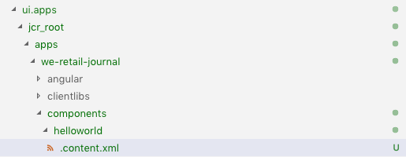

# 使用編輯AEMSPA器開發 — Hello World教程 {#developing-with-the-aem-spa-editor-hello-world-tutorial}

>[!WARNING]
>
> 本教程是 **棄用**。 建議遵循以下任一操作： [編輯器和AEMAngularSPA入門](https://experienceleague.adobe.com/docs/experience-manager-learn/getting-started-with-aem-headless/spa-editor/angular/overview.html) 或 [開始編輯AEM和SPA反應](https://experienceleague.adobe.com/docs/experience-manager-learn/getting-started-with-aem-headless/spa-editor/react/overview.html)

AEM編SPA輯器支援單頁應用程式或的上下文編SPA輯。 本教程是與SPAEditor JS SDK一起使AEM用SPA的開發介紹。 本教程將通過添加自定義Hello World元件來擴展We.Retail Journal應用。 用戶可以使用React或Angular框架完成本教程。

>[!NOTE]
>
> 單頁應用程式(SPA)編輯器功能AEM需要6.4 Service Pack 2或更高版本。
>
> 編輯SPA器是需要基於框架的SPA客戶端呈現(例如，反應或Angular)的項目的推薦解決方案。

## 先決條件閱讀 {#prereq}

本教程旨在突出介紹將元件映射到元件SPA以啟AEM用上下文編輯所需的步驟。 開始本教程的用戶應熟悉Adobe Experience Manager開發的基本概念AEM，以及使用Angular框架的反應進行開發。 本教程涵蓋後端和前端開發任務。

在開始本教程之前，建議先檢查以下資源：

* [編輯SPA器功能視頻](spa-editor-framework-feature-video-use.md)  — 編輯器和We.Retail Journal應SPA用的視頻概述。
* [React.js教程](https://reactjs.org/tutorial/tutorial.html)  — 使用反應框架進行開發的介紹。
* [Angular教程](https://angular.io/tutorial)  — 介紹利用Angular

## 本機開發環境 {#local-dev}

本教程旨在：

[Adobe Experience Manager6.5](https://helpx.adobe.com/tw/experience-manager/6-5/release-notes.html) 或 [Adobe Experience Manager6.4](https://helpx.adobe.com/experience-manager/6-4/sites/deploying/using/technical-requirements.html) + [Service Pack 5](https://helpx.adobe.com/tw/experience-manager/6-4/release-notes/sp-release-notes.html)

在本教程中，應安裝以下技術和工具：

1. [爪哇11](https://downloads.experiencecloud.adobe.com/content/software-distribution/en/general.html)
2. [Apache Maven - 3.3.1+](https://maven.apache.org/)
3. [Node.js - 8.11.1+](https://nodejs.org/en/) npm 5.6.0+（npm隨node.js一起安裝）

通過開啟新終端並運行以下程式，再次檢查上述工具的安裝：

```shell
$ java -version
java version "11 +"

$ mvn -version
Apache Maven 3.3.9

$ node --version
v8.11.1

$ npm --version
6.1.0
```

## 概覽 {#overview}

基本概念是將元件映SPA射到組AEM件。 組AEM件，運行伺服器端，以JSON形式導出內容。 JSON內容由瀏覽器中運SPA行的客戶端使用。 將建立元件和元SPA件之間AEM的1:1映射。


流行框架 [響應JS](https://reactjs.org/) 和 [Angular](https://angular.io/) 都支援出廠。 用戶可以在Angular或React中完成本教程，無論他們最喜歡哪個框架。

## 項目設定 {#project-setup}

SPA發展一AEM腳，發展一腳 其目標是讓發SPA展獨立進行，（大多）不可知AEM。

* 在SPA前端開發中，項AEM目可以獨立於項目運行。
* 前端構建工具和技術，如Webpack、NPM、 [!DNL Grunt] 和 [!DNL Gulp]繼續使用。
* 要為生成AEM，將SPA編譯項目並自動包括在AEM項目中。
* 用於AEM部署到的標準SPA包AEM。


*發SPA展一腳AEM是開發，另一腳是開發 — 讓SPA發展獨立進行，（大多）不AEM可知。*

本教程的目標是使用新元件擴展We.Retail Journal App。 首先下載We.Retail Journal應用的原始碼，然後部署到本地AEM。

1. **下載** 最新 [GitHub的We.Retail日誌代碼](https://github.com/adobe/aem-sample-we-retail-journal)。

   或從命令行克隆儲存庫：

   ```shell
   $ git clone git@github.com:adobe/aem-sample-we-retail-journal.git
   ```

   >[!NOTE]
   >
   >本教程將針對 **主** 分支 **1.2.1 — 快照** 版本。

1. 以下結構應可見：

   

   項目包含以下主模組：

   * `all`:將整個項目嵌入並安裝到單個軟體包中。
   * `bundles`:包含兩個OSGi捆綁包：公域和核心 [!DNL Sling Models] 和其他Java代碼。
   * `ui.apps`:包含項目的/apps部分，即JS和CSS客戶端、元件、運行模式特定配置。
   * `ui.content`:包含結構內容和配置(`/content`。 `/conf`)
   * `react-app`:We.Retail Journal React應用程式。 這既是Maven模組，也是Webpack項目。
   * `angular-app`:We.Retail JournalAngular應用程式。 這都是 [!DNL Maven] 模組和webpack項目。

1. 開啟新的終端窗口並運行以下命令，以生成整個應用程式並將其部署到運行AEM的本地實例 [http://localhost:4502](http://localhost:4502)。

   ```shell
   $ cd <src>/aem-sample-we-retail-journal
   $ mvn -PautoInstallSinglePackage clean install
   ```

   >[!NOTE]
   >
   > 在此項目中，要生成和打包整個項目的Maven配置檔案 `autoInstallSinglePackage`

1. 導航到:

   * [http://localhost:4502/editor.html/content/we-retail-journal/react/en/home.html](http://localhost:4502/editor.html/content/we-retail-journal/react/en/home.html)
   * [http://localhost:4502/editor.html/content/we-retail-journal/angular/en/home.html](http://localhost:4502/editor.html/content/we-retail-journal/angular/en/home.html)

   We.Retail Journal應用應顯示在AEM Sites編輯器中。

1. 在 [!UICONTROL 編輯] 模式，選擇要編輯的元件並更新內容。

   

1. 選擇 [!UICONTROL 頁面屬性] 表徵圖以開啟 [!UICONTROL 頁面屬性]。 選擇 [!UICONTROL 編輯模板] 開啟頁面的模板。

   

1. 在最新版本的編SPA輯器中， [可編輯模板](https://helpx.adobe.com/tw/experience-manager/6-5/sites/developing/using/page-templates-editable.html) 可以與傳統站點實施一樣使用。 稍後將使用我們的自定義元件重新查看此內容。

   >[!NOTE]
   >
   > 僅AEM6.5和AEM6.4 + **Service Pack 5** 支援可編輯模板。

## 開發概述 {#development-overview}


開SPA發迭代獨立進AEM行。 當準備SPA部署到以AEM下高級別步驟時（如上所示）。

1. 調AEM用項目生成，進而觸發項目生SPA成。 《We.Retail Journal》使用 [**前面的插件**](https://github.com/eirslett/frontend-maven-plugin)。
1. 項SPA目 [**aem-clientlib生成器**](https://www.npmjs.com/package/aem-clientlib-generator) 將編譯SPA為AEMClient Library的文AEM件嵌入
1. 項AEM目生成包AEM，包括已編SPA譯的包以及任何其AEM他支援代碼。

## 建立組AEM件 {#aem-component}

**角色：開發AEM人員**

首先AEM建立一個元件。 組AEM件負責呈現React元件讀取的JSON屬性。 該組AEM件還負責為元件的任何可編輯屬性提供對話框。

使用 [!DNL Eclipse]或 [!DNL IDE]，導入We.Retail Journal Maven項目。

1. 更新反應器 **pom.xml** 刪除 [!DNL Apache Rat] 插件。 此插件檢查每個檔案以確保存在許可證頭。 為了我們的目的，我們不需要關注此功能。

   在 **aem-sample-we-retail-journal/pom.xml** 刪除 **apache速率插件**:

   ```xml
   <!-- Remove apache-rat-plugin -->
   <plugin>
           <groupId>org.apache.rat</groupId>
           <artifactId>apache-rat-plugin</artifactId>
           <configuration>
               <excludes combine.children="append">
                   <exclude>*</exclude>
                       ...
               </excludes>
           </configuration>
           <executions>
                   <execution>
                       <phase>verify</phase>
                       <goals>
                           <goal>check</goal>
                       </goals>
               </execution>
           </executions>
       </plugin>
   ```

1. 在 **我們零售 — 期刊內容** (`<src>/aem-sample-we-retail-journal/ui.apps`)模組在下面建立新節點 `ui.apps/jcr_root/apps/we-retail-journal/components` 命名 **螺旋世界** 類型 **cq：元件**。
1. 將以下屬性添加到 **螺旋世界** 元件，以XML表示(`/helloworld/.content.xml`):

   ```xml
   <?xml version="1.0" encoding="UTF-8"?>
   <jcr:root xmlns:cq="http://www.day.com/jcr/cq/1.0" xmlns:jcr="http://www.jcp.org/jcr/1.0"
       jcr:description="Hello World Component for We.Retail Journal"
       jcr:primaryType="cq:Component"
       jcr:title="Hello World"
       componentGroup="We.Retail Journal" />
   ```

   

   >[!NOTE]
   >
   > 為了說明「可編輯模板」(Editable Templates)功能，我們特意設定 `componentGroup="Custom Components"`。 在現實項目中，最好將元件組數量減到最小，因此更好的組是「 」[!DNL We.Retail Journal]」以匹配其他內容元件。
   >
   > 僅AEM6.5和AEM6.4 + **Service Pack 5** 支援可編輯模板。

1. 接下來，將建立一個對話框，以便為 **《你好世界》** 元件。 在下面 `/apps/we-retail-journal/components/helloworld` 添加節點名稱 **cq：對話框** 共 **nt：非結構化**。
1. 的 **cq：對話框** 將顯示將文本保留到名為 **[!DNL message]**。 在新建立的 **cq：對話框** 添加以下節點和屬性（以下XML表示）(`helloworld/_cq_dialog/.content.xml`):

   ```xml
   <?xml version="1.0" encoding="UTF-8"?>
   <jcr:root xmlns:sling="http://sling.apache.org/jcr/sling/1.0" xmlns:cq="http://www.day.com/jcr/cq/1.0" xmlns:jcr="http://www.jcp.org/jcr/1.0" xmlns:nt="http://www.jcp.org/jcr/nt/1.0"
       jcr:primaryType="nt:unstructured"
       jcr:title="We.Retail Journal - Hello World"
       sling:resourceType="cq/gui/components/authoring/dialog">
       <content
           jcr:primaryType="nt:unstructured"
           sling:resourceType="granite/ui/components/coral/foundation/container">
           <items jcr:primaryType="nt:unstructured">
               <tabs
                   jcr:primaryType="nt:unstructured"
                   sling:resourceType="granite/ui/components/coral/foundation/tabs"
                   maximized="{Boolean}true">
                   <items jcr:primaryType="nt:unstructured">
                       <properties
                           jcr:primaryType="nt:unstructured"
                           jcr:title="Properties"
                           sling:resourceType="granite/ui/components/coral/foundation/container"
                           margin="{Boolean}true">
                           <items jcr:primaryType="nt:unstructured">
                               <columns
                                   jcr:primaryType="nt:unstructured"
                                   sling:resourceType="granite/ui/components/coral/foundation/fixedcolumns"
                                   margin="{Boolean}true">
                                   <items jcr:primaryType="nt:unstructured">
                                       <column
                                           jcr:primaryType="nt:unstructured"
                                           sling:resourceType="granite/ui/components/coral/foundation/container">
                                           <items jcr:primaryType="nt:unstructured">
                                               <message
                                                   jcr:primaryType="nt:unstructured"
                                                   sling:resourceType="granite/ui/components/coral/foundation/form/textfield"
                                                   fieldLabel="Message"
                                                   name="./message"
                                                   required="{Boolean}true"/>
                                           </items>
                                       </column>
                                   </items>
                               </columns>
                           </items>
                       </properties>
                   </items>
               </tabs>
           </items>
       </content>
   </jcr:root>
   ```

   

   上述XML節點定義將建立一個包含單個文本欄位的對話框，該文本欄位允許用戶輸入「消息」。 注意屬性 `name="./message"` 在 `<message />` 的下界。 這是將儲存在中的JCR中的屬性的名AEM稱。

1. 接下來將建立空策略對話框(`cq:design_dialog`)。 需要「策略」對話框才能在模板編輯器中查看元件。 對於此簡單使用情形，它將是一個空對話框。

   在下面 `/apps/we-retail-journal/components/helloworld` 添加節點名稱 `cq:design_dialog` 共 `nt:unstructured`。

   配置以下XML表示(`helloworld/_cq_design_dialog/.content.xml`)

   ```xml
   <?xml version="1.0" encoding="UTF-8"?>
   <jcr:root xmlns:sling="http://sling.apache.org/jcr/sling/1.0" xmlns:cq="http://www.day.com/jcr/cq/1.0" xmlns:jcr="http://www.jcp.org/jcr/1.0" xmlns:nt="http://www.jcp.org/jcr/nt/1.0"
   jcr:primaryType="nt:unstructured" />
   ```

1. 將代碼庫從命AEM令行部署到：

   ```shell
   $ cd <src>/aem-sample-we-retail-journal/content
   $ mvn -PautoInstallPackage clean install
   ```

   在 [CRXDE Lite](http://localhost:4502/crx/de/index.jsp#/apps/we-retail-journal/global/components/helloworld) 通過檢查下的資料夾來驗證是否已部署元件 `/apps/we-retail-journal/components:`

   

## 建立吊具模型 {#create-sling-model}

**角色：開發AEM人員**

下一個 [!DNL Sling Model] 建立為備份 [!DNL Hello World] 元件。 在傳統的WCM使用案例中， [!DNL Sling Model] 實現任何業務邏輯，伺服器端呈現指令碼(HTL)將調用 [!DNL Sling Model]。 這使呈現指令碼相對簡單。

[!DNL Sling Models] 在用例中還SPA用於實現伺服器端業務邏輯。 區別在於 [!DNL SPA] 用例， [!DNL Sling Models] 將其方法顯示為序列化JSON。

>[!NOTE]
>
>作為最佳做法，開發人員應尋求使用 [核AEM心元件](https://experienceleague.adobe.com/docs/experience-manager-core-components/using/introduction.html?lang=zh-Hant) 可能的時候。 核心元件提供 [!DNL Sling Models] JSON輸出「SPA就緒」，使開發人員能夠更專注於前端演示。

1. 在所選的編輯器中，開啟 **我們零售期刊共用** 項目(P) `<src>/aem-sample-we-retail-journal/bundles/commons`)。
1. 在包中 `com.adobe.cq.sample.spa.commons.impl.models`:
   * 建立名為 `HelloWorld`。
   * 添加實現介面 `com.adobe.cq.export.json.ComponentExporter.`

   

   的 `ComponentExporter` 必須實現介面，以便 [!DNL Sling Model] 與Content AEM Services相容。

   ```java
    package com.adobe.cq.sample.spa.commons.impl.models;
   
    import com.adobe.cq.export.json.ComponentExporter;
   
    public class HelloWorld implements ComponentExporter {
   
        @Override
        public String getExportedType() {
            return null;
        }
    }
   ```

1. 添加名為 `RESOURCE_TYPE` 以識別 [!DNL HelloWorld] 元件的資源類型：

   ```java
    ...
    public class HelloWorld implements ComponentExporter {
   
        static final String RESOURCE_TYPE = "we-retail-journal/components/helloworld";
   
        ...
    }
   ```

1. 添加OSGi注釋 `@Model` 和 `@Exporter`。 的 `@Model` 注釋將類註冊為 [!DNL Sling Model]。 的 `@Exporter` 批注將使用 [!DNL Jackson Exporter] 框。

   ```java
   import org.apache.sling.api.SlingHttpServletRequest;
   import org.apache.sling.models.annotations.Exporter;
   import org.apache.sling.models.annotations.Model;
   import com.adobe.cq.export.json.ExporterConstants;
   ...
   
   @Model(
           adaptables = SlingHttpServletRequest.class,
           adapters = {ComponentExporter.class},
           resourceType = HelloWorld.RESOURCE_TYPE
   )
   @Exporter(
           name = ExporterConstants.SLING_MODEL_EXPORTER_NAME, 
           extensions = ExporterConstants.SLING_MODEL_EXTENSION
   )
   public class HelloWorld implements ComponentExporter {
   
   ...
   ```

1. 實現該方法 `getDisplayMessage()` 返回JCR屬性 `message`。 使用 [!DNL Sling Model] 注釋 `@ValueMapValue` 使檢索屬性變得容易 `message` 儲存在元件下。 的 `@Optional` 注釋非常重要，因為當元件首次添加到頁面時，  `message`  將不填充。

   作為業務邏輯的一部分，字串， &quot;**你好**「 」，將優先於該消息。

   ```java
   import org.apache.sling.models.annotations.injectorspecific.ValueMapValue;
   import org.apache.sling.models.annotations.Optional;
   
   ...
   
   public class HelloWorld implements ComponentExporter {
   
      static final String RESOURCE_TYPE = "we-retail-journal/components/helloworld";
   
      private static final String PREPEND_MSG = "Hello";
   
       @ValueMapValue @Optional
       private String message;
   
       public String getDisplayMessage() {
           if(message != null && message.length() > 0) {
               return PREPEND_MSG + " "  + message;
           }
           return null;
       }
   
   ...
   ```

   >[!NOTE]
   >
   > 方法名稱 `getDisplayMessage` 很重要。 當 [!DNL Sling Model] 序列化 [!DNL Jackson Exporter] 它將作為JSON屬性公開： `displayMessage`。 的 [!DNL Jackson Exporter] 將序列化並公開 `getter` 不採用參數的方法（除非明確標籤為忽略）。 稍後在React /Angular應用中，我們將讀取此屬性值並將其作為應用程式的一部分進行顯示。

   方法 `getExportedType` 也很重要。 元件的值 `resourceType` 將用於將JSON資料「映射」到前端元件(Angular/反應)。 我們將在下一節中探討此問題。

1. 實現該方法 `getExportedType()` 返回的 `HelloWorld` 元件。

   ```java
    @Override
       public String getExportedType() {
           return RESOURCE_TYPE;
       }
   ```

   的完整代碼 [**HelloWorld.java** 的上界。](https://github.com/Adobe-Marketing-Cloud/aem-guides/blob/master/spa-helloworld-guide/src/bundles/commons/HelloWorld.java)

1. 將代碼部署AEM到Apache Maven:

   ```shell
   $ cd <src>/sample-we-retail-spa-content/bundles/commons
   $ mvn -PautoInstallPackage clean install
   ```

   驗證部署和註冊 [!DNL Sling Model] 通過導航 [[!UICONTROL 狀態] > [!UICONTROL 吊具模型]](http://localhost:4502/system/console/status-slingmodels) 在OSGi控制台中。

   你應該看到 `HelloWorld` 吊具模型已綁定到 `we-retail-journal/components/helloworld` Sling資源類型，且它已註冊為 [!DNL Sling Model Exporter Servlet]:

   ```shell
   com.adobe.cq.sample.spa.commons.impl.models.HelloWorld - we-retail-journal/components/helloworld
   com.adobe.cq.sample.spa.commons.impl.models.HelloWorld exports 'we-retail-journal/components/helloworld' with selector 'model' and extension '[Ljava.lang.String;@6480f3e5' with exporter 'jackson'
   ```

## 建立反應元件 {#react-component}

**角色：前端開發人員**

接下來，將建立React元件。 開啟 **反應應用** 模組( `<src>/aem-sample-we-retail-journal/react-app`)。

>[!NOTE]
>
> 如果您只對本節感興趣，可以跳過本節 [Angular開發](#angular-component)。

1. 在 `react-app` 資料夾導航到其src資料夾。 展開元件資料夾以查看現有的React元件檔案。

   

1. 在名為的元件資料夾下添加新檔案 `HelloWorld.js`。
1. 開啟 `HelloWorld.js`. 添加導入語句以導入React元件庫。 添加第二個導入語句以導入 `MapTo` 由Adobe提供的幫助者。 的 `MapTo` helper提供React元件到元件AEMJSON的映射。

   ```js
   import React, {Component} from 'react';
   import {MapTo} from '@adobe/cq-react-editable-components';
   ```

1. 在導入下面建立一個名為 `HelloWorld` 擴展了 `Component` 。 添加所需 `render()` 方法 `HelloWorld` 類。

   ```js
   import React, {Component} from 'react';
   import {MapTo} from '@adobe/cq-react-editable-components';
   
   class HelloWorld extends Component {
   
       render() {
   
       }
   }
   ```

1. 的 `MapTo` 幫助程式自動包括名為 `cqModel` 作為反應元件的道具的一部分。 的 `cqModel` 包括由 [!DNL Sling Model]。

   記住 [!DNL Sling Model] 先前建立的包含方法 `getDisplayMessage()`。 `getDisplayMessage()` 轉換為名為的JSON鍵 `displayMessage` 的子菜單。

   實施 `render()` 方法 `h1` 包含的值 `displayMessage`。 [JSX](https://reactjs.org/docs/introducing-jsx.html)的語法擴展，用於返回元件的最終標籤。

   ```js
   ...
   
   class HelloWorld extends Component {
       render() {
   
           if(this.props.displayMessage) {
               return (
                   <div className="cmp-helloworld">
                       <h1 className="cmp-helloworld_message">{this.props.displayMessage}</h1>
                   </div>
               );
           }
           return null;
       }
   }
   ```

1. 實現編輯配置方法。 此方法通過 `MapTo` 幫助程式，並AEM為編輯器提供資訊，以便在元件為空時顯示佔位符。 當元件添加到但尚未創SPA作時，會發生此情況。 在 `HelloWorld` 類：

   ```js
   ...
   
   class HelloWorld extends Component {
       ...
   }
   
   const HelloWorldEditConfig = {
   
       emptyLabel: 'Hello World',
   
       isEmpty: function(props) {
           return !props || !props.displayMessage || props.displayMessage.trim().length < 1;
       }
   };
   
   ...
   ```

1. 在檔案末尾， `MapTo` 幫助者，傳遞 `HelloWorld` 類和 `HelloWorldEditConfig`。 這將根據元件的資源類AEM型將反AEM應元件映射到元件： `we-retail-journal/components/helloworld`。

   ```js
   MapTo('we-retail-journal/components/helloworld')(HelloWorld, HelloWorldEditConfig);
   ```

   已完成的代碼 [**HelloWorld.js** 的上界。](https://github.com/Adobe-Marketing-Cloud/aem-guides/blob/master/spa-helloworld-guide/src/react-app/components/HelloWorld.js)

1. 開啟檔案 `ImportComponents.js`。 可在 `<src>/aem-sample-we-retail-journal/react-app/src/ImportComponents.js`。

   添加一行以要求 `HelloWorld.js` 與編譯的JavaScript包中的其他元件：

   ```js
   ...
     require('./components/Text');
     require('./components/Image');
     require('./components/HelloWorld');
   ...
   ```

1. 在  `components`  資料夾建立名為 `HelloWorld.css` 作為 `HelloWorld.js.` 使用以下內容填充檔案，為 `HelloWorld` 元件：

   ```css
   /* HelloWorld.css to style HelloWorld component */
   
   .cmp-helloworld_message {
       text-align: center;
       color: #ff505e;
       text-transform: unset;
       letter-spacing: unset;
   }
   ```

1. 重新開啟 `HelloWorld.js` 並更新下面的導入語句 `HelloWorld.css`:

   ```js
   import React, {Component} from 'react';
   import {MapTo} from '@adobe/cq-react-editable-components';
   
   require('./HelloWorld.css');
   
   ...
   ```

1. 將代碼部署AEM到Apache Maven:

   ```shell
   $ cd <src>/sample-we-retail-spa-content
   $ mvn -PautoInstallSinglePackage clean install
   ```

1. 在 [CRXDE-Lite](http://localhost:4502/crx/de/index.jsp#/apps/we-retail-journal/react/clientlibs/we-retail-journal-react/js/app.js) 開啟 `/apps/we-retail-journal/react/clientlibs/we-retail-journal-react/js/app.js`。 在app.js中快速搜索HelloWorld，以驗證已編譯的應用中是否包含React元件。

   >[!NOTE]
   >
   > **app.js** 是捆綁的React應用。 代碼不再是人類可讀的。 的 `npm run build` 命令已觸發優化生成，該生成輸出可由現代瀏覽器解釋的已編譯JavaScript。


## 建立Angular元件 {#angular-component}

**角色：前端開發人員**

>[!NOTE]
>
> 如果您只對「React development（響應開發）」感興趣，可以跳過此部分。

接下來，將建立Angular元件。 開啟 **angular應用** 模組(`<src>/aem-sample-we-retail-journal/angular-app`)。

1. 在 `angular-app` 資料夾導航到其 `src` 的子菜單。 展開元件資料夾以查看現有Angular元件檔案。

   

1. 在名為的元件資料夾下添加新資料夾 `helloworld`。 在 `helloworld` 資料夾添加新檔案 `helloworld.component.css, helloworld.component.html, helloworld.component.ts`。

   ```plain
   /angular-app
       /src
           /app
               /components
   +                /helloworld
   +                    helloworld.component.css
   +                    helloworld.component.html
   +                    helloworld.component.ts
   ```

1. 開啟 `helloworld.component.ts`. 添加導入語句以導入Angular `Component` 和 `Input` 類。 建立新元件，指向 `styleUrls` 和 `templateUrl` 至 `helloworld.component.css` 和 `helloworld.component.html`。 最後導出類 `HelloWorldComponent` 與 `displayMessage`。

   ```js
   //helloworld.component.ts
   
   import { Component, Input } from '@angular/core';
   
   @Component({
     selector: 'app-helloworld',
     host: { 'class': 'cmp-helloworld' },
     styleUrls:['./helloworld.component.css'],
     templateUrl: './helloworld.component.html',
   })
   
   export class HelloWorldComponent {
     @Input() displayMessage: string;
   }
   ```

   >[!NOTE]
   >
   > 如果你還記得 [!DNL Sling Model] 之前建立的方法 **getDisplayMessage()**。 此方法的序列化JSON將 **顯示消息**&#x200B;我們正在Angular應用上閱讀。

1. 開啟 `helloworld.component.html` 包含 `h1` 將打印的標籤 `displayMessage` 屬性：

   ```html
   <h1 *ngIf="displayMessage" class="cmp-helloworld_message">
       {{displayMessage}}
   </h1>
   ```

1. 更新 `helloworld.component.css` 包含元件的一些基本樣式。

   ```css
   :host-context {
       display: block;
   };
   
   .cmp-helloworld {
       display:block;
   }
   .cmp-helloworld_message {
       text-align: center;
       color: #ff505e;
       text-transform: unset;
       letter-spacing: unset;
   }
   ```

1. 更新 `helloworld.component.spec.ts` test床：

   ```js
   import { async, ComponentFixture, TestBed } from '@angular/core/testing';
   
   import { HelloWorldComponent } from './helloworld.component';
   
       describe('HelloWorld', () => {
       let component: HelloWorldComponent;
       let fixture: ComponentFixture<HelloWorldComponent>;
   
       beforeEach(async(() => {
           TestBed.configureTestingModule({
           declarations: [ HelloWorldComponent ]
           })
           .compileComponents();
       }));
   
       beforeEach(() => {
           fixture = TestBed.createComponent(HelloWorldComponent);
           component = fixture.componentInstance;
           fixture.detectChanges();
       });
   
       it('should create', () => {
           expect(component).toBeTruthy();
       });
   });
   ```

1. 下次更新 `src/components/mapping.ts` 包含 `HelloWorldComponent`。 添加 `HelloWorldEditConfig` 將在配置元件之前AEM在編輯器中標籤佔位符。 最後添加一行，將組AEM件映射到Angular元件 `MapTo` 幫助程式。

   ```js
   // src/components/mapping.ts
   
   import { HelloWorldComponent } from "./helloworld/helloworld.component";
   
   ...
   
   const HelloWorldEditConfig = {
   
       emptyLabel: 'Hello World',
   
       isEmpty: function(props) {
           return !props || !props.displayMessage || props.displayMessage.trim().length < 1;
       }
   };
   
   ...
   
   MapTo('we-retail-journal/components/helloworld')(HelloWorldComponent, HelloWorldEditConfig);
   ```

   的完整代碼 [**映射.ts** 的上界。](https://github.com/Adobe-Marketing-Cloud/aem-guides/blob/master/spa-helloworld-guide/src/angular-app/mapping.ts)

1. 更新 `src/app.module.ts` 更新 **NgModule**。 添加 **`HelloWorldComponent`** 作為 **聲明** 屬於 **應用模組**。 另加 `HelloWorldComponent` 作為 **entryComponent** 以便在處理JSON模型時編譯並動態地包括在應用中。

   ```js
   import { HelloWorldComponent } from './components/helloworld/helloworld.component';
   
   ...
   
   @NgModule({
     imports: [BrowserModule.withServerTransition({ appId: 'we-retail-sample-angular' }),
       SpaAngularEditableComponentsModule,
     AngularWeatherWidgetModule.forRoot({
       key: "37375c33ca925949d7ba331e52da661a",
       name: WeatherApiName.OPEN_WEATHER_MAP,
       baseUrl: 'http://api.openweathermap.org/data/2.5'
     }),
       AppRoutingModule,
       BrowserTransferStateModule],
     providers: [ModelManagerService,
       { provide: APP_BASE_HREF, useValue: '/' }],
     declarations: [AppComponent,
       TextComponent,
       ImageComponent,
       WeatherComponent,
       NavigationComponent,
       MenuComponent,
       MainContentComponent,
       HelloWorldComponent],
     entryComponents: [TextComponent,
       ImageComponent,
       WeatherComponent,
       NavigationComponent,
       MainContentComponent,
       HelloWorldComponent],
     bootstrap: [AppComponent]
    })
   ```

   已完成的代碼 [**app.module.ts** 的上界。](https://github.com/Adobe-Marketing-Cloud/aem-guides/blob/master/spa-helloworld-guide/src/angular-app/app.module.ts)

1. 將代碼部署到AEMMaven:

   ```shell
   $ cd <src>/sample-we-retail-spa-content
   $ mvn -PautoInstallSinglePackage clean install
   ```

1. 在 [CRXDE-Lite](http://localhost:4502/crx/de/index.jsp#/apps/we-retail-journal/angular/clientlibs/we-retail-journal-angular/js/main.js) 開啟 `/apps/we-retail-journal/angular/clientlibs/we-retail-journal-angular/js/main.js`。 執行快速搜索 **《你好世界》** 在 `main.js` 驗證是否包含Angular元件。

   >[!NOTE]
   >
   > **main.js** 是捆綁的Angular應用。 代碼不再是人類可讀的。 npm run build命令已觸發優化生成，該生成輸出可由現代瀏覽器解釋的已編譯JavaScript。

## 更新模板 {#template-update}

1. 導航到React和/或Angular版本的可編輯模板：

   * (Angular) [http://localhost:4502/editor.html/conf/we-retail-journal/angular/settings/wcm/templates/we-retail-angular-weather-template/structure.html](http://localhost:4502/editor.html/conf/we-retail-journal/angular/settings/wcm/templates/we-retail-angular-weather-template/structure.html)
   * （反應） [http://localhost:4502/editor.html/conf/we-retail-journal/react/settings/wcm/templates/we-retail-react-weather-template/structure.html](http://localhost:4502/editor.html/conf/we-retail-journal/react/settings/wcm/templates/we-retail-react-weather-template/structure.html)

1. 選擇主 [!UICONTROL 佈局容器] 的 [!UICONTROL 策略] 表徵圖以開啟其策略：

   

   下 **[!UICONTROL 屬性]** > **[!UICONTROL 允許的元件]**，執行搜索 **[!DNL Custom Components]**。 您應該看到 **[!DNL Hello World]** ，選擇它。 按一下右上角的複選框以保存更改。

   

1. 保存後，您應看到 **[!DNL HelloWorld]** 元件作為允許的元件 [!UICONTROL 佈局容器]。

   

   >[!NOTE]
   >
   > 只有AEM6.5和AEM6.4.5支援編輯器的「可編輯模SPA板」功能。 如果使AEM用6.4，則需要通過CRXDE Lite手動配置允許的元件的策略： `/conf/we-retail-journal/react/settings/wcm/policies/wcm/foundation/components/responsivegrid/default` 或 `/conf/we-retail-journal/angular/settings/wcm/policies/wcm/foundation/components/responsivegrid/default`

   CRXDE Lite顯示更新的策略配置 [!UICONTROL 允許的元件] 的 [!UICONTROL 佈局容器]:

   

## 把它們放在一起 {#putting-together}

1. 導航到「Angular」或「反應」頁：

   * [http://localhost:4502/editor.html/content/we-retail-journal/react/en/home.html](http://localhost:4502/editor.html/content/we-retail-journal/react/en/home.html)
   * [http://localhost:4502/editor.html/content/we-retail-journal/angular/en/home.html](http://localhost:4502/editor.html/content/we-retail-journal/angular/en/home.html)

1. 查找 **[!DNL Hello World]** 元件和拖放 **[!DNL Hello World]** 上的元件。

   

   應出現佔位符。

   

1. 選擇元件並在對話框中添加消息，即「World」或「Your Name」。 儲存變更。

   

   請注意，字串「Hello」始終優先於消息。 這是 `HelloWorld.java` [!DNL Sling Model]。

## 後續步驟 {#next-steps}

[HelloWorld元件的已完成解決方案](assets/spa-editor-helloworld-tutorial-use/aem-sample-we-retail-journal-HelloWorldSolution.zip)

* 完整原始碼 [[!DNL We.Retail Journal] 在GitHub上](https://github.com/adobe/aem-sample-we-retail-journal)
* 查看有關開發React與的更深入的教程 [[!DNL Getting Started with the AEM SPA Editor - WKND Tutorial]](https://helpx.adobe.com/experience-manager/kt/sites/using/getting-started-spa-wknd-tutorial-develop.html)

## 疑難排解 {#troubleshooting}

### 無法在Eclipse中生成項目 {#unable-to-build-project-in-eclipse}

**錯誤：** 導入時出錯 [!DNL We.Retail Journal] 項目到Eclipse中，以執行無法識別的目標：

`Execution npm install, Execution npm run build, Execution default-analyze-classes*`


**解決**:按一下「完成」以稍後解決這些問題。 這不應妨礙教程的完成。

**錯誤**:反應模組， `react-app`，在Maven生成期間未成功生成。

**解決方案：** 嘗試刪除 `node_modules` 資料夾 **反應應用**。 重新運行Apache Maven命令 `mvn  clean install -PautoInstallSinglePackage` 從項目的根部。

### 未滿足的依賴項AEM {#unsatisfied-dependencies-in-aem}


如果不AEM滿足依賴關係，則 **[!UICONTROL 包管AEM理器]** 或 **[!UICONTROL Web控AEM制台]** (Felix Console)，這表示「編SPA輯器功能」不可用。

### 元件不顯示

**錯誤**:即使在成功部署並驗證已編譯的React/Angular應用版本是否已更新之後 `helloworld` 將元件拖到頁面時，不顯示元件。 我可以在UI中看到組AEM件。

**解決**:清除瀏覽器的歷史/快取和/或開啟新瀏覽器或使用隱藏模式。 如果這不起作用，則使本地實例上的客戶端庫快取無效AEM。 嘗AEM試快取大型客戶端庫以提高效率。 有時需要手動使快取無效來修復快取過期代碼的問題。

導航到： [http://localhost:4502/libs/granite/ui/content/dumplibs.rebuild.html](http://localhost:4502/libs/granite/ui/content/dumplibs.rebuild.html) 然後按一下Invalidate Cache。 返回到「React/Angular」頁並刷新該頁。


