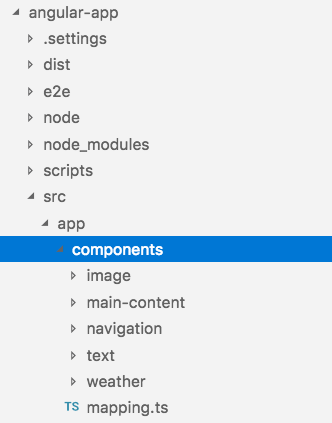

# 使用AEM SPA編輯器進行開發-Hello World教學課程 {#developing-with-the-aem-spa-editor-hello-world-tutorial}

>[!WARNING]
>
> 本教學課程已 **過時**。 建議您執行下列任一操作： [AEM SPA編輯器快速入門](https://docs.adobe.com/content/help/en/experience-manager-learn/spa-angular-tutorial/overview.html) , [AEM SPA編輯器快速入門](https://docs.adobe.com/content/help/en/experience-manager-learn/spa-react-tutorial/overview.html)

AEM的SPA編輯器支援「單頁應用程式」或SPA的內容內容編輯。 本教學課程是SPA開發的簡介，可與AEM的SPA編輯器JS SDK搭配使用。 本教學課程將新增自訂Hello World元件，以擴充We.Retail Journal應用程式。 使用者可使用React或Angular架構完成教學課程。

>[!NOTE]
>
> 「單頁應用程式(SPA)編輯器」功能需要AEM 6.4 Service Pack 2或更新版本。
>
> SPA編輯器是建議的解決方案，適用於需要以SPA架構為基礎的用戶端轉換（例如React或Angular）的專案。

## 先決條件閱讀 {#prereq}

本教學課程旨在反白顯示將SPA元件對應至AEM元件以啟用內容內容編輯所需的步驟。 開始本教學課程的使用者應熟悉Adobe Experience Manager、AEM的開發基本概念，以及使用React of Angular架構進行開發。 本教學課程涵蓋後端和前端開發工作。

建議在開始本教學課程之前先檢閱下列資源：

* [SPA編輯器功能視訊](spa-editor-framework-feature-video-use.md) - SPA編輯器和We.Retail Journal應用程式的視訊概觀。
* [React.js教學課程](https://reactjs.org/tutorial/tutorial.html) -使用React架構進行開發的簡介。
* [Angular Tutorial](https://angular.io/tutorial) —— 使用Angular進行開發的簡介

## 當地開發環境 {#local-dev}

本教學課程的適用對象：

[Adobe Experience Manager 6.5](https://helpx.adobe.com/tw/experience-manager/6-5/release-notes.html) 或 [Adobe Experience Manager 6.4](https://helpx.adobe.com/experience-manager/6-4/sites/deploying/using/technical-requirements.html) + [Service Pack 5](https://helpx.adobe.com/tw/experience-manager/6-4/release-notes/sp-release-notes.html)

在本教學課程中，應安裝下列技術與工具：

1. [Java 11](https://downloads.experiencecloud.adobe.com/content/software-distribution/en/general.html)
2. [Apache Maven - 3.3.1+](https://maven.apache.org/)
3. [Node.js - 8.11.1+](https://nodejs.org/en/) 和npm 5.6.0+（npm隨node.js一起安裝）

開啟新的終端並執行下列動作，以再次檢查上述工具的安裝：

```shell
$ java -version
java version "11 +"

$ mvn -version
Apache Maven 3.3.9

$ node --version
v8.11.1

$ npm --version
6.1.0
```

## 概覽 {#overview}

基本概念是將SPA元件對應至AEM元件。 AEM元件執行伺服器端，以JSON格式匯出內容。 SPA會使用JSON內容，在瀏覽器中執行用戶端。 會建立SPA元件與AEM元件之間的1:1對應。


常用 [的架構](https://reactjs.org/) React JS和 [Angular](https://angular.io/) 現成可用。 使用者可以在Angular或React中完成本教學課程，不論他們最熟悉的架構為何。

## 專案設定 {#project-setup}

SPA開發只有AEM開發的一步，而另一步則是。 其目標是讓SPA開發可獨立進行，而且（大部分）不受AEM限制。

* SPA專案可在前端開發期間獨立於AEM專案運作。
* 前端建置工具和技術（例如Webpack、NPM） [!DNL Grunt] 仍 [!DNL Gulp]在繼續使用。
* 若要針對AEM建置，會編譯SPA專案並自動加入AEM專案。
* 用來將SPA部署至AEM的標準AEM套件。


*SPA開發只有AEM開發的一步，而另一步則無法開發——讓SPA開發可獨立進行，而且（大部分）不受AEM限制。*

本教學課程的目標是使用新元件來擴充We.Retail Journal應用程式。 首先，下載We.Retail Journal應用程式的原始碼，並部署至本機AEM。

1. **從GitHub** 下載最 [新的We.Retail Journal Code](https://github.com/adobe/aem-sample-we-retail-journal)。

   或者，從命令行克隆儲存庫：

   ```shell
   $ git clone git@github.com:adobe/aem-sample-we-retail-journal.git
   ```

   >[!NOTE]
   >
   >本教程將針對具有 **1.2** .1- **** SNAPSHOT版本的主分支使用。

2. 下列結構應可見：

   

   項目包含下列主要模組：

   * `all`:將整個專案內嵌並安裝在單一套件中。
   * `bundles`:包含兩個OSGi組合：commons和core，其中包含 [!DNL Sling Models] 和其他Java程式碼。
   * `ui.apps`:包含專案的/apps部分，即JS和CSSclientlibs、元件、執行模式特定設定。
   * `ui.content`:包含結構內容和配置(`/content`, `/conf`)
   * `react-app`:We.Retail Journal React Application. 這既是Maven模組，也是Webpack項目。
   * `angular-app`:We.Retail Journal Angular應用程式。 這既是模 [!DNL Maven] 塊項目，也是Webpack項目。

3. 開啟新的終端機視窗並執行下列命令，以建立整個應用程式並部署至http://localhost:4502上執行的本機AEM [例項](http://localhost:4502)。

   ```shell
   $ cd <src>/aem-sample-we-retail-journal
   $ mvn -PautoInstallSinglePackage clean install
   ```

   >[!NOTE]
   >
   > 在本專案中，要建立並封裝整個專案的Maven描述檔是 `autoInstallSinglePackage`

   >[!CAUTION]
   >
   > 如果您在建置期間收到錯誤，請確 [定您的Maven settings.xml檔案包含Adobe的Maven工件儲存庫](https://helpx.adobe.com/experience-manager/kb/SetUpTheAdobeMavenRepository.html)。

4. 導航到:

   * [http://localhost:4502/editor.html/content/we-retail-journal/react/en/home.html](http://localhost:4502/editor.html/content/we-retail-journal/react/en/home.html)
   * [http://localhost:4502/editor.html/content/we-retail-journal/angular/en/home.html](http://localhost:4502/editor.html/content/we-retail-journal/angular/en/home.html)

   We.Retail Journal應用程式應顯示在AEM Sites編輯器中。

5. 在「 [!UICONTROL 編輯] 」模式中，選擇要編輯的元件並對內容進行更新。

   

6. 選取「頁 [!UICONTROL 面屬性] 」圖示以開啟「 [!UICONTROL 頁面屬性」]。 選 [!UICONTROL 擇編輯模板] ，以開啟頁面的模板。

   

7. 在最新版的SPA編輯器中， [可編輯的範本](https://helpx.adobe.com/experience-manager/6-5/sites/developing/using/page-templates-editable.html) ，可與傳統網站實作的使用方式相同。 我們稍後會使用自訂元件來重新檢視此項目。

   >[!NOTE]
   >
   > 只有AEM 6.5和AEM 6.4 + **Service Pack 5支援可編輯的範本** 。

## 開發概觀 {#development-overview}


SPA開發改版不受AEM影響。 當SPA準備好部署至AEM時，會進行下列高階步驟（如上圖所示）。

1. 會叫用AEM專案組建版本，而這會觸發SPA專案的建立。 We.Retail Journal使用 [**frontend-maven-plugin**](https://github.com/eirslett/frontend-maven-plugin)。
2. SPA專案的 [**aem-clientlib-generator**](https://www.npmjs.com/package/aem-clientlib-generator) ，會將編譯的SPA內嵌為AEM專案中的AEM用戶端程式庫。
3. AEM專案會產生AEM套件，包括編譯的SPA，以及任何其他支援AEM程式碼。

## 建立AEM元件 {#aem-component}

**角色：AEM開發人員**

首先會建立AEM元件。 AEM元件負責轉譯由React元件讀取的JSON屬性。 AEM元件也負責針對元件的任何可編輯屬性提供對話方塊。

使用 [!DNL Eclipse]或其他 [!DNL IDE]方式匯入We.Retail Journal Maven專案。

1. 更新反應 **器pom.xml** ，以移除 [!DNL Apache Rat] 外掛程式。 此外掛程式會檢查每個檔案，以確保有授權標題。 為了我們的目的，我們不需要擔心此功能。

   在 **aem-sample-we-retail-journal/pom.xml****中**，移除apache-rate-plugin:

   ```xml
   <!-- Remove apache-rat-plugin -->
   <plugin>
           <groupId>org.apache.rat</groupId>
           <artifactId>apache-rat-plugin</artifactId>
           <configuration>
               <excludes combine.children="append">
                   <exclude>*</exclude>
                       ...
               </excludes>
           </configuration>
           <executions>
                   <execution>
                       <phase>verify</phase>
                       <goals>
                           <goal>check</goal>
                       </goals>
               </execution>
           </executions>
       </plugin>
   ```

2. 在 **we-retail-journal-content** (`<src>/aem-sample-we-retail-journal/ui.apps`)模組中，在名為 `ui.apps/jcr_root/apps/we-retail-journal/components` helloworld **type** f **** c:ComponentContent(cq:ComponentContent)的下方建立一個新節點。
3. 將下列屬性新增至 **helloworld** 元件，以XML(`/helloworld/.content.xml`)表示：

   ```xml
   <?xml version="1.0" encoding="UTF-8"?>
   <jcr:root xmlns:cq="http://www.day.com/jcr/cq/1.0" xmlns:jcr="http://www.jcp.org/jcr/1.0"
       jcr:description="Hello World Component for We.Retail Journal"
       jcr:primaryType="cq:Component"
       jcr:title="Hello World"
       componentGroup="We.Retail Journal" />
   ```

   

   >[!NOTE]
   >
   > 為了說明「可編輯的範本」功能，我們特意設定 `componentGroup="Custom Components"`。 在實際專案中，最好將元件群組數目減到最少，因此較好的群組是「[!DNL We.Retail Journal]」來比對其他內容元件。
   >
   > 只有AEM 6.5和AEM 6.4 + **Service Pack 5支援可編輯的範本** 。

4. 接下來將建立一個對話框，允許為 **Hello World元件配置自定義** 消息。 在下 `/apps/we-retail-journal/components/helloworld` 面添加節點名 **稱cq:dialog** of **nt:antrustructed**。
5. cq: **dialog** 將顯示單一文字欄位，將文字保留至名為的屬性 **[!DNL message]**。 在新建立的 **cq:dialog下方** ，新增下列節點和屬性，如下(`helloworld/_cq_dialog/.content.xml`)所示：

   ```xml
   <?xml version="1.0" encoding="UTF-8"?>
   <jcr:root xmlns:sling="http://sling.apache.org/jcr/sling/1.0" xmlns:cq="http://www.day.com/jcr/cq/1.0" xmlns:jcr="http://www.jcp.org/jcr/1.0" xmlns:nt="http://www.jcp.org/jcr/nt/1.0"
       jcr:primaryType="nt:unstructured"
       jcr:title="We.Retail Journal - Hello World"
       sling:resourceType="cq/gui/components/authoring/dialog">
       <content
           jcr:primaryType="nt:unstructured"
           sling:resourceType="granite/ui/components/coral/foundation/container">
           <items jcr:primaryType="nt:unstructured">
               <tabs
                   jcr:primaryType="nt:unstructured"
                   sling:resourceType="granite/ui/components/coral/foundation/tabs"
                   maximized="{Boolean}true">
                   <items jcr:primaryType="nt:unstructured">
                       <properties
                           jcr:primaryType="nt:unstructured"
                           jcr:title="Properties"
                           sling:resourceType="granite/ui/components/coral/foundation/container"
                           margin="{Boolean}true">
                           <items jcr:primaryType="nt:unstructured">
                               <columns
                                   jcr:primaryType="nt:unstructured"
                                   sling:resourceType="granite/ui/components/coral/foundation/fixedcolumns"
                                   margin="{Boolean}true">
                                   <items jcr:primaryType="nt:unstructured">
                                       <column
                                           jcr:primaryType="nt:unstructured"
                                           sling:resourceType="granite/ui/components/coral/foundation/container">
                                           <items jcr:primaryType="nt:unstructured">
                                               <message
                                                   jcr:primaryType="nt:unstructured"
                                                   sling:resourceType="granite/ui/components/coral/foundation/form/textfield"
                                                   fieldLabel="Message"
                                                   name="./message"
                                                   required="{Boolean}true"/>
                                           </items>
                                       </column>
                                   </items>
                               </columns>
                           </items>
                       </properties>
                   </items>
               </tabs>
           </items>
       </content>
   </jcr:root>
   ```

   

   上述XML節點定義將建立一個對話框，其中包含一個文本欄位，允許用戶輸入「消息」。 請注意節 `name="./message"` 點內的 `<message />` 屬性。 這是將儲存在AEM中JCR的屬性的名稱。

6. 接下來將建立一個空策略對話框(`cq:design_dialog`)。 需要「策略」對話框才能在模板編輯器中查看元件。 對於這個簡單的使用案例，它將是空白對話方塊。

   在 `/apps/we-retail-journal/components/helloworld` 添加節點名 `cq:design_dialog` 下 `nt:unstructured`。

   配置以下的XML表示(`helloworld/_cq_design_dialog/.content.xml`)

   ```xml
   <?xml version="1.0" encoding="UTF-8"?>
   <jcr:root xmlns:sling="http://sling.apache.org/jcr/sling/1.0" xmlns:cq="http://www.day.com/jcr/cq/1.0" xmlns:jcr="http://www.jcp.org/jcr/1.0" xmlns:nt="http://www.jcp.org/jcr/nt/1.0"
   jcr:primaryType="nt:unstructured" />
   ```

7. 從命令列將程式碼庫部署至AEM:

   ```shell
   $ cd <src>/aem-sample-we-retail-journal/content
   $ mvn -PautoInstallPackage clean install
   ```

   在 [CRXDE Lite](http://localhost:4502/crx/de/index.jsp#/apps/we-retail-journal/global/components/helloworld) 中，檢查下方的資料夾，以驗證元件是否已部署 `/apps/we-retail-journal/components:`

   

## Create Sling Model {#create-sling-model}

**角色：AEM開發人員**

接下來 [!DNL Sling Model] 將建立一個以備 [!DNL Hello World] 份元件。 在傳統的WCM使用案例 [!DNL Sling Model] 中，實作任何商業邏輯，伺服器端轉譯指令碼(HTL)將呼叫 [!DNL Sling Model]。 如此可讓轉譯指令碼相對簡單。

[!DNL Sling Models] 也用於SPA使用案例，以實作伺服器端商業邏輯。 區別在於，在使 [!DNL SPA] 用案例中， [!DNL Sling Models] 會將其方法顯示為序號JSON。

>[!NOTE]
>
>最佳實務是，開發人員應盡可能 [使用AEM Core Components](https://docs.adobe.com/content/help/zh-Hant/experience-manager-core-components/using/introduction.html) 。 除了其他功能外，核心元件 [!DNL Sling Models] 還提供「SPA就緒」的JSON輸出，讓開發人員可更專注於前端簡報。

1. 在您選擇的編輯器中，開啟 **we-retail-journal-commons專案** ( `<src>/aem-sample-we-retail-journal/bundles/commons`)。
2. 在包中 `com.adobe.cq.sample.spa.commons.impl.models`:
   * 建立名為的新類 `HelloWorld`。
   * 新增實作介面 `com.adobe.cq.export.json.ComponentExporter.`

   

   必 `ComponentExporter` 須實作介面，才能 [!DNL Sling Model] 與AEM Content Services相容。

   ```java
    package com.adobe.cq.sample.spa.commons.impl.models;
   
    import com.adobe.cq.export.json.ComponentExporter;
   
    public class HelloWorld implements ComponentExporter {
   
        @Override
        public String getExportedType() {
            return null;
        }
    }
   ```

3. 添加名為的靜 `RESOURCE_TYPE` 態變數以 [!DNL HelloWorld] 標識元件的資源類型：

   ```java
    ...
    public class HelloWorld implements ComponentExporter {
   
        static final String RESOURCE_TYPE = "we-retail-journal/components/helloworld";
   
        ...
    }
   ```

4. 為和添加OSGi `@Model` 批注 `@Exporter`。 注 `@Model` 釋將類註冊為 [!DNL Sling Model]。 注 `@Exporter` 釋會使用架構將方法顯示為序列化的JSON [!DNL Jackson Exporter] 。

   ```java
   import org.apache.sling.api.SlingHttpServletRequest;
   import org.apache.sling.models.annotations.Exporter;
   import org.apache.sling.models.annotations.Model;
   import com.adobe.cq.export.json.ExporterConstants;
   ...
   
   @Model(
           adaptables = SlingHttpServletRequest.class,
           adapters = {ComponentExporter.class},
           resourceType = HelloWorld.RESOURCE_TYPE
   )
   @Exporter(
           name = ExporterConstants.SLING_MODEL_EXPORTER_NAME, 
           extensions = ExporterConstants.SLING_MODEL_EXTENSION
   )
   public class HelloWorld implements ComponentExporter {
   
   ...
   ```

5. 實作方法 `getDisplayMessage()` 以傳回JCR屬性 `message`。 使用的 [!DNL Sling Model] 注釋 `@ValueMapValue` 可方便檢索儲存在元件下 `message` 面的屬性。 注 `@Optional` 釋很重要，因為首次將元件添加到頁面時， `message` 不會填入。

   作為商業邏輯的一部分，字串&quot;**Hello**&quot;會優先於訊息。

   ```java
   import org.apache.sling.models.annotations.injectorspecific.ValueMapValue;
   import org.apache.sling.models.annotations.Optional;
   
   ...
   
   public class HelloWorld implements ComponentExporter {
   
      static final String RESOURCE_TYPE = "we-retail-journal/components/helloworld";
   
      private static final String PREPEND_MSG = "Hello";
   
       @ValueMapValue @Optional
       private String message;
   
       public String getDisplayMessage() {
           if(message != null && message.length() > 0) {
               return PREPEND_MSG + " "  + message;
           }
           return null;
       }
   
   ...
   ```

   >[!NOTE]
   >
   > 方法名稱 `getDisplayMessage` 很重要。 當序 [!DNL Sling Model] 列化時，會 [!DNL Jackson Exporter] 以JSON屬性的形式顯示： `displayMessage`. 將序 [!DNL Jackson Exporter] 列化並公開所有未採 `getter` 用參數的方法（除非明確標籤為忽略）。 稍後在React / Angular應用程式中，我們會讀取此屬性值，並將它顯示為應用程式的一部分。

   方法也 `getExportedType` 很重要。 元件的值 `resourceType` 將用來「映射」JSON資料至前端元件(Angular / React)。 我們將在下一節中探討此問題。

6. 實施方法 `getExportedType()` 以返回元件的資源類 `HelloWorld` 型。

   ```java
    @Override
       public String getExportedType() {
           return RESOURCE_TYPE;
       }
   ```

   您可在此處 [**找到HelloWorld.java** 的完整程式碼。](https://github.com/Adobe-Marketing-Cloud/aem-guides/blob/master/spa-helloworld-guide/src/bundles/commons/HelloWorld.java)

7. 使用Apache Maven將程式碼部署至AEM:

   ```shell
   $ cd <src>/sample-we-retail-spa-content/bundles/commons
   $ mvn -PautoInstallPackage clean install
   ```

   導覽至OSGi主控台中的「 [!DNL Sling Model] Status [[!UICONTROL >] Sling Models ](http://localhost:4502/system/console/status-slingmodels) 」，以驗證部署和註冊。

   您應該會看到 `HelloWorld` Sling Model已系結至 `we-retail-journal/components/helloworld` Sling資源類型，且已註冊為 [!DNL Sling Model Exporter Servlet]:

   ```shell
   com.adobe.cq.sample.spa.commons.impl.models.HelloWorld - we-retail-journal/components/helloworld
   com.adobe.cq.sample.spa.commons.impl.models.HelloWorld exports 'we-retail-journal/components/helloworld' with selector 'model' and extension '[Ljava.lang.String;@6480f3e5' with exporter 'jackson'
   ```

## 建立React元件 {#react-component}

**角色：前端開發人員**

接下來，將建立React元件。 使用 **您選擇的編輯器** ，開 `<src>/aem-sample-we-retail-journal/react-app`啟react-app模組()。

>[!NOTE]
>
> 如果您只對 [Angular開發感興趣，請免費略過本節](#angular-component)。

1. 資料夾內 `react-app` 部導航到其src資料夾。 展開元件資料夾以檢視現有的React元件檔案。

   

2. 在名為的元件資料夾下添加新檔案 `HelloWorld.js`。
3. 開啟 `HelloWorld.js`. 新增匯入陳述式以匯入React元件庫。 新增第二個匯入陳述式，以匯入Adobe `MapTo` 提供的協助程式。 Helper `MapTo` 提供React元件與AEM元件JSON的對應。

   ```js
   import React, {Component} from 'react';
   import {MapTo} from '@adobe/cq-react-editable-components';
   ```

4. 在匯入下方建立新類別，名 `HelloWorld` 為擴充React介 `Component` 面。 將所需的 `render()` 方法添加到類 `HelloWorld` 中。

   ```js
   import React, {Component} from 'react';
   import {MapTo} from '@adobe/cq-react-editable-components';
   
   class HelloWorld extends Component {
   
       render() {
   
       }
   }
   ```

5. 幫 `MapTo` 助工具會自動包含名為 `cqModel` React元件props一部分的物件。 包含 `cqModel` 由公開的所有屬性 [!DNL Sling Model]。

   請記住， [!DNL Sling Model] 先前建立的包含方法 `getDisplayMessage()`。 `getDisplayMessage()` 會轉譯為輸出時命名 `displayMessage` 的JSON索引鍵。

   實作方 `render()` 法以輸出包 `h1` 含值的標籤 `displayMessage`。 [JSX](https://reactjs.org/docs/introducing-jsx.html)是JavaScript的語法擴充功能，可用來傳回元件的最終標籤。

   ```js
   ...
   
   class HelloWorld extends Component {
       render() {
   
           if(this.props.displayMessage) {
               return (
                   <div className="cmp-helloworld">
                       <h1 className="cmp-helloworld_message">{this.props.displayMessage}</h1>
                   </div>
               );
           }
           return null;
       }
   }
   ```

6. 實施編輯配置方法。 此方法會透過協助工具傳 `MapTo` 遞，並提供AEM編輯器資訊，以在元件為空白時顯示預留位置。 當元件新增至SPA但尚未編寫時，就會發生此情況。 在類別下方新增下 `HelloWorld` 列：

   ```js
   ...
   
   class HelloWorld extends Component {
       ...
   }
   
   const HelloWorldEditConfig = {
   
       emptyLabel: 'Hello World',
   
       isEmpty: function(props) {
           return !props || !props.displayMessage || props.displayMessage.trim().length < 1;
       }
   };
   
   ...
   ```

7. 在檔案結尾，呼叫協助 `MapTo` 程式，傳送類 `HelloWorld` 別和 `HelloWorldEditConfig`。 這會根據AEM元件的資源類型，將React Component對應至AEM元件： `we-retail-journal/components/helloworld`.

   ```js
   MapTo('we-retail-journal/components/helloworld')(HelloWorld, HelloWorldEditConfig);
   ```

   您可在此找到 [**HelloWorld.js的完成程式碼** 。](https://github.com/Adobe-Marketing-Cloud/aem-guides/blob/master/spa-helloworld-guide/src/react-app/components/HelloWorld.js)

8. 開啟檔案 `ImportComponents.js`。 可在中找到 `<src>/aem-sample-we-retail-journal/react-app/src/ImportComponents.js`。

   添加一行以要求 `HelloWorld.js` 與編譯的JavaScript包中的其他元件一起使用：

   ```js
   ...
     require('./components/Text');
     require('./components/Image');
     require('./components/HelloWorld');
   ...
   ```

9. 在資料 `components` 夾中，建立名為 `HelloWorld.css` 「填入檔案的同級檔案」( `HelloWorld.js.` Populate the file with the following)的新檔案，以建立元件的一些基本樣 `HelloWorld` 式：

   ```css
   /* HelloWorld.css to style HelloWorld component */
   
   .cmp-helloworld_message {
       text-align: center;
       color: #ff505e;
       text-transform: unset;
       letter-spacing: unset;
   }
   ```

10. 請重新開啟 `HelloWorld.js` 並更新匯入陳述式，以要求 `HelloWorld.css`:

   ```js
   import React, {Component} from 'react';
   import {MapTo} from '@adobe/cq-react-editable-components';
   
   require('./HelloWorld.css');
   
   ...
   ```

11. 使用Apache Maven將程式碼部署至AEM:

   ```shell
   $ cd <src>/sample-we-retail-spa-content
   $ mvn -PautoInstallSinglePackage clean install
   ```

12. 在 [CRXDE-Lite中](http://localhost:4502/crx/de/index.jsp#/apps/we-retail-journal/react/clientlibs/we-retail-journal-react/js/app.js) ，開啟 `/apps/we-retail-journal/react/clientlibs/we-retail-journal-react/js/app.js`。 在app.js中快速搜尋HelloWorld，以確認已編譯的應用程式中已包含React元件。

   >[!NOTE]
   >
   > **app.js** 是搭售的React應用程式。 程式碼不再是人類可讀的。 此命 `npm run build` 令已觸發最佳化組建版本，可輸出已編譯的JavaScript，並可由現代瀏覽器解譯。


## 建立角度元件 {#angular-component}

**角色：前端開發人員**

>[!NOTE]
>
> 如果您只對React開發感興趣，請免費略過本節。

接下來，將建立「角度」(Angular)元件。 使用 **您選擇的編輯器** ，開啟角度應用程式模組(`<src>/aem-sample-we-retail-journal/angular-app`)。

1. 檔案夾內 `angular-app` 部導覽至其檔案 `src` 夾。 展開元件資料夾以查看現有的Angular元件檔案。

   

2. 在名為的元件資料夾下添加新資料夾 `helloworld`。 在資料夾 `helloworld` 下方新增名為的新檔案 `helloworld.component.css, helloworld.component.html, helloworld.component.ts`。

   ```plain
   /angular-app
       /src
           /app
               /components
   +                /helloworld
   +                    helloworld.component.css
   +                    helloworld.component.html
   +                    helloworld.component.ts
   ```

3. 開啟 `helloworld.component.ts`. 添加導入語句以導入Angular `Component` 和 `Input` 類。 建立新元件，指 `styleUrls` 向 `templateUrl` 和 `helloworld.component.css` 和 `helloworld.component.html`。 最後，使用 `HelloWorldComponent` 的預期輸入匯出類別 `displayMessage`。

   ```js
   //helloworld.component.ts
   
   import { Component, Input } from '@angular/core';
   
   @Component({
     selector: 'app-helloworld',
     host: { 'class': 'cmp-helloworld' },
     styleUrls:['./helloworld.component.css'],
     templateUrl: './helloworld.component.html',
   })
   
   export class HelloWorldComponent {
     @Input() displayMessage: string;
   }
   ```

   >[!NOTE]
   >
   > 如果您回想 [!DNL Sling Model] 先前建立的內容，則會有 **getDisplayMessage()方法**。 此方法的序號JSON將是 **displayMessage**，我們現在正在Angular應用程式中閱讀它。

4. 開啟 `helloworld.component.html` 以包含 `h1` 將列印屬性的標 `displayMessage` 簽：

   ```html
   <h1 *ngIf="displayMessage" class="cmp-helloworld_message">
       {{displayMessage}}
   </h1>
   ```

5. 更新 `helloworld.component.css` 以包含元件的一些基本樣式。

   ```css
   :host-context {
       display: block;
   };
   
   .cmp-helloworld {
       display:block;
   }
   .cmp-helloworld_message {
       text-align: center;
       color: #ff505e;
       text-transform: unset;
       letter-spacing: unset;
   }
   ```

6. 使用 `helloworld.component.spec.ts` 下列測試台更新：

   ```js
   import { async, ComponentFixture, TestBed } from '@angular/core/testing';
   
   import { HelloWorldComponent } from './helloworld.component';
   
       describe('HelloWorld', () => {
       let component: HelloWorldComponent;
       let fixture: ComponentFixture<HelloWorldComponent>;
   
       beforeEach(async(() => {
           TestBed.configureTestingModule({
           declarations: [ HelloWorldComponent ]
           })
           .compileComponents();
       }));
   
       beforeEach(() => {
           fixture = TestBed.createComponent(HelloWorldComponent);
           component = fixture.componentInstance;
           fixture.detectChanges();
       });
   
       it('should create', () => {
           expect(component).toBeTruthy();
       });
   });
   ```

7. 下次更 `src/components/mapping.ts` 新將包含 `HelloWorldComponent`。 新增 `HelloWorldEditConfig` 會在AEM編輯器中標示預留位置(placeholder)，然後再設定元件。 最後，使用輔助工具新增行，將AEM元件對應至Angular元 `MapTo` 件。

   ```js
   // src/components/mapping.ts
   
   import { HelloWorldComponent } from "./helloworld/helloworld.component";
   
   ...
   
   const HelloWorldEditConfig = {
   
       emptyLabel: 'Hello World',
   
       isEmpty: function(props) {
           return !props || !props.displayMessage || props.displayMessage.trim().length < 1;
       }
   };
   
   ...
   
   MapTo('we-retail-journal/components/helloworld')(HelloWorldComponent, HelloWorldEditConfig);
   ```

   您可在此處 [**找到mapping.ts的** 完整程式碼。](https://github.com/Adobe-Marketing-Cloud/aem-guides/blob/master/spa-helloworld-guide/src/angular-app/mapping.ts)

8. 更新 `src/app.module.ts` 以更新 **NgModule**。 新增 **`HelloWorldComponent`** 為屬於 **AppModule的** 聲明 ****。 此外，也 `HelloWorldComponent` 可新增為 **entryComponent** ，以便在處理JSON模型時，將它編譯並動態包含在應用程式中。

   ```js
   import { HelloWorldComponent } from './components/helloworld/helloworld.component';
   
   ...
   
   @NgModule({
     imports: [BrowserModule.withServerTransition({ appId: 'we-retail-sample-angular' }),
       SpaAngularEditableComponentsModule,
     AngularWeatherWidgetModule.forRoot({
       key: "37375c33ca925949d7ba331e52da661a",
       name: WeatherApiName.OPEN_WEATHER_MAP,
       baseUrl: 'http://api.openweathermap.org/data/2.5'
     }),
       AppRoutingModule,
       BrowserTransferStateModule],
     providers: [ModelManagerService,
       { provide: APP_BASE_HREF, useValue: '/' }],
     declarations: [AppComponent,
       TextComponent,
       ImageComponent,
       WeatherComponent,
       NavigationComponent,
       MenuComponent,
       MainContentComponent,
       HelloWorldComponent],
     entryComponents: [TextComponent,
       ImageComponent,
       WeatherComponent,
       NavigationComponent,
       MainContentComponent,
       HelloWorldComponent],
     bootstrap: [AppComponent]
    })
   ```

   您可在這裡 [**找到app.module.ts的完成程式碼** 。](https://github.com/Adobe-Marketing-Cloud/aem-guides/blob/master/spa-helloworld-guide/src/angular-app/app.module.ts)

9. 使用Maven將程式碼部署至AEM:

   ```shell
   $ cd <src>/sample-we-retail-spa-content
   $ mvn -PautoInstallSinglePackage clean install
   ```

10. 在 [CRXDE-Lite中](http://localhost:4502/crx/de/index.jsp#/apps/we-retail-journal/angular/clientlibs/we-retail-journal-angular/js/main.js) ，開啟 `/apps/we-retail-journal/angular/clientlibs/we-retail-journal-angular/js/main.js`。 在中快速搜索 **HelloWorld** , `main.js` 以驗證Angular元件是否已包含。

   >[!NOTE]
   >
   > **main.js是已打包的Angular應用程式。** 程式碼不再是人類可讀的。 npm run build命令已觸發最佳化組建，可輸出已編譯的JavaScript，可供現代瀏覽器解譯。

## 更新範本 {#template-update}

1. 導覽至React和／或Angular版本的可編輯範本：

   * (Angular) [http://localhost:4502/editor.html/conf/we-retail-journal/angular/settings/wcm/templates/we-retail-angular-weather-template/structure.html](http://localhost:4502/editor.html/conf/we-retail-journal/angular/settings/wcm/templates/we-retail-angular-weather-template/structure.html)
   * (React) [http://localhost:4502/editor.html/conf/we-retail-journal/react/settings/wcm/templates/we-retail-react-weather-template/structure.html](http://localhost:4502/editor.html/conf/we-retail-journal/react/settings/wcm/templates/we-retail-react-weather-template/structure.html)

2. 選取主要的 [!UICONTROL 配置容器] ，並選取  原則圖示以開啟其原則：

   

   在「 **[!UICONTROL 屬性]** >允 **[!UICONTROL 許的元件]**」下，執行搜尋 **[!DNL Custom Components]**。 您應該看到該 **[!DNL Hello World]** 元件，選擇它。 按一下右上角的核取方塊，儲存您所做的變更。

   

3. 儲存後，您應將元件視 **[!DNL HelloWorld]** 為「版面容器」中允許的 [!UICONTROL 元件]。

   

   >[!NOTE]
   >
   > 只有AEM 6.5和AEM 6.4.5支援SPA編輯器的「可編輯範本」功能。 如果使用AEM 6.4，您將需要透過CRXDE Lite手動設定「允許的元件」原則： `/conf/we-retail-journal/react/settings/wcm/policies/wcm/foundation/components/responsivegrid/default` 或 `/conf/we-retail-journal/angular/settings/wcm/policies/wcm/foundation/components/responsivegrid/default`

   CRXDE Lite顯示「配置容器」中「允 [!UICONTROL 許的元件] 」的更 [!UICONTROL 新原則設定]:

   

## 整合在一起 {#putting-together}

1. 導覽至「角度」或「反應」頁面：

   * [http://localhost:4502/editor.html/content/we-retail-journal/react/en/home.html](http://localhost:4502/editor.html/content/we-retail-journal/react/en/home.html)
   * [http://localhost:4502/editor.html/content/we-retail-journal/angular/en/home.html](http://localhost:4502/editor.html/content/we-retail-journal/angular/en/home.html)

2. 尋找元 **[!DNL Hello World]** 件並將元件拖放 **[!DNL Hello World]** 至頁面上。

   

   預留位置應會出現。

   

3. 選取元件並在對話方塊中新增訊息，例如「World」或「Your Name」。 儲存變更。

   

   請注意，字串&quot;Hello&quot;一律會先於訊息。 這是邏輯的結果 `HelloWorld.java`[!DNL Sling Model]。

## 後續步驟 {#next-steps}

[HelloWorld元件的完整解決方案](assets/spa-editor-helloworld-tutorial-use/aem-sample-we-retail-journal-HelloWorldSolution.zip)

* GitHub上的完整原 [[!DNL We.Retail Journal] 始碼](https://github.com/adobe/aem-sample-we-retail-journal)
* 檢視有關開發React with [[!DNL Getting Started with the AEM SPA Editor - WKND Tutorial]的更深入教學課程](https://helpx.adobe.com/experience-manager/kt/sites/using/getting-started-spa-wknd-tutorial-develop.html)

## 疑難排解 {#troubleshooting}

### 無法在Eclipse中建立專案 {#unable-to-build-project-in-eclipse}

**錯誤：** 將專案匯入Eclipse以執行 [!DNL We.Retail Journal] 無法辨識的目標時發生錯誤：

`Execution npm install, Execution npm run build, Execution default-analyze-classes*`


**解析度**:按一下「完成」以稍後解決這些問題。 這不應妨礙教學課程的完成。

**錯誤**:React模組在Maven `react-app`構建過程中無法成功構建。

**解析度：** 嘗試刪除 `node_modules` react-app下 **方的資料夾**。 從項目的根目錄重新 `mvn  clean install -PautoInstallSinglePackage` 運行Apache Maven命令。

### AEM中未滿足的相依性 {#unsatisfied-dependencies-in-aem}


如果AEM相依性不符合，在 **[!UICONTROL AEM Package Manager]** ，或在 **[!UICONTROL AEM Web Console]** (Felix Console)中，這表示SPA編輯器功能不可用。

### 元件不顯示

**錯誤**:即使在成功部署並驗證編譯版React/Angular應用程式是否有更新的元件後，我的元件在拖曳至頁面時 `helloworld` ，仍不會顯示。 我可以在AEM UI中看到元件。

**解析度**:清除瀏覽器的歷史記錄／快取和／或開啟新瀏覽器或使用Incognito模式。 如果無法運作，請使本機AEM例項上的用戶端程式庫快取失效。 AEM會嘗試快取大型clientlibraries，以提高效率。 有時需要手動取消驗證快取，以修正快取過期代碼的問題。

導覽至： [http://localhost:4502/libs/granite/ui/content/dumplibs.rebuild.html並按一下](http://localhost:4502/libs/granite/ui/content/dumplibs.rebuild.html) 「使快取無效」。 返回您的React/Angular頁面並重新整理頁面。


