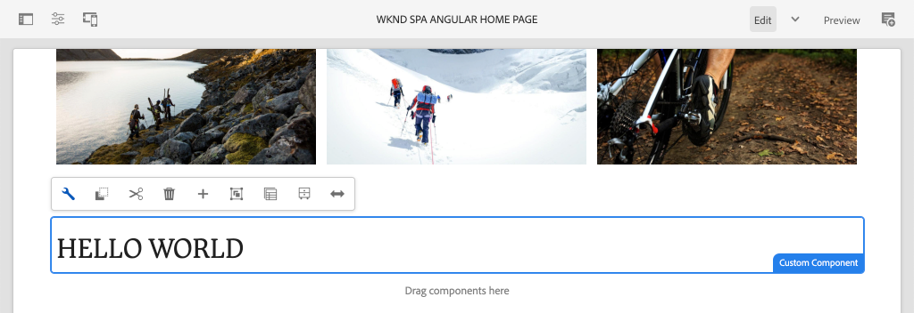
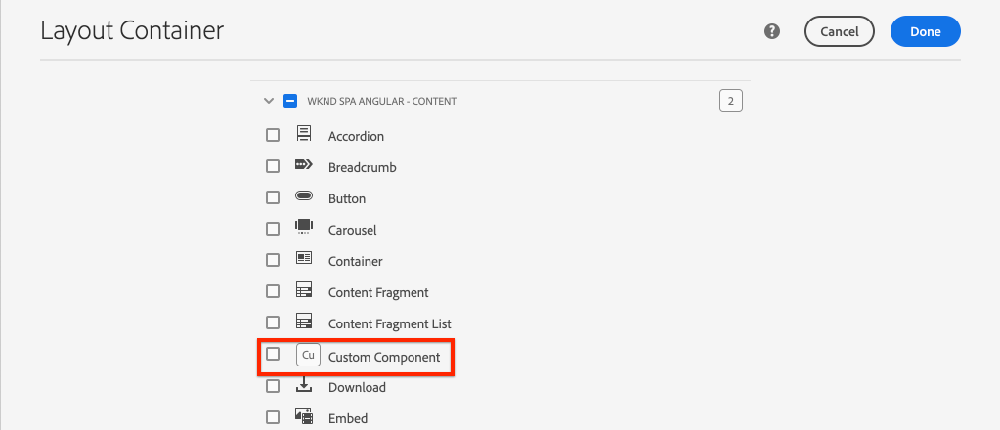
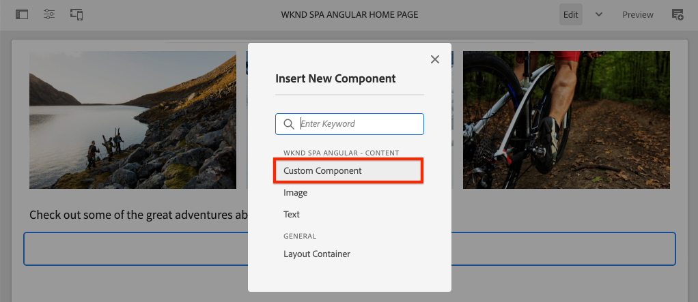

# 建立自訂元件 {#custom-component}

瞭解如何建立要與AEM SPA編輯器搭配使用的自訂元件。 瞭解如何開發作者對話方塊和Sling Models以擴充JSON模型以填入自訂元件。

## 目標

1. 瞭解Sling Models在控制AEM提供的JSON模型API中的角色。
2. 瞭解如何建立新的AEM元件對話方塊。
3. 瞭解如何建立 **與** SPA編輯器架構相容的自訂AEM元件。

## 您將建立的

前幾章的重點是開發SPA元件，並將它們對應至 *現有* AEM Core Components。 本章將著重說明如何建立和擴充 *新* AEM元件，以及如何控制AEM提供的JSON模型。

簡單說 `Custom Component` 明建立新AEM元件所需的步驟。



## 必備條件

檢視建立本機開發環境所需的工 [具和指示](overview.md#local-dev-environment)。

### 取得程式碼

1. 透過Git下載本教學課程的起點：

   ```shell
   $ git clone git@github.com:adobe/aem-guides-wknd-spa.git
   $ cd aem-guides-wknd-spa
   $ git checkout Angular/custom-component-start
   ```

2. 使用Maven將程式碼庫部署至本機AEM例項：

   ```shell
   $ mvn clean install -PautoInstallSinglePackage
   ```

   如果使用 [AEM 6.x](overview.md#compatibility) ，請新增 `classic` 描述檔：

   ```shell
   $ mvn clean install -PautoInstallSinglePackage -Pclassic
   ```

3. 為傳統的 [WKND參考站點安裝完成的軟體包](https://github.com/adobe/aem-guides-wknd/releases/latest)。 WKND參考網 [站提供的影像](https://github.com/adobe/aem-guides-wknd/releases/latest) ，將重新用於WKND SPA。 您可使用 [AEM的Package Manager來安裝套件](http://localhost:4502/crx/packmgr/index.jsp)。

   

您隨時都可以在 [GitHub上檢視完成的程式碼](https://github.com/adobe/aem-guides-wknd-spa/tree/Angular/custom-component-solution) ，或切換至分支，在本機檢出程式碼 `Angular/custom-component-solution`。

## 定義AEM元件

AEM元件定義為節點和屬性。 在項目中，這些節點和屬性在模組中表示為XML `ui.apps` 檔案。 接著，在模組中建立AEM `ui.apps` 元件。

>[!NOTE]
>
> 快速進一步瞭解AEM [元件的基本概念可能很有幫助](https://docs.adobe.com/content/help/en/experience-manager-learn/getting-started-wknd-tutorial-develop/component-basics.html)。

1. 在您選擇的IDE中，開啟該文 `ui.apps` 件夾。
2. 導覽至 `ui.apps/src/main/content/jcr_root/apps/wknd-spa-angular/components` 並建立名為的新資料夾 `custom-component`。
3. 在資料夾下建立名 `.content.xml` 為的新 `custom-component` 檔案。 填入 `custom-component/.content.xml` 下列內容：

   ```xml
   <?xml version="1.0" encoding="UTF-8"?>
   <jcr:root xmlns:sling="http://sling.apache.org/jcr/sling/1.0" xmlns:cq="http://www.day.com/jcr/cq/1.0" xmlns:jcr="http://www.jcp.org/jcr/1.0"
       jcr:primaryType="cq:Component"
       jcr:title="Custom Component"
       componentGroup="WKND SPA Angular - Content"/>
   ```

   

   `jcr:primaryType="cq:Component"` -標識此節點將是AEM元件。

   `jcr:title` 是顯示給「內容作者」的值，並決定 `componentGroup` 製作UI中的元件群組。

4. 在資料夾 `custom-component` 下，建立另一個名為的資料夾 `_cq_dialog`。
5. 在資料 `_cq_dialog` 夾下方建立名為的新檔 `.content.xml` 案，並填入下列檔案：

   ```xml
   <?xml version="1.0" encoding="UTF-8"?>
   <jcr:root xmlns:sling="http://sling.apache.org/jcr/sling/1.0" xmlns:granite="http://www.adobe.com/jcr/granite/1.0" xmlns:cq="http://www.day.com/jcr/cq/1.0" xmlns:jcr="http://www.jcp.org/jcr/1.0" xmlns:nt="http://www.jcp.org/jcr/nt/1.0"
       jcr:primaryType="nt:unstructured"
       jcr:title="Custom Component"
       sling:resourceType="cq/gui/components/authoring/dialog">
       <content
           jcr:primaryType="nt:unstructured"
           sling:resourceType="granite/ui/components/coral/foundation/container">
           <items jcr:primaryType="nt:unstructured">
               <tabs
                   jcr:primaryType="nt:unstructured"
                   sling:resourceType="granite/ui/components/coral/foundation/tabs"
                   maximized="{Boolean}true">
                   <items jcr:primaryType="nt:unstructured">
                       <properties
                           jcr:primaryType="nt:unstructured"
                           jcr:title="Properties"
                           sling:resourceType="granite/ui/components/coral/foundation/container"
                           margin="{Boolean}true">
                           <items jcr:primaryType="nt:unstructured">
                               <columns
                                   jcr:primaryType="nt:unstructured"
                                   sling:resourceType="granite/ui/components/coral/foundation/fixedcolumns"
                                   margin="{Boolean}true">
                                   <items jcr:primaryType="nt:unstructured">
                                       <column
                                           jcr:primaryType="nt:unstructured"
                                           sling:resourceType="granite/ui/components/coral/foundation/container">
                                           <items jcr:primaryType="nt:unstructured">
                                               <message
                                                   jcr:primaryType="nt:unstructured"
                                                   sling:resourceType="granite/ui/components/coral/foundation/form/textfield"
                                                   fieldDescription="The text to display on the component."
                                                   fieldLabel="Message"
                                                   name="./message"/>
                                           </items>
                                       </column>
                                   </items>
                               </columns>
                           </items>
                       </properties>
                   </items>
               </tabs>
           </items>
       </content>
   </jcr:root>
   ```

   

   上述XML檔案會為產生非常簡單的對話方塊 `Custom Component`。 檔案的關鍵部分是內部節 `<message>` 點。 此對話框將包含一個名為 `textfield` 的簡 `Message` 單，並將textifeld的值保留到名為的屬性 `message`。

   Sling Model將會建立在旁邊，以透過JSON模 `message` 型公開屬性值。

   >[!NOTE]
   >
   > 您可以檢視更多對 [話方塊的範例，方法是檢視核心元件定義](https://github.com/adobe/aem-core-wcm-components/tree/master/content/src/content/jcr_root/apps/core/wcm/components)。 您也可以在CRXDE-Lite中檢視其 `select`他表單欄 `textarea`位， `pathfield`如、、, `/libs/granite/ui/components/coral/foundation/form` 下 [方可用](http://localhost:4502/crx/de/index.jsp#/libs/granite/ui/components/coral/foundation/form)。

   使用傳統AEM元件時， [通常需要HTL](https://docs.adobe.com/content/help/zh-Hant/experience-manager-htl/using/overview.html) 指令碼。 由於SPA會轉譯元件，因此不需要HTL指令碼。

## 建立Sling Model

Sling Models是註解導向的Java &quot;POJO&#39;s&quot;(Plain Old Java Objects)，可協助將資料從JCR對應至Java變數。 [Sling Models](https://docs.adobe.com/content/help/en/experience-manager-learn/getting-started-wknd-tutorial-develop/component-basics.html#sling-models) 通常可封裝AEM元件的複雜伺服器端商業邏輯。

在SPA編輯器中，Sling Models會透過使用 [Sling Model Exporter的功能，透過JSON模型公開元件的內容](https://docs.adobe.com/content/help/en/experience-manager-learn/foundation/development/develop-sling-model-exporter.html)。

1. 在您選擇的IDE中開啟模 `core` 塊。 `CustomComponent.java` 並 `CustomComponentImpl.java` 且已建立和複製成章節起始代碼。

   >[!NOTE]
   >
   > 如果使用Visual Studio代碼IDE，則安裝Java擴 [充功能可能有幫助](https://code.visualstudio.com/docs/java/extensions)。

2. 在以下位置開啟Java `CustomComponent.java` 介面 `core/src/main/java/com/adobe/aem/guides/wknd/spa/angular/core/models/CustomComponent.java`:

   

   這是Java介面，將由Sling Model實作。

3. 更新 `CustomComponent.java` 以擴展界 `ComponentExporter` 面：

   ```java
   package com.adobe.aem.guides.wknd.spa.angular.core.models;
   import com.adobe.cq.export.json.ComponentExporter;
   
   public interface CustomComponent extends ComponentExporter {
   
       public String getMessage();
   
   }
   ```

   實作介 `ComponentExporter` 面是JSON模型API自動擷取Sling Model的需求。

   該 `CustomComponent` 介面包括單個getter方法 `getMessage()`。 這是透過JSON模型公開作者對話方塊值的方法。 JSON模型中只會匯出 `()` 含空參數的getter方法。

4. 開啟 `CustomComponentImpl.java` 位置 `core/src/main/java/com/adobe/aem/guides/wknd/spa/angular/core/models/impl/CustomComponentImpl.java`。

   這是介面的實 `CustomComponent` 施。 注 `@Model` 釋將Java類識別為Sling Model。 注 `@Exporter` 釋可讓Java類別透過Sling Model Exporter序列化和匯出。

5. 更新靜態變 `RESOURCE_TYPE` 數，以指向在上一個練習 `wknd-spa-angular/components/custom-component` 中建立的AEM元件。

   ```java
   static final String RESOURCE_TYPE = "wknd-spa-angular/components/custom-component";
   ```

   元件的資源類型是將Sling Model系結至AEM元件，最終將會映射至Angular元件的內容。

6. 將方法 `getExportedType()` 添加到類中 `CustomComponentImpl` 以返回元件資源類型：

   ```java
   @Override
   public String getExportedType() {
       return CustomComponentImpl.RESOURCE_TYPE;
   }
   ```

   實施介面時需要此方 `ComponentExporter` 法，並將顯示允許映射到Angular元件的資源類型。

7. 更新方 `getMessage()` 法以傳回作者對話 `message` 方塊所保留的屬性值。 使用注 `@ValueMap` 釋將JCR值映射 `message` 到Java變數：

   ```java
   import org.apache.commons.lang3.StringUtils;
   ...
   
   @ValueMapValue
   private String message;
   
   @Override
   public String getMessage() {
       return StringUtils.isNotBlank(message) ? message.toUpperCase() : null;
   }
   ```

   新增一些額外的「商業邏輯」，以傳回訊息的值為大寫。 這可讓我們查看作者對話方塊儲存的原始值與Sling Model公開的值之間的差異。

   >[!NOTE]
   >
   > 您可以在此處檢 [視完成的CustomComponentImpl.java](https://github.com/adobe/aem-guides-wknd-spa/blob/Angular/custom-component-solution/core/src/main/java/com/adobe/aem/guides/wknd/spa/angular/core/models/impl/CustomComponentImpl.java)。

## 更新角度元件

「自訂元件」的「角度」程式碼已建立。 接下來，進行一些更新，將Angular元件對應至AEM元件。

1. 在模 `ui.frontend` 塊中開啟檔案 `ui.frontend/src/app/components/custom/custom.component.ts`
2. 觀察 `@Input() message: string;` 線。 轉換後的大寫值應該會對應至此變數。
3. 從AEM `MapTo` SPA編輯器JS SDK匯入物件，並使用它對應至AEM元件：

   ```diff
   + import {MapTo} from '@adobe/cq-angular-editable-components';
   
    ...
    export class CustomComponent implements OnInit {
        ...
    }
   
   + MapTo('wknd-spa-angular/components/custom-component')(CustomComponent, CustomEditConfig);
   ```

4. 開 `cutom.component.html` 啟並觀察值將 `{{message}}` 顯示在標籤旁 `<h2>` 邊。
5. 開啟 `custom.component.css` 並新增下列規則：

   ```css
   :host-context {
       display: block;
   }
   ```

   為了讓AEM Editor預留位置在元件空白時正確顯示， `:host-context` 您 `<div>` 必須設定或另一個 `display: block;`。

6. 使用您的Maven技能，從專案目錄的根目錄將所有更新部署至本機AEM環境：

   ```shell
   $ cd aem-guides-wknd-spa
   $ mvn clean install -PautoInstallSinglePackage
   ```

## 更新範本原則

接著，導覽至AEM以驗證更新並允許 `Custom Component` 將更新新增至SPA。

1. 導覽至http://localhost:4502/system/console/status-slingmodels以驗證新Sling Model的註冊 [情況](http://localhost:4502/system/console/status-slingmodels)。

   ```plain
   com.adobe.aem.guides.wknd.spa.angular.core.models.impl.CustomComponentImpl - wknd-spa-angular/components/custom-component
   
   com.adobe.aem.guides.wknd.spa.angular.core.models.impl.CustomComponentImpl exports 'wknd-spa-angular/components/custom-component' with selector 'model' and extension '[Ljava.lang.String;@6fb4a693' with exporter 'jackson'
   ```

   您應該會看到上述兩行，指出 `CustomComponentImpl` 此元件與元件相 `wknd-spa-angular/components/custom-component` 關聯，且其已透過Sling Model Exporter註冊。

2. 導覽至SPA頁面範本，網址為 [http://localhost:4502/editor.html/conf/wknd-spa-angular/settings/wcm/templates/spa-page-template/structure.html](http://localhost:4502/editor.html/conf/wknd-spa-angular/settings/wcm/templates/spa-page-template/structure.html)。
3. 更新「配置容器」的原則，將新元件新 `Custom Component` 增為允許的元件：

   

   保存對策略的更改，並將其作為 `Custom Component` 允許的元件進行觀察：

   

## 編寫自訂元件

接著，使用 `Custom Component` AEM SPA編輯器來編寫。

1. 導覽至 [http://localhost:4502/editor.html/content/wknd-spa-angular/us/en/home.html](http://localhost:4502/editor.html/content/wknd-spa-angular/us/en/home.html)。
2. 在模 `Edit` 式中，將 `Custom Component` 添加到 `Layout Container`:

   

3. 開啟元件的對話框，並輸入包含某些小寫字母的消息。

   

   這是基於本章前面的XML檔案建立的對話框。

4. 儲存變更。請注意，顯示的訊息已全部加上大寫。

   

5. 導覽至http://localhost:4502/content/wknd-spa-angular/us/en.model.json以檢視JSON模 [型](http://localhost:4502/content/wknd-spa-angular/us/en.model.json)。 搜尋 `wknd-spa-angular/components/custom-component`:

   ```json
   "custom_component_208183317": {
       "message": "HELLO WORLD",
       ":type": "wknd-spa-angular/components/custom-component"
   }
   ```

   請注意，JSON值會根據新增至Sling Model的邏輯，設為所有大寫字母。

## 恭喜！ {#congratulations}

恭喜您，您學習了如何建立自訂AEM元件，以及Sling Models和對話方塊如何與JSON模型搭配運作。

您隨時都可以在 [GitHub上檢視完成的程式碼](https://github.com/adobe/aem-guides-wknd-spa/tree/Angular/custom-component-solution) ，或切換至分支，在本機檢出程式碼 `Angular/custom-component-solution`。

### 後續步驟 {#next-steps}

[Extend a Core Component](extend-component.md) —— 瞭解如何擴充現有的核心元件，以便與AEM SPA Editor搭配使用。 瞭解如何將屬性和內容新增至現有元件是擴充AEM SPA編輯器實作功能的強大技巧。
