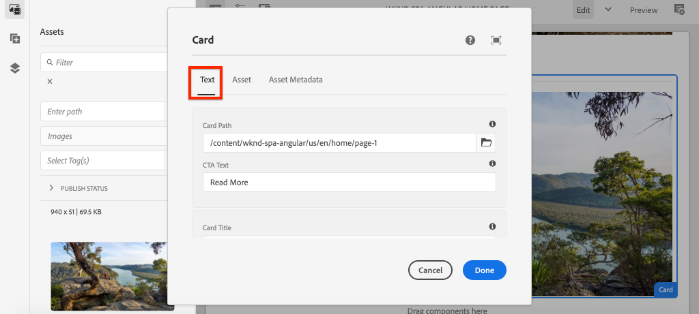
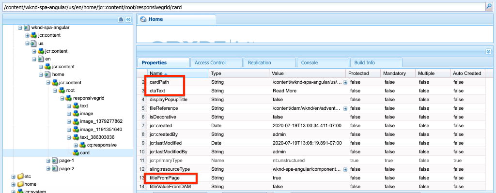

# 擴展核心元件{#extend-component}

瞭解如何擴充現有的核心元件，以便與AEM SPA編輯器搭配使用。 瞭解如何擴充現有元件是自訂和擴充AEM SPA Editor實作功能的強大技巧。

## 目標

1. 使用其他屬性和內容擴充現有的核心元件。
2. 使用`sling:resourceSuperType`瞭解元件繼承的基本內容。
3. 瞭解如何運用[Delegation Pattern](https://github.com/adobe/aem-core-wcm-components/wiki/Delegation-Pattern-for-Sling-Models) for Sling Models來重新使用現有的邏輯和功能。

## 您將建立的

在本章中，將建立一個新的`Card`元件。 `Card`元件將擴展[影像核心元件](https://docs.adobe.com/content/help/zh-Hant/experience-manager-core-components/using/components/image.translate.html)，添加諸如「標題」和「呼叫操作」按鈕等附加內容欄位，以對SPA中的其他內容執行摘要角色。


>[!NOTE]
>
> 在實際實施中，更合適的做法是，只使用[Teaser元件](https://docs.adobe.com/content/help/en/experience-manager-core-components/using/components/teaser.html)然後擴展[Image核心元件](https://docs.adobe.com/content/help/en/experience-manager-core-components/using/components/image.html)，根據項目要求製作`Card`元件。 建議您盡可能直接使用[核心元件](https://docs.adobe.com/content/help/en/experience-manager-core-components/using/introduction.html)。

## 必備條件

檢閱設定[本機開發環境](overview.md#local-dev-environment)所需的工具和指示。

### 取得程式碼

1. 透過Git下載本教學課程的起點：

   ```shell
   $ git clone git@github.com:adobe/aem-guides-wknd-spa.git
   $ cd aem-guides-wknd-spa
   $ git checkout Angular/extend-component-start
   ```

2. 使用Maven將程式碼庫部署至本機AEM例項：

   ```shell
   $ mvn clean install -PautoInstallSinglePackage
   ```

   如果使用[AEM 6.x](overview.md#compatibility)新增`classic`描述檔：

   ```shell
   $ mvn clean install -PautoInstallSinglePackage -Pclassic
   ```

3. 為傳統[WKND參考站點](https://github.com/adobe/aem-guides-wknd/releases/latest)安裝完成的軟體包。 由[WKND參考站點](https://github.com/adobe/aem-guides-wknd/releases/latest)提供的影像將重新用於WKND SPA。 可使用[AEM的Package Manager](http://localhost:4502/crx/packmgr/index.jsp)安裝套件。

   

您隨時都可以在[GitHub](https://github.com/adobe/aem-guides-wknd-spa/tree/Angular/extend-component-solution)上檢視完成的程式碼，或切換至分支`Angular/extend-component-solution`，在本機檢出程式碼。

## 檢查初始卡片實作

章節起始代碼已提供初始卡元件。 檢查卡實施的起點。

1. 在您選擇的IDE中，開啟`ui.apps`模組。
2. 導覽至`ui.apps/src/main/content/jcr_root/apps/wknd-spa-angular/components/card`並檢視`.content.xml`檔案。

   

   ```xml
   <?xml version="1.0" encoding="UTF-8"?>
   <jcr:root xmlns:sling="http://sling.apache.org/jcr/sling/1.0" xmlns:cq="http://www.day.com/jcr/cq/1.0" xmlns:jcr="http://www.jcp.org/jcr/1.0"
       jcr:primaryType="cq:Component"
       jcr:title="Card"
       sling:resourceSuperType="wknd-spa-angular/components/image"
       componentGroup="WKND SPA Angular - Content"/>
   ```

   屬性`sling:resourceSuperType`指向`wknd-spa-angular/components/image`，指出`Card`元件將繼承WKND SPA映像元件的所有功能。

3. 檢查檔案`ui.apps/src/main/content/jcr_root/apps/wknd-spa-angular/components/image/.content.xml` :

   ```xml
   <?xml version="1.0" encoding="UTF-8"?>
   <jcr:root xmlns:sling="http://sling.apache.org/jcr/sling/1.0" xmlns:cq="http://www.day.com/jcr/cq/1.0" xmlns:jcr="http://www.jcp.org/jcr/1.0"
       jcr:primaryType="cq:Component"
       jcr:title="Image"
       sling:resourceSuperType="core/wcm/components/image/v2/image"
       componentGroup="WKND SPA Angular - Content"/>
   ```

   請注意，`sling:resourceSuperType`指向`core/wcm/components/image/v2/image`。 這表示WKND SPA映像元件繼承核心元件映像的所有功能。

   也稱為[Proxy pattern](https://docs.adobe.com/content/help/en/experience-manager-core-components/using/developing/guidelines.html#proxy-component-pattern) Sling資源繼承是功能強大的設計模式，可讓子元件在需要時繼承功能並擴充／覆寫行為。 Sling繼承支援多種層級的繼承，因此最終新`Card`元件繼承核心元件影像的功能。

   許多開發團隊都致力於成為D.R.Y.（別重複自己）。 Sling繼承讓AEM可進行此作業。

4. 在`card`資料夾下，開啟檔案`_cq_dialog/.content.xml`。

   此檔案是`Card`元件的元件對話框定義。 如果使用Sling繼承，則可能使用[Sling Resource Merger](https://docs.adobe.com/content/help/en/experience-manager-65/developing/platform/sling-resource-merger.html)的功能來覆寫或延伸對話方塊的部分。 在此範例中，對話方塊中已新增一個標籤，以從作者擷取其他資料以填入卡片元件。

   `sling:orderBefore`等屬性可讓開發人員選擇插入新標籤或表單欄位的位置。 在這種情況下，`Text`頁籤將插入到`asset`頁籤之前。 要充分利用Sling Resource Merger，請務必瞭解[Image component dialog](https://github.com/adobe/aem-core-wcm-components/blob/master/content/src/content/jcr_root/apps/core/wcm/components/image/v2/image/_cq_dialog/.content.xml)的原始對話節點結構。

5. 在`card`資料夾下，開啟檔案`_cq_editConfig.xml`。 此檔案指定AEM製作UI中的拖放行為。 擴展映像元件時，資源類型必須與元件本身匹配。 查看`<parameters>`節點：

   ```xml
   <parameters
       jcr:primaryType="nt:unstructured"
       sling:resourceType="wknd-spa-angular/components/card"
       imageCrop=""
       imageMap=""
       imageRotate=""/>
   ```

   大多數元件不需要`cq:editConfig`，映像元件的映像和子代是例外。

6. 在到`ui.frontend`模組的IDE交換機中，導航到`ui.frontend/src/app/components/card` :

   

7. 檢查檔案`card.component.ts`。

   元件已研發成使用標準`MapTo`函式對應至AEM `Card`元件。

   ```js
   MapTo('wknd-spa-angular/components/card')(CardComponent, CardEditConfig);
   ```

   查看類中`src`、`alt`和`title`的三個`@Input`參數。 這些是AEM元件的JSON值，將會對應至Angular元件。

8. 開啟檔案`card.component.html`:

   ```html
   <div class="card"  *ngIf="hasContent">
       <app-image class="card__image" [src]="src" [alt]="alt" [title]="title"></app-image>
   </div>
   ```

   在此示例中，我們選擇只通過從`card.component.ts`傳遞`@Input`參數來重新使用現有的Angular Image元件`app-image`。 在教學課程的稍後部分，將會新增並顯示其他屬性。

## 更新範本原則

透過此初始`Card`實作，檢視AEM SPA編輯器中的功能。 要查看初始`Card`元件，需要更新Template策略。

1. 將起始程式碼部署至AEM的本機執行個體(如果您尚未：

   ```shell
   $ cd aem-guides-wknd-spa
   $ mvn clean install -PautoInstallSinglePackage
   ```

2. 導覽至位於[http://localhost:4502/editor.html/conf/wknd-spa-angular/settings/wcm/templates/spa-page-template/structure.html](http://localhost:4502/editor.html/conf/wknd-spa-angular/settings/wcm/templates/spa-page-template/structure.html)的SPA頁面範本。
3. 更新Layout Container的原則，將新`Card`元件新增為允許的元件：

   

   保存對策略的更改，並將`Card`元件作為允許的元件進行觀察：

   

## 作者初始卡片元件

接著，使用AEM SPA編輯器編寫`Card`元件。

1. 導覽至[http://localhost:4502/editor.html/content/wknd-spa-angular/us/en/home.html](http://localhost:4502/editor.html/content/wknd-spa-angular/us/en/home.html)。
2. 在`Edit`模式中，將`Card`元件新增至`Layout Container`:

   

3. 將影像從資產搜尋器拖放至`Card`元件：

   

4. 開啟`Card`元件對話方塊，並注意新增了&#x200B;**文字**&#x200B;標籤。
5. 在&#x200B;**Text**&#x200B;標籤上輸入以下值：

   

   **卡片路徑** -在SPA首頁下方選擇一個頁面。

   **CTA Text**  - &quot;Read More&quot;

   **卡片標題** -保留空白

   **從連結頁面取得標題** -勾選核取方塊以指出true。

6. 更新&#x200B;**資產中繼資料**&#x200B;標籤，以新增&#x200B;**替代文字**&#x200B;和&#x200B;**標題**&#x200B;的值。

   目前更新對話方塊後，不會再顯示其他變更。 若要將新欄位公開給Angular Component，我們需要更新`Card`元件的Sling Model。

7. 開啟新標籤並導覽至[CRXDE-Lite](http://localhost:4502/crx/de/index.jsp#/content/wknd-spa-angular/us/en/home/jcr%3Acontent/root/responsivegrid/card)。 檢查`/content/wknd-spa-angular/us/en/home/jcr:content/root/responsivegrid`下的內容節點，以查找`Card`元件內容。

   

   請注意，對話方塊會保留屬性`cardPath`、`ctaText`、`titleFromPage`。

## 更新Card Sling Model

若要最終將元件對話方塊中的值公開至Angular元件，我們需要更新填入`Card`元件JSON的Sling Model。 我們還有機會實施兩個商業邏輯：

* 如果`titleFromPage`至&#x200B;**true**，則傳回由`cardPath`指定之頁面的標題，否則傳回`cardTitle`文字欄位的值。
* 傳回由`cardPath`指定之頁面的上次修改日期。

返回您選擇的IDE並開啟`core`模組。

1. 在`core/src/main/java/com/adobe/aem/guides/wknd/spa/angular/core/models/Card.java`開啟檔案`Card.java`。

   請注意，`Card`介面當前擴展`com.adobe.cq.wcm.core.components.models.Image` ，因此繼承了`Image`介面的所有方法。 `Image`介面已擴充`ComponentExporter`介面，可讓Sling Model匯出為JSON，並由SPA編輯器映射。 因此，我們不需要像[自訂元件章節](custom-component.md)中那樣顯式擴展`ComponentExporter`介面。

2. 將下列方法新增至介面：

   ```java
   @ProviderType
   public interface Card extends Image {
   
       /***
       * The URL to populate the CTA button as part of the card.
       * The link should be based on the cardPath property that points to a page.
       * @return String URL
       */
       public String getCtaLinkURL();
   
       /***
       * The text to display on the CTA button of the card.
       * @return String CTA text
       */
       public String getCtaText();
   
   
   
       /***
       * The date to be displayed as part of the card.
       * This is based on the last modified date of the page specified by the cardPath
       * @return
       */
       public Calendar getCardLastModified();
   
   
       /**
       * Return the title of the page specified by cardPath if `titleFromPage` is set to true.
       * Otherwise return the value of `cardTitle`
       * @return
       */
       public String getCardTitle();
   }
   ```

   這些方法將會透過JSON模型API公開，並傳遞至Angular元件。

3. 開啟 `CardImpl.java`. 這是`Card.java`介面的實現。 此實作已部分遭到研究，以加速教學課程。  請注意使用`@Model`和`@Exporter`註解以確保Sling Model可透過Sling Model Exporter以JSON序列化。

   `CardImpl.java` 也使用Sling  [Model的Delegation模式，](https://github.com/adobe/aem-core-wcm-components/wiki/Delegation-Pattern-for-Sling-Models) 以避免從Image核心元件重新編寫所有邏輯。

4. 請遵循下列行：

   ```java
   @Self
   @Via(type = ResourceSuperType.class)
   private Image image;
   ```

   上述注釋將根據`Card`元件的`sling:resourceSuperType`繼承實例化名為`image`的Image對象。

   ```java
   @Override
   public String getSrc() {
       return null != image ? image.getSrc() : null;
   }
   ```

   然後，可以只使用`image`對象來實現由`Image`介面定義的方法，而無需自行編寫邏輯。 此技術用於`getSrc()`、`getAlt()`和`getTitle()`。

5. 接著，實作`initModel()`方法，以根據`cardPath`的值啟動專用變數`cardPage`

   ```java
   @PostConstruct
   public void initModel() {
       if(StringUtils.isNotBlank(cardPath) && pageManager != null) {
           cardPage = pageManager.getPage(this.cardPath);
       }
   }
   ```

   當Sling Model初始化時，將一律會呼叫`@PostConstruct initModel()`，因此，這是初始化模型中其他方法可能使用的物件的好機會。 `pageManager`是透過`@ScriptVariable`註解提供給Sling Models的數個[Java支援的全域物件](https://docs.adobe.com/content/help/en/experience-manager-htl/using/htl/global-objects.html#java-backed-objects)中的其中一個。 [getPage](https://docs.adobe.com/content/help/en/experience-manager-cloud-service/implementing/developing/ref/javadoc/com/day/cq/wcm/api/PageManager.html#getPage-java.lang.String-)方法會進入路徑並傳回AEM [Page](https://docs.adobe.com/content/help/en/experience-manager-cloud-service/implementing/developing/ref/javadoc/com/day/cq/wcm/api/Page.html)物件，若路徑未指向有效頁面，則傳回null。

   這將初始化`cardPage`變數，其他新方法將使用此變數來傳回有關基礎連結頁面的資料。

6. 檢視已映射至已儲存作者對話方塊之JCR屬性的全域變數。 `@ValueMapValue`注釋用於自動執行映射。

   ```java
   @ValueMapValue
   private String cardPath;
   
   @ValueMapValue
   private String ctaText;
   
   @ValueMapValue
   private boolean titleFromPage;
   
   @ValueMapValue
   private String cardTitle;
   ```

   這些變數將用於實作`Card.java`介面的其他方法。

7. 實施`Card.java`介面中定義的其他方法：

   ```java
   @Override
   public String getCtaLinkURL() {
       if(cardPage != null) {
           return cardPage.getPath() + ".html";
       }
       return null;
   }
   
   @Override
   public String getCtaText() {
       return ctaText;
   }
   
   @Override
   public Calendar getCardLastModified() {
      if(cardPage != null) {
          return cardPage.getLastModified();
      }
      return null;
   }
   
   @Override
   public String getCardTitle() {
       if(titleFromPage) {
           return cardPage != null ? cardPage.getTitle() : null;
       }
       return cardTitle;
   }
   ```

   >[!NOTE]
   >
   > 您可以在此處查看[完成的CardImpl.java](https://github.com/adobe/aem-guides-wknd-spa/blob/Angular/extend-component-solution/core/src/main/java/com/adobe/aem/guides/wknd/spa/angular/core/models/impl/CardImpl.java)。

8. 開啟終端窗口，使用`core`目錄中的Maven `autoInstallBundle`配置檔案只部署`core`模組的更新。

   ```shell
   $ cd core/
   $ mvn clean install -PautoInstallBundle
   ```

   如果使用[AEM 6.x](overview.md#compatibility)新增`classic`描述檔。

9. 請在以下網址檢視JSON模型回應：[http://localhost:4502/content/wknd-spa-angular/us/en.model.json](http://localhost:4502/content/wknd-spa-angular/us/en.model.json)並搜尋`wknd-spa-angular/components/card`:

   ```json
   "card": {
       "ctaText": "Read More",
       "cardTitle": "Page 1",
       "title": "Woman chillaxing with river views in Australian bushland",
       "src": "/content/wknd-spa-angular/us/en/home/_jcr_content/root/responsivegrid/card.coreimg.jpeg/1595190732886/adobestock-216674449.jpeg",
       "alt": "Female sitting on a large rock relaxing in afternoon dappled light the Australian bushland with views over the river",
       "cardLastModified": 1591360492414,
       "ctaLinkURL": "/content/wknd-spa-angular/us/en/home/page-1.html",
       ":type": "wknd-spa-angular/components/card"
   }
   ```

   請注意，在`CardImpl` Sling Model中更新方法後，JSON模型會以其他金鑰／值配對進行更新。

## 更新Angular元件

現在JSON模型已填入`ctaLinkURL`、`ctaText`、`cardTitle`和`cardLastModified`的新屬性，我們可以更新Angular元件以顯示這些屬性。

1. 返回IDE並開啟`ui.frontend`模組。 或者，從新的終端視窗啟動webpack dev server，即時查看變更：

   ```shell
   $ cd ui.frontend
   $ npm install
   $ npm start
   ```

2. 在`ui.frontend/src/app/components/card/card.component.ts`開啟`card.component.ts`。 添加其他`@Input`注釋以捕獲新模型：

   ```diff
   export class CardComponent implements OnInit {
   
        @Input() src: string;
        @Input() alt: string;
        @Input() title: string;
   +    @Input() cardTitle: string;
   +    @Input() cardLastModified: number;
   +    @Input() ctaLinkURL: string;
   +    @Input() ctaText: string;
   ```

3. 新增方法，以檢查「動作呼叫」是否已就緒，並根據`cardLastModified`輸入傳回日期／時間字串：

   ```js
   export class CardComponent implements OnInit {
       ...
       get hasCTA(): boolean {
           return this.ctaLinkURL && this.ctaLinkURL.trim().length > 0 && this.ctaText && this.ctaText.trim().length > 0;
       }
   
       get lastModifiedDate(): string {
           const lastModifiedDate = this.cardLastModified ? new Date(this.cardLastModified) : null;
   
           if (lastModifiedDate) {
           return lastModifiedDate.toLocaleDateString();
           }
           return null;
       }
       ...
   }
   ```

4. 開啟`card.component.html`並新增下列標籤以顯示標題、動作呼叫和上次修改日期：

   ```html
   <div class="card"  *ngIf="hasContent">
       <app-image class="card__image" [src]="src" [alt]="alt" [title]="title"></app-image>
       <div class="card__content">
           <h2 class="card__title">
               {{cardTitle}}
               <span class="card__lastmod" *ngIf="lastModifiedDate">{{lastModifiedDate}}</span>
           </h2>
           <div class="card__action-container" *ngIf="hasCTA">
               <a [routerLink]="ctaLinkURL" class="card__action-link" [title]="ctaText">
                   {{ctaText}}
               </a>
           </div>
       </div>
   </div>
   ```

   已在`card.component.scss`新增Sass規則，以設定標題的樣式、動作要求和上次修改日期。

   >[!NOTE]
   >
   > 您可以在此處查看已完成的[Angular卡元件代碼](https://github.com/adobe/aem-guides-wknd-spa/tree/Angular/extend-component-solution/ui.frontend/src/app/components/card)。

5. 使用Maven，從專案的根部部署AEM的完整變更：

   ```shell
   $ cd aem-guides-wknd-spa
   $ mvn clean install -PautoInstallSinglePackage
   ```

6. 導覽至[http://localhost:4502/editor.html/content/wknd-spa-angular/us/en/home.html](http://localhost:4502/editor.html/content/wknd-spa-angular/us/en/home.html)以檢視更新的元件：

   

7. 您應該可以重新編寫現有內容，以建立類似下列的頁面：

   

## 恭喜！{#congratulations}

恭喜您，您已學習如何使用和Sling Models和對話方塊搭配JSON模型來擴充AEM元件。

您隨時都可以在[GitHub](https://github.com/adobe/aem-guides-wknd-spa/tree/Angular/extend-component-solution)上檢視完成的程式碼，或切換至分支`Angular/extend-component-solution`，在本機檢出程式碼。
