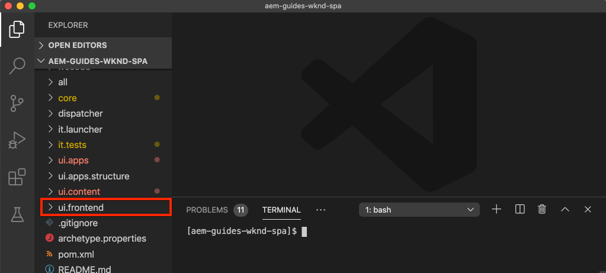
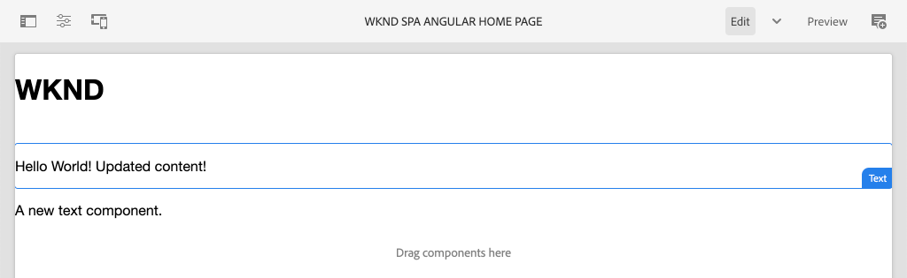
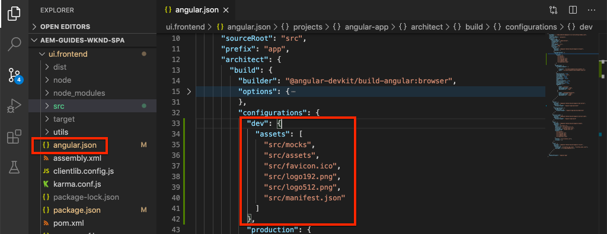

# 整合SPA {#integrate-spa}

瞭解如何將Angular中撰寫的單頁應用程式(SPA)原始碼與Adobe Experience Manager(AEM)專案整合。 瞭解如何使用現代前端工具（例如webpack dev server），針對AEM JSON模型API快速開發SPA。

## 目標

1. 瞭解SPA專案如何與AEM與用戶端程式庫整合。
2. 瞭解如何使用本機開發伺服器進行專屬的前端開發。
3. 探索針對AEM JSON模型API開發使用&#x200B;**proxy**&#x200B;和靜態&#x200B;**mock**&#x200B;檔案的方式

## 您將建立的

本章將向SPA添加一個簡單的`Header`元件。 在建立此靜態`Header`元件的過程中，將會使用數種AEM SPA開發方法。


*擴展SPA以添加靜態組 `Header` 件*

## 必備條件

檢閱設定[本機開發環境](overview.md#local-dev-environment)所需的工具和指示。

### 取得程式碼

1. 透過Git下載本教學課程的起點：

   ```shell
   $ git clone git@github.com:adobe/aem-guides-wknd-spa.git
   $ cd aem-guides-wknd-spa
   $ git checkout Angular/integrate-spa-start
   ```

2. 使用Maven將程式碼庫部署至本機AEM例項：

   ```shell
   $ mvn clean install -PautoInstallSinglePackage
   ```

   如果使用[AEM 6.x](overview.md#compatibility)新增`classic`描述檔：

   ```shell
   $ mvn clean install -PautoInstallSinglePackage -Pclassic
   ```

您隨時都可以在[GitHub](https://github.com/adobe/aem-guides-wknd-spa/tree/Angular/integrate-spa-solution)上檢視完成的程式碼，或切換至分支`Angular/integrate-spa-solution`，在本機檢出程式碼。

## 整合方法{#integration-approach}

AEM專案中已建立兩個模組：`ui.apps`和`ui.frontend`。

`ui.frontend`模組是包含所有SPA原始碼的[webpack](https://webpack.js.org/)項目。 大部分的SPA開發和測試都將在webpack專案中完成。 觸發生產組建時，會使用webpack建立並編譯SPA。 編譯的物件（CSS和Javascript）會複製至`ui.apps`模組，然後部署至AEM執行時期。


*SPA整合的高階描述。*

有關前端構建版本的其他資訊，請參閱[。](https://docs.adobe.com/content/help/en/experience-manager-core-components/using/developing/archetype/uifrontend-angular.html)

## 檢查SPA整合{#inspect-spa-integration}

接著，檢查`ui.frontend`模組以瞭解由[AEM Project原型](https://docs.adobe.com/content/help/en/experience-manager-core-components/using/developing/archetype/uifrontend-angular.html)自動產生的SPA。

1. 在您選擇的IDE中，開啟WKND SPA的AEM專案。 本教程將使用[Visual Studio代碼IDE](https://docs.adobe.com/content/help/en/experience-manager-learn/cloud-service/local-development-environment-set-up/development-tools.html#microsoft-visual-studio-code)。

   

2. 展開並檢查`ui.frontend`資料夾。 開啟檔案`ui.frontend/package.json`

3. 在`dependencies`下，您應看到與`@angular`相關的數個：

   ```json
   "@angular/animations": "~9.1.11",
   "@angular/common": "~9.1.11",
   "@angular/compiler": "~9.1.11",
   "@angular/core": "~9.1.11",
   "@angular/forms": "~9.1.10",
   "@angular/platform-browser": "~9.1.10",
   "@angular/platform-browser-dynamic": "~9.1.10",
   "@angular/router": "~9.1.10",
   ```

   該`ui.frontend`模組是通過使用包含路由的[Angular CLI工具](https://angular.io/cli)生成的[Angular應用程式](https://angular.io)。

4. 此外，還有三個前置詞為`@adobe`的依賴項：

   ```json
   "@adobe/cq-angular-editable-components": "^2.0.2",
   "@adobe/cq-spa-component-mapping": "^1.0.3",
   "@adobe/cq-spa-page-model-manager": "^1.1.3",
   ```

   上述模組由[AEM SPA Editor JS SDK](https://docs.adobe.com/content/help/en/experience-manager-65/developing/headless/spas/spa-blueprint.html)組成，並提供功能讓SPA元件對應至AEM元件。

5. 在`package.json`檔案中定義了數個`scripts`:

   ```json
   "scripts": {
       "start": "ng serve --open --proxy-config ./proxy.conf.json",
       "build": "ng lint && ng build && clientlib",
       "build:production": "ng lint && ng build --prod && clientlib",
       "test": "ng test",
       "sync": "aemsync -d -w ../ui.apps/src/main/content"
   }
   ```

   這些指令碼是以常用的[Angular CLI指令](https://angular.io/cli/build)為基礎，但已稍作修改，以搭配較大的AEM專案運作。

   `start` -使用本機Web伺服器在本機運行Angular應用程式。它已更新為Proxy本機AEM例項的內容。

   `build` -編譯Angular應用程式以進行生產散發。添加`&& clientlib`負責在構建過程中將編譯的SPA作為客戶端庫複製到`ui.apps`模組中。 npm模組[aem-clientlib-generator](https://github.com/wcm-io-frontend/aem-clientlib-generator)用於促進此過程。

   有關可用指令碼的詳細資訊，請參閱[此處](https://docs.adobe.com/content/help/en/experience-manager-core-components/using/developing/archetype/uifrontend-angular.html)。

6. 檢查檔案`ui.frontend/clientlib.config.js`。 [aem-clientlib-generator](https://github.com/wcm-io-frontend/aem-clientlib-generator#clientlibconfigjs)會使用此組態檔來決定如何產生用戶端程式庫。

7. 檢查檔案`ui.frontend/pom.xml`。 此檔案將`ui.frontend`資料夾轉換為[Maven模組](http://maven.apache.org/guides/mini/guide-multiple-modules.html)。 `pom.xml`檔案已更新為在Maven建置期間使用[frontend-maven-plugin](https://github.com/eirslett/frontend-maven-plugin)至&#x200B;**test**&#x200B;和&#x200B;**build** SPA。

8. 在`ui.frontend/src/app/app.component.ts`檢查檔案`app.component.ts` :

   ```js
   import { Constants } from '@adobe/cq-angular-editable-components';
   import { ModelManager } from '@adobe/cq-spa-page-model-manager';
   import { Component } from '@angular/core';
   
   @Component({
   selector: '#spa-root', // tslint:disable-line
   styleUrls: ['./app.component.css'],
   templateUrl: './app.component.html'
   })
   export class AppComponent {
       ...
   
       constructor() {
           ModelManager.initialize().then(this.updateData);
       }
   
       private updateData = pageModel => {
           this.path = pageModel[Constants.PATH_PROP];
           this.items = pageModel[Constants.ITEMS_PROP];
           this.itemsOrder = pageModel[Constants.ITEMS_ORDER_PROP];
       }
   }
   ```

   `app.component.js` 是SPA的入口。`ModelManager` 由AEM SPA Editor JS SDK提供。它負責呼叫並將`pageModel`（JSON內容）注入應用程式。

## 添加標題元件{#header-component}

接著，將新元件新增至SPA，並將變更部署至本機AEM例項，以檢視整合。

1. 開啟新的終端機視窗並導覽至`ui.frontend`資料夾：

   ```shell
   $ cd aem-guides-wknd-spa/ui.frontend
   ```

2. 全局安裝[Angular CLI](https://angular.io/cli#installing-angular-cli)這用於生成Angular元件，並通過&#x200B;**ng**&#x200B;命令構建和服務Angular應用程式。

   ```shell
   $ npm install -g @angular/cli
   ```

   >[!CAUTION]
   >
   > 本項目使用的&#x200B;**@angular/cli**&#x200B;版本為&#x200B;**9.1.7**。 建議將Angular CLI版本保持同步。

3. 通過從`ui.frontend`資料夾中運行Angular CLI `ng generate component`命令建立新的`Header`元件。

   ```shell
   $ ng generate component components/header
   
   CREATE src/app/components/header/header.component.css (0 bytes)
   CREATE src/app/components/header/header.component.html (21 bytes)
   CREATE src/app/components/header/header.component.spec.ts (628 bytes)
   CREATE src/app/components/header/header.component.ts (269 bytes)
   UPDATE src/app/app.module.ts (1809 bytes)
   ```

   這將為`ui.frontend/src/app/components/header`處的新角度頭元件建立骨架。

4. 在您選擇的IDE中開啟`aem-guides-wknd-spa`專案。 導覽至`ui.frontend/src/app/components/header`資料夾。

   

5. 開啟檔案`header.component.html`，並將內容取代為：

   ```html
   <!--/* header.component.html */-->
   <header className="header">
       <div className="header-container">
           <h1>WKND</h1>
       </div>
   </header>
   ```

   請注意，這會顯示靜態內容，因此此Angular元件不需要對預設生成的`header.component.ts`進行任何調整。

6. 在`ui.frontend/src/app/app.component.html`開啟檔案&#x200B;**app.component.html**。 新增`app-header`:

   ```html
   <app-header></app-header>
   <router-outlet></router-outlet>
   ```

   這將包含`header`元件，位於所有頁面內容之上。

7. 開啟新的終端並導覽至`ui.frontend`資料夾，然後執行`npm run build`命令：

   ```shell
   $ cd ui.frontend
   $ npm run build
   
   Linting "angular-app"...
   All files pass linting.
   Generating ES5 bundles for differential loading...
   ES5 bundle generation complete.
   ```

8. 導覽至`ui.apps`資料夾。 在`ui.apps/src/main/content/jcr_root/apps/wknd-spa-angular/clientlibs/clientlib-angular`下方，您應看到已編譯的SPA檔案已從`ui.frontend/build`資料夾複製。

   

9. 返回終端並導航到`ui.apps`資料夾。 執行下列Maven命令：

   ```shell
   $ cd ../ui.apps
   $ mvn clean install -PautoInstallPackage
   ...
   [INFO] ------------------------------------------------------------------------
   [INFO] BUILD SUCCESS
   [INFO] ------------------------------------------------------------------------
   [INFO] Total time:  9.629 s
   [INFO] Finished at: 2020-05-04T17:48:07-07:00
   [INFO] ------------------------------------------------------------------------
   ```

   這會將`ui.apps`套件部署至本機執行的AEM例項。

10. 開啟瀏覽器標籤並導覽至[http://localhost:4502/editor.html/content/wknd-spa-angular/us/en/home.html](http://localhost:4502/editor.html/content/wknd-spa-angular/us/en/home.html)。 您現在應該會在SPA中看到`Header`元件的內容。

   

   當從項目的根目錄觸發Maven構建時，會自動執行步驟&#x200B;**7-9**（即`mvn clean install -PautoInstallSinglePackage`）。 您現在應該瞭解SPA與AEM用戶端程式庫之間整合的基本概念。 請注意，您仍可以編輯並新增AEM中的`Text`元件，但是`Header`元件不可編輯。

## Webpack開發伺服器- Proxy JSON API {#proxy-json}

如先前練習所示，執行建置並將用戶端資料庫同步至AEM的本機例項需要幾分鐘的時間。 這對最終測試是可接受的，但對於大多數的SPA開發來說並不理想。

[webpack dev server](https://webpack.js.org/configuration/dev-server/)可用於快速開發SPA。 SPA由AEM產生的JSON模型驅動。 在本練習中，來自AEM執行中例項的JSON內容將&#x200B;**proxied**&#x200B;放入由[Angular project](https://angular.io/guide/build)所設定的開發伺服器。

1. 返回IDE並在`ui.frontend/proxy.conf.json`開啟檔案&#x200B;**proxy.conf.json**。

   ```json
   [
       {
           "context": [
                       "/content/**/*.(jpg|jpeg|png|model.json)",
                       "/etc.clientlibs/**/*"
                   ],
           "target": "http://localhost:4502",
           "auth": "admin:admin",
           "logLevel": "debug"
       }
   ]
   ```

   [Angular app](https://angular.io/guide/build#proxying-to-a-backend-server)提供了一種輕鬆的代理API請求機制。 在`context`中指定的模式會透過本機AEM快速入門(`localhost:4502`)來代理。

2. 在`ui.frontend/src/index.html`開啟檔案&#x200B;**index.html**。 這是開發伺服器使用的根HTML檔案。

   請注意，`base href="/"`有一個條目。 [基本標籤](https://angular.io/guide/deployment#the-base-tag)對於應用程式來解析相對URL至關重要。

   ```html
   <base href="/">
   ```

3. 開啟一個終端窗口並導航到`ui.frontend`資料夾。 運行命令`npm start` :

   ```shell
   $ cd ui.frontend
   $ npm start
   
   > wknd-spa-angular@0.1.0 start /Users/dgordon/Documents/code/aem-guides-wknd-spa/ui.frontend
   > ng serve --open --proxy-config ./proxy.conf.json
   
   10% building 3/3 modules 0 active[HPM] Proxy created: [ '/content/**/*.(jpg|jpeg|png|model.json)', '/etc.clientlibs/**/*' ]  ->  http://localhost:4502
   [HPM] Subscribed to http-proxy events:  [ 'error', 'close' ]
   ℹ ｢wds｣: Project is running at http://localhost:4200/webpack-dev-server/
   ℹ ｢wds｣: webpack output is served from /
   ℹ ｢wds｣: 404s will fallback to //index.html
   ```

4. 開啟新的瀏覽器標籤（如果尚未開啟）並導覽至[http://localhost:4200/content/wknd-spa-angular/us/en/home.html](http://localhost:4200/content/wknd-spa-angular/us/en/home.html)。

   

   您應該會看到與AEM相同的內容，但是沒有啟用任何編寫功能。

5. 返回IDE並在`ui.frontend/src/assets`建立名為`img`的新資料夾。
6. 下載下列WKND標誌並將其添加到`img`資料夾：

   

7. 在`ui.frontend/src/app/components/header/header.component.html`開啟&#x200B;**header.component.html**，並加入標誌：

   ```html
   <header class="header">
       <div class="header-container">
           <div class="logo">
               
           </div>
       </div>
   </header>
   ```

   將變更儲存至&#x200B;**header.component.html**。

8. 返回瀏覽器。 您應立即看到應用程式的變更。

   

   您可以繼續在&#x200B;**AEM**&#x200B;中更新內容，並查看它們在&#x200B;**webpack dev server**&#x200B;中的反映，因為我們代理內容。 請注意，內容變更只會顯示在&#x200B;**webpack dev server**&#x200B;中。

9. 在終端中使用`ctrl+c`停止本地Web伺服器。

## Webpack開發伺服器- Mock JSON API {#mock-json}

另一個快速開發的方法是使用靜態JSON檔案做為JSON模型。 透過「模仿」JSON，我們移除對本機AEM例項的依賴。 此外，它還可讓前端開發人員更新JSON模型，以測試功能並驅動JSON API的變更，JSON API稍後將由後端開發人員實作。

模擬JSON的初始設定需要&#x200B;**本機AEM例項**。

1. 在瀏覽器中導覽至[http://localhost:4502/content/wknd-spa-angular/us/en.model.json](http://localhost:4502/content/wknd-spa-angular/us/en.model.json)。

   這是由AEM匯出的JSON，是應用程式的驅動器。 複製JSON輸出。

2. 返回到IDE，導航到`ui.frontend/src`並添加名為&#x200B;**mocks**&#x200B;和&#x200B;**json**&#x200B;的新資料夾，以匹配以下資料夾結構：

   ```plain
   |-- ui.frontend
       |-- src
           |-- mocks
               |-- json
   ```

3. 在`ui.frontend/public/mocks/json`下方建立名為&#x200B;**en.model.json**&#x200B;的新檔案。 將&#x200B;**步驟1**&#x200B;的JSON輸出貼到此處。

   

4. 在`ui.frontend`下方建立新檔案&#x200B;**proxy.mock.conf.json**。 在檔案中填入下列項目：

   ```json
   [
       {
       "context": [
           "/content/**/*.model.json"
       ],
       "pathRewrite": { "^/content/wknd-spa-angular/us" : "/mocks/json"} ,
       "target": "http://localhost:4200",
       "logLevel": "debug"
       }
   ]
   ```

   此代理配置將重寫以`/content/wknd-spa-angular/us`開頭且以`/mocks/json`開頭的請求，並提供對應的靜態JSON檔案，例如：

   ```plain
   /content/wknd-spa-angular/us/en.model.json -> /mocks/json/en.model.json
   ```

5. 開啟檔案&#x200B;**angular.json**。 新增&#x200B;**dev**&#x200B;組態，其中包含更新的&#x200B;**assets**&#x200B;陣列，以參考建立的&#x200B;**mocks**&#x200B;資料夾。

   ```json
    "dev": {
             "assets": [
               "src/mocks",
               "src/assets",
               "src/favicon.ico",
               "src/logo192.png",
               "src/logo512.png",
               "src/manifest.json"
             ]
       },
   ```

   

   建立專用的&#x200B;**dev**&#x200B;組態可確保&#x200B;**mocks**&#x200B;資料夾僅在開發期間使用，且不會部署至生產建置中的AEM。

6. 在&#x200B;**angular.json**&#x200B;檔案中，下一步更新&#x200B;**browserTarget**&#x200B;組態，以使用新的&#x200B;**dev**&#x200B;組態：

   ```diff
     ...
     "serve": {
         "builder": "@angular-devkit/build-angular:dev-server",
         "options": {
   +       "browserTarget": "angular-app:build:dev"
   -       "browserTarget": "angular-app:build"
         },
     ...
   ```

   

7. 開啟檔案`ui.frontend/package.json`並新增&#x200B;**start:mock**&#x200B;命令，以參考&#x200B;**proxy.mock.conf.json**&#x200B;檔案。

   ```diff
       "scripts": {
           "start": "ng serve --open --proxy-config ./proxy.conf.json",
   +       "start:mock": "ng serve --open --proxy-config ./proxy.mock.conf.json",
           "build": "ng lint && ng build && clientlib",
           "build:production": "ng lint && ng build --prod && clientlib",
           "test": "ng test",
           "sync": "aemsync -d -w ../ui.apps/src/main/content"
       }
   ```

   新增命令可讓您輕鬆切換代理組態。

8. 如果當前正在運行，請停止&#x200B;**webpack dev server**。 使用&#x200B;**start:mock**&#x200B;指令碼啟動&#x200B;**webpack dev server**:

   ```shell
   $ npm run start:mock
   
   > wknd-spa-angular@0.1.0 start:mock /Users/dgordon/Documents/code/aem-guides-wknd-spa/ui.frontend
   > ng serve --open --proxy-config ./proxy.mock.conf.json
   ```

   導覽至[http://localhost:4200/content/wknd-spa-angular/us/en/home.html](http://localhost:4200/content/wknd-spa-angular/us/en/home.html)，您應該會看到相同的SPA，但內容現在會從&#x200B;**mock** JSON檔案中提取。

9. 對先前建立的&#x200B;**en.model.json**&#x200B;檔案進行小幅變更。 更新的內容應立即反映在&#x200B;**webpack dev server**&#x200B;中。

   

   能夠操控JSON模型並查看即時SPA的效果，可協助開發人員瞭解JSON模型API。 它還允許前端和後端開發同時進行。

## 使用Sass新增樣式

接下來，專案中會新增一些已更新的樣式。 此專案將新增[Sass](https://sass-lang.com/)支援一些有用的功能，例如變數。

1. 開啟終端窗口，如果啟動，則停止&#x200B;**webpack dev server**。 在`ui.frontend`資料夾內輸入下列命令，以更新Angular應用程式以處理&#x200B;**.scss**&#x200B;檔案。

   ```shell
   $ cd ui.frontend
   $ ng config schematics.@schematics/angular:component.styleext scss
   ```

   這會更新`angular.json`檔案，並在檔案底部加入新項目：

   ```json
   "schematics": {
       "@schematics/angular:component": {
       "styleext": "scss"
       }
   }
   ```

2. 安裝`normalize-scss`以標準化瀏覽器的樣式：

   ```shell
   $ npm install normalize-scss --save
   ```

3. 返回到IDE並在`ui.frontend/src`下建立名為`styles`的新資料夾。
4. 在`ui.frontend/src/styles`下方建立名為`_variables.scss`的新檔案，並填入下列變數：

   ```scss
   //_variables.scss
   
   //== Colors
   //
   //## Gray and brand colors for use across theme.
   
   $black:                  #202020;
   $gray:                   #696969;
   $gray-light:             #EBEBEB;
   $gray-lighter:           #F7F7F7;
   $white:                  #FFFFFF;
   $yellow:                 #FFEA00;
   $blue:                   #0045FF;
   
   
   //== Typography
   //
   //## Font, line-height, and color for body text, headings, and more.
   
   $font-family-sans-serif:  "Helvetica Neue", Helvetica, Arial, sans-serif;
   $font-family-serif:       Georgia, "Times New Roman", Times, serif;
   $font-family-base:        $font-family-sans-serif;
   $font-size-base:          18px;
   
   $line-height-base:        1.5;
   $line-height-computed:    floor(($font-size-base * $line-height-base));
   
   // Functional Colors
   $brand-primary:             $yellow;
   $body-bg:                   $white;
   $text-color:                $black;
   $text-color-inverse:        $gray-light;
   $link-color:                $blue;
   
   //Layout
   $max-width: 1024px;
   $header-height: 75px;
   
   // Spacing
   $gutter-padding: 12px;
   ```

5. 將位於`ui.frontend/src/styles.css`的&#x200B;**styles.css**&#x200B;檔案副檔名重新命名為&#x200B;**styles.scss**。 將內容取代為：

   ```scss
   /* styles.scss * /
   
   /* Normalize */
   @import '~normalize-scss/sass/normalize';
   
   @import './styles/variables';
   
   body {
       background-color: $body-bg;
       font-family: $font-family-base;
       margin: 0;
       padding: 0;
       font-size: $font-size-base;
       text-align: left;
       color: $text-color;
       line-height: $line-height-base;
   }
   
   body.page {
       max-width: $max-width;
       margin: 0 auto;
       padding: $gutter-padding;
       padding-top: $header-height;
   }
   ```

6. 更新&#x200B;**angular.json**，並使用&#x200B;**styles.scss**&#x200B;重新命名所有&#x200B;**style.css**&#x200B;參照。 應該有3個參考。

   ```diff
     "styles": [
   -    "src/styles.css"
   +    "src/styles.scss"
      ],
   ```

## 更新頁首樣式

接著，使用Sass，將一些品牌特定樣式新增至&#x200B;**Header**&#x200B;元件。

1. 啟動&#x200B;**webpack dev server**&#x200B;以即時查看樣式更新：

   ```shell
   $ npm run start:mock
   ```

2. 在`ui.frontend/src/app/components/header`下，將&#x200B;**header.component.css**&#x200B;重新命名為&#x200B;**header.component.scss**。 在檔案中填入下列項目：

   ```scss
   @import "~src/styles/variables";
   
   .header {
       width: 100%;
       position: fixed;
       top: 0;
       left:0;
       z-index: 99;
       background-color: $brand-primary;
       box-shadow: 0px 0px 10px 0px rgba(0, 0, 0, 0.24);
   }
   
   .header-container {
       display: flex;
       max-width: $max-width;
       margin: 0 auto;
       padding-left: $gutter-padding;
       padding-right: $gutter-padding;
   }
   
   .logo {
       z-index: 100;
       display: flex;
       padding-top: $gutter-padding;
       padding-bottom: $gutter-padding;
   }
   
   .logo-img {
       width: 100px;
   }
   ```

3. 將&#x200B;**header.component.js**&#x200B;更新為參考&#x200B;**header.component.scss**:

   ```diff
   ...
     @Component({
       selector: 'app-header',
       templateUrl: './header.component.html',
   -   styleUrls: ['./header.component.css']
   +   styleUrls: ['./header.component.scss']
     })
   ...
   ```

4. 返回瀏覽器和&#x200B;**webpack dev server** :

   

   您現在應該會看到已新增至&#x200B;**Header**&#x200B;元件的更新樣式。

## 將SPA更新部署至AEM

對&#x200B;**Header**&#x200B;所做的變更目前只能透過&#x200B;**webpack dev server**&#x200B;看到。 將更新的SPA部署至AEM，以檢視變更。

1. 停止&#x200B;**webpack dev server**。
2. 導覽至專案`/aem-guides-wknd-spa`的根目錄，並使用Maven將專案部署至AEM:

   ```shell
   $ cd ..
   $ mvn clean install -PautoInstallSinglePackage
   ```

3. 導覽至[http://localhost:4502/editor.html/content/wknd-spa-angular/us/en/home.html](http://localhost:4502/editor.html/content/wknd-spa-angular/us/en/home.html)。 您應看到已更新的&#x200B;**Header**&#x200B;並套用標誌和樣式：

   

   現在更新的SPA已在AEM中，撰寫作業可以繼續。

## 恭喜！{#congratulations}

恭喜您，您已更新SPA並探索與AEM的整合！ 您現在知道使用&#x200B;**webpack dev server**&#x200B;針對AEM JSON模型API開發SPA的兩種不同方法。

您隨時都可以在[GitHub](https://github.com/adobe/aem-guides-wknd-spa/tree/Angular/integrate-spa-solution)上檢視完成的程式碼，或切換至分支`Angular/integrate-spa-solution`，在本機檢出程式碼。

### 後續步驟{#next-steps}

[將SPA元件對應至AEM元件](map-components.md) -瞭解如何使用AEM SPA Editor JS SDK將Angular元件對應至Adobe Experience Manager(AEM)元件。元件對應可讓作者在AEM SPA編輯器中對SPA元件進行動態更新，類似於傳統的AEM製作。
