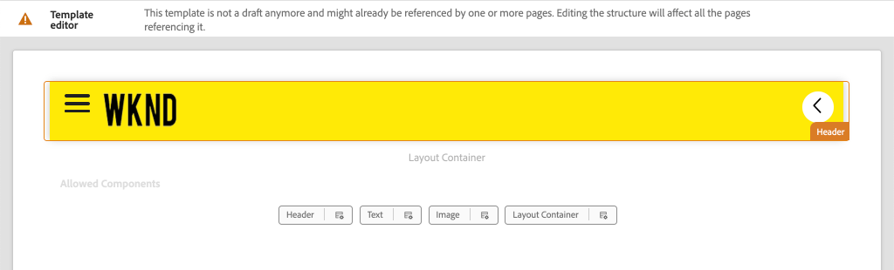
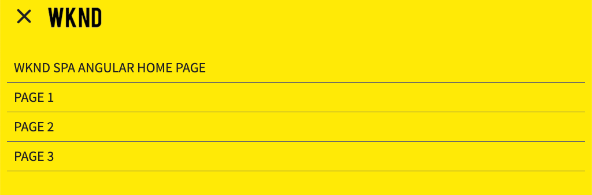
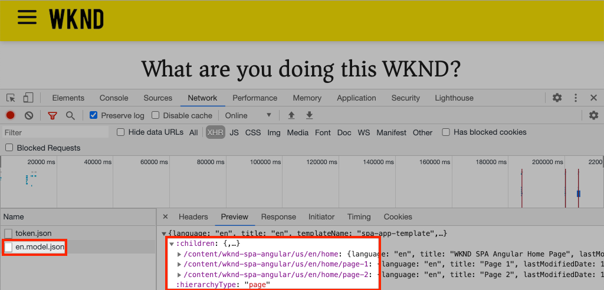

# 添加導航和路由{#navigation-routing}

瞭解如何使用「頁面」SPA和AEMSPA Editor SDK支援多個檢視。 動態導覽是使用Angular路由實作，並新增至現有的標題元件。

## 目標

1. 瞭解使SPA用編輯器時可用的模型路SPA由選項。
2. 瞭解如何使用[Angular路由](https://angular.io/guide/router)在不同視圖之間導航SPA。
3. 實作由頁面階層驅動的動AEM態導覽。

## 您將建立的

本章將導航菜單添加到現有`Header`元件。 導覽功能表由頁AEM面階層驅動，並使用[導覽核心元件](https://docs.adobe.com/content/help/en/experience-manager-core-components/using/components/navigation.html)提供的JSON模型。


## 必備條件

檢閱設定[本機開發環境](overview.md#local-dev-environment)所需的工具和指示。

### 取得程式碼

1. 透過Git下載本教學課程的起點：

   ```shell
   $ git clone git@github.com:adobe/aem-guides-wknd-spa.git
   $ cd aem-guides-wknd-spa
   $ git checkout Angular/navigation-routing-start
   ```

2. 使用Maven將程式碼庫部署AEM至本機例項：

   ```shell
   $ mvn clean install -PautoInstallSinglePackage
   ```

   如果使用[AEM 6.x](overview.md#compatibility)新增`classic`描述檔：

   ```shell
   $ mvn clean install -PautoInstallSinglePackage -Pclassic
   ```

3. 為傳統[WKND參考站點](https://github.com/adobe/aem-guides-wknd/releases/latest)安裝完成的軟體包。 由[WKND參考站點](https://github.com/adobe/aem-guides-wknd/releases/latest)提供的影像將重新用於WKNDSPA。 可以使用[AEM Package Manager](http://localhost:4502/crx/packmgr/index.jsp)安裝軟體包。

   

您隨時都可以在[GitHub](https://github.com/adobe/aem-guides-wknd-spa/tree/Angular/navigation-routing-solution)上檢視完成的程式碼，或切換至分支`Angular/navigation-routing-solution`，在本機檢出程式碼。

## InspectHeaderComponent更新{#inspect-header}

在前幾章中，`HeaderComponent`元件是透過`app.component.html`加入的純Angular元件。 在本章中，`HeaderComponent`元件會從應用程式中移除，並會透過[範本編輯器](https://docs.adobe.com/content/help/en/experience-manager-learn/sites/page-authoring/template-editor-feature-video-use.html)新增。 這可讓使用者從中設定`HeaderComponent`的導覽功能表AEM。

>[!NOTE]
>
> 已對程式碼庫進行數項CSS和JavaScript更新，以開始本章節。 為了集中討論核心概念，不討論代碼更改的&#x200B;**all**。 您可以在[這裡](https://github.com/adobe/aem-guides-wknd-spa/compare/Angular/map-components-solution...Angular/navigation-routing-start)檢視完整變更。

1. 在您選擇的IDE中，開啟本章SPA的入門項目。
2. 在`ui.frontend`模組下，檢查檔案`header.component.ts` :`ui.frontend/src/app/components/header/header.component.ts`。

   已進行了幾項更新，包括添加`HeaderEditConfig`和`MapTo`以便將元件映射到AEM`wknd-spa-angular/components/header`元件。

   ```js
   /* header.component.ts */
   ...
   const HeaderEditConfig = {
       ...
   };
   
   @Component({
   selector: 'app-header',
   templateUrl: './header.component.html',
   styleUrls: ['./header.component.scss']
   })
   export class HeaderComponent implements OnInit {
   @Input() items: object[];
       ...
   }
   ...
   MapTo('wknd-spa-angular/components/header')(withRouter(Header), HeaderEditConfig);
   ```

   請注意`items`的`@Input()`注釋。 `items` 將包含從傳入的導覽物件陣列AEM。

3. 在`ui.apps`模組中，檢查`Header`組AEM件的元件定義：`ui.apps/src/main/content/jcr_root/apps/wknd-spa-angular/components/header/.content.xml`:

   ```xml
   <?xml version="1.0" encoding="UTF-8"?>
   <jcr:root xmlns:sling="http://sling.apache.org/jcr/sling/1.0" xmlns:cq="http://www.day.com/jcr/cq/1.0"
       xmlns:jcr="http://www.jcp.org/jcr/1.0"
       jcr:primaryType="cq:Component"
       jcr:title="Header"
       sling:resourceSuperType="wknd-spa-angular/components/navigation"
       componentGroup="WKND SPA Angular - Structure"/>
   ```

   &lt;a0/AEM>元件將通過`sling:resourceSuperType`屬性繼承[導航核心元件](https://docs.adobe.com/content/help/en/experience-manager-core-components/using/components/navigation.html)的所有功能。`Header`

## 將HeaderComponent新SPA增至範本{#add-header-template}

1. 開啟瀏覽器並登AEM入[http://localhost:4502/](http://localhost:4502/)。 應已部署起始代碼庫。
2. 導覽至&#x200B;**[!UICONTROL 頁SPA面範本]**:[http://localhost:4502/editor.html/conf/wknd-spa-angular/settings/wcm/templates/spa-page-template/structure.html](http://localhost:4502/editor.html/conf/wknd-spa-angular/settings/wcm/templates/spa-page-template/structure.html)。
3. 選擇最外層的&#x200B;**[!UICONTROL 根佈局容器]** ，然後按一下其&#x200B;**[!UICONTROL 策略]**&#x200B;表徵圖。 請務必&#x200B;**not**，以選擇&#x200B;**[!UICONTROL 版面容器]**&#x200B;未鎖定以進行編寫。

   

4. 複製當前策略並建立名為&#x200B;**[!UICONTROL SPA Structure]**&#x200B;的新策略：

   

   在「**[!UICONTROL 允許的元件]** > **[!UICONTROL 一般]** >」下，選擇「版面容器&#x200B;]**」元件。**[!UICONTROL 

   在「**[!UICONTROL 允許的元件]** > **[!UICONTROL WKND SPAANGULAR- STRUCTURE]** >」下，選擇&#x200B;**[!UICONTROL 標題]**&#x200B;元件：

   

   在「**[!UICONTROL 允許的元件]** > **[!UICONTROL WKND SPAANGULAR-內容]**」下，選擇&#x200B;**[!UICONTROL Image]**&#x200B;和&#x200B;**[!UICONTROL Text]**&#x200B;元件。 您應選取總共4個元件。

   按一下&#x200B;**[!UICONTROL Done]**&#x200B;保存更改。

5. **重** 新整理頁面。在未鎖定的&#x200B;**[!UICONTROL 版面容器]**&#x200B;上方新增&#x200B;**[!UICONTROL 標題]**&#x200B;元件：

   

6. 選擇&#x200B;**[!UICONTROL 標題]**&#x200B;元件，然後按一下其&#x200B;**策略**&#x200B;表徵圖以編輯策略。

   

7. 使用&#x200B;**&quot;WKND標題&quot;**&#x200B;的&#x200B;**[!UICONTROL 策略標題]**&#x200B;建立新策略。

   在&#x200B;**[!UICONTROL 屬性]**&#x200B;下：

   * 將&#x200B;**[!UICONTROL 導覽根]**&#x200B;設為`/content/wknd-spa-angular/us/en`。
   * 將&#x200B;**[!UICONTROL 排除根級別]**&#x200B;設定為&#x200B;**1**。
   * 取消選中&#x200B;**[!UICONTROL 收集所有子頁]**。
   * 將&#x200B;**[!UICONTROL 導覽結構深度]**&#x200B;設為&#x200B;**3**。

   

   這會收集`/content/wknd-spa-angular/us/en`下方深處的導覽2層級。

8. 儲存變更後，您應將填入的`Header`視為範本的一部分：

   

## 建立子頁面

接著，在中建立AEM其他頁面，做為中的不同檢視SPA。 我們也會檢查由提供的JSON模型階層結構AEM。

1. 導覽至&#x200B;**Sites**&#x200B;主控台：[http://localhost:4502/sites.html/content/wknd-spa-angular/us/en/home](http://localhost:4502/sites.html/content/wknd-spa-angular/us/en/home)。 選擇&#x200B;**WKND SPA Angular首頁** ，然後按一下&#x200B;**[!UICONTROL 建立]** > **[!UICONTROL 頁]** :

   

2. 在&#x200B;**[!UICONTROL Template]**&#x200B;下，選擇&#x200B;**[!UICONTROL SPA Page]**。 在&#x200B;**[!UICONTROL Properties]**&#x200B;下輸入&#x200B;**&quot;Page 1&quot;**&#x200B;作為&#x200B;**[!UICONTROL Title]**&#x200B;和&#x200B;**&quot;page-1&quot;**&#x200B;的名稱。

   

   按一下&#x200B;**[!UICONTROL 建立]** ，然後在對話框彈出窗口中按一下&#x200B;**[!UICONTROL 開啟]**&#x200B;以在編輯器中開啟該AEM頁SPA。

3. 將新的&#x200B;**[!UICONTROL Text]**&#x200B;元件新增至主&#x200B;**[!UICONTROL 版面容器]**。 編輯元件並輸入文本：**&quot;Page 1&quot;**&#x200B;使用RTE和&#x200B;**H1**&#x200B;元素（您必須進入全螢幕模式才能變更段落元素）

   

   您可以隨意新增其他內容，例如影像。

4. 返回AEM Sites控制台並重複上述步驟，建立名為&#x200B;**&quot;Page 2&quot;**&#x200B;的第二頁，作為&#x200B;**Page 1**&#x200B;的同級。 將內容新增至&#x200B;**第2頁**，以方便識別。
5. 最後，建立第三頁&#x200B;**&quot;Page 3&quot;**，但是作為&#x200B;**第2頁**&#x200B;的&#x200B;**子**。 完成網站階層後，網站階層應如下所示：

   

6. 在新索引標籤中，開啟下列人員提供的JSON模型APIAEM:[http://localhost:4502/content/wknd-spa-angular/us/en.model.json](http://localhost:4502/content/wknd-spa-angular/us/en.model.json)。 首次載入時會要求SPA此JSON內容。 外部結構如下所示：

   ```json
   {
   "language": "en",
   "title": "en",
   "templateName": "spa-app-template",
   "designPath": "/libs/settings/wcm/designs/default",
   "cssClassNames": "spa page basicpage",
   ":type": "wknd-spa-angular/components/spa",
   ":items": {},
   ":itemsOrder": [],
   ":hierarchyType": "page",
   ":path": "/content/wknd-spa-angular/us/en",
   ":children": {
       "/content/wknd-spa-angular/us/en/home": {},
       "/content/wknd-spa-angular/us/en/home/page-1": {},
       "/content/wknd-spa-angular/us/en/home/page-2": {},
       "/content/wknd-spa-angular/us/en/home/page-2/page-3": {}
       }
   }
   ```

   在`:children`下，您應該會看到每個已建立頁面的項目。 所有頁面的內容都在此初始JSON請求中。 一旦實施導航路由，則後續的視SPA圖將快速載入，因為內容已經可用於客戶端。

   載入初始JSON請求中的內容&#x200B;**ALL&lt;a1/SPA>並不明智，因為這會減緩初始頁面載入的速度。**&#x200B;接下來，讓我們來瞭解如何收集頁面的階層深度。

7. 導覽至&#x200B;**SPA Root**&#x200B;範本，網址為：[http://localhost:4502/editor.html/conf/wknd-spa-angular/settings/wcm/templates/spa-app-template/structure.html](http://localhost:4502/editor.html/conf/wknd-spa-angular/settings/wcm/templates/spa-app-template/structure.html)。

   按一下&#x200B;**[!UICONTROL 頁面屬性菜單]** > **[!UICONTROL 頁面策略]**:

   

8. **SPA Root**&#x200B;範本有額外的&#x200B;**[!UICONTROL 階層結構]**&#x200B;標籤，以控制所收集的JSON內容。 **[!UICONTROL 結構深度]**&#x200B;可決定在網站階層中收集&#x200B;**root**&#x200B;下方子頁面的深度。 您也可以使用&#x200B;**[!UICONTROL 結構模式]**&#x200B;欄位，根據規則運算式來篩選其他頁面。

   將&#x200B;**[!UICONTROL 結構深度]**&#x200B;更新為&#x200B;**&quot;2&quot;**:

   

   按一下&#x200B;**[!UICONTROL Done]**&#x200B;保存對策略所做的更改。

9. 重新開啟JSON模型[http://localhost:4502/content/wknd-spa-angular/us/en.model.json](http://localhost:4502/content/wknd-spa-angular/us/en.model.json)。

   ```json
   {
   "language": "en",
   "title": "en",
   "templateName": "spa-app-template",
   "designPath": "/libs/settings/wcm/designs/default",
   "cssClassNames": "spa page basicpage",
   ":type": "wknd-spa-angular/components/spa",
   ":items": {},
   ":itemsOrder": [],
   ":hierarchyType": "page",
   ":path": "/content/wknd-spa-angular/us/en",
   ":children": {
       "/content/wknd-spa-angular/us/en/home": {},
       "/content/wknd-spa-angular/us/en/home/page-1": {},
       "/content/wknd-spa-angular/us/en/home/page-2": {}
       }
   }
   ```

   請注意，**第3頁**&#x200B;路徑已移除：`/content/wknd-spa-angular/us/en/home/page-2/page-3`。

   稍後，我們將觀察Editor AEM SDK如何動SPA態載入其他內容。

## 實作導覽

接著，使用新的`NavigationComponent`實作導覽功能表。 我們可以直接在`header.component.html`中新增程式碼，但更好的做法是避免使用大型元件。 請改為實作`NavigationComponent`，稍後可能會重新使用。

1. 檢視`Header`元AEM件在[http://localhost:4502/content/wknd-spa-angular/us/en.model.json](http://localhost:4502/content/wknd-spa-angular/us/en.model.json)公開的JSON:

   ```json
   ...
   "header": {
       "items": [
       {
       "level": 0,
       "active": true,
       "path": "/content/wknd-spa-angular/us/en/home",
       "description": null,
       "url": "/content/wknd-spa-angular/us/en/home.html",
       "lastModified": 1589062597083,
       "title": "WKND SPA Angular Home Page",
       "children": [
               {
               "children": [],
               "level": 1,
               "active": false,
               "path": "/content/wknd-spa-angular/us/en/home/page-1",
               "description": null,
               "url": "/content/wknd-spa-angular/us/en/home/page-1.html",
               "lastModified": 1589429385100,
               "title": "Page 1"
               },
               {
               "level": 1,
               "active": true,
               "path": "/content/wknd-spa-angular/us/en/home/page-2",
               "description": null,
               "url": "/content/wknd-spa-angular/us/en/home/page-2.html",
               "lastModified": 1589429603507,
               "title": "Page 2",
               "children": [
                   {
                   "children": [],
                   "level": 2,
                   "active": false,
                   "path": "/content/wknd-spa-angular/us/en/home/page-2/page-3",
                   "description": null,
                   "url": "/content/wknd-spa-angular/us/en/home/page-2/page-3.html",
                   "lastModified": 1589430413831,
                   "title": "Page 3"
                   }
               ],
               }
           ]
           }
       ],
   ":type": "wknd-spa-angular/components/header"
   ```

   頁面的階層AEM性質是在JSON中建立模型，可用來填入導覽功能表。 請記住，`Header`元件繼承[導覽核心元件](https://www.aemcomponents.dev/content/core-components-examples/library/templating/navigation.html)的所有功能，透過JSON公開的內容將自動對應至Angular`@Input`註解。

2. 開啟新的終端視窗並導覽至專案的`ui.frontend`資料SPA夾。 使用AngularCLI工具建立新`NavigationComponent` :

   ```shell
   $ cd ui.frontend
   $ ng generate component components/navigation
   CREATE src/app/components/navigation/navigation.component.scss (0 bytes)
   CREATE src/app/components/navigation/navigation.component.html (25 bytes)
   CREATE src/app/components/navigation/navigation.component.spec.ts (656 bytes)
   CREATE src/app/components/navigation/navigation.component.ts (286 bytes)
   UPDATE src/app/app.module.ts (2032 bytes)
   ```

3. 然後，使用新建立的`components/navigation`目錄中的AngularCLI建立名為`NavigationLink`的類：

   ```shell
   $ cd src/app/components/navigation/
   $ ng generate class NavigationLink
   CREATE src/app/components/navigation/navigation-link.spec.ts (187 bytes)
   CREATE src/app/components/navigation/navigation-link.ts (32 bytes)
   ```

4. 返回您選擇的IDE並開啟位於`navigation-link.ts` `/src/app/components/navigation/navigation-link.ts`的檔案。

   

5. 將`navigation-link.ts`填入以下內容：

   ```js
   export class NavigationLink {
   
       title: string;
       path: string;
       url: string;
       level: number;
       children: NavigationLink[];
       active: boolean;
   
       constructor(data) {
           this.path = data.path;
           this.title = data.title;
           this.url = data.url;
           this.level = data.level;
           this.active = data.active;
           this.children = data.children.map( item => {
               return new NavigationLink(item);
           });
       }
   }
   ```

   這是一個簡單的類別，可代表個別導覽連結。 在類別建構函式中，我們預期`data`是傳入的JSON物件AEM。 此類別將同時用於`NavigationComponent`和`HeaderComponent`中，以輕鬆填入導覽結構。

   未執行任何資料轉換，此類別的建立主要是為了強烈輸入JSON模型。 請注意，`this.children`已鍵入為`NavigationLink[]`，且建構函式會針對`children`陣列中的每個項目遞歸建立新的`NavigationLink`物件。 請記住，`Header`的JSON模型是階層式的。

6. 開啟檔案`navigation-link.spec.ts`。 這是`NavigationLink`類的測試檔案。 使用下列方式更新：

   ```js
   import { NavigationLink } from './navigation-link';
   
   describe('NavigationLink', () => {
       it('should create an instance', () => {
           const data = {
               children: [],
               level: 1,
               active: false,
               path: '/content/wknd-spa-angular/us/en/home/page-1',
               description: null,
               url: '/content/wknd-spa-angular/us/en/home/page-1.html',
               lastModified: 1589429385100,
               title: 'Page 1'
           };
           expect(new NavigationLink(data)).toBeTruthy();
       });
   });
   ```

   請注意，`const data`遵循先前針對單一連結所檢查的相同JSON模型。 這遠非強穩的單位測試，但測試`NavigationLink`的建構函式應已足夠。

7. 開啟檔案`navigation.component.ts`。 使用下列方式更新：

   ```js
   import { Component, OnInit, Input } from '@angular/core';
   import { NavigationLink } from './navigation-link';
   
   @Component({
   selector: 'app-navigation',
   templateUrl: './navigation.component.html',
   styleUrls: ['./navigation.component.scss']
   })
   export class NavigationComponent implements OnInit {
   
       @Input() items: object[];
   
       constructor() { }
   
       get navigationLinks(): NavigationLink[] {
   
           if (this.items && this.items.length > 0) {
               return this.items.map(item => {
                   return new NavigationLink(item);
               });
           }
   
           return null;
       }
   
       ngOnInit() {}
   
   }
   ```

   `NavigationComponent` 預期 `object[]` 的 `items` 命名為JSON模型AEM。此類公開了返回`NavigationLink`對象陣列的單個方法`get navigationLinks()`。

8. 開啟檔案`navigation.component.html`，然後使用下列程式碼更新檔案：

   ```html
   <ul *ngIf="navigationLinks && navigationLinks.length > 0" class="navigation__group">
       <ng-container *ngTemplateOutlet="recursiveListTmpl; context:{ links: navigationLinks }"></ng-container>
   </ul>
   ```

   這會產生初始`<ul>`，並從`navigation.component.ts`呼叫`get navigationLinks()`方法。 `<ng-container>`用於調用名為`recursiveListTmpl`的模板，並將其作為名為`links`的變數傳遞。`navigationLinks`

   新增`recursiveListTmpl`下一個：

   ```html
   <ng-template #recursiveListTmpl let-links="links">
       <li *ngFor="let link of links" class="{{'navigation__item navigation__item--' + link.level}}">
           <a [routerLink]="link.url" class="navigation__item-link" [title]="link.title" [attr.aria-current]="link.active">
               {{link.title}}
           </a>
           <ul *ngIf="link.children && link.children.length > 0">
               <ng-container *ngTemplateOutlet="recursiveListTmpl; context:{ links: link.children }"></ng-container>
           </ul>
       </li>
   </ng-template>
   ```

   這裡會實作導覽連結的其餘演算。 請注意，變數`link`的類型為`NavigationLink`，且該類建立的所有方法／屬性都可用。 [`[routerLink]`](https://angular.io/api/router/RouterLink) is used而非normal  `href` attribute.這可讓我們連結至應用程式中的特定路由，而不需重新整理整頁。

   如果當前`link`具有非空的`children`陣列，則通過建立另一個`<ul>`來實現導航的遞歸部分。

9. 更新`navigation.component.spec.ts`以新增對`RouterTestingModule`的支援：

   ```diff
    ...
   + import { RouterTestingModule } from '@angular/router/testing';
    ...
    beforeEach(async(() => {
       TestBed.configureTestingModule({
   +   imports: [ RouterTestingModule ],
       declarations: [ NavigationComponent ]
       })
       .compileComponents();
    }));
    ...
   ```

   需要添加`RouterTestingModule`，因為元件使用`[routerLink]`。

10. 更新`navigation.component.scss`以新增一些基本樣式至`NavigationComponent`:

   ```scss
   @import "~src/styles/variables";
   
   $link-color: $black;
   $link-hover-color: $white;
   $link-background: $black;
   
   :host-context {
       display: block;
       width: 100%;
   }
   
   .navigation__item {
       list-style: none;
   }
   
   .navigation__item-link {
       color: $link-color;
       font-size: $font-size-large;
       text-transform: uppercase;
       padding: $gutter-padding;
       display: flex;
       border-bottom: 1px solid $gray;
   
       &:hover {
           background: $link-background;
           color: $link-hover-color;
       }
   
   }
   ```

## 更新標題元件

現在`NavigationComponent`已實作，必須更新`HeaderComponent`以參考它。

1. 開啟終端並導覽至專案中的`ui.frontend`資料SPA夾。 啟動&#x200B;**webpack dev server** :

   ```shell
   $ npm start
   ```

2. 開啟瀏覽器標籤並導覽至[http://localhost:4200/](http://localhost:4200/)。

   應將&#x200B;**webpack dev server**&#x200B;設定為從本機例項(`ui.frontend/proxy.conf.json`)AEM代理JSON模型。 這可讓我們直接針對教學課程中先前建立的內AEM容編寫程式碼。

   

   `HeaderComponent`目前已實作功能表切換功能。 接著，新增導覽元件。

3. 返回您選擇的IDE，並在`ui.frontend/src/app/components/header/header.component.ts`處開啟檔案`header.component.ts`。
4. 更新`setHomePage()`方法以移除硬式編碼字串，並使用元件傳入的動態AEMprop:

   ```js
   /* header.component.ts */
   import { NavigationLink } from '../navigation/navigation-link';
   ...
    setHomePage() {
       if (this.hasNavigation) {
           const rootNavigationLink: NavigationLink = new NavigationLink(this.items[0]);
           this.isHome = rootNavigationLink.path === this.route.snapshot.data.path;
           this.homePageUrl = rootNavigationLink.url;
       }
   }
   ...
   ```

   根據`items[0]`建立`NavigationLink`的新例項，此為從傳入的導覽JSON模型根AEM。 `this.route.snapshot.data.path` 返回當前Angular路由的路徑。此值用於確定當前路由是否為&#x200B;**首頁**。 `this.homePageUrl` 用於填入標誌上的錨點 **連結**。

5. 開啟`header.component.html`，並以新建立的`NavigationComponent`參考取代導覽的靜態預留位置：

   ```diff
       <div class="header-navigation">
           <div class="navigation">
   -            Navigation Placeholder
   +           <app-navigation [items]="items"></app-navigation>
           </div>
       </div>
   ```

   `[items]=items` 屬性會 `@Input() items` 從 `HeaderComponent` 傳遞 `NavigationComponent` 至它要建立導覽的位置。

6. 開啟`header.component.spec.ts`並添加`NavigationComponent`聲明：

   ```diff
       /* header.component.spect.ts */
   +   import { NavigationComponent } from '../navigation/navigation.component';
   
       describe('HeaderComponent', () => {
       let component: HeaderComponent;
       let fixture: ComponentFixture<HeaderComponent>;
   
       beforeEach(async(() => {
           TestBed.configureTestingModule({
           imports: [ RouterTestingModule ],
   +       declarations: [ HeaderComponent, NavigationComponent ]
           })
           .compileComponents();
       }));
   ```

   由於`NavigationComponent`現在作為`HeaderComponent`的一部分使用，因此它需要作為測試台的一部分聲明。

7. 將更改保存到任何開啟的檔案並返回至&#x200B;**webpack dev server** :[http://localhost:4200/](http://localhost:4200/)

   

   按一下功能表切換以開啟導覽，您應該會看到填入的導覽連結。 您應該可以導覽至不同的檢視SPA。

## 瞭解路SPA由

現在已實施導覽，請在中檢查路由AEM。

1. 在IDE中，開啟`app-routing.module.ts`檔案，位於`ui.frontend/src/app`。

   ```js
   /* app-routing.module.ts */
   import { AemPageDataResolver, AemPageRouteReuseStrategy } from '@adobe/cq-angular-editable-components';
   import { NgModule } from '@angular/core';
   import { RouteReuseStrategy, RouterModule, Routes, UrlMatchResult, UrlSegment } from '@angular/router';
   import { PageComponent } from './components/page/page.component';
   
   export function AemPageMatcher(url: UrlSegment[]): UrlMatchResult {
       if (url.length) {
           return {
               consumed: url,
               posParams: {
                   path: url[url.length - 1]
               }
           };
       }
   }
   
   const routes: Routes = [
       {
           matcher: AemPageMatcher,
           component: PageComponent,
           resolve: {
               path: AemPageDataResolver
           }
       }
   ];
   @NgModule({
       imports: [RouterModule.forRoot(routes)],
       exports: [RouterModule],
       providers: [
           AemPageDataResolver,
           {
           provide: RouteReuseStrategy,
           useClass: AemPageRouteReuseStrategy
           }
       ]
   })
   export class AppRoutingModule {}
   ```

   `routes: Routes = [];`陣列定義到Angular元件映射的路由或導航路徑。

   `AemPageMatcher` 是自訂Angular路由 [器UrlMatcher](https://angular.io/api/router/UrlMatcher)，它會比對屬於此Angular應用程式AEM一部分的頁面「外觀」。

   `PageComponent` 是Angular元件，它表示中的頁AEM，匹配的路由將調用。`PageComponent`將進一步檢查。

   `AemPageDataResolver`，由AEM Editor SPA JS SDK提供的是自訂 [Angular路由器](https://angular.io/api/router/Resolve) Resolver，用於將路由URL(包括。html副檔名的路AEM徑)轉換為中的資源路徑AEM，即頁路徑減去副檔名。

   例如，`AemPageDataResolver`會將路由的URL `content/wknd-spa-angular/us/en/home.html`轉換為路徑`/content/wknd-spa-angular/us/en/home`。 這可用來根據JSON模型API中的路徑解析頁面內容。

   `AemPageRouteReuseStrategy`，由Editor AEM JS SDK提供的自訂 [](https://angular.io/api/router/RouteReuseStrategy) RouteReuseStrategy可防止跨路 `PageComponent` 由重複使用。否則，頁面&quot;A&quot;的內容在導覽至頁面&quot;B&quot;時可能會顯示。

2. 在`ui.frontend/src/app/components/page/`開啟檔案`page.component.ts`。

   ```js
   ...
   export class PageComponent {
       items;
       itemsOrder;
       path;
   
       constructor(
           private route: ActivatedRoute,
           private modelManagerService: ModelManagerService
       ) {
           this.modelManagerService
           .getData({ path: this.route.snapshot.data.path })
           .then(data => {
               this.path = data[Constants.PATH_PROP];
               this.items = data[Constants.ITEMS_PROP];
               this.itemsOrder = data[Constants.ITEMS_ORDER_PROP];
           });
       }
   }
   ```

   `PageComponent`是處理從中檢索的JSON所必需的，AEM並用作Angular元件來呈現路由。

   `ActivatedRoute`，由Angular路由器模組提供，包含狀態，指AEM出應將哪個頁面的JSON內容載入此Angular頁面元件例項。

   `ModelManagerService`，則會根據路由取得JSON資料，並將資料對應至類別變 `path`數 `items`、 `itemsOrder`。然後，這些值會傳遞至[AEMPageComponent](https://www.npmjs.com/package/@adobe/cq-angular-editable-components#aempagecomponent.md)

3. 在`ui.frontend/src/app/components/page/`開啟檔案`page.component.html`

   ```html
   <aem-page 
       class="structure-page" 
       [attr.data-cq-page-path]="path" 
       [cqPath]="path" 
       [cqItems]="items" 
       [cqItemsOrder]="itemsOrder">
   </aem-page>
   ```

   `aem-page` 包含 [AEMPageComponent](https://www.npmjs.com/package/@adobe/cq-angular-editable-components#aempagecomponent.md)。變數`path`、`items`和`itemsOrder`會傳遞至`AEMPageComponent`。 然後，透過SPA Editor JavaScript SDK提供的`AemPageComponent`將會重複此資料，並根據[地圖元件教學課程](./map-components.md)中所示的JSON資料動態執行個體化Angular元件。

   `PageComponent`實際上只是`AEMPageComponent`的代理程式，而負責大部分繁重工作的`AEMPageComponent`，會將JSON模型正確對應至Angular元件。

## InspectSPA的路AEM線

1. 開啟終端並停止&#x200B;**webpack dev server**（如果已啟動）。 導覽至專案的根目錄，並使用您的Maven技AEM能部署專案：

   ```shell
   $ cd aem-guides-wknd-spa
   $ mvn clean install -PautoInstallSinglePackage
   ```

   >[!CAUTION]
   >
   > angular項目啟用了一些非常嚴格的連結規則。 如果Maven組建失敗，請檢查錯誤並查找列出的檔案中找到的&#x200B;**Lint錯誤。**. 修正Linter發現的任何問題，並重新執行Maven命令。

2. 導覽至SPA首頁AEM:[http://localhost:4502/content/wknd-spa-angular/us/en/home.html](http://localhost:4502/content/wknd-spa-angular/us/en/home.html)並開啟您瀏覽器的開發人員工具。 以下螢幕擷取自Google Chrome瀏覽器。

   重新整理頁面，您應該會看到`/content/wknd-spa-angular/us/en.model.json`的XHR請求，此為根SPA目錄。 請注意，根據教學課程中稍早建立的根範本的階層深度設定，僅包含三SPA個子頁面。 這不包括&#x200B;**第3頁**。

   

3. 在開啟開發人員工具後，導覽至&#x200B;**第3頁**:

   

   請注意，新的XHR要求是：`/content/wknd-spa-angular/us/en/home/page-2/page-3.model.json`

   

   模AEM型管理員瞭解&#x200B;**第3頁** JSON內容不可用，並自動觸發其他XHR要求。

4. 使用各種導SPA覽連結繼續導覽。 請注意，未提出其他XHR要求，且未進行完整頁面重新整理。 如此可讓使SPA用者快速上手，並將不必要的要求減少回AEM來。

   

5. 直接導覽至：[http://localhost:4502/content/wknd-spa-angular/us/en/home/page-2.html](http://localhost:4502/content/wknd-spa-angular/us/en/home/page-2.html)。 請注意，瀏覽器的「上一步」按鈕仍能繼續運作。

## 恭喜！{#congratulations}

恭喜您，您瞭解如何透過Editor SPA SDK對應至「頁面」來支AEM援多個SPA檢視。 動態導航已使用Angular路由實施，並添加到`Header`元件中。

您隨時都可以在[GitHub](https://github.com/adobe/aem-guides-wknd-spa/tree/Angular/navigation-routing-solution)上檢視完成的程式碼，或切換至分支`Angular/navigation-routing-solution`，在本機檢出程式碼。

### 後續步驟{#next-steps}

[建立自訂元件](custom-component.md) -瞭解如何建立自訂元件以搭配編輯器使AEM用SPA。瞭解如何開發作者對話方塊和Sling Models以擴充JSON模型以填入自訂元件。
