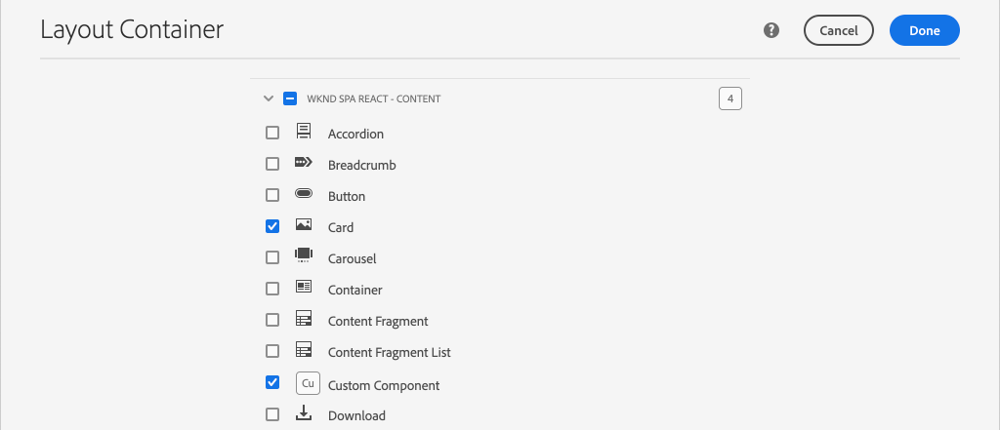

# 擴充核心元件 {#extend-component}

瞭解如何擴充現有的核心元件，以便與AEM SPA編輯器搭配使用。 瞭解如何擴充現有元件是自訂和擴充AEM SPA Editor實作功能的強大技巧。

## 目標

1. 使用其他屬性和內容擴充現有的核心元件。
2. 使用瞭解元件繼承的基本內容 `sling:resourceSuperType`。
3. 瞭解如何運用 [Delegation Pattern](https://github.com/adobe/aem-core-wcm-components/wiki/Delegation-Pattern-for-Sling-Models) for Sling Models來重新使用現有的邏輯和功能。

## 您將建立的

在本章中，將創 `Card` 建新元件。 此元 `Card` 件將擴充「 [Image Core Component](https://docs.adobe.com/content/help/zh-Hant/experience-manager-core-components/using/components/image.translate.html) 」（影像核心元件），新增其他內容欄位，例如「Title」（標題）和「Call To Action」（呼叫動作）按鈕，以針對SPA中的其他內容執行摘要。


>[!NOTE]
>
> 在實際實作中，只要使用 [Teaser元件，然後擴充](https://docs.adobe.com/content/help/en/experience-manager-core-components/using/components/teaser.html) Image Core Component [，以根據專案需求來建立元](https://docs.adobe.com/content/help/zh-Hant/experience-manager-core-components/using/components/image.translate.html)`Card` 件，可能更合適。 建議您盡可能直接 [使用核心元件](https://docs.adobe.com/content/help/zh-Hant/experience-manager-core-components/using/introduction.html) 。

## 必備條件

檢視建立本機開發環境所需的工 [具和指示](overview.md#local-dev-environment)。

### 取得程式碼

1. 透過Git下載本教學課程的起點：

   ```shell
   $ git clone git@github.com:adobe/aem-guides-wknd-spa.git
   $ cd aem-guides-wknd-spa
   $ git checkout React/extend-component-start
   ```

2. 使用Maven將程式碼庫部署至本機AEM例項：

   ```shell
   $ mvn clean install -PautoInstallSinglePackage
   ```

   如果使用 [AEM 6.x](overview.md#compatibility) ，請新增 `classic` 描述檔：

   ```shell
   $ mvn clean install -PautoInstallSinglePackage -Pclassic
   ```

3. 為傳統的 [WKND參考站點安裝完成的軟體包](https://github.com/adobe/aem-guides-wknd/releases/latest)。 WKND參考網 [站提供的影像](https://github.com/adobe/aem-guides-wknd/releases/latest) ，將重新用於WKND SPA。 您可使用 [AEM的Package Manager來安裝套件](http://localhost:4502/crx/packmgr/index.jsp)。

   

您隨時都可以在 [GitHub上檢視完成的程式碼](https://github.com/adobe/aem-guides-wknd-spa/tree/React/extend-component-solution) ，或切換至分支，在本機檢出程式碼 `React/extend-component-solution`。

## 檢查初始卡片實作

章節起始代碼已提供初始卡元件。 檢查卡實施的起點。

1. 在您選擇的IDE中開啟模 `ui.apps` 塊。
2. 導覽至 `ui.apps/src/main/content/jcr_root/apps/wknd-spa-react/components/card` 並檢視檔 `.content.xml` 案。

   

   ```xml
   <?xml version="1.0" encoding="UTF-8"?>
   <jcr:root xmlns:sling="http://sling.apache.org/jcr/sling/1.0" xmlns:cq="http://www.day.com/jcr/cq/1.0" xmlns:jcr="http://www.jcp.org/jcr/1.0"
       jcr:primaryType="cq:Component"
       jcr:title="Card"
       sling:resourceSuperType="wknd-spa-react/components/image"
       componentGroup="WKND SPA React - Content"/>
   ```

   該屬 `sling:resourceSuperType` 性指 `wknd-spa-react/components/image` 出該組 `Card` 件將繼承WKND SPA映像元件的所有功能。

3. 檢查檔案 `ui.apps/src/main/content/jcr_root/apps/wknd-spa-react/components/image/.content.xml`:

   ```xml
   <?xml version="1.0" encoding="UTF-8"?>
   <jcr:root xmlns:sling="http://sling.apache.org/jcr/sling/1.0" xmlns:cq="http://www.day.com/jcr/cq/1.0" xmlns:jcr="http://www.jcp.org/jcr/1.0"
       jcr:primaryType="cq:Component"
       jcr:title="Image"
       sling:resourceSuperType="core/wcm/components/image/v2/image"
       componentGroup="WKND SPA React - Content"/>
   ```

   請注意， `sling:resourceSuperType` 指向 `core/wcm/components/image/v2/image`。 這表示WKND SPA映像元件繼承核心元件映像的所有功能。

   也稱為 [Proxy模式](https://docs.adobe.com/content/help/en/experience-manager-core-components/using/developing/guidelines.html#proxy-component-pattern) Sling資源繼承是功能強大的設計模式，可讓子元件在需要時繼承功能和擴充／覆寫行為。 Sling繼承支援多種層級的繼承，因此，新元件 `Card` 會繼承核心元件影像的功能。

   許多開發團隊都致力於成為D.R.Y.（別重複自己）。 Sling繼承讓AEM可進行此作業。

4. 在檔案 `card` 夾下，開啟檔案 `_cq_dialog/.content.xml`。

   此檔案是元件的「元件對話框」定 `Card` 義。 如果使用Sling繼承，則可能使用 [Sling Resource Merger的功能](https://docs.adobe.com/content/help/en/experience-manager-65/developing/platform/sling-resource-merger.html) ，覆寫或延伸對話方塊的部分。 在此範例中，對話方塊中已新增一個標籤，以從作者擷取其他資料以填入卡片元件。

   屬性( `sling:orderBefore` 例如)可讓開發人員選擇插入新標籤或表單欄位的位置。 在這種情況下， `Text` 頁籤將插入到頁籤 `asset` 之前。 若要充份運用Sling Resource Merger，請務必瞭解 [Image元件對話方塊的原始對話節點結構](https://github.com/adobe/aem-core-wcm-components/blob/master/content/src/content/jcr_root/apps/core/wcm/components/image/v2/image/_cq_dialog/.content.xml)。

5. 在檔案 `card` 夾下，開啟檔案 `_cq_editConfig.xml`。 此檔案指定AEM製作UI中的拖放行為。 擴展映像元件時，資源類型必須與元件本身匹配。 查看節 `<parameters>` 點：

   ```xml
   <parameters
       jcr:primaryType="nt:unstructured"
       sling:resourceType="wknd-spa-react/components/card"
       imageCrop=""
       imageMap=""
       imageRotate=""/>
   ```

   大多數元件不需要， `cq:editConfig`映像元件的映像和子代是例外。

6. 在IDE的模組交換機 `ui.frontend` 中，導航到 `ui.frontend/src/components/Card`:

   

7. 檢查檔案 `Card.js`。

   元件已研發過來，可使用標準函式對應 `Card` 至AEM元 `MapTo` 件。

   ```js
   MapTo('wknd-spa-react/components/card')(Card, CardEditConfig);
   ```

8. 檢查方法 `get imageContent()`:

   ```js
    get imageContent() {
       return (
           <div className="Card__image">
               <Image {...this.props} />
           </div>)
   }
   ```

   在此範例中，我們選擇只從元件傳遞，即可重 `Image` 新使用現有 `this.props` 的React Image `Card` 元件。 在本教學課程的後 `get bodyContent()` 續章節中，將實作此方法，以顯示標題、日期和動作呼叫按鈕。

## 更新範本原則

透過此初始 `Card` 實作，檢視AEM SPA編輯器中的功能。 若要查看初始組 `Card` 件，需要更新模板策略。

1. 將起始程式碼部署至AEM的本機執行個體(如果您尚未：

   ```shell
   $ cd aem-guides-wknd-spa
   $ mvn clean install -PautoInstallSinglePackage
   ```

2. 導覽至SPA頁面範本，網址為 [http://localhost:4502/editor.html/conf/wknd-spa-react/settings/wcm/templates/spa-page-template/structure.html](http://localhost:4502/editor.html/conf/wknd-spa-react/settings/wcm/templates/spa-page-template/structure.html)。
3. 更新「配置容器」的原則，將新元件新 `Card` 增為允許的元件：

   

   保存對策略的更改，並將該組 `Card` 件作為允許的元件：

   

## 作者初始卡片元件

接著，使用 `Card` AEM SPA編輯器來編寫元件。

1. 導覽至 [http://localhost:4502/editor.html/content/wknd-spa-react/us/en/home.html](http://localhost:4502/editor.html/content/wknd-spa-react/us/en/home.html)。
2. 在模 `Edit` 式中，將組 `Card` 件添加到 `Layout Container`:

   

3. 將影像從Asset Finder拖放至元件 `Card` 上：

   

4. 開啟元 `Card` 件對話方塊，並注意新增「文字 **** 」標籤。
5. 在「文本」( **Text** )頁籤上輸入以下值：

   

   **卡片路徑** -在SPA首頁下方選擇頁面。

   **CTA Text** - &quot;Read More&quot;

   **卡片標題** -留空

   **從連結頁面取得標題** -勾選核取方塊以指出true。

6. 更新「 **資產中繼資料** 」索引標籤，以新增「替 **代文字** 」和「 **標題**」。

   目前更新對話方塊後，不會再顯示其他變更。 若要將新欄位公開給React Component，我們需要更新元件的Sling Model `Card` 。

7. 開啟新標籤並導覽至 [CRXDE-Lite](http://localhost:4502/crx/de/index.jsp#/content/wknd-spa-react/us/en/home/jcr%3Acontent/root/responsivegrid/card)。 檢查下方的內容節 `/content/wknd-spa-react/us/en/home/jcr:content/root/responsivegrid` 點以尋找 `Card` 元件內容。

   

   請注意，對 `cardPath`話方 `ctaText`塊 `titleFromPage` 會保留屬性。

## 更新Card Sling Model

若要最終將元件對話方塊中的值公開給React元件，我們需要更新填入元件JSON的Sling Model `Card` 。 我們還有機會實施兩個商業邏輯：

* 如果 `titleFromPage` 為 **true**，則傳回由指定之頁面的標題， `cardPath` 否則傳回文字欄 `cardTitle` 位值。
* 傳回指定之頁面的上次修改日期 `cardPath`。

返回您選擇的IDE並開啟模 `core` 塊。

1. 在中開啟 `Card.java` 檔案 `core/src/main/java/com/adobe/aem/guides/wknd/spa/react/core/models/Card.java`。

   請注意，該 `Card` 介面當前 `com.adobe.cq.wcm.core.components.models.Image` 已擴展，因此繼承了該介面的所有方 `Image` 法。 介 `Image` 面已擴充介面， `ComponentExporter` 可讓Sling Model匯出為JSON，並由SPA編輯器映射。 因此，我們不需要像在「自訂元件」 `ComponentExporter` 一章中那樣明確地擴 [充介面](custom-component.md)。

2. 將下列方法新增至介面：

   ```java
   @ProviderType
   public interface Card extends Image {
   
       /***
       * The URL to populate the CTA button as part of the card.
       * The link should be based on the cardPath property that points to a page.
       * @return String URL
       */
       public String getCtaLinkURL();
   
       /***
       * The text to display on the CTA button of the card.
       * @return String CTA text
       */
       public String getCtaText();
   
   
   
       /***
       * The date to be displayed as part of the card.
       * This is based on the last modified date of the page specified by the cardPath
       * @return
       */
       public Calendar getCardLastModified();
   
   
       /**
       * Return the title of the page specified by cardPath if `titleFromPage` is set to true.
       * Otherwise return the value of `cardTitle`
       * @return
       */
       public String getCardTitle();
   }
   ```

   這些方法將會透過JSON模型API公開，並傳遞至React元件。

3. 開啟 `CardImpl.java`. 這是介面的實 `Card.java` 施。 此實作已部分遭到研究，以加速教學課程。  請注意使用和 `@Model` 注 `@Exporter` 釋以確保Sling Model可透過Sling Model Exporter以JSON序列化。

   `CardImpl.java` 此外，也使 [用Delegation模式來建立Sling Models](https://github.com/adobe/aem-core-wcm-components/wiki/Delegation-Pattern-for-Sling-Models) ，以避免從Image核心元件中重寫所有邏輯。

4. 請遵循下列行：

   ```java
   @Self
   @Via(type = ResourceSuperType.class)
   private Image image;
   ```

   上述注釋將根據元件的繼承來實 `image` 例化名 `sling:resourceSuperType` 稱的Image物 `Card` 件。

   ```java
   @Override
   public String getSrc() {
       return null != image ? image.getSrc() : null;
   }
   ```

   然後，可以簡單地使用對 `image` 像來實現由介面定義的方 `Image` 法，而無需自行編寫邏輯。 此技術用於 `getSrc()`和 `getAlt()` 和 `getTitle()`。

5. 接著，實作 `initModel()` 方法，以根據 `cardPage` `cardPath`

   ```java
   @PostConstruct
   public void initModel() {
       if(StringUtils.isNotBlank(cardPath) && pageManager != null) {
           cardPage = pageManager.getPage(this.cardPath);
       }
   }
   ```

   當 `@PostConstruct initModel()` Sling Model初始化時，一律會呼叫，因此，這是初始化模型中其他方法可能使用的物件的好機會。 是 `pageManager` Sling Models透過註解提供 [多個Java支援的全域物件之一](https://docs.adobe.com/content/help/en/experience-manager-htl/using/htl/global-objects.html#java-backed-objects)`@ScriptVariable` 。 getPage [方法會進入路徑，並傳回AEM](https://docs.adobe.com/content/help/en/experience-manager-cloud-service/implementing/developing/ref/javadoc/com/day/cq/wcm/api/PageManager.html#getPage-java.lang.String-) Page [](https://docs.adobe.com/content/help/en/experience-manager-cloud-service/implementing/developing/ref/javadoc/com/day/cq/wcm/api/Page.html) 物件，若路徑未指向有效頁面，則傳回null。

   這會初始化變 `cardPage` 數，其他新方法會使用此變數來傳回有關基礎連結頁面的資料。

6. 檢視已映射至已儲存作者對話方塊之JCR屬性的全域變數。 注 `@ValueMapValue` 釋用於自動執行映射。

   ```java
   @ValueMapValue
   private String cardPath;
   
   @ValueMapValue
   private String ctaText;
   
   @ValueMapValue
   private boolean titleFromPage;
   
   @ValueMapValue
   private String cardTitle;
   ```

   這些變數將用來實作介面的其他方 `Card.java` 法。

7. 實作介面中定義的其他 `Card.java` 方法：

   ```java
   @Override
   public String getCtaLinkURL() {
       if(cardPage != null) {
           return cardPage.getPath() + ".html";
       }
       return null;
   }
   
   @Override
   public String getCtaText() {
       return ctaText;
   }
   
   @Override
   public Calendar getCardLastModified() {
      if(cardPage != null) {
          return cardPage.getLastModified();
      }
      return null;
   }
   
   @Override
   public String getCardTitle() {
       if(titleFromPage) {
           return cardPage != null ? cardPage.getTitle() : null;
       }
       return cardTitle;
   }
   ```

   >[!NOTE]
   >
   > 您可以在此處檢 [視完成的CardImpl.java](https://github.com/adobe/aem-guides-wknd-spa/blob/React/extend-component-solution/core/src/main/java/com/adobe/aem/guides/wknd/spa/react/core/models/impl/CardImpl.java)。

8. 開啟終端窗口，使用目錄中的Maven配置 `core` 檔案將更新部 `autoInstallBundle` 署到模 `core` 塊。

   ```shell
   $ cd core/
   $ mvn clean install -PautoInstallBundle
   ```

   如果使 [用AEM 6.x](overview.md#compatibility) ，請新增 `classic` 描述檔。

9. 請在以下網址檢視JSON模型回應： [http://localhost:4502/content/wknd-spa-react/us/en.model.json](http://localhost:4502/content/wknd-spa-react/us/en.model.json) ，並搜尋 `wknd-spa-react/components/card`:

   ```json
   "card": {
       "ctaText": "Read More",
       "cardTitle": "Page 1",
       "title": "Woman chillaxing with river views in Australian bushland",
       "src": "/content/wknd-spa-react/us/en/home/_jcr_content/root/responsivegrid/card.coreimg.jpeg/1595190732886/adobestock-216674449.jpeg",
       "alt": "Female sitting on a large rock relaxing in afternoon dappled light the Australian bushland with views over the river",
       "cardLastModified": 1591360492414,
       "ctaLinkURL": "/content/wknd-spa-react/us/en/home/page-1.html",
       ":type": "wknd-spa-react/components/card"
   }
   ```

   請注意，在更新 `CardImpl` Sling Model中的方法後，JSON模型會以其他金鑰／值配對更新。

## 更新React元件

現在，JSON模型已填入新屬 `ctaLinkURL`性、 `ctaText``cardTitle` 並且我 `cardLastModified` 們可更新React元件以顯示這些。

1. 返回IDE並開啟模 `ui.frontend` 塊。 或者，從新的終端視窗啟動webpack dev server，即時查看變更：

   ```shell
   $ cd ui.frontend
   $ npm install
   $ npm start
   ```

2. 開啟 `Card.js` 位置 `ui.frontend/src/components/Card/Card.js`。
3. 新增方法 `get ctaButton()` 以呈現動作的呼叫：

   ```js
   import {Link} from "react-router-dom";
   ...
   
   export default class Card extends Component {
   
       get ctaButton() {
           if(this.props && this.props.ctaLinkURL && this.props.ctaText) {
               return (
                   <div className="Card__action-container">
                       <Link to={this.props.ctaLinkURL} title={this.props.title}
                           className="Card__action-link">
                           {this.props.ctaText}
                       </Link>
                   </div>
               );
           }
   
           return null;
       }
       ...
   }
   ```

4. 新增轉換為 `get lastModifiedDisplayDate()` 代表日 `this.props.cardLastModified` 期的本地化字串的方法。

   ```js
   export default class Card extends Component {
       ...
       get lastModifiedDisplayDate() {
           const lastModifiedDate = this.props.cardLastModified ? new Date(this.props.cardLastModified) : null;
   
           if (lastModifiedDate) {
               return lastModifiedDate.toLocaleDateString();
           }
           return null;
       }
       ...
   }
   ```

5. 更新 `get bodyContent()` 以顯 `this.props.cardTitle` 示，並使用前述步驟中建立的方法：

   ```js
   export default class Card extends Component {
       ...
       get bodyContent() {
          return (<div class="Card__content">
                       <h2 class="Card__title"> {this.props.cardTitle}
                           <span class="Card__lastmod">
                               {this.lastModifiedDisplayDate}
                           </span>
                       </h2>
                       {this.ctaButton}
               </div>);
       }
       ...
   }
   ```

6. Sass規則已新增至， `Card.scss` 以設定標題的樣式、動作呼叫和上次修改日期。 在檔案頂端新增下列行， `Card.js` 加入這些樣式：

   ```diff
     import {MapTo} from '@adobe/aem-react-editable-components';
   
   + require('./Card.scss');
   
     export const CardEditConfig = {
   ```

   >[!NOTE]
   >
   > 您可以在這裡檢視完 [成的React卡元件代碼](https://github.com/adobe/aem-guides-wknd-spa/blob/React/extend-component-solution/ui.frontend/src/components/Card/Card.js)。

7. 使用Maven，從專案的根部部署AEM的完整變更：

   ```shell
   $ cd aem-guides-wknd-spa
   $ mvn clean install -PautoInstallSinglePackage
   ```

8. 導覽至 [http://localhost:4502/editor.html/content/wknd-spa-react/us/en/home.html](http://localhost:4502/editor.html/content/wknd-spa-react/us/en/home.html) ，查看更新的元件：

   

9. 您應該可以重新編寫現有內容，以建立類似下列的頁面：

   

## 恭喜！ {#congratulations}

恭喜您，您已學習如何使用和Sling Models和對話方塊搭配JSON模型來擴充AEM元件。

您隨時都可以在 [GitHub上檢視完成的程式碼](https://github.com/adobe/aem-guides-wknd-spa/tree/React/extend-component-solution) ，或切換至分支，在本機檢出程式碼 `React/extend-component-solution`。
