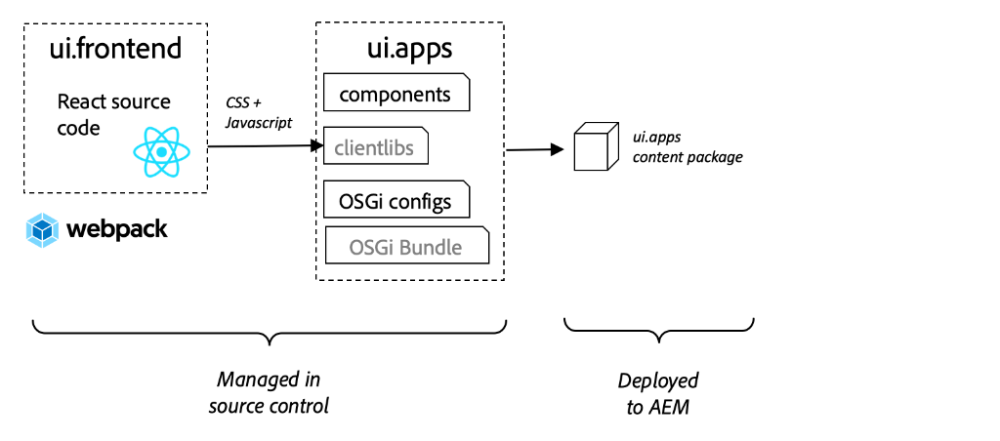

# 整合SPA {#integrate-spa}

了解在React中撰寫的單頁應用程式(SPA)原始碼如何與Adobe Experience Manager(AEM)專案整合。 了解如何使用現代化的前端工具（例如WebPack開發伺服器），針對AEM JSON模型API快速開發SPA。

## 目標

1. 了解SPA專案如何與AEM與用戶端程式庫整合。
2. 了解如何使用Webpack開發伺服器進行專屬的前端開發。
3. 探索使用&#x200B;**proxy**&#x200B;和靜態&#x200B;**mock**&#x200B;檔案，針對AEM JSON模型API進行開發

## 您將建置的

本章將向SPA添加簡單的`Header`元件。 在建置此靜態`Header`元件的過程中，將使用數種AEM SPA開發方法。


*擴充SPA以新增靜態元 `Header` 件*

## 必備條件

查看設定[本地開發環境](overview.md#local-dev-environment)所需的工具和說明。

### 取得程式碼

1. 透過Git下載本教學課程的起始點：

   ```shell
   $ git clone git@github.com:adobe/aem-guides-wknd-spa.git
   $ cd aem-guides-wknd-spa
   $ git checkout React/integrate-spa-start
   ```

2. 使用Maven將程式碼基底部署至本機AEM例項：

   ```shell
   $ mvn clean install -PautoInstallSinglePackage
   ```

   如果使用[AEM 6.x](overview.md#compatibility)新增`classic`設定檔：

   ```shell
   $ mvn clean install -PautoInstallSinglePackage -Pclassic
   ```

您一律可以在[GitHub](https://github.com/adobe/aem-guides-wknd-spa/tree/React/integrate-spa-solution)上檢視完成的程式碼，或切換至分支`React/integrate-spa-solution`在本機檢出程式碼。

## 整合方法{#integration-approach}

已在AEM專案中建立兩個模組：`ui.apps`和`ui.frontend`。

`ui.frontend`模組是包含所有SPA原始碼的[webpack](https://webpack.js.org/)專案。 大部分的SPA開發與測試將在Webpack專案中完成。 觸發生產組建時，會使用webpack建置及編譯SPA。 編譯的成品（CSS和Javascript）會複製到`ui.apps`模組中，然後部署到AEM執行階段。



*對SPA整合的高階描述。*

有關前端版本編號的其他資訊，請參見[這裡](https://docs.adobe.com/content/help/en/experience-manager-core-components/using/developing/archetype/uifrontend-react.html)。

## Inspect SPA整合{#inspect-spa-integration}

接下來，檢查`ui.frontend`模組，了解[AEM專案原型](https://docs.adobe.com/content/help/en/experience-manager-core-components/using/developing/archetype/uifrontend-react.html)自動產生的SPA。

1. 在您選擇的IDE中，開啟WKND SPA的AEM專案。 本教程將使用[Visual Studio代碼IDE](https://docs.adobe.com/content/help/en/experience-manager-learn/cloud-service/local-development-environment-set-up/development-tools.html#microsoft-visual-studio-code)。

   

2. 展開並檢查`ui.frontend`資料夾。 開啟檔案`ui.frontend/package.json`

3. 在`dependencies`下，應該會看到幾個與`react`相關的項目，包括`react-scripts`

   ```json
   "react": "^16.12.0",
   "react-app-polyfill": "^1.0.5",
   "react-dom": "^16.12.0",
   "react-router-dom": "^5.1.2",
   "react-scripts": "3.4.1"
   ```

   `ui.frontend`是以[建立React應用程式](https://create-react-app.dev/)或CRA為基礎的React應用程式。 `react-scripts`版本指出使用的CRA版本。

4. 此外，還有三個前置詞為`@adobe`的相依性：

   ```json
   "@adobe/aem-react-editable-components": "^1.0.0",
   "@adobe/aem-spa-component-mapping": "^1.0.0",
   "@adobe/aem-spa-page-model-manager": "^1.0.0",
   ```

   上述模組組成[AEM SPA Editor JS SDK](https://docs.adobe.com/content/help/en/experience-manager-65/developing/headless/spas/spa-blueprint.html)，並提供功能，讓您能夠將SPA元件對應至AEM元件。

5. 在`package.json`檔案中，定義了多個`scripts`:

   ```json
   "scripts": {
       "start": "react-scripts start",
       "build": "react-scripts build && clientlib",
       "test": "react-scripts test",
       "eject": "react-scripts eject",
   }
   ```

   這些是由「建立React應用程式」製作的[available](https://create-react-app.dev/docs/available-scripts)標準建置指令碼。

   唯一的差異是將`&& clientlib`加入`build`指令碼。 此額外指示負責在建置期間將編譯的SPA複製到`ui.apps`模組，作為用戶端程式庫。

   npm模組[aem-clientlib-generator](https://github.com/wcm-io-frontend/aem-clientlib-generator)用於促進此操作。

6. Inspect檔案`ui.frontend/clientlib.config.js`。 [aem-clientlib-generator](https://github.com/wcm-io-frontend/aem-clientlib-generator#clientlibconfigjs)使用此配置檔案來確定如何生成客戶端庫。

7. Inspect檔案`ui.frontend/pom.xml`。 此檔案將`ui.frontend`資料夾轉換為[Maven模組](http://maven.apache.org/guides/mini/guide-multiple-modules.html)。 `pom.xml`檔案已更新，以在Maven建置期間使用[frontend-maven-plugin](https://github.com/eirslett/frontend-maven-plugin)至&#x200B;**test**&#x200B;和&#x200B;**build** SPA。

8. Inspect檔案`index.js`(`ui.frontend/src/index.js`):

   ```js
   //ui.frontend/src/index.js
   ...
   document.addEventListener('DOMContentLoaded', () => {
       ModelManager.initialize().then(pageModel => {
           const history = createBrowserHistory();
           render(
           <Router history={history}>
               <App
               history={history}
               cqChildren={pageModel[Constants.CHILDREN_PROP]}
               cqItems={pageModel[Constants.ITEMS_PROP]}
               cqItemsOrder={pageModel[Constants.ITEMS_ORDER_PROP]}
               cqPath={pageModel[Constants.PATH_PROP]}
               locationPathname={window.location.pathname}
               />
           </Router>,
           document.getElementById('spa-root')
           );
       });
   });
   ```

   `index.js` 是SPA的入口。`ModelManager` 由AEM SPA Editor JS SDK提供。它負責呼叫應用程式並將`pageModel`（JSON內容）插入。

## 添加標題元件{#header-component}

接著，將新元件新增至SPA，並將變更部署至本機AEM例項。

1. 在`ui.frontend`模組的`ui.frontend/src/components`下方，建立名為`Header`的新資料夾。
2. 在`Header`資料夾下建立名為`Header.js`的檔案。

   

3. 將以下內容填入`Header.js`:

   ```js
   //Header.js
   import React, {Component} from 'react';
   
   export default class Header extends Component {
   
       render() {
           return (
                   <header className="Header">
                       <div className="Header-container">
                           <h1>WKND</h1>
                       </div>
                   </header>
           );
       }
   }
   ```

   以上是將輸出靜態文字字串的標準React元件。

4. 開啟檔案`ui.frontend/src/App.js`。 這是應用程式入口點。
5. 對`App.js`進行下列更新，以包含靜態`Header`:

   ```diff
     import { Page, withModel } from '@adobe/aem-react-editable-components';
     import React from 'react';
   + import Header from './components/Header/Header';
   
     // This component is the application entry point
     class App extends Page {
     render() {
         return (
         <div>
   +       <Header />
            {this.childComponents}
            {this.childPages}
        </div>
   ```

6. 開啟新終端機並導覽至`ui.frontend`資料夾並執行`npm run build`命令：

   ```shell
   $ cd aem-guides-wknd-spa
   $ cd ui.frontend
   $ npm run build
   ...
   Compiled successfully.
   
   File sizes after gzip:
   
   118.95 KB (-33 B)  build/static/js/2.489f399a.chunk.js
   1.11 KB (+48 B)    build/static/js/main.6cfa5095.chunk.js
   806 B              build/static/js/runtime-main.42b998df.js
   451 B              build/static/css/main.e57bbe8a.chunk.css
   ```

7. 導覽至`ui.apps`資料夾。 在`ui.apps/src/main/content/jcr_root/apps/wknd-spa-react/clientlibs/clientlib-react`下方，應該會看到已編譯的SPA檔案已從`ui.frontend/build`資料夾複製。

   

8. 返回終端機並導覽至`ui.apps`資料夾。 執行以下Maven命令：

   ```shell
   $ cd ../ui.apps
   $ mvn clean install -PautoInstallPackage
   ...
   [INFO] ------------------------------------------------------------------------
   [INFO] BUILD SUCCESS
   [INFO] ------------------------------------------------------------------------
   [INFO] Total time:  9.629 s
   [INFO] Finished at: 2020-05-04T17:48:07-07:00
   [INFO] ------------------------------------------------------------------------
   ```

   這會將`ui.apps`套件部署至本機執行中的AEM例項。

9. 開啟瀏覽器標籤並導覽至[http://localhost:4502/editor.html/content/wknd-spa-react/us/en/home.html](http://localhost:4502/editor.html/content/wknd-spa-react/us/en/home.html)。 您現在應該會在SPA中看到`Header`元件的內容。

   

   從專案的根觸發Maven組建時（即`mvn clean install -PautoInstallSinglePackage`），步驟6-8會自動執行。 您現在應了解SPA和AEM用戶端程式庫之間整合的基本知識。 請注意，您仍可以在AEM中靜態`Header`元件下方編輯和新增`Text`元件。

## Webpack開發伺服器 — 代理JSON API {#proxy-json}

如先前的練習所示，執行組建，並將用戶端程式庫同步至AEM的本機例項需要幾分鐘的時間。 這是最終測試可接受的選項，但不適用於大部分SPA開發。

[webpack-dev-server](https://webpack.js.org/configuration/dev-server/)可用來快速開發SPA。 SPA是由AEM產生的JSON模型驅動。 在本練習中，來自AEM執行中例項的JSON內容將&#x200B;**代理**&#x200B;至開發伺服器。

1. 返回IDE並開啟檔案`ui.frontend/package.json`。

   尋找如下所示的行：

   ```json
   "proxy": "http://localhost:4502",
   ```

   [建立React應用程式](https://create-react-app.dev/docs/proxying-api-requests-in-development)提供簡單的代理API請求機制。 所有未知請求都將通過本地AEM快速入門`localhost:4502`進行代理。

2. 開啟終端機視窗，並導覽至`ui.frontend`資料夾。 運行命令`npm start`:

   ```shell
   $ cd ui.frontend
   $ npm start
   ...
   Compiled successfully!
   
   You can now view wknd-spa-react in the browser.
   
   Local:            http://localhost:3000
   On Your Network:  http://192.168.86.136:3000
   
   Note that the development build is not optimized.
   To create a production build, use npm run build.
   ```

3. 開啟新的瀏覽器標籤（如果尚未開啟），並導覽至[http://localhost:3000/content/wknd-spa-react/us/en/home.html](http://localhost:3000/content/wknd-spa-react/us/en/home.html)。

   

   您應該會看到與AEM相同的內容，但未啟用任何製作功能。

   >[!NOTE]
   >
   > 由於AEM的安全性需求，您需要在相同的瀏覽器中，但位在不同的索引標籤中，登入本機AEM例項(http://localhost:4502)。

4. 返回IDE，在`ui.frontend/src/media`處建立名為`media`的新資料夾。
5. 下載以下WKND標誌並添加到`media`資料夾中：

   

6. 在`ui.frontend/src/components/Header/Header.js`開啟`Header.js`並匯入標誌：

   ```diff
     import React, {Component} from 'react';
   + import wkndLogoDark from '../../media/wknd-logo-dk.png';
   ```

7. 對`Header.js`進行下列更新，將標誌納入標題中：

   ```js
    export default class Header extends Component {
   
       get logo() {
           return (
               <div className="Logo">
                   
               </div>
           );
       }
   
       render() {
           return (
                   <header className="Header">
                       <div className="Header-container">
                           {this.logo}
                       </div>
                   </header>
           );
       }
   }
   ```

   將更改保存到`Header.js`。

8. 返回瀏覽器，網址為[http://localhost:3000/content/wknd-spa-react/us/en/home.html](http://localhost:3000/content/wknd-spa-react/us/en/home.html)。 您應會立即看到應用程式的變更反映在內。

   

   由於我們代理內容，因此您可以繼續在AEM中更新內容，並看到它們反映在&#x200B;**webpack-dev-server**&#x200B;中。

9. 在終端中使用`ctrl+c`停止Webpack開發伺服器。

## Webpack開發伺服器 — 模擬JSON API {#mock-json}

另一種快速開發的方法是使用靜態JSON檔案作為JSON模型。 借由「模擬」JSON，我們移除了對本機AEM例項的相依性。 此外，前端開發人員也能更新JSON模型，以測試功能，並推動對JSON API的變更，JSON API稍後將由後端開發人員實作。

模擬JSON的初始設定&#x200B;**需要本機AEM例項**。

1. 在瀏覽器中，導覽至[http://localhost:4502/content/wknd-spa-react/us/en.model.json](http://localhost:4502/content/wknd-spa-react/us/en.model.json)。

   這是由AEM匯出的JSON，此JSON會驅動應用程式。 複製JSON輸出。

2. 返回到IDE，導航到`ui.frontend/public`並添加名為`mock-content`的新資料夾。
3. 在`ui.frontend/public/mock-content`下方建立名為`mock.model.json`的新檔案。 從&#x200B;**Step 1**&#x200B;貼上JSON輸出至此處。

   

4. 在`ui.frontend/public/index.html`開啟檔案`index.html`。 更新AEM頁面模型的中繼資料屬性以指向變數`%REACT_APP_PAGE_MODEL_PATH%`:

   ```html
       <!-- AEM page model -->
       <meta
          property="cq:pagemodel_root_url"
          content="%REACT_APP_PAGE_MODEL_PATH%"
       />
   ```

   將變數用於`cq:pagemodel_root_url`的值，可讓您更輕鬆地在Proxy和模擬json模型之間切換。

5. 開啟檔案`ui.frontend/.env.development`並進行下列更新，以註解`REACT_APP_PAGE_MODEL_PATH`的先前值：

   ```plain
   PUBLIC_URL=/
   
   #REACT_APP_PAGE_MODEL_PATH=/content/wknd-spa-react/us/en.model.json
   REACT_APP_PAGE_MODEL_PATH=/mock-content/mock.model.json
   
   REACT_APP_ROOT=/content/wknd-spa-react/us/en/home.html
   ```

6. 如果當前正在運行，請停止&#x200B;**webpack-dev-server**。 從終端啟動&#x200B;**webpack-dev-server**:

   ```shell
   $ cd ui.frontend
   $ npm start
   ```

   導覽至[http://localhost:3000/content/wknd-spa-react/us/en/home.html](http://localhost:3000/content/wknd-spa-react/us/en/home.html)，您應該會看到SPA的&#x200B;**proxy** json中使用的內容相同。

7. 對先前建立的`mock.model.json`檔案進行小幅變更。 您應會看到更新後的內容立即反映在&#x200B;**webpack-dev-server**&#x200B;中。

   

能夠操控JSON模型並查看即時SPA上的效果，可協助開發人員了解JSON模型API。 它還允許前端和後端開發並行進行。

您現在可以切換使用JSON內容的位置，方法是切換`env.development`檔案中的項目：

```plain
# JSON API via proxy to AEM
#REACT_APP_PAGE_MODEL_PATH=/content/wknd-spa-react/us/en.model.json

# JSON API via static mock file
REACT_APP_PAGE_MODEL_PATH=/mock-content/mock.model.json
```

## 使用Sass新增樣式

React的最佳實務是保持每個元件模組化且獨立。 一般建議是避免在元件間重複使用相同的CSS類別名稱，因此前置處理器的使用功能不如前置處理器強大。 此專案將針對變數等幾個實用功能使用[Sass](https://sass-lang.com/)。 此專案也將鬆散遵循[SUIT CSS命名慣例](https://github.com/suitcss/suit/blob/master/doc/components.md)。 CAIT是BEM標籤法(Block Element Modifier)的變體，用來建立一致的CSS規則。

1. 開啟終端窗口，如果啟動，則停止&#x200B;**webpack-dev-server**。 從`ui.frontend`資料夾內，輸入以下命令以[安裝Sass](https://create-react-app.dev/docs/adding-a-sass-stylesheet):

   ```shell
   $ cd ui.frontend
   $ npm install node-sass --save
   ```

   安裝`sass`作為對等項：

   ```shell
   $ npm install sass --save
   ```

2. 安裝`normalize-scss`以標準化瀏覽器間的樣式：

   ```shell
   $ npm install normalize-scss
   ```

3. 啟動&#x200B;**webpack-dev-server**，以便即時查看樣式更新：

   ```shell
   $ npm start
   ```

   使用模擬代理方法來處理JSON模型API。

4. 返回到IDE，在`ui.frontend/src`下建立名為`styles`的新資料夾。
5. 在`ui.frontend/src/styles`下建立名為`_variables.scss`的新檔案，並填入下列變數：

   ```scss
   //_variables.scss
   
   //== Colors
   //
   //## Gray and brand colors for use across theme.
   
   $black:                  #202020;
   $gray:                   #696969;
   $gray-light:             #EBEBEB;
   $gray-lighter:           #F7F7F7;
   $white:                  #FFFFFF;
   $yellow:                 #FFEA00;
   $blue:                   #0045FF;
   
   
   //== Typography
   //
   //## Font, line-height, and color for body text, headings, and more.
   
   $font-family-sans-serif:  "Helvetica Neue", Helvetica, Arial, sans-serif;
   $font-family-serif:       Georgia, "Times New Roman", Times, serif;
   $font-family-base:        $font-family-sans-serif;
   $font-size-base:          18px;
   
   $line-height-base:        1.5;
   $line-height-computed:    floor(($font-size-base * $line-height-base));
   
   // Functional Colors
   $brand-primary:             $yellow;
   $body-bg:                   $white;
   $text-color:                $black;
   $text-color-inverse:        $gray-light;
   $link-color:                $blue;
   
   //Layout
   $max-width: 1024px;
   
   // Spacing
   $gutter-padding: 12px;
   ```

6. 將位於`ui.frontend/src/index.css`的檔案`index.css`的副檔名重新命名為&#x200B;**`index.scss`**。 將內容替換為：

   ```scss
   /* index.scss * /
   
   /* Normalize */
   @import '~normalize-scss/sass/normalize';
   
   @import './styles/variables';
   
   body {
       background-color: $body-bg;
       font-family: $font-family-base;
       margin: 0;
       padding: 0;
       font-size: $font-size-base;
       text-align: left;
       color: $text-color;
       line-height: $line-height-base;
   }
   
   //spacing for header
   body.page {
       padding-top: 75px;
   }
   ```

7. 更新`ui.frontend/src/index.js`以包含重新命名的`index.scss`:

   ```diff
    ...
   - import './index.css';
   + import './index.scss';
    ....
   ```

8. 在`ui.frontend/src/components/Header`下方建立名為`Header.scss`的新檔案。 將下列項目填入檔案：

   ```scss
   @import '../../styles/variables';
   
   .Header {
       width: 100%;
       position: fixed;
       top: 0;
       left:0;
       z-index: 99;
       background-color: $brand-primary;
       box-shadow: 0px 0px 10px 0px rgba(0, 0, 0, 0.24);
   }
   
   .Header-container {
       display: flex;
       max-width: $max-width;
       margin: 0 auto;
       padding-left: $gutter-padding;
       padding-right: $gutter-padding;
   }
   
   .Logo {
       z-index: 100;
       display: flex;
       padding-top: $gutter-padding;
       padding-bottom: $gutter-padding;
   }
   
   .Logo-img {
       width: 100px;
   }
   ```

9. 通過更新`Header.js`包括`Header.scss`:

   ```js
   import React, {Component} from 'react';
   import wkndLogoDark from '../../media/wknd-logo-dk.png';
   
   require('./Header.scss');
   ...
   ```

10. 返回瀏覽器和&#x200B;**webpack-dev-server**:[http://localhost:3000/content/wknd-spa-react/us/en/home.html](http://localhost:3000/content/wknd-spa-react/us/en/home.html)

   

   您現在應該會看到已新增至`Header`元件的更新樣式。

## 將SPA更新部署至AEM

對`Header`所做的變更目前僅透過&#x200B;**webpack-dev-server**&#x200B;顯示。 將更新的SPA部署至AEM以查看變更。

1. 導覽至專案的根目錄(`aem-guides-wknd-spa`)，並使用Maven將專案部署至AEM:

   ```shell
   $ cd ..
   $ mvn clean install -PautoInstallSinglePackage
   ```

2. 導覽至[http://localhost:4502/editor.html/content/wknd-spa-react/us/en/home.html](http://localhost:4502/editor.html/content/wknd-spa-react/us/en/home.html)。 您應該會看到已更新的`Header`，並套用標誌和樣式。

   

   現在更新的SPA已在AEM中，製作即可繼續。

## 疑難排解節點錯誤

在開發過程中，您可能會遇到下列錯誤：

```
Error: Missing binding aem-guides-wknd-spa/ui.frontend/node_modules/node-sass/vendor/darwin-x64-72/binding.node
Node Sass could not find a binding for your current environment: macOS 64-bit with Node.js 12.x
```

當&#x200B;**Node.js**&#x200B;和&#x200B;**npm**&#x200B;的本機版本與[frontend-maven-plugin](https://github.com/eirslett/frontend-maven-plugin)所使用的版本不同時，就會發生此情況。 運行命令`npm rebuild node-sass`可以臨時修復問題或刪除`ui.frontend/node_modules`資料夾並重新安裝。

還有一些方法可以更永久地解決這個問題。

* 確保npm和Node.js的本機版本與[Maven組建](https://github.com/adobe/aem-guides-wknd-spa/blob/React/latest/pom.xml#L118)使用的版本相符
* 在`npm run build`步驟之前，將下列執行步驟新增至`ui.frontend/pom.xml`:

   ```xml
   <execution>
       <id>npm rebuild node-sass</id>
       <goals>
           <goal>npm</goal>
       </goals>
       <configuration>
           <arguments>rebuild node-sass</arguments>
       </configuration>
   </execution>
   ```

## 恭喜！ {#congratulations}

恭喜，您已更新SPA並探索與AEM的整合！ 您現在知道使用&#x200B;**webpack-dev-server**&#x200B;針對AEM JSON模型API開發SPA的兩種方法。

您一律可以在[GitHub](https://github.com/adobe/aem-guides-wknd-spa/tree/React/integrate-spa-solution)上檢視完成的程式碼，或切換至分支`React/integrate-spa-solution`在本機檢出程式碼。

### 後續步驟{#next-steps}

[將SPA元件對應至AEM元件](map-components.md)  — 了解如何使用AEM SPA Editor JS SDK將React元件對應至Adobe Experience Manager(AEM)元件。元件對應可讓使用者在AEM SPA編輯器中對SPA元件進行動態更新，與傳統AEM製作類似。
