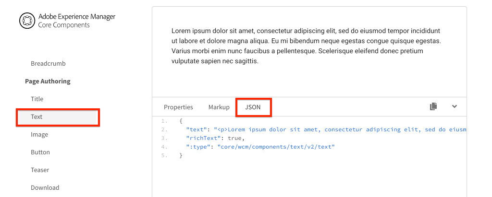

# 將SPA元件對應至AEM元件 {#map-components}

瞭解如何使用AEM SPA Editor JS SDK將React元件對應至Adobe Experience Manager(AEM)元件。 元件對應可讓使用者在AEM SPA編輯器中對SPA元件進行動態更新，類似於傳統的AEM編寫。

本章深入探討AEM JSON模型API，以及AEM元件公開的JSON內容如何自動插入React元件做為prop。

## 目標

1. 瞭解如何將AEM元件對應至SPA元件。
2. 瞭解Container元件與 **Content** 元件之 **間的差** 異。
3. 建立新的React元件，以對應至現有的AEM元件。

## 您將建立的

本章將檢查提供的 `Text` SPA元件如何對應至AEM元 `Text`件。 將會建 `Image` 立新的SPA元件，以便用於SPA並在AEM中編寫。 版面容器和範本編輯 **器(** Layout Container **** )原則的立即可用功能也可用來建立外觀更多樣的檢視。


## 必備條件

檢視建立本機開發環境所需的工 [具和指示](overview.md#local-dev-environment)。

### 取得程式碼

1. 透過Git下載本教學課程的起點：

   ```shell
   $ git clone git@github.com:adobe/aem-guides-wknd-spa.git
   $ cd aem-guides-wknd-spa
   $ git checkout React/map-components-start
   ```

2. 使用Maven將程式碼庫部署至本機AEM例項：

   ```shell
   $ mvn clean install -PautoInstallSinglePackage
   ```

   如果使用 [AEM 6.x](overview.md#compatibility) ，請新增 `classic` 描述檔：

   ```shell
   $ mvn clean install -PautoInstallSinglePackage -Pclassic
   ```

您隨時都可以在 [GitHub上檢視完成的程式碼](https://github.com/adobe/aem-guides-wknd-spa/tree/React/map-components-solution) ，或切換至分支，在本機檢出程式碼 `React/map-components-solution`。

## 映射方法

基本概念是將SPA元件對應至AEM元件。 AEM元件、執行伺服器端、匯出內容做為JSON模型API的一部分。 SPA會使用JSON內容，在瀏覽器中執行用戶端。 會建立SPA元件與AEM元件之間的1:1對應。


*將AEM元件對應至React Component的高階概述*

## 檢查文本元件

[AEM Project Archetype](https://github.com/adobe/aem-project-archetype)`Text` 提供對應至AEM [Text元件的元件](https://docs.adobe.com/content/help/en/experience-manager-core-components/using/components/text.html)。 這是內容元件的 **範例** ，其中會從 *AEM轉譯內* 容。

讓我們看看元件的運作方式。

### 檢查JSON模型

1. 在跳至SPA程式碼之前，請務必瞭解AEM提供的JSON模型。 導覽至核 [心元件庫](https://www.aemcomponents.dev/content/core-components-examples/library/page-authoring/text.html) ，並檢視文字元件的頁面。 核心元件庫提供所有AEM核心元件的範例。
2. 選取 **其中一個範例的JSON** 標籤：

   

   您應該會看到三個屬性： `text`、 `richText`和 `:type`。

   `:type` 是一個保留屬性，會列 `sling:resourceType` 出AEM元件的（或路徑）。 值是用 `:type` 來將AEM元件對應至SPA元件的值。

   `text` 以 `richText` 及SPA元件所暴露的其他屬性。

### 檢查Text元件

1. 開啟新的終端機，並導覽至專案 `ui.frontend` 內的資料夾。 執 `npm install` 行並 `npm start` 啟動 **webpack-dev-server**:

   ```shell
   $ cd ui.frontend
   $ npm install
   $ npm start
   ```

   模 `ui.frontend` 組目前已設定為使用 [模擬JSON模型](./integrate-spa.md#mock-json)。

2. 您應會看到新的瀏覽器視窗開啟至 [http://localhost:3000/content/wknd-spa-react/us/en/home.html](http://localhost:3000/content/wknd-spa-react/us/en/home.html)

   

3. 在您選擇的IDE中，開啟WKND SPA的AEM專案。 展開模 `ui.frontend` 塊並開啟以下 `Text.js` 檔案 `ui.frontend/src/components/Text/Text.js`:

   

4. 我們將檢查的第一個區域是 `class Text` 第40行：

   ```js
   class Text extends Component {
   
       get richTextContent() {
           return (<div
                   id={extractModelId(this.props.cqPath)}
                   data-rte-editelement
                   dangerouslySetInnerHTML={{__html: DOMPurify.sanitize(this.props.text)}} />
                   );
       }
   
       get textContent() {
           return <div>{this.props.text}</div>;
       }
   
       render() {
           return this.props.richText ? this.richTextContent : this.textContent;
       }
   }
   ```

   `Text` 是標準的React元件。 元件會 `this.props.richText` 用來判斷要轉譯的內容是RTF還是純文字。 實際使用的「內容」來自 `this.props.text`。 為避免潛在的XSS攻擊，在使用危險的SetInnerHTML `DOMPurify` 來轉譯內容 [](https://reactjs.org/docs/dom-elements.html#dangerouslysetinnerhtml) 之前，會先透過逸出富格文字。 在練習 `richText` 中 `text` ，請回想JSON模型的和屬性。

5. 接下來，請看 `TextEditConfig` ~29號線：

   ```js
   const TextEditConfig = {
   emptyLabel: 'Text',
   
       isEmpty: function(props) {
           return !props || !props.text || props.text.trim().length < 1;
       }
   };
   ```

   上述程式碼負責決定何時在AEM作者環境中呈現預留位置。 如果方 `isEmpty` 法傳 **回true** ，則會呈現預留位置。

6. 最後，請看~62 `MapTo` 號線的通話：

   ```js
   export default MapTo('wknd-spa-react/components/text')(Text, TextEditConfig);
   ```

   `MapTo` 由AEM SPA Editor JS SDK(`@adobe/aem-react-editable-components`)提供。 路徑 `wknd-spa-react/components/text` 代表 `sling:resourceType` AEM元件。 此路徑與先前觀察到 `:type` 的JSON模型公開的路徑相符。 `MapTo` 負責剖析JSON模型回應，並將正確值傳 `props` 遞至SPA元件。

   您可在找到AEM元 `Text` 件定義 `ui.apps/src/main/content/jcr_root/apps/wknd-spa-react/components/text`。

7. 在中修改檔 `mock.model.json` 案以實驗 `ui.frontend/public/mock-content/mock.model.json`。 在~line 62更新第一個 `Text` 值，以使用 **`H1`** 和 **`u`** 標籤：

   ```json
       "text": {
           "text": "<h1><u>Hello World!</u></h1>",
           "richText": true,
           ":type": "wknd-spa-react/components/text"
       }
   ```

   導覽至 [http://localhost:3000](http://localhost:3000) ，以檢視效果：

   

   嘗試在true `richText` / **false之間切****** 換屬性，以檢視演算邏輯的實際運作。

8. 在 `Text.scss` 檢查 `ui.frontend/src/components/Text/Text.scss`。

   本章的起始程式碼庫已新增此檔案，並運用前一章中新增的 [Sass](https://sass-lang.com/) 功能。 請注意引用的變數 `ui.frontend/src/styles/_variables.scss`。

## 建立影像元件

接著，建立 `Image` 對應至AEM [Image元件的Reacte元件](https://docs.adobe.com/content/help/zh-Hant/experience-manager-core-components/using/components/image.translate.html)。 該 `Image` 元件是內容元件的 **另一示例** 。

### 檢查JSON

在跳至SPA程式碼之前，請先檢查AEM提供的JSON模型。

1. 導覽至核心 [元件庫中的影像範例](https://www.aemcomponents.dev/content/core-components-examples/library/page-authoring/image.html)。

   

   將使 `src`用、 `alt`和 `title` 的屬性填充SPA組 `Image` 件。

   >[!NOTE]
   >
   > 還有其他顯示(`lazyEnabled`, `widths`)的影像屬性可讓開發人員建立可調式和延遲載入的元件。 本教學課程中建立的元件將很簡單， **不會** 使用這些進階屬性。

2. 返回IDE並開啟 `mock.model.json` at `ui.frontend/public/mock-content/mock.model.json`。 由於這是專案的新元件，因此我們需要「模擬」影像JSON。

   在~70行新增模型的JSON `image` 項目(別忘記第二個字元後面 `,` 的尾 `text_23828680`隨逗號)並更新 `:itemsOrder` 陣列。

   ```json
   ...
   ":items": {
               ...
               "text_23828680": {
                   "text": "<p>Mock Model JSON!</p>",
                   "richText": true,
                   ":type": "wknd-spa-react/components/text"
               },
               "image": {
                   "alt": "Rock Climber in New Zealand",
                   "title": "Rock Climber in New Zealand",
                   "src": "/mock-content/adobestock-140634652.jpeg",
                   ":type": "wknd-spa-react/components/image"
               }
           },
           ":itemsOrder": [
               "text",
               "text_23828680",
               "image"
           ],
   ```

   該項目包含將與 `/mock-content/adobestock-140634652.jpeg` webpack-dev-server一起使用 **的示例映像**。

   您可以在此處檢 [視完整的mock.model.json](https://github.com/adobe/aem-guides-wknd-spa/blob/React/map-components-solution/ui.frontend/public/mock-content/mock.model.json)。

### 實作影像元件

1. 接下來，建立名為的新 `Image` 資料夾 `ui.frontend/src/components`。
2. 在資料夾 `Image` 的下方建立一個名為的新檔案 `Image.js`。

   

3. 將以下語 `import` 句添加到 `Image.js`:

   ```js
   import React, {Component} from 'react';
   import {MapTo} from '@adobe/aem-react-editable-components';
   ```

4. 然後新增 `ImageEditConfig` 以決定何時在AEM中顯示預留位置：

   ```js
   export const ImageEditConfig = {
   
       emptyLabel: 'Image',
   
       isEmpty: function(props) {
           return !props || !props.src || props.src.trim().length < 1;
       }
   };
   ```

   如果未設定屬性，則 `src` 會顯示預留位置。

5. 接下來實作 `Image` 類別：

   ```js
    export default class Image extends Component {
   
       get content() {
           return ;
       }
   
       render() {
           if(ImageEditConfig.isEmpty(this.props)) {
               return null;
           }
   
           return (
                   <div className="Image">
                       {this.content}
                   </div>
           );
       }
   }
   ```

   上述程式碼會根 `` 據JSON模型傳入 `src`的 `alt`prop `title` 和prop來演算。

6. 新增程 `MapTo` 式碼，將Reacte元件對應至AEM元件：

   ```js
   MapTo('wknd-spa-react/components/image')(Image, ImageEditConfig);
   ```

   請注意，字 `wknd-spa-react/components/image` 串與AEM元件在以下位置的對 `ui.apps` 應位置： `ui.apps/src/main/content/jcr_root/apps/wknd-spa-react/components/image`.

7. 在同一目錄中創 `Image.scss` 建名為的新檔案並添加以下內容：

   ```scss
   .Image-src {
       margin: 1rem 0;
       width: 100%;
       border: 0;
   }
   ```

8. 在 `Image.js` 語句下方頂部添加對檔案的引 `import` 用：

   ```js
   import React, {Component} from 'react';
   import {MapTo} from '@adobe/aem-react-editable-components';
   
   require('./Image.scss');
   ```

   您可以在這裡檢視已完 [成的Image.js](https://github.com/adobe/aem-guides-wknd-spa/blob/React/map-components-solution/ui.frontend/src/components/Image/Image.js)。

9. 開啟檔案 `ui.frontend/src/components/import-components.js` 並新增新元件的參 `Image` 考：

   ```js
   import './Page/Page';
   import './Text/Text';
   import './Image/Image'; //add reference to Image component
   ```

10. 如果尚未啟動，請啟 **動webpack-dev-server**。 導覽至 [http://localhost:3000](http://localhost:3000) ，您應該會看到影像演算：

   

   >[!NOTE]
   >
   > **獎金挑戰**:在中實作新方 `Image.js` 法，將值顯示為 `this.props.title` 影像下方的標題。

## AEM中的更新政策

元 `Image` 件僅在 **webpack-dev-server中顯示**。 接著，將更新的SPA部署至AEM並更新範本原則。

1. 停止 **webpack-dev-server** ，並從專案的根目錄，使用您的Maven技巧將變更部署至AEM:

   ```shell
   $ cd aem-guides-wknd-spa
   $ mvn clean install -PautoInstallSinglePackage
   ```

2. 從「AEM開始」畫面導覽至「工 **具** >範本 **>** WKND SPA React **[](http://localhost:4502/libs/wcm/core/content/sites/templates.html/conf/wknd-spa-react)**」。

   選擇並編輯 **SPA頁**:

   

3. 選取「 **配置容器** 」，然後按一下其 **** 原則圖示以編輯原則：

   

4. 在「 **允許的元件** > **WKND SPA React - Content** >檢查 **** 影像元件：

   

   在「 **Default Components** > **Add mapping** (預設元件 **>添加映射)」下，選擇「** Image - WKND SPA React - Content（影像- WKND SPA反應——內容元件）」:

   

   輸入 **MIME類型**`image/*`。

   按一下 **完成** ，保存策略更新。

5. 在「版 **面容器** 」中，按一 **下Text元件的** 原則圖示 **** :

   

   建立名為 **WKND SPA Text的新策略**。 在「外 **掛程式** >格 **式設定** >選取所有方塊以啟用其他格式設定選項：

   

   在「 **外掛程式** >段落樣式 **>」下方，核取「啟用段落樣式」** 方塊 ****:

   

   按一下 **完成** ，保存策略更新。

6. 導覽至首 **頁**[http://localhost:4502/editor.html/content/wknd-spa-react/us/en/home.html](http://localhost:4502/editor.html/content/wknd-spa-react/us/en/home.html)。

   您也可以編輯元件，並 `Text` 在全螢幕模式中新 **增其他段落** 。

   

7. 您也應該能夠從資產搜尋器拖放影 **像**:

   

8. 透過 [AEM Assets](http://localhost:4502/assets.html/content/dam) ，新增您自己的影像，或安裝標準 [WKND參考網站的完成程式碼庫](https://github.com/adobe/aem-guides-wknd/releases/latest)。 WKND參 [考網站](https://github.com/adobe/aem-guides-wknd/releases/latest) ，包含許多可在WKND SPA上重新使用的影像。 您可使用 [AEM的Package Manager來安裝套件](http://localhost:4502/crx/packmgr/index.jsp)。

   

## 檢查版面容器

AEM SPA編輯 **器SDK會自動提供「版面容器** 」支援。 「 **版面容器**」（由名稱指示）是容器 **元件** 。 容器元件是接受JSON結構的元件，可代表其 *他元件* ，並動態執行個體化。

讓我們進一步檢查「版面容器」。

1. 在瀏覽器中導覽至 [http://localhost:4502/content/wknd-spa-react/us/en.model.json](http://localhost:4502/content/wknd-spa-react/us/en.model.json)

   

   Layout Container **元件有一** 個， `sling:resourceType` SPA編輯器會使用屬性來識別它，就像和元 `wcm/foundation/components/responsivegrid` 件一 `:type``Text``Image` 樣。

   SPA編輯器也提供使用版面模式重新調整 [元件大小](https://docs.adobe.com/content/help/en/experience-manager-65/authoring/siteandpage/responsive-layout.html#defining-layouts-layout-mode) 的相同功能。

2. 返回 [http://localhost:4502/editor.html/content/wknd-spa-react/us/en/home.html](http://localhost:4502/editor.html/content/wknd-spa-react/us/en/home.html)。 新增其 **他影像** ，並嘗試使用「版面配置」選項重新調整 **其大小** :

   

3. 重新開啟JSON模型 [http://localhost:4502/content/wknd-spa-react/us/en.model.json](http://localhost:4502/content/wknd-spa-react/us/en.model.json) ，並 `columnClassNames` 觀察JSON的一部分：

   

   類名表 `aem-GridColumn--default--4` 示元件應基於12列網格為4列寬。 如需互動式格線 [的詳細資訊，請參閱這裡](https://adobe-marketing-cloud.github.io/aem-responsivegrid/)。

4. 返回IDE，在模組中 `ui.apps` 有定義於的客戶端庫 `ui.apps/src/main/content/jcr_root/apps/wknd-spa-react/clientlibs/clientlib-grid`。 開啟檔案 `less/grid.less`。

   此檔案會決定「版面`default`容器」 `tablet`所使 `phone`用的中 **斷點**。 此檔案旨在根據專案規格自訂。 目前，中斷點設為 `1200px` 和 `650px`。

5. 您應該可以使用元件的回應功能和更新的豐富文字原 `Text` 則來製作如下的檢視：

   

## 恭喜！ {#congratulations}

恭喜您，您已學習如何將SPA元件對應至AEM元件，並實作了新的元 `Image` 件。 您也有機會探索版面容器的互動 **功能**。

您隨時都可以在 [GitHub上檢視完成的程式碼](https://github.com/adobe/aem-guides-wknd-spa/tree/React/map-components-solution) ，或切換至分支，在本機檢出程式碼 `React/map-components-solution`。

### 後續步驟 {#next-steps}

[導覽和路由](navigation-routing.md) -瞭解如何透過SPA編輯器SDK對應至AEM頁面，以支援SPA中的多個檢視。 動態導航是使用React Router實現的，並添加到現有的Header元件中。

## 額外——保留源控制的配置 {#bonus}

在許多情況下，尤其是在AEM專案開始時，將設定（例如範本和相關內容原則）保留至來源控制非常有用。 這可確保所有開發人員針對相同的內容和組態進行工作，並可確保環境之間的額外一致性。 一旦項目達到一定的成熟度，管理模板的做法就可以交給一組特殊的超級用戶。

接下來的幾個步驟將會使用Visual Studio程式碼IDE和 [VSCode AEM Sync](https://marketplace.visualstudio.com/items?itemName=yamato-ltd.vscode-aem-sync) ，但可能會使用您設定為從AEM的本機例項提取或匯入內容的任何工具和任何IDE ******** 。

1. 在Visual Studio代碼IDE中，請確定您已透過Marketplace擴充功能 **安裝VSCode AEM Sync** :

   

2. 展開「 **專案檔案總管」中的ui.content** 模組，並導覽至 `/conf/wknd-spa-react/settings/wcm/templates`。

3. **以滑鼠右鍵** +按一 `templates` 下資料夾，然後選 **取「從AEM Server匯入」**:

   

4. 重複這些步驟以匯入內容，但選取位 **於的** 「原則」檔案夾 `/conf/wknd-spa-react/settings/wcm/templates/policies`。

5. 檢查位 `filter.xml` 於的檔案 `ui.content/src/main/content/META-INF/vault/filter.xml`。

   ```xml
   <!--ui.content filter.xml-->
   <?xml version="1.0" encoding="UTF-8"?>
    <workspaceFilter version="1.0">
        <filter root="/conf/wknd-spa-react" mode="merge"/>
        <filter root="/content/wknd-spa-react" mode="merge"/>
        <filter root="/content/dam/wknd-spa-react" mode="merge"/>
        <filter root="/content/experience-fragments/wknd-spa-react" mode="merge"/>
    </workspaceFilter>
   ```

   文 `filter.xml` 件負責標識隨軟體包一起安裝的節點的路徑。 請注意 `mode="merge"` 每個篩選器上的，指出現有內容不會修改，只會新增新內容。 由於內容作者可能正在更新這些路徑，因此請務必不要覆寫程 **式碼** 。 有關使用 [篩選元素的詳細資訊](https://jackrabbit.apache.org/filevault/filter.html) ，請參閱FileVault檔案。

   比較 `ui.content/src/main/content/META-INF/vault/filter.xml` 並 `ui.apps/src/main/content/META-INF/vault/filter.xml` 瞭解每個模組管理的不同節點。
